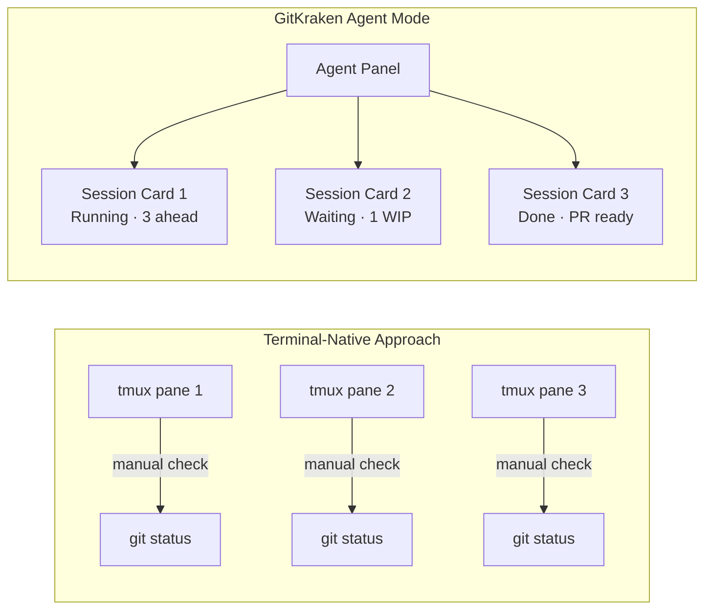
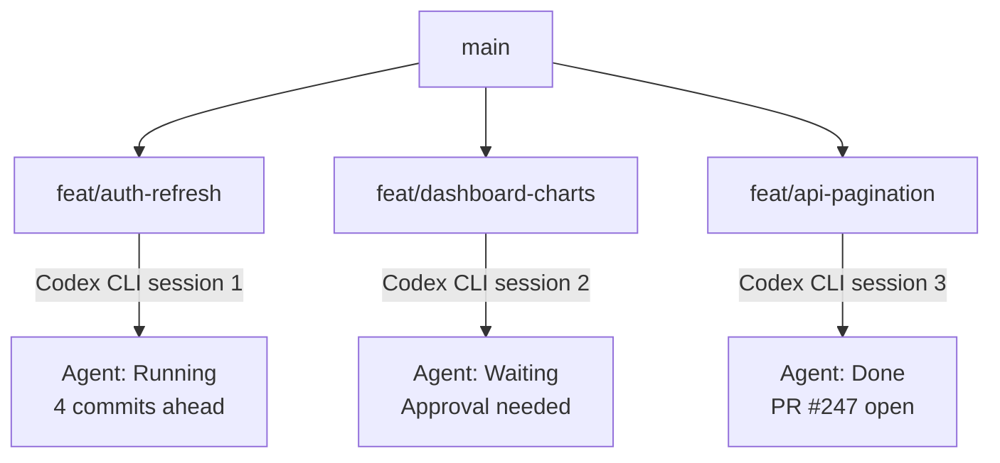

# GitKraken Desktop 12.0 Agent Mode: Visual Parallel Session Management for Codex CLI


---

Running multiple Codex CLI sessions in parallel is powerful — but keeping track of five or six worktrees, their branches, commit states, and whether each agent is blocked or running has historically meant a wall of tmux panes and manual `git worktree list` commands. GitKraken Desktop 12.0, released on 16 April 2026, introduces **Agent Mode**: a dedicated visual layer for launching, monitoring, and managing parallel coding agent sessions[^1]. This article examines what Agent Mode offers Codex CLI practitioners and how it compares to terminal-native approaches.

## The Problem Agent Mode Solves

Parallel agentic development — running multiple Codex CLI sessions on different features simultaneously — creates a supervision challenge. Each session needs:

- An isolated git worktree on its own branch
- Dependencies installed and environment configured
- Real-time visibility into whether the agent is working, waiting for input, or finished
- Easy navigation between session outputs and the commit graph

Terminal multiplexers (tmux, Zellij) solve the isolation problem but offer no semantic awareness of git state. You see terminal output, not branch topology[^2]. Tools like OMX and cmux add orchestration but remain text-first[^3].



## How Agent Mode Works

### Session Creation

The workflow reduces parallel session setup to three steps[^1]:

1. Type a branch name
2. Select **Codex CLI** from the agent picker (also supports Claude Code, Copilot CLI, Gemini CLI, and OpenCode)
3. Click **Start**

GitKraken then automatically:

- Creates a new git worktree for the branch
- Runs configured setup commands (dependency installation, environment file copies, build steps)
- Launches Codex CLI in an embedded terminal within that worktree

Your primary working directory remains untouched[^4].

### Configuration

Setup commands are configured per-repository under **Preferences → Repo-Specific Preferences → Agents**[^5]. Commands run sequentially in the new worktree before the coding agent launches.

```bash
# Example setup commands for a Node.js monorepo
npm ci
cp .env.template .env.local
npx prisma generate
```

For Codex CLI specifically, GitKraken auto-detects the binary from your `$PATH`[^5]. If you use a project-local installation via `npx`, ensure your setup commands include the appropriate configuration.

### The Agent Sessions View

The left panel displays each active session as a card showing[^4]:

| Field | Description |
|-------|-------------|
| Branch name | The worktree's checked-out branch |
| Agent status | Running, waiting for input, or complete |
| WIP changes | Uncommitted file count |
| Ahead/behind | Commits ahead of or behind the remote |
| Associated PRs | Linked pull requests |

Status indicators currently show full state for Claude Code sessions. For Codex CLI, the status reflects terminal activity — whether the process is actively producing output or idle[^4]. ⚠️ Deep integration with Codex CLI's app-server protocol (which would expose goal state, approval requests, and reasoning status) is not yet documented.

### Commit Graph Integration

The existing commit graph — GitKraken's primary navigation surface — now renders every active worktree alongside branches and commits[^1]. You can see:

- Where each agent is working in the branch topology
- What it has committed
- How its branch relates to `main` and other agent branches

This visual context is the key differentiator over terminal-native approaches. Instead of running `git log --oneline --all --graph` across worktrees, the topology is live and interactive.

## Practical Codex CLI Workflow

### Setting Up a Three-Agent Sprint

Consider a scenario where you need to implement three independent features in parallel:



1. Open GitKraken Agent Mode panel
2. Create session for `feat/auth-refresh` → select Codex CLI → Start
3. Create session for `feat/dashboard-charts` → select Codex CLI → Start
4. Create session for `feat/api-pagination` → select Codex CLI → Start

Each session gets its own embedded terminal. When Codex CLI in session 2 hits an approval prompt, the card shows "Waiting for input" — you click into it, approve the operation, and return to monitoring.

### Codex CLI Configuration Considerations

GitKraken's worktree isolation works well with Codex CLI's hierarchical AGENTS.md discovery. Each worktree inherits the repository's root AGENTS.md while any directory-specific overrides apply normally[^6].

For Codex CLI's config, ensure your `~/.codex/config.toml` profiles are set appropriately. Since each session runs in its own worktree, they share the same user-level configuration but can have per-directory `.codex/config.toml` overrides if needed:

```toml
# ~/.codex/config.toml — shared across all GitKraken agent sessions
model = "o4-mini"
approval_policy = "unless-allow-listed"

[tui]
notifications = true
```

### Cleanup

One-click worktree removal from the session card deletes the directory and cleans up git's worktree registry[^1]. No orphaned directories or stale `.git/worktrees` entries — a common irritation with manual `git worktree remove` workflows.

## Comparison with Terminal-Native Approaches

| Capability | tmux + manual | OMX/cmux | GitKraken Agent Mode |
|-----------|---------------|----------|---------------------|
| Worktree creation | Manual | Automated | Automated |
| Setup commands | Script-per-repo | Config file | GUI preferences |
| Agent status visibility | Terminal output | Process status | Card-based indicators |
| Branch topology | `git log --graph` | None built-in | Live commit graph |
| Approval handling | Switch pane | Switch pane | Click card |
| PR association | Manual | Manual | Automatic |
| Cost | Free | Free | Free[^7] |
| Works over SSH | Yes | Yes | No (local only) |
| Headless/CI | Yes | Yes | No |

The trade-off is clear: GitKraken Agent Mode excels at **local, visual supervision** of parallel sessions but cannot replace terminal-native tooling for remote development, headless CI, or SSH-tunnelled workflows[^8].

## Limitations and Sharp Edges

1. **No app-server integration** — GitKraken communicates with Codex CLI as a terminal process, not through the app-server JSON-RPC protocol. Goal state, reasoning summaries, and structured approval data are not surfaced in session cards. ⚠️
2. **Local only** — If you run Codex CLI on a remote devbox via SSH, GitKraken cannot manage those sessions.
3. **No cross-agent orchestration** — Each session is independent. There is no built-in mechanism for one agent's output to trigger another agent's session, unlike MultiAgentV2's spawn_agent pattern[^9].
4. **Agent detection relies on PATH** — If Codex CLI is installed via a non-standard method or within a devcontainer, GitKraken may not detect it automatically[^5].
5. **Status granularity varies by agent** — Claude Code has deeper integration; Codex CLI status is inferred from terminal activity rather than agent state[^4].

## When to Use GitKraken Agent Mode

**Good fit:**

- Running 3-6 parallel Codex CLI sessions on local feature branches
- Teams where not everyone is comfortable with tmux/Zellij
- Reviewing agent commit output in context of the full branch topology
- Quick session spin-up/teardown during sprint work

**Not a fit:**

- Remote development (SSH devboxes, Coder workspaces, Codespaces)
- CI/CD automation with `codex exec`
- Deeply orchestrated multi-agent workflows requiring inter-agent communication
- Headless or scheduled agent runs

## The Broader Trend: Visual Tooling for Agentic Development

GitKraken 12.0 represents a broader trend in 2026: as coding agents become mainstream, developer tooling adapts to supervise them rather than just assist humans directly[^1]. The commit graph becomes a **supervision dashboard** rather than a history browser.

Other entries in this space include:

- **Codex App** — OpenAI's own cloud-based visual interface with worktree management[^10]
- **VS Code + Codex IDE extension** — Inline agent task management
- **cmux** — Terminal-native but with agent-aware session naming

The question for Codex CLI power users is whether you need visual supervision enough to add a GUI tool to your workflow, or whether terminal-native approaches with good naming conventions suffice.

## Conclusion

GitKraken Desktop 12.0 Agent Mode is a well-executed visual layer for parallel Codex CLI session management. It eliminates the manual worktree lifecycle, provides at-a-glance status for multiple concurrent agents, and integrates session output with the commit graph. Its limitations — local-only, no app-server protocol, no inter-agent orchestration — mean it complements rather than replaces terminal-native tooling. For teams running 3-6 local parallel sessions and wanting visual topology awareness, it's a meaningful productivity addition at no extra cost.

---

## Citations

[^1]: GitKraken, "GitKraken Desktop 12.0 Introduces Agent Mode: Gives Developers Ultimate Control & Visualization While Scaling Parallel Agent Workflows," PR Newswire, 16 April 2026. [https://www.prnewswire.com/news-releases/gitkraken-desktop-12-0-introduces-agent-mode-gives-developers-ultimate-control--visualization-while-scaling-parallel-agent-workflows-302745055.html](https://www.prnewswire.com/news-releases/gitkraken-desktop-12-0-introduces-agent-mode-gives-developers-ultimate-control--visualization-while-scaling-parallel-agent-workflows-302745055.html)

[^2]: "Running Multiple Codex Agent Instances: Parallel Orchestration Patterns," danielvaughan.com, 18 April 2026. [https://codex.danielvaughan.com/2026/04/18/running-multiple-codex-agents-parallel-orchestration/](https://codex.danielvaughan.com/2026/04/18/running-multiple-codex-agents-parallel-orchestration/)

[^3]: "How to Run Multiple Codex CLI Sessions in Parallel with Git Worktrees," BSWEN, 28 April 2026. [https://docs.bswen.com/blog/2026-04-28-codex-parallel-worktrees/](https://docs.bswen.com/blog/2026-04-28-codex-parallel-worktrees/)

[^4]: GitKraken, "GitKraken Desktop 12.0 Agent Mode: All your parallel sessions. One panel," GitKraken Blog, April 2026. [https://www.gitkraken.com/blog/youre-running-agents-your-tooling-is-still-catching-up](https://www.gitkraken.com/blog/youre-running-agents-your-tooling-is-still-catching-up)

[^5]: GitKraken, "Coding Agents in GitKraken Desktop," GitKraken Help Center, April 2026. [https://help.gitkraken.com/gitkraken-desktop/agents/](https://help.gitkraken.com/gitkraken-desktop/agents/)

[^6]: OpenAI, "Custom instructions with AGENTS.md," OpenAI Developers, 2026. [https://developers.openai.com/codex/guides/agents-md](https://developers.openai.com/codex/guides/agents-md)

[^7]: GitKraken Desktop is available as a free download. [https://www.gitkraken.com/git-client](https://www.gitkraken.com/git-client)

[^8]: OpenAI, "Codex CLI Remote Connections," OpenAI Developers, 2026. [https://developers.openai.com/codex/cli/features](https://developers.openai.com/codex/cli/features)

[^9]: OpenAI, "Subagents – Codex," OpenAI Developers, 2026. [https://developers.openai.com/codex/subagents](https://developers.openai.com/codex/subagents)

[^10]: OpenAI, "Features – Codex app," OpenAI Developers, 2026. [https://developers.openai.com/codex/app/features](https://developers.openai.com/codex/app/features)
