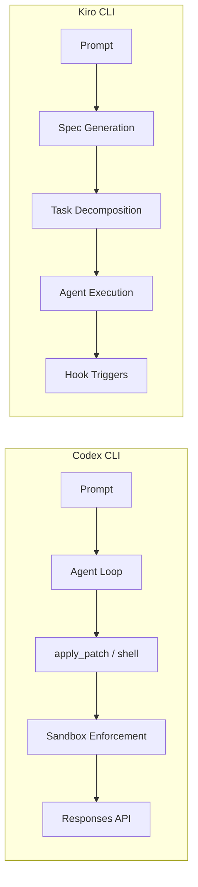
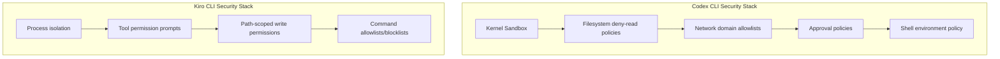
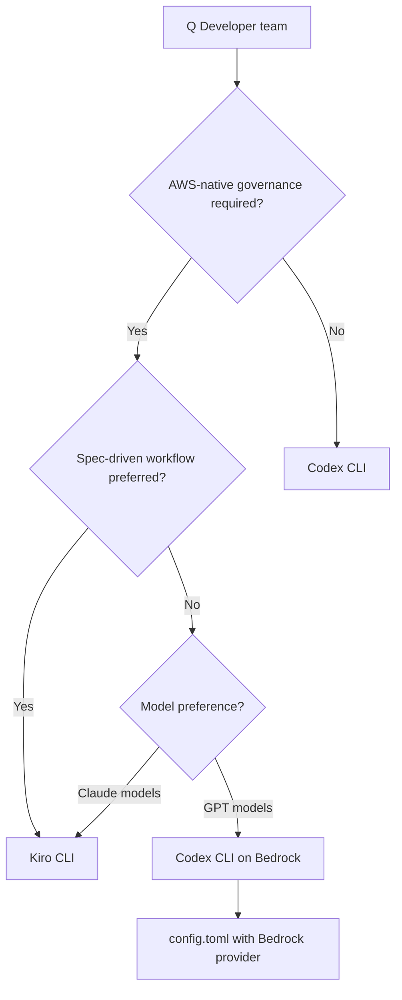

# Kiro CLI 2.0 vs Codex CLI: Spec-Driven Development Meets Terminal-First Autonomy


---

The terminal agent landscape shifted again this week. AWS released Kiro CLI 2.0 with headless mode, Windows support, and a refreshed terminal UI[^1] — the same week Amazon Q Developer began blocking new signups ahead of its April 2027 end-of-support[^2]. For AWS-oriented teams choosing their next coding agent, the decision increasingly comes down to two philosophies: Kiro's spec-driven, structured approach versus Codex CLI's lightweight, terminal-first autonomy.

This article provides a practitioner-level comparison as both tools stand in the first week of May 2026.

---

## Architectural Philosophies

The two tools occupy overlapping territory but start from fundamentally different premises.

**Codex CLI** is a Rust-native binary that treats the terminal as its natural habitat[^3]. It authenticates through your existing ChatGPT subscription, runs in a kernel-level sandbox (Seatbelt on macOS, Landlock/Bubblewrap on Linux, DACL on Windows), and talks to OpenAI's Responses API. It is intentionally minimal — no IDE, no project scaffolding, no structured specification workflow. You prompt, it executes.

**Kiro CLI** is a TypeScript-based agent that extends a broader platform encompassing an IDE (Code OSS fork) and cloud services[^4]. Its philosophical core is *spec-driven development* — translating natural language into structured requirements before generating code. The CLI surface launched in 2025 and graduated to a full terminal UI in v2.0.



---

## Feature Comparison Matrix

| Capability | Codex CLI (v0.128) | Kiro CLI (v2.0) |
|---|---|---|
| **Language** | Rust | TypeScript |
| **Open source** | Yes (Apache 2.0)[^3] | No |
| **Sandbox** | Kernel-level (Seatbelt/Landlock/DACL)[^5] | Process isolation, no kernel sandbox[^6] |
| **Primary models** | GPT-5.5, GPT-5.4, GPT-5.3-Codex-Spark[^7] | Claude Opus 4.7, Claude Sonnet 4.6[^8] |
| **Spec-driven workflows** | Manual (PLANS.md pattern) | First-class (Feature Specs, Bugfix Specs)[^9] |
| **Headless / CI mode** | `codex exec` (since v0.100)[^10] | `--no-interactive` + API key (v2.0)[^1] |
| **MCP support** | Full (stdio + HTTP)[^11] | Full (stdio + HTTP, prompts + resource templates)[^12] |
| **Subagents** | MultiAgentV2 with custom TOML roles[^13] | Subagent crew with task dependencies[^1] |
| **Hooks** | Six lifecycle events (stable since v0.124)[^14] | Pre/Post Task Execution + five lifecycle hooks[^12] |
| **Plan mode** | /plan toggle (Shift+Tab)[^15] | Design-First and Requirements-First spec workflows[^9] |
| **Windows** | Native (DACL sandbox)[^5] | Native (v2.0)[^1] |
| **Self-update** | `codex update`[^16] | Background auto-update[^1] |
| **Pricing** | Included in ChatGPT Plus (\$20/mo)[^17] | Free (50 credits) / Pro (\$20/mo, 1000 credits)[^18] |

---

## Headless Mode: CI/CD Integration

Both tools now support non-interactive execution for CI/CD pipelines, but the mechanics differ.

### Codex CLI

```bash
# Codex exec has existed since early versions
codex exec "Fix the failing test in src/auth.ts" \
  --model gpt-5.4-mini \
  --output-schema '{"type":"object","properties":{"fix_applied":{"type":"boolean"}}}' \
  --approval-mode full-auto
```

Codex's headless mode operates through the `exec` subcommand. It supports `--output-schema` for structured JSON output, `--ephemeral` for disposable sessions, and `--ignore-user-config` for hermetic CI runs[^10]. Session resumption via `codex resume` allows multi-stage pipelines.

### Kiro CLI

```bash
# Kiro 2.0 headless mode
export KIRO_API_KEY="$YOUR_KIRO_KEY"
kiro-cli --no-interactive \
  --trust-all-tools \
  "Fix the failing test in src/auth.ts"
```

Kiro's headless mode requires a generated API key and the `--no-interactive` flag[^1]. Tool permissions are granted upfront via `--trust-all-tools` or selectively with `--trust-tools`. Enterprise administrators control API key generation through governance settings.

### Key Differences

The philosophical split shows here. Codex treats headless execution as a Unix-style pipe — stdin prompt, stdout results, exit code for success/failure. Kiro treats it as an authenticated service call — API key implies identity, governance policies apply remotely.

For CI/CD pipelines, Codex's `--output-schema` is a significant advantage when you need structured data extraction. Kiro's approach is simpler to set up (no OAuth dance) but offers less output control.

---

## Spec-Driven Development vs Terminal-First Autonomy

This is the fundamental philosophical divide.

### Kiro's Spec-Driven Approach

Kiro's Feature Specs generate structured documents in three stages[^9]:

1. **Requirements** — EARS notation (Easy Approach to Requirements Syntax) formal requirement statements
2. **Design** — Architecture decisions, data models, API contracts
3. **Tasks** — Ordered implementation steps with dependencies

```markdown
# Feature Spec: User Authentication

## Requirements
- WHEN a user submits valid credentials, THE system SHALL issue a JWT
- IF the token has expired, THEN the system SHALL return 401

## Design
- OAuth2 PKCE flow with refresh token rotation
- Redis session store with 15-minute TTL

## Tasks
- [x] 1. Create auth middleware
- [ ] 2. Implement token refresh endpoint (depends: 1)
- [ ] 3. Add rate limiting (depends: 1)
```

Bugfix Specs follow a different structure: Current Behaviour, Expected Behaviour, and Unchanged Behaviour[^9]. This explicit framing of what must *not* change addresses the specification drift problem that plagues long agent sessions.

### Codex CLI's Equivalent Patterns

Codex CLI achieves similar structured planning through composition rather than built-in spec workflows:

```bash
# Plan mode for structured thinking
codex --model gpt-5.5
# Then within the session:
# /plan  (or Shift+Tab to toggle)
```

For reproducible structured development, Codex relies on:

- **PLANS.md** — The ExecPlan pattern for multi-hour sessions[^19]
- **AGENTS.md** — Repository-level conventions and constraints[^20]
- **Plan Mode** — Agent reads and analyses without writing until you approve[^15]
- **/goal** — Persistent objectives with token budgets[^21]

The Codex approach is more flexible but less prescriptive. You *can* build spec-driven workflows, but the tool does not enforce them.

---

## Sandbox and Security Model

This is where Codex CLI has a clear architectural advantage.



Codex CLI enforces isolation at the operating system kernel level[^5]. The Seatbelt (macOS), Landlock + Bubblewrap (Linux), and DACL (Windows) mechanisms prevent even a compromised agent from escaping its sandbox. Network access is mediated through a managed proxy with domain allowlists.

Kiro CLI uses process-level isolation with a permission prompt system[^6]. Users grant shell execution approval per-command, per-session, or comprehensively. Path-scoped write permissions and command allowlists provide additional guardrails, but without kernel enforcement.

For enterprise environments handling sensitive codebases, Codex's kernel sandbox is materially stronger. For standard development work, Kiro's permission system is arguably more ergonomic — you choose your trust level once and work uninterrupted.

---

## Model Access and Cost Economics

### Codex CLI

Bundled with ChatGPT subscriptions[^17]:

| Plan | Monthly Cost | Codex Allowance |
|------|---|---|
| Plus | \$20 | Standard usage |
| Pro | \$200 | 20x Plus usage |
| Team | \$30/user | Shared team limits |
| Enterprise | Custom | Unlimited |

API key access charges per-token at standard OpenAI rates. The Pro plan's 2x promotional bonus (10x total usage) runs through 31 May 2026[^17].

### Kiro CLI

Credit-based pricing[^18]:

| Plan | Monthly Cost | Credits |
|------|---|---|
| Free | \$0 | 50 |
| Pro | \$20 | 1,000 |
| Pro+ | \$40 | 2,000 |
| Power | \$200 | 10,000 |

Overage at \$0.04/credit on paid plans. Enterprise pricing via AWS IAM Identity Centre integration.

### Practical Cost Comparison

A typical heavy development day might consume 200-400 Kiro credits or the equivalent of \$15-30 in Codex token usage. For teams already on ChatGPT Pro, Codex CLI represents zero incremental cost. For AWS-native teams without OpenAI subscriptions, Kiro's \$20/month Pro tier is competitive.

---

## When to Choose Each

### Choose Codex CLI When

- Your team already has ChatGPT Pro or Enterprise subscriptions
- Kernel-level sandboxing is a compliance requirement
- You need Unix-pipe composability (`codex exec | jq | gh pr create`)
- Open-source tooling matters for audit or extensibility
- You prefer flexibility over prescription in workflows
- Multi-provider model access (Bedrock, custom providers) is needed[^22]

### Choose Kiro CLI When

- Your infrastructure is AWS-native and you want integrated governance
- Spec-driven development resonates with your team's process
- You value structured requirements-before-code workflows
- The team includes less experienced developers who benefit from guardrails
- You are migrating from Amazon Q Developer and want minimal disruption[^2]
- Subagent task dependency graphs match your workflow patterns

### Use Both

There is no exclusivity requirement. A practical pattern for AWS-oriented teams:

```toml
# ~/.codex/config.toml — use Codex for quick terminal tasks
[profiles.quick]
model = "gpt-5.4-mini"
model_reasoning_effort = "low"

# Kiro for structured feature development
# (configured separately via kiro-cli settings)
```

---

## The Convergence Pattern

Despite their differences, both tools are converging on shared primitives:

1. **Structured planning** — Codex's /plan and /goal; Kiro's Feature/Bugfix Specs
2. **Lifecycle hooks** — Both offer pre/post execution hooks for automation
3. **MCP integration** — Both support stdio and HTTP MCP servers
4. **Subagent orchestration** — Both support parallel agent execution
5. **Headless CI/CD** — Both now have non-interactive modes

The competitive pressure is pushing each tool to adopt the other's strengths. Kiro added headless mode (Codex's territory); Codex added Goal Mode (closer to Kiro's persistent objectives). Expect further convergence through 2026.

---

## Migration Considerations for Q Developer Teams

With Amazon Q Developer blocking new signups from 15 May 2026 and removing Opus 4.6 from 29 May[^2], teams need to act now. The decision framework:



For teams wanting GPT models within AWS infrastructure, Codex CLI now supports first-class Amazon Bedrock provider configuration with AWS SigV4 signing[^22]. This gives you Codex's terminal-first workflow with AWS credential management.

---

## Citations

[^1]: Kiro CLI 2.0 release announcement, [kiro.dev/blog/cli-2-0](https://kiro.dev/blog/cli-2-0/)
[^2]: Amazon Q Developer end-of-support announcement, [AWS DevOps Blog](https://aws.amazon.com/blogs/devops/amazon-q-developer-end-of-support-announcement/)
[^3]: OpenAI Codex CLI GitHub repository, [github.com/openai/codex](https://github.com/openai/codex)
[^4]: Kiro general availability announcement, [kiro.dev/blog/general-availability](https://kiro.dev/blog/general-availability/)
[^5]: Codex CLI sandboxing documentation, [developers.openai.com/codex/sandboxing](https://developers.openai.com/codex/sandboxing)
[^6]: Kiro CLI vs Codex CLI comparison, [vibecoding.app/compare/kiro-vs-openai-codex-cli](https://vibecoding.app/compare/kiro-vs-openai-codex-cli)
[^7]: Codex CLI models documentation, [developers.openai.com/codex/models](https://developers.openai.com/codex/models)
[^8]: Kiro changelog — CLI 2.0, [kiro.dev/changelog/cli/2-0](https://kiro.dev/changelog/cli/2-0/)
[^9]: Kiro Specs documentation, [kiro.dev/docs/specs](https://kiro.dev/docs/specs/)
[^10]: Codex CLI non-interactive mode documentation, [developers.openai.com/codex/noninteractive](https://developers.openai.com/codex/noninteractive)
[^11]: Codex CLI MCP documentation, [developers.openai.com/codex/mcp](https://developers.openai.com/codex/mcp)
[^12]: Kiro CLI changelog — new spec workflows and MCP prompts, [kiro.dev/changelog/ide/0-10](https://kiro.dev/changelog/ide/0-10/)
[^13]: Codex CLI subagents documentation, [developers.openai.com/codex/subagents](https://developers.openai.com/codex/subagents)
[^14]: Codex CLI hooks documentation, [developers.openai.com/codex/hooks](https://developers.openai.com/codex/hooks)
[^15]: Codex CLI features documentation, [developers.openai.com/codex/cli/features](https://developers.openai.com/codex/cli/features)
[^16]: Codex CLI v0.128 changelog, [developers.openai.com/codex/changelog](https://developers.openai.com/codex/changelog)
[^17]: Codex pricing, [developers.openai.com/codex/pricing](https://developers.openai.com/codex/pricing)
[^18]: Kiro pricing, [kiro.dev/pricing](https://kiro.dev/pricing/)
[^19]: OpenAI Cookbook — PLANS.md for multi-hour sessions, [cookbook.openai.com](https://developers.openai.com/cookbook/examples/gpt-5/codex_prompting_guide)
[^20]: Codex CLI AGENTS.md documentation, [developers.openai.com/codex/agents-md](https://developers.openai.com/codex/agents-md)
[^21]: Codex CLI Goal Mode (v0.128), [developers.openai.com/codex/changelog](https://developers.openai.com/codex/changelog)
[^22]: Codex CLI advanced configuration — Amazon Bedrock provider, [developers.openai.com/codex/config-advanced](https://developers.openai.com/codex/config-advanced)
