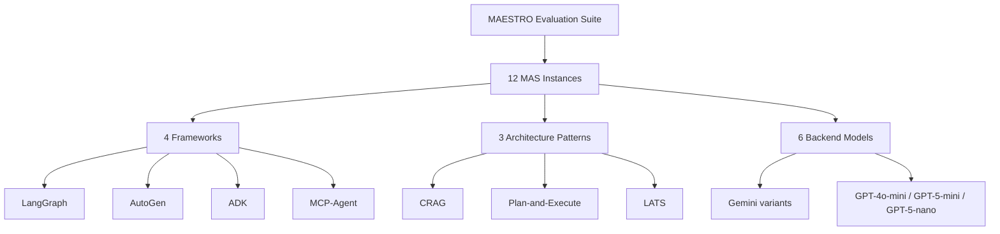
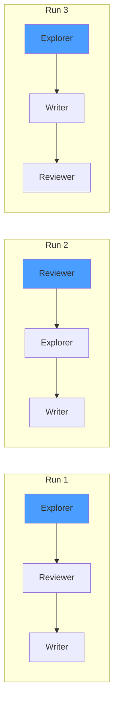
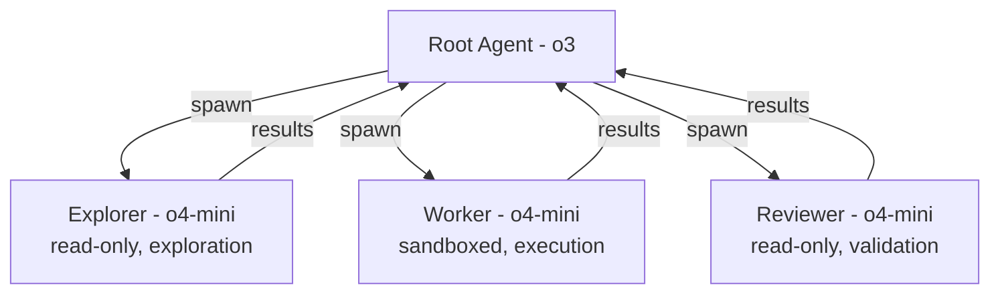

# MAESTRO Lessons for Codex CLI: What a 12-System Multi-Agent Evaluation Suite Reveals About Architecture vs Model Choice


---

There is a persistent assumption in the agent-building community that upgrading the backend model is the fastest route to better performance. Swap GPT-4o-mini for GPT-5-mini, the reasoning goes, and everything improves. MAESTRO — a January 2026 evaluation suite from KAUST and collaborators — puts hard numbers behind the counter-argument: **MAS architecture is the dominant driver of resource profiles, reproducibility, and cost–latency–accuracy trade-offs, often outweighing changes in backend models or tool settings** [^1].

This article unpacks MAESTRO's key findings and maps them directly to Codex CLI's subagent system, hooks engine, and rollout tracing — the machinery you actually have at your disposal when building multi-agent workflows on the CLI today.

## What MAESTRO Actually Measured

MAESTRO (Multi-Agent Evaluation Suite for Testing, Reliability, and Observability) standardises MAS configuration through a unified interface, exports framework-agnostic execution traces alongside system-level signals — latency, cost, and failures — and integrates both native and third-party MAS via lightweight adapters [^1].

The study instantiated **12 representative MAS** spanning four frameworks — **LangGraph, AutoGen, ADK, and MCP-Agent** — across three architecture patterns: **CRAG (Corrective RAG), Plan-and-Execute, and LATS (Language Agent Tree Search)** [^1]. Six backend models were tested: Gemini-2.0-Flash-Lite, Gemini-2.5-Flash-Lite, Gemini-2.5-Flash, GPT-4o-mini, GPT-5-mini, and GPT-5-nano [^1].



## Finding 1: Architecture Dominates Model Choice

CRAG achieved a **median cost of \$0.0010 per task** — more than 10x cheaper than Plan-and-Execute (\$0.0126) and LATS (\$0.0101) [^1]. Execution time followed the same pattern: 42.8 seconds for CRAG versus 101.5 seconds for Plan-and-Execute [^1]. CRAG also posted the highest average accuracy at **70.6%**, against 48.3% for Plan-and-Execute [^1].

Switching backend models within the same architecture produced smaller shifts. Architecture dependency for CPU consumption ranged from 9.7% (CRAG) to 1.36% (LATS) to 0.07% (Plan-and-Execute) [^1]. Tool enablement reduced average CPU by only 3.1% and memory by 4.8 MB [^1].

The practical takeaway: **before experimenting with model upgrades, get the orchestration pattern right**. A well-chosen architecture with a cheaper model will typically outperform a poorly chosen architecture with a frontier model.

### What This Means for Codex CLI

Codex CLI ships three built-in agent types — `default`, `worker`, and `explorer` — and lets you define custom agents under `~/.codex/agents/` or `.codex/agents/` with distinct `model`, `sandbox_mode`, and `developer_instructions` fields [^2]. The MAESTRO data argues strongly for matching agent type to task shape rather than throwing the most expensive model at everything.

A concrete example: for a codebase exploration task, an `explorer` agent using `o4-mini` may outperform a `default` agent using `o3` — not because the model is better, but because the architecture (read-heavy, no write permissions, lower token overhead) fits the task.

```toml
# .codex/agents/reviewer.toml — specialised, cheaper, faster
name = "reviewer"
description = "Read-only code reviewer — never writes files"
model = "o4-mini"
sandbox_mode = "read-only"
developer_instructions = """
You are a code reviewer. Analyse the provided files for correctness,
security issues, and style violations. Never propose file edits —
only report findings with file paths and line numbers.
"""
```

## Finding 2: 75% of Failures Are Silent Gray Errors

MAESTRO's failure analysis revealed that **75.17% of all failures were silent gray errors** — outputs that look plausible but lack utility [^1]. The breakdown:

| Failure Type | Percentage |
|---|---|
| Missing or underspecified output | 47.61% |
| Wrong fact or entity | 27.66% |
| Empty prediction | 15.96% |
| Exceptions | 6.38% |
| Timeouts | 1.86% |

Only 8.24% of failures produced visible crashes (exceptions + timeouts). The remaining 91.76% passed silently — a sobering statistic for anyone relying on exit codes alone to validate agent output.

### Detecting Gray Errors in Codex CLI

Codex CLI's hooks engine — stable since v0.124.0 [^3] — provides the primary defence against silent failures. A `PostToolUse` hook can intercept agent output and run validation before the next turn proceeds:

```toml
# config.toml — validate subagent output is non-trivial
[[hooks]]
event = "PostToolUse"
tool = "apply_patch"
command = "python3 .codex/hooks/validate-output.py"
```

The hook script can return exit code 2 to inject feedback back into the model's context, transforming a passive observer into a gatekeeper [^4]. This is the Codex equivalent of MAESTRO's recommendation for runtime validation — checking that output is structurally complete, not just successfully returned.

However, note a current limitation: hooks reliably fire for shell (Bash) tool calls but coverage for `apply_patch` and MCP tool calls remains inconsistent [^5]. ⚠️ If your subagent workflow relies heavily on MCP tools, hook-based validation may miss a significant portion of the tool surface.

## Finding 3: Structural Stability vs Temporal Instability

MAESTRO measured two dimensions of reproducibility across repeated runs:

- **Interaction structure (Jaccard similarity):** average 0.86 — agent call graphs were highly stable [^1]
- **Execution order (LCS similarity):** average 0.65 — the sequence in which agents ran varied considerably [^1]

CRAG showed extremely high consistency (0.97 average similarity across model pairs), while LATS and Plan-and-Execute dropped to 0.54 and 0.47 respectively [^1].

This means **the same agents get called, but in different orders** — which matters when agents have side effects or when you need deterministic audit trails.



### Codex CLI's Rollout Tracing

As of v0.128.0 (April 30, 2026), Codex CLI records **rollout traces** capturing tool, code-mode, session, and multi-agent relationships [^3]. The `debug trace` reduction command lets you inspect the actual execution graph post-hoc — precisely the kind of observability MAESTRO argues is essential for detecting temporal instability.

Combined with the MultiAgentV2 configuration (also landing in v0.128.0), which introduces explicit thread caps, wait-time controls, and root/subagent context hints [^3], you now have the primitives to constrain execution order where determinism matters.

```toml
# config.toml — constrain multi-agent execution
[agents]
multi_agent_v2 = true
max_threads = 3
```

## Finding 4: Specialised Agents Beat General Architectures on Cost

The 10x cost differential between CRAG and the general-purpose architectures maps directly to a pattern the Codex community has already discovered empirically: **specialised, constrained agents using smaller models drastically reduce token consumption** [^6].

Codex CLI's `max_threads` (default 6) and `max_depth` (default 1) settings control the blast radius [^2]. MAESTRO's data suggests these defaults are reasonable — most of their efficient systems stayed in the sub-GB memory regime with moderate CPU usage [^1]. But the real savings come from agent specialisation:



Each specialised agent uses `o4-mini` with tight sandbox constraints, while only the orchestrating root agent needs the heavier model. Token consumption scales linearly with thread count [^2], so keeping subagents lightweight is where the cost savings compound.

## Practical Recommendations

Drawing from MAESTRO's findings and Codex CLI's current capabilities:

1. **Choose architecture first, model second.** Define your agent topology (how many agents, what roles, what communication pattern) before selecting models. MAESTRO shows this decision has 10x cost impact [^1].

2. **Instrument for gray errors.** Use `PostToolUse` hooks to validate output completeness. Do not rely on exit codes — 75% of failures will pass silently [^1] [^4].

3. **Enable rollout tracing.** Use the debug trace reduction command to inspect execution graphs across runs. Look for temporal instability (varying execution order) as a signal that your architecture may produce inconsistent results [^3].

4. **Specialise subagents aggressively.** Give each agent the smallest model, tightest sandbox, and most specific instructions that will accomplish its task. The CRAG pattern's 10x cost advantage came from architectural simplicity, not model sophistication [^1].

5. **Set explicit thread caps.** MultiAgentV2's `max_threads` and wait-time controls prevent runaway parallelism. Match the cap to your task's actual parallelism — more threads is not always better [^2] [^3].

6. **Measure, do not assume.** MAESTRO's framework-agnostic tracing philosophy applies to Codex: export your traces, compare runs, and let the data tell you where the variance lives.

## Limitations

MAESTRO evaluated 12 systems across academic benchmarks — not production software engineering tasks. The cost and latency figures are directionally useful but should not be taken as absolutes for Codex CLI workflows. The 75.17% gray error rate was measured across all 12 systems; your specific architecture may fare better or worse. ⚠️ The study tested Gemini and GPT model families — OpenAI's `o3` and `o4-mini` reasoning models used by Codex CLI were not directly evaluated, though the architectural findings should generalise.

Additionally, Codex CLI's hook coverage for MCP tools remains incomplete as of May 2026 [^5], which limits the hook-based validation strategies discussed above.

## Citations

[^1]: Ma, T., Chen, Y., Anand, V., et al. "MAESTRO: Multi-Agent Evaluation Suite for Testing, Reliability, and Observability." arXiv:2601.00481, January 2026. [https://arxiv.org/abs/2601.00481](https://arxiv.org/abs/2601.00481)

[^2]: OpenAI. "Subagents — Codex CLI." OpenAI Developers, 2026. [https://developers.openai.com/codex/subagents](https://developers.openai.com/codex/subagents)

[^3]: OpenAI. "Changelog — Codex CLI." OpenAI Developers, 2026. [https://developers.openai.com/codex/changelog](https://developers.openai.com/codex/changelog)

[^4]: OpenAI. "Hooks — Codex CLI." OpenAI Developers, 2026. [https://developers.openai.com/codex/hooks](https://developers.openai.com/codex/hooks)

[^5]: "Inconsistent PreToolUse hook coverage across tool handlers." GitHub Issue #20204, openai/codex. [https://github.com/openai/codex/issues/20204](https://github.com/openai/codex/issues/20204)

[^6]: Osmani, A. "The Code Agent Orchestra — What Makes Multi-Agent Coding Work." AddyOsmani.com, 2026. [https://addyosmani.com/blog/code-agent-orchestra/](https://addyosmani.com/blog/code-agent-orchestra/)
