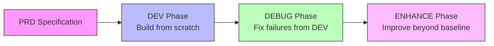
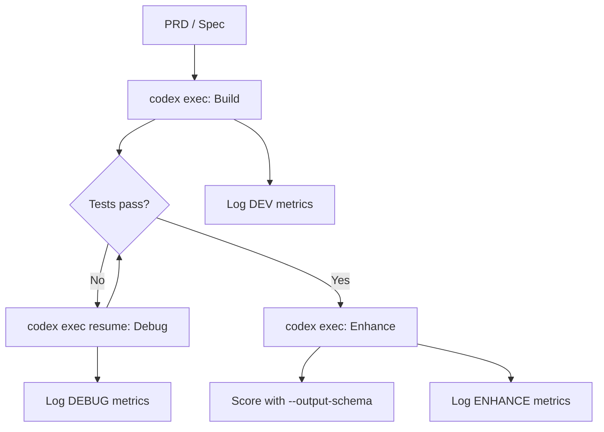

# PRDBench and the PRD-to-Code Gap: Why Building From Specs Is Harder Than Fixing Bugs


---

Most coding agent benchmarks ask a deceptively narrow question: *can the agent fix this bug?* SWE-bench and its variants hand the model a failing test and a known-good codebase, then measure whether the patch resolves the issue [^1]. That workflow mirrors a single slice of real development — triage and repair — while ignoring the far harder task of building software from a specification.

PRDBench, accepted at AAMAS 2026, shifts the evaluation target from bug-fixing to greenfield development [^2]. It hands agents a structured Product Requirement Document (PRD) and asks them to deliver a working project. The results are sobering: the best agent achieves only 55.81% on the development phase, and Claude Code reaches 36.60% [^2]. For teams using Codex CLI's spec-driven workflows, those numbers carry practical implications.

## What PRDBench Measures

PRDBench comprises 50 real-world Python projects spanning 20 domains, each defined by a structured PRD, a verifiable criteria scheme, and a reference implementation [^2]. The benchmark totals over 1,262 individual scoring points [^3].

Unlike SWE-bench's fail-to-pass test paradigm, PRDBench evaluates three distinct phases:



- **DEV** — build the project from the PRD alone
- **DEBUG** — fix failures surfaced during the DEV phase
- **ENHANCE** — improve the codebase beyond the initial pass [^2]

This three-phase structure reveals something unit-test benchmarks cannot: whether an agent that debugs well can also *build* well, and vice versa.

## The Performance Gap

The headline numbers from PRDBench's evaluation expose a stark reality [^2][^3]:

| Agent | Framework | DEV (%) | DEBUG (%) | Enhance (Δ%) |
|-------|-----------|---------|-----------|---------------|
| GPT-5 | Minimal | 55.81 | 60.15 | +4.34 |
| Claude | Minimal | 45.50 | 49.07 | +3.57 |
| CodeX | Commercial | 56.23 | 50.24 | −6.99 |
| Gemini | Minimal | 14.27 | 15.99 | — |
| Qwen3-Coder | Minimal | 37.60 | 46.98 | +9.38 |

Three findings stand out:

**Development is harder than debugging.** Most agents score higher in DEBUG than DEV, confirming that fixing known failures in existing code is easier than building from a blank slate [^2]. This maps onto everyday experience — reading and patching code exercises different capabilities from interpreting requirements and structuring a project.

**Commercial wrappers don't always help.** CodeX's commercial framework scored marginally higher in DEV (56.23%) but *degraded* during DEBUG (−6.99%), suggesting that "effective debugging requires not only error identification but also careful maintenance of code structure" [^2]. More scaffolding does not guarantee more resilience.

**The best agent still fails nearly half the time.** A 55.81% DEV pass rate means that for every two PRD-level tasks, one produces broken output. Compare this with SWE-bench Verified, where top agents now exceed 70% [^4]. The gap quantifies the difference between "fix this" and "build this."

## Agent-as-Judge: PRDJudge

Traditional benchmarks rely on unit tests — pass or fail, with no nuance. PRDBench introduces PRDJudge, a fine-tuned evaluation model based on Qwen3-Coder-30B that scores agent output against the criteria scheme [^2].

PRDJudge achieves over 90% human alignment in fixed-interface scenarios and 81.56% perfect score alignment overall [^2][^3]. Alignment varies by test type:

- **Unit tests:** 79.44%
- **Shell interaction:** 82.55%
- **File comparison:** 84.62% [^2]

The evaluation runs at roughly \$2.68 per problem in approximately 7 minutes, compared to 0.5–1 hour for human annotation [^2]. This cost profile makes PRDBench practical for continuous evaluation — something that matters when you are iterating on Codex CLI configurations.

## Why This Matters for Codex CLI

Codex CLI's ecosystem has been converging on spec-driven development throughout 2025–2026. Tools like `codex-spec` implement a PRD → Design → Development Plan → Implementation pipeline [^5], whilst `cc-sdd` treats specs as contracts between system components [^6]. The community has embraced the pattern: write the specification first, then let the agent build.

PRDBench's results should temper expectations. When the best available agent fails 44% of the time at PRD-to-code, the quality of the specification and the verification harness around it become load-bearing.

### Practical Recommendations

**1. Treat PRDs as iterative, not fire-and-forget**

PRDBench's three-phase structure mirrors a realistic workflow: build, debug, enhance. Design your Codex CLI sessions the same way. The first `codex exec` pass against a PRD will likely produce partial output. Plan for a debugging pass using the same conversation context:

```bash
# Initial build from PRD
codex exec "Implement the project described in PRD.md"

# Debug pass — resume with failure context
codex exec resume --last "Fix the failing tests and missing features"
```

**2. Use structured output to grade your own runs**

Codex CLI's `--output-schema` flag forces structured JSON responses [^7], enabling automated grading pipelines analogous to PRDJudge:

```bash
codex exec \
  --output-schema '{"type":"object","properties":{"tests_passing":{"type":"number"},"coverage":{"type":"number"},"missing_features":{"type":"array","items":{"type":"string"}}}}' \
  "Run all tests and report results for the PRD implementation"
```

Pipe this into a CI step that gates on minimum thresholds.

**3. Separate development and debugging evaluation**

PRDBench demonstrates that DEV and DEBUG exercise different capabilities. When evaluating your Codex CLI workflows, measure them separately:



This gives you three separate signals rather than a single pass/fail, letting you identify whether your `AGENTS.md` instructions, model selection, or permission profile is the bottleneck.

**4. Choose the right benchmark for the right question**

The benchmark landscape now offers distinct tools for distinct questions:

| Benchmark | Question Answered | Tasks | Scope |
|-----------|------------------|-------|-------|
| SWE-bench Verified | Can it fix known bugs? | 500 | Patch generation [^1] |
| SWE-bench Pro | Can it handle large changes? | 1,865 | Multi-file patches [^4] |
| PRDBench | Can it build from a spec? | 50 | Greenfield projects [^2] |
| ProdCodeBench | Does it work on production code? | Rolling | Real workloads [^8] |

For Codex CLI evaluation, SWE-bench tells you whether your configuration can triage issues. PRDBench tells you whether it can deliver features. You need both.

## The Annotation Efficiency Angle

One underappreciated aspect of PRDBench is its annotation pipeline. By using a code agent to generate the initial project scaffolding and PRD, then having human annotators verify rather than create, annotation cost drops to roughly eight hours per project [^2]. This agent-driven annotation approach means the benchmark can scale to new domains without requiring deep domain experts for every task.

For teams building internal evaluation suites around Codex CLI, the same principle applies: use the agent to generate initial test scaffolding, then have engineers verify and refine. It inverts the traditional test-writing burden.

## Limitations

PRDBench is not without gaps. The benchmark covers only Python projects, limiting generalisability to polyglot codebases [^2]. The 50-project corpus, whilst diverse across domains, is small compared to SWE-bench's thousands of instances. And the ENHANCE phase shows volatile results — CodeX's −6.99% degradation suggests that iterative improvement remains poorly understood even by the benchmark itself [^2].

⚠️ The specific model names and scores reported here reflect PRDBench's evaluation as of March 2026. Agent capabilities evolve rapidly; these numbers should be treated as a snapshot rather than a permanent ranking.

## Conclusion

PRDBench reframes how we think about coding agent capability. Bug-fixing — the task most benchmarks measure — is the *easier* half of software development. Building from specifications, the workflow that Codex CLI's spec-driven ecosystem encourages, remains significantly harder.

The practical takeaway: if your team relies on Codex CLI for greenfield development from PRDs, build your evaluation pipeline around the DEV/DEBUG/ENHANCE phases that PRDBench models. Measure each phase independently, use `codex exec --output-schema` for automated grading, and resist the temptation to extrapolate SWE-bench scores to spec-driven work. They measure different things.

---

## Citations

[^1]: SWE-bench: Evaluating Language Models on Real-World Software Issues. [https://www.swebench.com/](https://www.swebench.com/)

[^2]: Fu, L. et al. "Automatically Benchmarking LLM Code Agents through Agent-Driven Annotation and Evaluation." arXiv:2510.24358, revised March 2026. Accepted at AAMAS 2026. [https://arxiv.org/abs/2510.24358](https://arxiv.org/abs/2510.24358)

[^3]: PRDBench GitHub Repository, AGI-Eval-Official. [https://github.com/AGI-Eval-Official/PRDBench](https://github.com/AGI-Eval-Official/PRDBench)

[^4]: SWE-Bench Pro Leaderboard, Scale AI. [https://labs.scale.com/leaderboard/swe_bench_pro_public](https://labs.scale.com/leaderboard/swe_bench_pro_public)

[^5]: codex-spec: Automated workflows for OpenAI Codex — spec-driven development. [https://github.com/shenli/codex-spec](https://github.com/shenli/codex-spec)

[^6]: cc-sdd: Spec-Driven Development harness for Claude Code, Codex, and 25+ agents. [https://github.com/gotalab/cc-sdd](https://github.com/gotalab/cc-sdd)

[^7]: Codex CLI Non-Interactive Mode documentation. [https://developers.openai.com/codex/noninteractive](https://developers.openai.com/codex/noninteractive)

[^8]: Jha, A. et al. "ProdCodeBench: A Production-Derived Benchmark for Evaluating AI Coding Agents." arXiv:2604.01527, April 2026. [https://arxiv.org/abs/2604.01527](https://arxiv.org/abs/2604.01527)
