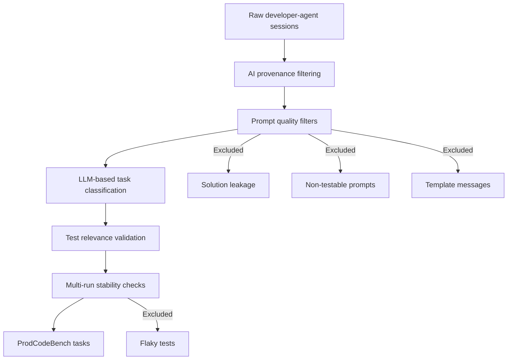
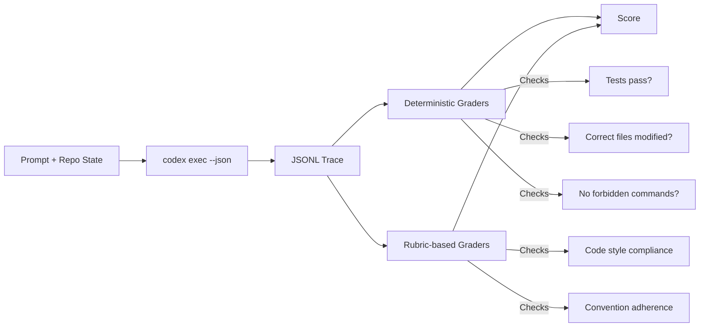
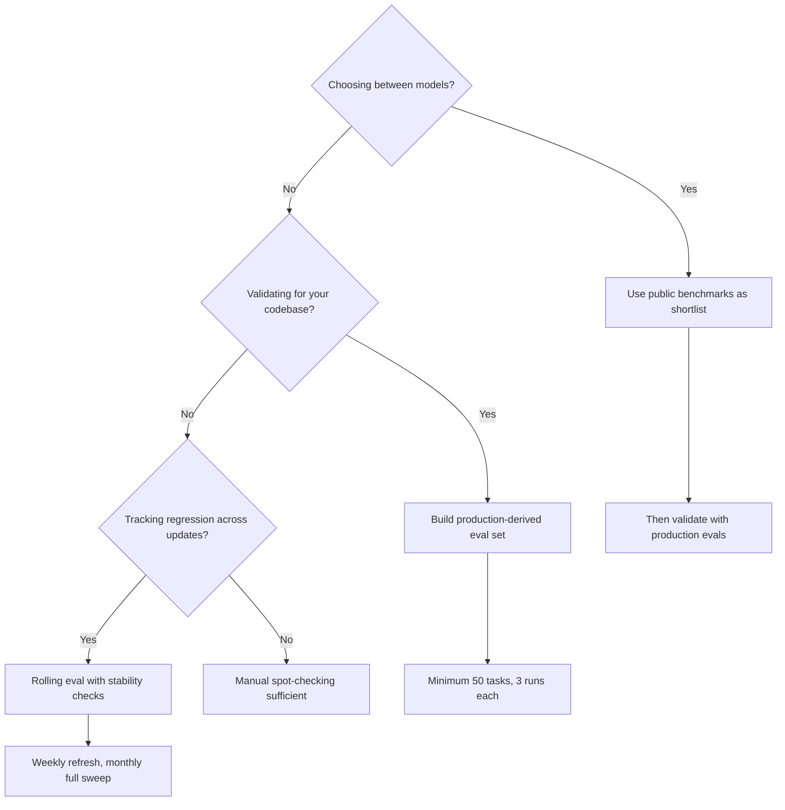

# ProdCodeBench and Production-Derived Evaluation: Why Synthetic Benchmarks Mislead and How to Evaluate Codex CLI Against Real Workloads


## The Benchmark Problem

Most teams selecting a coding agent rely on public leaderboards — SWE-bench Verified, Terminal-Bench 2.0, Aider Polyglot — to inform their choice. These benchmarks serve a purpose, but Meta's ProdCodeBench research (April 2026) exposes a structural gap: synthetic benchmarks diverge from production workloads in prompt style, language distribution, and codebase structure[^1]. The solve-rate delta between public benchmarks and internal evaluations can exceed 20 percentage points[^2], meaning a model that scores 80% on SWE-bench Verified may achieve barely 60% on your actual monorepo tasks.

This article examines ProdCodeBench's methodology, extracts the principles that matter for Codex CLI practitioners, and provides a practical pipeline for building production-derived evaluations using `codex exec --json`.

## What ProdCodeBench Reveals

### Methodology

ProdCodeBench, developed by researchers at Meta[^1], curates benchmark tasks from real developer-agent conversations rather than GitHub issues written for human communication. Each sample consists of three components:

1. **Verbatim prompt** — the exact text a developer typed to the coding agent
2. **Committed code change** — the production diff that was merged
3. **Fail-to-pass tests** — tests spanning seven programming languages that validate correctness

The curation pipeline applies multiple filtering stages[^1]:



### Key Findings

Across four foundation models, solve rates ranged from 53.2% to 72.2%[^1] — significantly below the 80%+ scores these same model families achieve on SWE-bench Verified[^3]. The gap stems from three structural differences:

| Dimension | SWE-bench | ProdCodeBench |
|-----------|-----------|---------------|
| Prompt origin | GitHub issue descriptions | Verbatim developer prompts |
| Context assumptions | Self-contained | Enterprise context, implicit knowledge |
| Codebase structure | Individual OSS repos | Monorepo with cross-service dependencies |
| Language coverage | Predominantly Python | Seven languages reflecting production mix |

### The Monorepo Problem

ProdCodeBench identifies a "time travel problem" unique to production evaluation[^1]: distributed services continuously index the latest state, developer tooling expires within 30–365 days, build indices expire within days, and CI metadata retention is limited. This motivates a **rolling benchmark design** with periodic task refreshes rather than a fixed dataset — a pattern directly applicable to Codex CLI evaluation in enterprise environments.

## Why This Matters for Codex CLI Teams

### Public Benchmarks as Directional Signal Only

Current public scores for Codex CLI's underlying models[^3][^4]:

- **SWE-bench Verified**: GPT-5.2 achieves 80.0%; GPT-5.4-Codex leads SWE-bench Pro at 56.8%
- **Terminal-Bench 2.0**: GPT-5.3 Codex scores ~77.3%, GPT-5.5 reaches 82.0%
- **Aider Polyglot**: GPT-5.3 scores ~80%

These numbers tell you which models are broadly capable. They do not tell you whether Codex CLI will correctly refactor your payment service's retry logic, navigate your monorepo's build system, or follow your team's commit conventions. ProdCodeBench demonstrates that the same models score 10–25 points lower on production-derived tasks[^1][^2].

### The Three Gaps

Production workloads introduce challenges that synthetic benchmarks rarely exercise:

1. **Implicit context** — production prompts assume knowledge of internal APIs, naming conventions, and architectural decisions
2. **Cross-service dependencies** — changes that span multiple packages with shared types and configuration
3. **Non-functional requirements** — logging standards, error handling patterns, test coverage thresholds enforced by CI

## Building Production-Derived Evals for Codex CLI

### Step 1: Capture Real Sessions

Codex CLI's rollout files provide the raw material. Every interactive session produces a session rollout stored in `~/.codex/sessions/`[^5]. For `codex exec` invocations, use `--json` to capture structured JSONL events:

```bash
codex exec --json \
  --model gpt-5.3-codex \
  "Refactor the retry logic in payments/client.go to use exponential backoff" \
  2>/dev/null | tee /tmp/eval-session.jsonl
```

The JSONL stream includes every tool call, file edit, and command execution as structured events[^6].

### Step 2: Classify and Filter Tasks

Not every session makes a good benchmark task. Apply ProdCodeBench's classification criteria:

```bash
# Extract sessions where tests went from failing to passing
codex exec --json --output-schema '{"type":"object","properties":{"testable":{"type":"boolean"},"task_type":{"type":"string"},"complexity":{"type":"string"}}}' \
  "Analyse this session trace and classify: is the task testable (has fail-to-pass tests), what type (bug_fix|feature|refactor), and complexity (low|medium|high)?" \
  < /tmp/eval-session.jsonl
```

### Step 3: Build the Eval Harness

OpenAI's recommended pattern uses `codex exec --json` with layered grading[^6]:



A minimal eval script:

```bash
#!/usr/bin/env bash
set -euo pipefail

EVAL_DIR="$1"
PROMPT=$(cat "$EVAL_DIR/prompt.txt")
REPO_STATE=$(cat "$EVAL_DIR/repo_sha.txt")

# Reset to known state
git checkout "$REPO_STATE" --quiet

# Run the agent
codex exec --json \
  --model gpt-5.3-codex \
  --approval-mode full-auto \
  "$PROMPT" > "$EVAL_DIR/trace.jsonl" 2>"$EVAL_DIR/stderr.log"

# Deterministic grading
TEST_RESULT=$(cd "$EVAL_DIR/repo" && make test 2>&1 && echo "PASS" || echo "FAIL")
MODIFIED_FILES=$(git diff --name-only)

# Score
jq -n \
  --arg test_result "$TEST_RESULT" \
  --arg modified "$MODIFIED_FILES" \
  '{test_pass: ($test_result == "PASS"), files_modified: ($modified | split("\n") | length)}' \
  > "$EVAL_DIR/score.json"
```

### Step 4: Multi-Run Stability

ProdCodeBench's key insight: each model must be evaluated multiple times to quantify variance[^1]. Non-deterministic outcomes without code changes indicate flaky tests that should be excluded. For Codex CLI evaluations:

```toml
# eval-config.toml
[eval]
runs_per_task = 3
stability_threshold = 0.67  # 2/3 runs must agree
model = "gpt-5.3-codex"
reasoning_effort = "medium"

[eval.exclude_patterns]
flaky_tests = ["**/integration/network_*", "**/e2e/timing_*"]
```

### Step 5: Rolling Refresh

Following ProdCodeBench's rolling benchmark design, refresh your eval set periodically:

```bash
# Weekly: extract new sessions from the past 7 days
find ~/.codex/sessions -mtime -7 -name "*.jsonl" \
  | xargs -I{} codex exec --json \
    "Classify this session for eval suitability" < {} \
  >> /tmp/new-candidates.jsonl
```

## Production Eval Patterns for Codex CLI

### Pattern 1: Regression Detection

Compare solve rates across model upgrades:

```bash
for model in "gpt-5.3-codex" "gpt-5.4-codex" "gpt-5.5"; do
  codex exec --json --model "$model" \
    --approval-mode full-auto \
    "$(cat eval/task-042/prompt.txt)" \
    > "eval/task-042/trace-${model}.jsonl"
done
```

### Pattern 2: Configuration A/B Testing

Test whether reasoning effort or approval mode affects production task completion:

```toml
# profiles for eval comparison
[profile.eval-medium]
model = "gpt-5.3-codex"
reasoning_effort = "medium"

[profile.eval-high]
model = "gpt-5.3-codex"
reasoning_effort = "high"
```

### Pattern 3: Harness-Aware Scoring

Use Promptfoo's Codex SDK provider[^7] for structured evaluation with trajectory assertions, token tracking, and skill usage verification — aligning with ProdCodeBench's emphasis on process goals alongside outcome goals.

## Decision Framework



## Current Limitations

- ⚠️ ProdCodeBench's full dataset is not publicly available — the paper describes methodology rather than releasing a reusable benchmark
- ⚠️ The "time travel problem" means production evals have a shelf life; tasks become stale as codebases evolve
- ⚠️ `codex exec --json` reasoning-token reporting (added in v0.125.0[^8]) helps with cost tracking but does not yet integrate with eval frameworks natively
- ⚠️ Multi-run stability checks triple evaluation cost — budget accordingly when using paid models

## Recommendations

1. **Treat public benchmarks as a filter, not a decision** — use SWE-bench Verified and Terminal-Bench 2.0 to shortlist models, then validate against your own workload
2. **Start small** — 20–30 production-derived tasks with fail-to-pass tests provide more signal than thousands of synthetic problems
3. **Capture verbatim prompts** — ProdCodeBench shows that real developer prompts behave differently from cleaned-up issue descriptions
4. **Implement rolling refresh** — eval tasks older than 90 days should be reviewed for relevance given codebase evolution
5. **Score process, not just outcome** — use JSONL traces to verify Codex CLI followed intended tool sequences and conventions

## Citations

[^1]: Jha, S., Paltenghi, M., Maddila, C., Murali, V., Ugare, S., & Chandra, S. (2026). "ProdCodeBench: A Production-Derived Benchmark for Evaluating AI Coding Agents." arXiv:2604.01527. https://arxiv.org/abs/2604.01527

[^2]: Meta AI Research internal evaluation results as reported in ProdCodeBench, showing 53.2%–72.2% solve rates vs. 80%+ on synthetic benchmarks. https://arxiv.org/html/2604.01527v1

[^3]: Morphllm. "AI Coding Benchmarks 2026: Every Major Eval Explained and Ranked." https://www.morphllm.com/ai-coding-benchmarks-2026

[^4]: Terminal-Bench 2.0 Leaderboard. BenchLM.ai. https://benchlm.ai/benchmarks/terminalBench2

[^5]: OpenAI. "Codex CLI Features — Session resumption." https://developers.openai.com/codex/cli/features

[^6]: OpenAI. "Testing Agent Skills Systematically with Evals." https://developers.openai.com/blog/eval-skills

[^7]: Promptfoo. "OpenAI Codex SDK — Evaluate Coding Agents." https://www.promptfoo.dev/docs/providers/openai-codex-sdk/

[^8]: OpenAI. "Codex CLI Changelog — v0.125.0." https://developers.openai.com/codex/changelog
