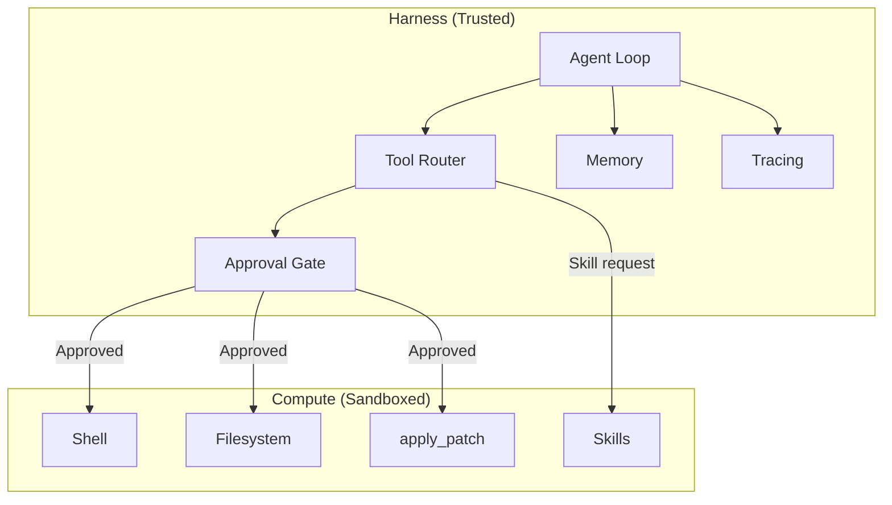
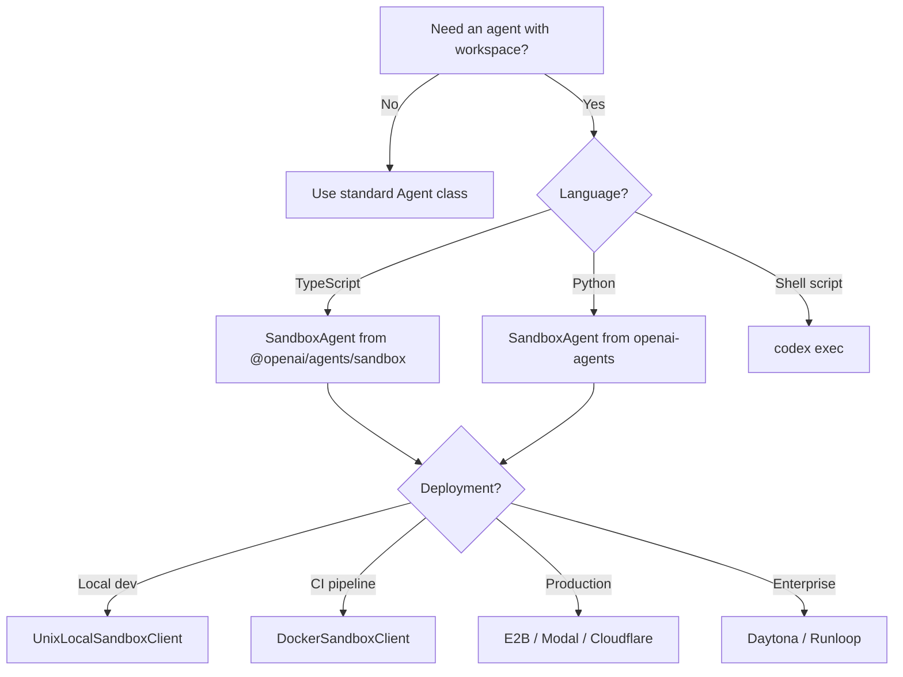

# Agents SDK TypeScript Goes Sandbox-Native: Building Codex-Powered Agents with the Open-Source Harness


---

On 6 May 2026, OpenAI released v0.9.1 of the Agents SDK for TypeScript — the first version to ship **sandbox agents** and the **open-source harness** that underpins Codex itself[^1]. The Python SDK gained these features in mid-April[^2]; TypeScript developers now have parity. This matters for Codex CLI users because it means you can embed the same harness–compute separation that powers `codex exec` into your own TypeScript applications, CI pipelines, and multi-agent orchestrators — and swap the underlying compute provider at runtime without touching agent logic.

This article covers the architecture, walks through practical integration patterns with Codex CLI, and examines provider trade-offs for production deployments.

## Why the Harness–Compute Split Matters

Codex CLI has always separated its reasoning loop from command execution: the agent decides *what* to do, and the sandbox decides *where* and *how* it runs[^3]. The Agents SDK formalises this boundary into two clean layers:

| Layer | Responsibilities | Where it runs |
|-------|-----------------|---------------|
| **Harness** | Model calls, tool dispatch, handoffs, approvals, memory, tracing, recovery | Trusted infrastructure (your server, CI runner, Lambda) |
| **Compute** | File I/O, shell commands, package installation, port exposure | Sandboxed environment (local Unix, Docker, E2B, Modal…) |



This split means credentials, API keys, and orchestration state never enter the sandbox. The sandbox sees only the files and environment variables you explicitly declare in the `Manifest`[^4].

## Getting Started: A Minimal Sandbox Agent

Install the SDK and create a sandbox agent that reviews a workspace:

```bash
npm install @openai/agents@0.9.1
```

```typescript
import { run } from "@openai/agents";
import {
  SandboxAgent,
  Manifest,
  file,
  shell,
  filesystem,
} from "@openai/agents/sandbox";
import { UnixLocalSandboxClient } from "@openai/agents/sandbox/local";

const manifest = new Manifest({
  entries: {
    "AGENTS.md": file({
      content: `# Review Agent
## Rules
- Run tests before summarising.
- Never modify production files.`,
    }),
    "src/index.ts": file({ content: "export const greet = () => 'hello';" }),
    "src/index.test.ts": file({
      content: `import { greet } from './index';
test('greets', () => expect(greet()).toBe('hello'));`,
    }),
  },
});

const reviewer = new SandboxAgent({
  name: "Code Reviewer",
  model: "gpt-5.5",
  instructions:
    "Read AGENTS.md first. Run the test suite, then summarise results.",
  defaultManifest: manifest,
  capabilities: [shell(), filesystem()],
});

const result = await run(
  reviewer,
  "Review this workspace and report any issues.",
  { sandbox: { client: new UnixLocalSandboxClient() } },
);

console.log(result.finalOutput);
```

The `UnixLocalSandboxClient` runs commands on the host machine inside a restricted directory — fast for local development, unsuitable for untrusted code[^4].

## Capabilities: What a Sandbox Agent Can Do

Each capability grants the agent a set of tools. The defaults mirror what Codex CLI provides in a standard session[^4]:

| Capability | Tools added | Requires |
|-----------|-------------|----------|
| `shell()` | `run_command`, interactive input | — |
| `filesystem()` | `apply_patch`, `view_image`, file read/write | — |
| `skills()` | Skill discovery and materialisation | — |
| `memory()` | Cross-run lesson retention | `shell()` |
| `compaction()` | Context trimming for long sessions | — |

The `apply_patch` tool uses the same v4a diff format as Codex CLI[^5], ensuring patches generated in one environment apply cleanly in the other.

### Loading Skills from Git

Skills — the same `SKILL.md` format used by Codex CLI[^6] — can be loaded from local directories or Git repositories:

```typescript
import { skills, gitRepo } from "@openai/agents/sandbox";

const agent = new SandboxAgent({
  name: "Skilled Agent",
  model: "gpt-5.5",
  instructions: "Use available skills when appropriate.",
  capabilities: [
    shell(),
    filesystem(),
    skills({
      from: gitRepo({
        repo: "your-org/codex-skills",
        ref: "main",
      }),
    }),
  ],
});
```

This means teams that maintain skill libraries for Codex CLI can reuse them directly in TypeScript agents without duplication[^6].

## Nine Sandbox Providers at Runtime

The provider is a runtime argument — change it without modifying agent logic[^4]:

| Provider | Client class | Best for |
|----------|-------------|----------|
| Unix-local | `UnixLocalSandboxClient` | Fast local iteration |
| Docker | `DockerSandboxClient` | Local container isolation |
| Blaxel | `BlaxelSandboxClient` | Managed multi-tenant |
| Cloudflare | `CloudflareSandboxClient` | Edge compute |
| Daytona | `DaytonaSandboxClient` | Multi-language devbox |
| E2B | `E2BSandboxClient` | Managed preview URLs |
| Modal | `ModalSandboxClient` | Serverless GPU access |
| Runloop | `RunloopSandboxClient` | Devbox with tunnels |
| Vercel | `VercelSandboxClient` | Deployment integration |

Switching from local development to production is a one-line change:

```typescript
import { DockerSandboxClient } from "@openai/agents/sandbox/local";

const result = await run(agent, "Analyse this codebase.", {
  sandbox: {
    client: new DockerSandboxClient({
      image: "node:22-bookworm-slim",
    }),
  },
});
```

For CI pipelines, Docker or E2B provides repeatable isolation without host contamination[^4].

## Session State and Resume

Sandbox sessions support persistence and resumption — the same pattern Codex CLI uses for `codex resume`[^7]:

```typescript
// First run
const session = await client.create({ manifest });
const firstResult = await run(agent, "Set up the project.", {
  maxTurns: 20,
  sandbox: { session },
});

// Serialise state
const frozen = await client.serializeSessionState?.(session.state);
await session.close?.();

// Later: resume from frozen state
const resumed = await client.resume(
  await client.deserializeSessionState(frozen),
);

const secondResult = await run(agent, "Now add integration tests.", {
  maxTurns: 20,
  sandbox: { session: resumed },
});
```

This enables long-running workflows that span CI stages, human review gates, or time-bounded compute budgets[^4].

## Sandbox Memory: Cross-Run Learning

The `memory()` capability persists lessons across runs without polluting conversational context[^4]. Memory files follow a defined layout:

```
workspace/
  memories/
    memory_summary.md      # Distilled guidance
    MEMORY.md              # Active memory document
    raw_memories.md        # Unprocessed entries
    raw_memories/<run>.md  # Per-run raw memories
    rollout_summaries/     # Run-level summaries
```

Three memory modes control behaviour:

- **Default** — read existing memories, generate new entries
- **Read-only** — consume prior lessons without writing
- **Generate-only** — produce memories without reading

This mirrors Codex CLI's native memories system[^8], and memories written by Codex sessions can be read by TypeScript agents if they share the same workspace directory.

## Codex CLI Integration Patterns

### Pattern 1: Codex CLI as MCP Server, TypeScript Agent as Orchestrator

Run `codex mcp-server` and connect a TypeScript `SandboxAgent` to it via the MCP transport[^9]. The orchestrator handles routing and approvals; Codex handles code execution:

```typescript
import { MCPServerStdio } from "@openai/agents/mcp";

const codexMcp = new MCPServerStdio({
  name: "codex",
  command: "codex",
  args: ["mcp-server", "--path", "/workspace/project"],
});

const orchestrator = new SandboxAgent({
  name: "Orchestrator",
  model: "gpt-5.5",
  mcpServers: [codexMcp],
  instructions: "Delegate coding tasks to the Codex MCP server.",
  capabilities: [shell(), filesystem()],
});
```

### Pattern 2: Shared Manifest for Codex CLI and TypeScript Agents

Define workspace contents once in a `Manifest`, use it across both surfaces:

```typescript
const sharedManifest = new Manifest({
  entries: {
    repo: gitRepo({ repo: "your-org/your-project", ref: "main" }),
    "AGENTS.md": file({ content: agentsContent }),
  },
});

// TypeScript agent uses the manifest directly
const result = await run(agent, task, {
  sandbox: { client, manifest: sharedManifest },
});

// Codex CLI uses the same repo + AGENTS.md via normal git clone
// $ codex exec "Run the test suite" --path /workspace/your-project
```

### Pattern 3: Handoff from Non-Sandbox to Sandbox Agent

A lightweight orchestration agent without sandbox capabilities delegates workspace-heavy tasks to a sandbox agent[^4]:

```typescript
import { Agent } from "@openai/agents";

const triage = new Agent({
  name: "Triage",
  model: "gpt-5.5",
  instructions: "Classify incoming requests. Hand off coding tasks.",
  handoffs: [sandboxCodingAgent],
});
```

The triage agent handles natural-language routing; the sandbox agent handles file manipulation. This separates concerns cleanly and keeps the triage agent's context lean.

## What This Means for Codex CLI Users

The TypeScript SDK release closes a significant gap. Prior to v0.9.1, TypeScript developers who wanted sandbox-powered agents had three options: shell out to `codex exec`, use the Python SDK, or build their own harness[^10]. Now they can build natively in TypeScript with the same primitives:

1. **Portable skills** — SKILL.md files work across Codex CLI, the Python SDK, and now the TypeScript SDK[^6].
2. **Portable manifests** — workspace definitions are provider-agnostic and SDK-agnostic.
3. **Shared memory** — agents across languages can read the same memory files if they share a workspace.
4. **Consistent patching** — `apply_patch` uses the same v4a format everywhere[^5].

The beta label is worth noting: API details, defaults, and supported capabilities may change[^1]. Pin your SDK version in `package.json` and watch the changelog.

## Decision Framework: When to Use What



## Limitations and Sharp Edges

- **Beta status** — sandbox agents in TypeScript are beta; expect breaking changes between minor versions[^1].
- **No code mode yet** — the TypeScript SDK does not yet support the Codex CLI-style `code_mode` that restricts the agent to code-only output. OpenAI lists this as planned[^1].
- **No subagent primitive** — TypeScript sandbox agents cannot natively spawn sub-sandbox-agents the way Codex CLI's MultiAgentV2 does[^11]. Use handoffs or tool-based composition instead.
- **Provider parity varies** — snapshot support, port exposure, and mount types differ across providers. Test your target provider early[^4].
- **Memory requires persistence** — cross-run memory only works if the workspace directory (or cloud mount) survives between runs[^4].

## Citations

[^1]: [OpenAI Agents SDK TypeScript documentation](https://openai.github.io/openai-agents-js/) — v0.9.1 release, sandbox agents beta status, planned features.
[^2]: [OpenAI, "The next evolution of the Agents SDK"](https://openai.com/index/the-next-evolution-of-the-agents-sdk/) — April 2026 announcement of harness and sandbox for Python SDK.
[^3]: [OpenAI, "Unlocking the Codex harness: how we built the App Server"](https://openai.com/index/unlocking-the-codex-harness/) — Codex app-server architecture and harness–compute separation.
[^4]: [OpenAI API docs, "Sandbox Agents"](https://developers.openai.com/api/docs/guides/agents/sandboxes) — Manifest format, capabilities, provider table, session state, memory, secret management.
[^5]: [OpenAI Codex CLI features](https://developers.openai.com/codex/cli/features) — apply_patch v4a diff format, shared across Codex and Agents SDK.
[^6]: [OpenAI, "Agent Skills"](https://developers.openai.com/codex/skills) — SKILL.md format specification, progressive disclosure, skill loading from Git.
[^7]: [OpenAI Codex CLI features — resume](https://developers.openai.com/codex/cli/features) — `codex resume` session persistence.
[^8]: [OpenAI Codex Memories documentation](https://developers.openai.com/codex/config-reference) — Native memories pipeline, memory file layout.
[^9]: [OpenAI, "Use Codex with the Agents SDK"](https://developers.openai.com/codex/guides/agents-sdk) — Running Codex as MCP server for SDK orchestration.
[^10]: [OpenAI Developer Changelog, 6 May 2026](https://developers.openai.com/changelog/) — "The updated Agents SDK became available in TypeScript, featuring sandbox agents and an open-source harness built in."
[^11]: [OpenAI Codex CLI subagents documentation](https://developers.openai.com/codex/subagents) — MultiAgentV2 thread orchestration and depth handling.
