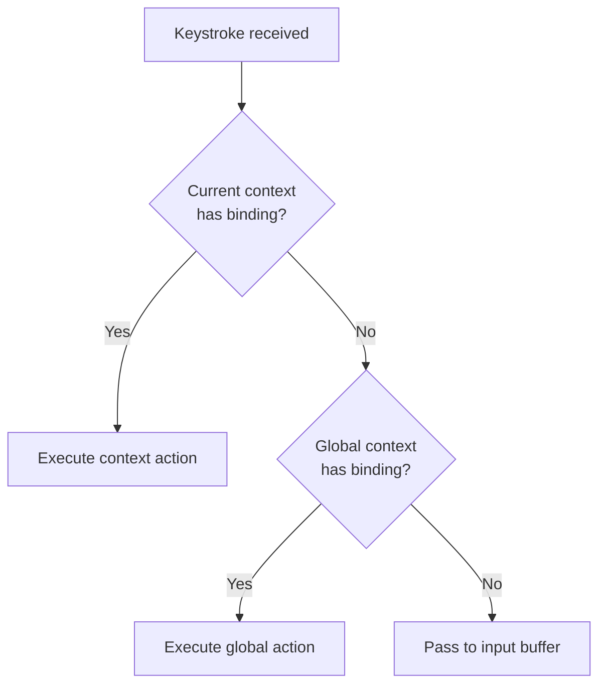
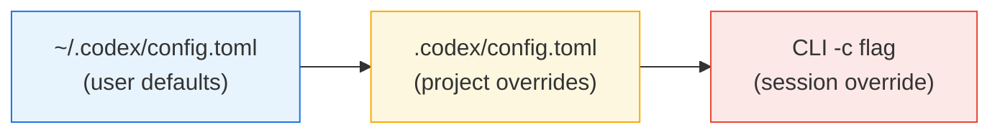

# Configurable TUI Keymaps in Codex CLI: Custom Keyboard Shortcuts for Every Context


---

Codex CLI 0.128.0 shipped configurable TUI keymaps on 30 April 2026, closing one of the longest-running feature requests in the repository[^1][^2]. Before this release, every keyboard shortcut was hard-coded — frustrating for Vim users whose muscle memory clashes with Emacs-style defaults, developers on non-standard keyboards (Corne, Planck), and anyone whose terminal emulator swallows specific key sequences[^3]. The new system lets you remap, layer, and unbind every TUI action through `config.toml` or the interactive `/keymap` slash command.

## How the Keymap System Works

Keymaps are organised into **contexts** — logical zones of the TUI that each define a set of bindable **actions**. When Codex receives a keystroke, it resolves the binding by checking the current context first, then falling back to `global`[^4].



### Supported Contexts

Codex CLI 0.128.0 exposes seven binding contexts[^4]:

| Context | Where it applies |
|---------|-----------------|
| `global` | Everywhere — fallback for all other contexts |
| `chat` | The conversation transcript pane |
| `composer` | The prompt input area at the bottom of the TUI |
| `editor` | The external-editor overlay (Ctrl+G by default) |
| `pager` | Scrollable output views (diffs, long responses) |
| `list` | Selection lists (model picker, file fuzzy-finder) |
| `approval` | The tool-approval prompt shown before commands run |

Context-specific bindings always override `global` when the relevant pane has focus.

## Configuring Keymaps in `config.toml`

Bindings live under the `tui.keymap` table in your user-level (`~/.codex/config.toml`) or project-level (`.codex/config.toml`) configuration[^5][^6].

### Syntax

```toml
[tui.keymap.global]
open_transcript = "ctrl-t"

[tui.keymap.composer]
submit = ["enter", "ctrl-m"]
insert_newline = "shift-enter"

[tui.keymap.approval]
accept = ["enter", "y"]
reject = ["escape", "n"]
```

Key names use normalised strings: `ctrl-a`, `shift-enter`, `page-down`, `alt-j`, `f5`[^4]. An action can be bound to a single key (string) or multiple keys (array of strings).

### Unbinding an Action

To disable an action entirely within a context, assign an empty array[^4]:

```toml
[tui.keymap.composer]
# Prevent accidental submission on plain Enter
submit = []
```

This is particularly useful when a default binding conflicts with your terminal emulator. Several users reported that `Alt+Enter` was being swallowed by WSL terminals, making it impossible to insert newlines in the composer[^7].

## The `/keymap` Slash Command

If you prefer not to edit TOML by hand, the `/keymap` slash command provides an interactive configuration flow[^8]:

1. Type `/keymap` in the composer
2. Select the context (global, composer, etc.)
3. Choose the action to rebind
4. Enter the new key combination or clear the existing binding

Changes apply immediately to the running session **and** persist to the `tui.keymap` section of your `config.toml`[^8]. This makes `/keymap` the fastest way to experiment with bindings before committing to a configuration.

## Practical Recipes

### Recipe 1: Vim-Friendly Composer

Vim users have long requested modal editing in the composer[^9]. Whilst full Vim mode remains a separate feature request, you can reduce friction by rebinding the most common actions:

```toml
[tui.keymap.composer]
submit = "ctrl-enter"
insert_newline = ["enter", "o"]

[tui.keymap.chat]
scroll_up = "k"
scroll_down = "j"
page_up = "ctrl-u"
page_down = "ctrl-d"

[tui.keymap.list]
select_up = "k"
select_down = "j"
confirm = "enter"
cancel = "escape"
```

### Recipe 2: One-Handed Approval

When reviewing a batch of tool calls, having single-key approve/reject saves repetitive reaching:

```toml
[tui.keymap.approval]
accept = ["enter", "y", "space"]
reject = ["escape", "n", "backspace"]
```

### Recipe 3: Ergonomic Split Keyboard

Corne and Planck users often lack dedicated function keys and find `Ctrl+G` awkward on a 40% layout:

```toml
[tui.keymap.global]
open_editor = "alt-e"
copy_output = "alt-c"
clear_screen = "alt-l"

[tui.keymap.composer]
history_search = "alt-r"
submit = ["enter", "alt-s"]
```

## Scope Layering: User vs Project

Keymap configuration follows the same layering rules as all other `config.toml` settings[^6]. Project-scoped bindings in `.codex/config.toml` override user-level bindings in `~/.codex/config.toml`. This is useful for team conventions:



You can also override a binding for a single session using the `-c` flag[^5]:

```bash
codex -c 'tui.keymap.composer.submit = "ctrl-enter"'
```

## Related TUI Customisations

CLI 0.128.0 bundled keymaps alongside two other TUI personalisation features that round out the interface customisation story.

### `/statusline` — Footer Items

The `/statusline` command lets you toggle and reorder the items shown in the TUI footer bar (model name, context window usage, git branch, token count, session identifier). Changes persist to `tui.status_line` in `config.toml`[^8].

```toml
# Show only model and token count in the footer
tui.status_line = ["model", "tokens"]
```

### `/title` — Terminal Window Title

The `/title` command configures which fields appear in your terminal tab/window title — handy when running multiple Codex sessions in tmux or iTerm2 tabs. Defaults to `["spinner", "project"]`; set to `null` to disable title updates entirely[^4].

```toml
tui.terminal_title = ["project", "model", "branch"]
```

## Default Bindings Reference

For reference, these are the out-of-the-box bindings that ship with Codex CLI 0.128.0[^2][^10]:

| Context | Action | Default Binding |
|---------|--------|----------------|
| global | `copy_output` | `ctrl-o` |
| global | `clear_screen` | `ctrl-l` |
| global | `open_editor` | `ctrl-g` |
| global | `exit` | `ctrl-c`, `ctrl-d` |
| composer | `submit` | `enter` |
| composer | `insert_newline` | `ctrl-j`, `ctrl-m`, `shift-enter` |
| composer | `history_search` | `ctrl-r` |
| composer | `history_up` | `up` |
| composer | `history_down` | `down` |
| composer | `edit_previous` | `escape escape` |
| chat | `steer` | `enter` |
| chat | `queue_followup` | `tab` |
| approval | `accept` | `enter` |
| approval | `reject` | `escape` |

⚠️ The complete action list is not exhaustively documented in the official configuration reference at time of writing; the table above is reconstructed from the features documentation, changelog, and community reports[^2][^3][^10].

## When Not to Customise

A word of caution: keymaps are session-portable — they round-trip across TUI sessions, app-server connections, and MCP sandbox state[^2]. If you share project-scoped configurations with a team, exotic bindings in `.codex/config.toml` will affect every developer who clones the repository. Consider keeping project-level keymap overrides minimal and documenting any non-standard bindings in your `AGENTS.md`.

## Conclusion

Configurable keymaps transform Codex CLI from a one-size-fits-all terminal into an interface that adapts to your keyboard, your muscle memory, and your workflow. Combined with `/statusline` and `/title`, the 0.128.0 release makes the TUI genuinely personal — without sacrificing the ability to share sensible project defaults through scoped configuration.

---

## Citations

[^1]: [Configurable Hotkeys Support — Issue #3049, openai/codex](https://github.com/openai/codex/issues/3049)
[^2]: [Codex Changelog — OpenAI Developers](https://developers.openai.com/codex/changelog)
[^3]: [Regression: Alt+Enter no longer inserts newline in VS Code WSL terminal — Issue #20501, openai/codex](https://github.com/openai/codex/issues/20501)
[^4]: [Configuration Reference — Codex, OpenAI Developers](https://developers.openai.com/codex/config-reference)
[^5]: [Config Basics — Codex, OpenAI Developers](https://developers.openai.com/codex/config-basic)
[^6]: [Sample Configuration — Codex, OpenAI Developers](https://developers.openai.com/codex/config-sample)
[^7]: [Regression: Alt+Enter no longer inserts newline in VS Code WSL terminal — Issue #20501, openai/codex](https://github.com/openai/codex/issues/20501)
[^8]: [Slash Commands in Codex CLI — OpenAI Developers](https://developers.openai.com/codex/cli/slash-commands)
[^9]: [TUI composer: native Vim modal keymap (opt-in, composer-only) — Issue #12508, openai/codex](https://github.com/openai/codex/issues/12508)
[^10]: [Features — Codex CLI, OpenAI Developers](https://developers.openai.com/codex/cli/features)
