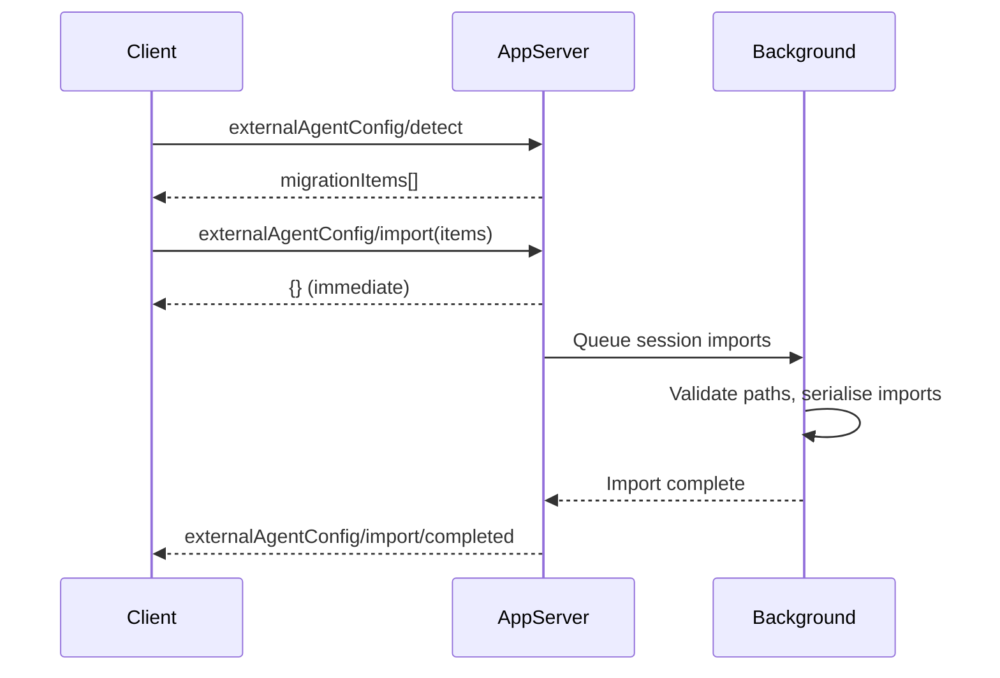

# Codex CLI External Agent Migration: The Detect/Import API and Cross-Agent Portability


---

The terminal coding agent landscape in 2026 is crowded: Codex CLI, Claude Code, Cursor, Gemini CLI, Aider, Copilot CLI, and more, all competing for developers' muscle memory. The result is that most teams have configuration, skills, MCP servers, and session history scattered across multiple agent harnesses. Codex CLI 0.128.0 shipped a first-class answer to that fragmentation: the `externalAgentConfig/detect` and `externalAgentConfig/import` JSON-RPC APIs, backed by asynchronous background session import [^1]. This article covers the API surface, the artefact types it handles, the community tooling that supplements it, and practical migration patterns for teams moving between agents.

## Why Migration Matters Now

Three converging forces make cross-agent portability a priority rather than a nice-to-have.

First, **AGENTS.md became an open standard** when the Linux Foundation's Agentic AI Foundation (AAIF) accepted it alongside MCP and goose in December 2025 [^2]. With over 60,000 open-source projects adopting AGENTS.md and native support in Codex CLI, Cursor, Copilot, Windsurf, Amp, and Gemini CLI, the configuration surface area is converging [^3].

Second, **SKILL.md followed the same path**. The Agent Skills open standard means that skill files written for Claude Code (`~/.claude/skills/<n>/SKILL.md`) work in Codex CLI (`~/.agents/skills/`) and Cursor with no semantic changes to the format itself — only the directory differs [^4].

Third, **MCP server configuration is structurally identical** across tools. A `mcpServers` JSON block in Cursor's `.cursor/mcp.json` is near-identical to Claude Code's `.mcp.json` and Codex CLI's `config.toml` `[mcp_servers]` section [^5]. The data is the same; only the envelope changes.

These convergences mean that automated migration is not just feasible — it is largely mechanical.

## The Detect/Import API

Codex CLI's app-server exposes two JSON-RPC methods for migration [^1] [^6]:

### `externalAgentConfig/detect`

Scans the filesystem for importable artefacts from other agent harnesses.

```json
{
  "method": "externalAgentConfig/detect",
  "params": {
    "includeHome": true,
    "cwds": ["/home/dev/myproject", "/home/dev/another-repo"]
  }
}
```

The `includeHome` flag tells the detector to scan the user's home directory for global agent configuration (e.g. `~/.claude/`, `~/.cursor/`). The `cwds` array specifies project directories to scan for repository-scoped artefacts.

The response returns a list of `migrationItems`, each typed by category:

| Item Type | What It Covers |
|-----------|---------------|
| `AGENTS_MD` | CLAUDE.md, .cursorrules, or other agent instruction files mappable to AGENTS.md |
| `CONFIG` | Global configuration (model defaults, approval modes, provider keys) |
| `SKILLS` | Skill directories containing SKILL.md files |
| `PLUGINS` | Marketplace plugin references with `marketplaceName` and `pluginNames` |
| `MCP_SERVER_CONFIG` | MCP server connection definitions |

Detection is **idempotent and incremental**: Codex skips `AGENTS_MD` when an AGENTS.md already exists and is non-empty, and skill imports do not overwrite existing skill directories [^6]. This means running detect repeatedly is safe and will only surface items that still need migration.

### `externalAgentConfig/import`

Applies selected migration items:

```json
{
  "method": "externalAgentConfig/import",
  "params": {
    "migrationItems": [
      { "type": "SKILLS", "cwd": "/home/dev/myproject" },
      { "type": "MCP_SERVER_CONFIG", "cwd": null },
      { "type": "AGENTS_MD", "cwd": "/home/dev/myproject" }
    ]
  }
}
```

Setting `cwd` to `null` targets home-directory items. The method returns an immediate `{}` response and processes the import asynchronously, emitting an `externalAgentConfig/import/completed` notification when finished [^1] [^7].

### Background Session Import

Session history import — the heaviest operation — runs entirely in the background. PR #20284 restructured the import pipeline so that:

1. The initial response returns immediately, unblocking the client.
2. Session imports are **serialised** to prevent duplicate imported threads from concurrent requests.
3. Canonical paths are validated upfront and preserved through background processing to prevent symlink-swapping attacks.
4. Import failures are logged rather than propagated, so a single corrupt session file does not abort the entire batch [^7].



## What Maps Where

The following table shows the concrete file mappings for the three most common source agents:

| Artefact | Claude Code | Cursor | Codex CLI Target |
|----------|------------|--------|-----------------|
| Agent instructions | `CLAUDE.md` | `.cursor/rules/*.md` | `AGENTS.md` |
| Skills | `.claude/skills/<n>/SKILL.md` | `.cursor/skills/` | `.agents/skills/` |
| MCP servers | `.mcp.json` or `claude mcp add` | `.cursor/mcp.json` | `config.toml` `[mcp_servers]` |
| Global config | `~/.claude/settings.json` | `~/.cursor/settings.json` | `~/.codex/config.toml` |
| Session history | `~/.claude/sessions/` | Cursor's internal DB | `~/.codex/sessions/` |

Skills using only `name`, `description`, `allowed-tools`, and `disable-model-invocation` fields work without changes after a directory copy [^4]. Skills that reference tool names using Claude Code's namespace (e.g. `Read`, `Grep`, `Glob`) need no translation because Codex CLI infers tool availability from sandbox mode rather than explicit frontmatter declarations [^8].

## Community Migration Tooling

The built-in API handles the common cases, but several community tools fill gaps for more complex migrations.

### ccode-to-codex

The `ccode-to-codex` project provides a Python toolkit that goes beyond mechanical file copying [^9]. It:

- **Classifies migration risk** into three tiers: `MECHANICAL` (direct conversion), `MANUAL` (requires human review), and `REFACTOR` (significant structural changes needed).
- **Maintains an audit trail** via `migration-state.json`, tracking every artefact's status end-to-end.
- **Provides four skill-based commands**: `migrate-to-codex`, `migrate-agents-to-codex`, `verify-skill-migration`, and `migration-dashboard`.

```bash
# Scan Claude Code artefacts and classify migration risk
python3 tools/migration_support/validate_names.py --scan-dir .claude/skills/

# Run the migration
python3 -m migrate_to_codex --source .claude/skills/ --target .codex/skills/

# Check progress
python3 .codex/skills/migration-dashboard/scripts/analyze_migration.py --status
```

### claude-replay

For teams that want to preserve session history as reviewable artefacts rather than importing into Codex's session store, `claude-replay` converts sessions from Claude Code, Cursor, Codex CLI, Gemini CLI, and OpenCode into self-contained HTML replays [^10].

### Sync Scripts

For teams running multiple agents in parallel, a synchronisation approach often works better than a one-off migration. The pattern is a single source-of-truth file (typically AGENTS.md) with a build script that generates tool-specific variants:

```bash
#!/usr/bin/env bash
# sync-ai-config.sh — generate tool-specific configs from AGENTS.md

SOURCE="AGENTS.md"

# Cursor rules (split sections into individual files)
mkdir -p .cursor/rules
awk '/^## /{f=".cursor/rules/"$2".md"} f{print > f}' "$SOURCE"

# Claude Code (symlink — CLAUDE.md reads the same markdown)
ln -sf "$SOURCE" CLAUDE.md

echo "Synced agent config from $SOURCE"
```

## Practical Migration Workflow

A recommended sequence for migrating a team from Claude Code to Codex CLI:

### Step 1: Detect

Run detection against both home and project directories:

```bash
# Using the app-server API via codex's internal RPC
# Or use the TUI — detection runs automatically on first launch
# when external agent artefacts are found
```

### Step 2: Review and Select

Inspect the detected items. Pay particular attention to:

- **Skills with `MANUAL` or `REFACTOR` risk** — these need human review before import.
- **MCP server configs** — verify that environment variables (`GITHUB_TOKEN`, API keys) are available in Codex's environment.
- **AGENTS.md conflicts** — if you already have an AGENTS.md, the import will skip it. Merge manually if both files contain useful instructions.

### Step 3: Import

Select the items you want and trigger the import. Config and skills import instantly; session history runs in the background.

### Step 4: Validate

```bash
# Check that skills are discovered
codex --print-config | grep -A5 skills

# Verify MCP servers connect
codex
# Then in the TUI:
/mcp
```

### Step 5: Clean Up

Once validated, you can optionally remove the source agent's configuration to avoid drift:

```bash
# Only after confirming everything works in Codex
rm -rf .claude/skills/  # Skills now live in .agents/skills/
# Keep CLAUDE.md as a symlink to AGENTS.md for backward compatibility
```

## Limitations and Known Issues

- **Session import is lossy.** Codex imports conversation text and metadata, but tool invocation details and sandbox state from other agents are not fully preserved. Imported sessions are best treated as reference material rather than resumable conversations.
- **Plugin mapping is partial.** The `PLUGINS` item type maps marketplace plugin names, but plugins with no Codex marketplace equivalent require manual replacement. The detection API surfaces these as items with empty `pluginNames` arrays.
- **No TUI slash command yet.** As of CLI 0.128.0, there is no `/import` or `/migrate` slash command — migration is driven through the app-server JSON-RPC API or happens automatically when the TUI detects external artefacts on first launch [^1].
- **Cursor session history** is stored in an internal database format that is not directly importable. Only file-based session formats (Claude Code, Gemini CLI) are supported for background session import [^7].

## The Convergence Trajectory

The AAIF's stewardship of AGENTS.md, MCP, and the emerging Agent Skills standard points towards a future where migration between coding agents is as routine as switching text editors. Codex CLI's detect/import API is an early, pragmatic implementation of that vision — not yet complete, but sufficient for the most common migration paths.

For teams evaluating multiple agents, the takeaway is clear: invest in the portable standards (AGENTS.md, SKILL.md, MCP server configs) and treat agent-specific configuration as a thin adapter layer. When the next generation of tools arrives, your workflow survives the switch.

## Citations

[^1]: [Codex CLI Changelog — v0.128.0 (30 April 2026)](https://developers.openai.com/codex/changelog)
[^2]: [Linux Foundation Announces the Formation of the Agentic AI Foundation (AAIF)](https://www.linuxfoundation.org/press/linux-foundation-announces-the-formation-of-the-agentic-ai-foundation)
[^3]: [OpenAI co-founds the Agentic AI Foundation under the Linux Foundation](https://openai.com/index/agentic-ai-foundation/)
[^4]: [Stop Copying Skills Between Claude Code, Cursor, and Codex — DEV Community](https://dev.to/itlackey/stop-copying-skills-between-claude-code-cursor-and-codex-olb)
[^5]: [Migrating Between Codex, Cursor, and Claude Code — Developer Toolkit](https://developertoolkit.ai/en/shared-workflows/migration-playbooks/from-codex/)
[^6]: [Codex App Server API Documentation — External Agent Config](https://developers.openai.com/codex/app-server)
[^7]: [PR #20284 — Import external agent sessions in background](https://github.com/openai/codex/pull/20284)
[^8]: [Same Framework, Different Engine: Porting AI Coding Workflows from Claude Code to Codex CLI — DEV Community](https://dev.to/shinpr/same-framework-different-engine-porting-ai-coding-workflows-from-claude-code-to-codex-cli-n3p)
[^9]: [ccode-to-codex — GitHub](https://github.com/zuharz/ccode-to-codex)
[^10]: [claude-replay — GitHub](https://github.com/es617/claude-replay)
