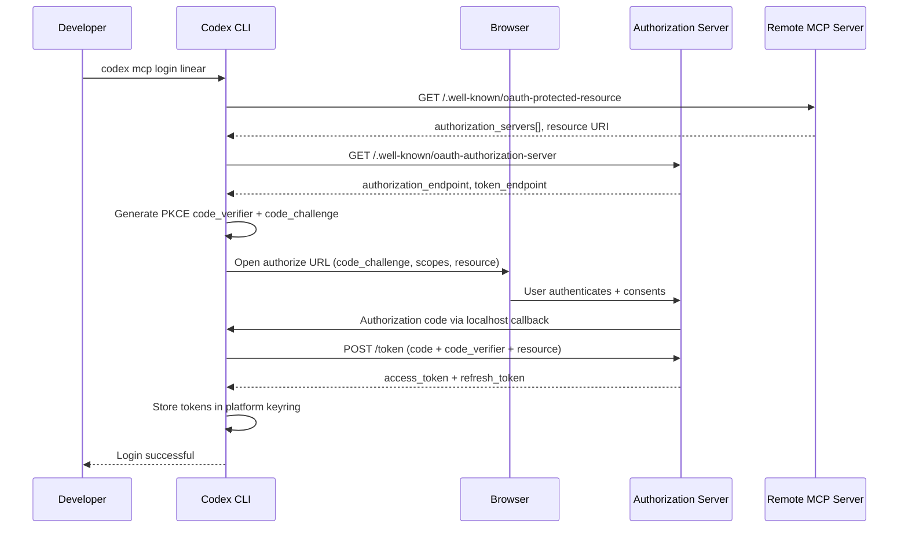
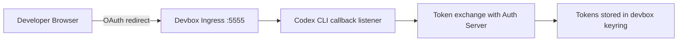

# Codex CLI MCP OAuth: Authenticating Remote Tool Servers with OAuth 2.1


---

## Why MCP OAuth Matters

Local MCP servers — launched via `command` and communicating over stdio — need no authentication. The process runs on your machine with your permissions. Remote MCP servers are different. When Codex CLI connects to a Linear, Notion, Cloudflare, or custom enterprise endpoint over Streamable HTTP, it must prove identity and obtain scoped access tokens before the server will expose its tools.[^1]

The MCP specification adopted OAuth 2.1 with mandatory PKCE as its authorisation standard in the 2025-06-18 transport revision.[^2] Codex CLI implements this flow natively through the `codex mcp login` command, storing credentials securely in the platform keyring and refreshing tokens transparently during sessions.[^3]

---

## The OAuth 2.1 Flow in Codex CLI



The flow relies on three specification documents: OAuth 2.1 (mandatory PKCE for all clients), RFC 9728 (OAuth 2.0 Protected Resource Metadata for server discovery), and RFC 8707 (Resource Indicators to bind tokens to specific MCP servers).[^2][^4]

---

## Configuring a Remote MCP Server

### Basic Streamable HTTP with Bearer Token

For servers that use static API keys rather than OAuth, configure a bearer token environment variable:

```toml
[mcp_servers.github]
url = "https://api.github-mcp.example.com/mcp"
bearer_token_env_var = "GITHUB_TOKEN"
startup_timeout_sec = 10.0
tool_timeout_sec = 60.0
enabled_tools = ["list_issues", "create_pr"]
```

The `bearer_token_env_var` field tells Codex to read the token from your shell environment at connection time — the secret never appears in the configuration file.[^5]

### OAuth-Enabled Server

For servers supporting OAuth discovery (like Linear or Notion), the configuration is simpler:

```toml
[mcp_servers.linear]
url = "https://mcp.linear.app/sse"
scopes = ["read", "write", "issues:create"]
oauth_resource = "https://api.linear.app/"
required = true
```

The `scopes` field declares what permissions to request during the OAuth flow. The `oauth_resource` field provides the RFC 8707 resource indicator, ensuring the issued token is audience-bound to the correct server.[^4][^6]

---

## The Login and Logout Commands

### Authenticating

```bash
# Interactive OAuth login with auto-detected scopes
codex mcp login linear

# Explicit scope override
codex mcp login notion --scopes "read_content,write_content,read_comments"
```

Codex starts a local HTTP callback server, opens your browser to the authorisation endpoint, and waits for the redirect. The PKCE code verifier ensures the token exchange cannot be intercepted even on localhost.[^3]

### Auto-Login on Add

When adding a new HTTP-based server, Codex automatically probes for OAuth support:

```bash
codex mcp add linear -- https://mcp.linear.app/sse
```

If the server responds to `/.well-known/oauth-protected-resource`, Codex triggers the login flow immediately via `perform_oauth_login_retry_without_scopes()` — falling back to unauthenticated access if discovery fails.[^3]

### Removing Credentials

```bash
codex mcp logout linear
```

This deletes tokens from all configured storage backends (keyring and file fallback). The server configuration in `config.toml` remains untouched.[^3]

---

## Token Storage and Security

Codex stores OAuth tokens using the `keyring-store` crate, which maps to platform-native secure storage:[^3]

| Platform | Storage Backend |
|----------|----------------|
| macOS | Keychain Access (service: "Codex Auth") |
| Linux | Secret Service API (GNOME Keyring / KDE Wallet) |
| Windows | Credential Manager |

Keyring entries use a computed key derived from the `CODEX_HOME` directory path, so multiple Codex installations maintain isolated credential stores.[^7]

When keyring access is unavailable (headless servers, containers), Codex falls back to an encrypted file store. Tokens never appear in `config.toml` or process environment variables at rest.

### Token Refresh

Access tokens are refreshed proactively during active sessions before expiry. If a refresh token itself expires, Codex prompts for re-authentication on the next tool call rather than failing silently.[^7]

---

## Remote and Devbox Environments

The standard OAuth callback assumes `http://localhost:<port>/callback`. For remote development environments (devboxes, SSH tunnels, cloud workstations), two configuration keys override this behaviour:

```toml
# Fixed port for the callback listener
mcp_oauth_callback_port = 5555

# Custom redirect URI (e.g. devbox ingress)
mcp_oauth_callback_url = "https://my-devbox.corp.internal:5555/callback"
```

When `mcp_oauth_callback_url` is set to a non-local address, Codex binds the callback listener on `0.0.0.0` rather than the loopback interface, allowing external traffic to reach it.[^5]

This enables OAuth flows in environments where the browser runs on a different machine from Codex CLI:



---

## Practical Patterns

### Pattern 1: Project-Scoped OAuth Servers

Keep OAuth-requiring servers in your project's `.codex/config.toml` so every team member gets the same tool surface:

```toml
# .codex/config.toml (committed to repository)
[mcp_servers.linear]
url = "https://mcp.linear.app/sse"
scopes = ["read", "write"]
required = true

[mcp_servers.notion]
url = "https://mcp.notion.so/mcp"
scopes = ["read_content"]
```

Each developer runs `codex mcp login linear` once; their token is stored locally and never shared.[^5]

### Pattern 2: CI/CD with Bearer Tokens

In non-interactive environments, OAuth flows are impractical. Use `bearer_token_env_var` instead:

```toml
[mcp_servers.internal_docs]
url = "https://docs-mcp.corp.internal/mcp"
bearer_token_env_var = "MCP_DOCS_TOKEN"
tool_timeout_sec = 120.0
```


```yaml
# GitHub Actions workflow
env:
  MCP_DOCS_TOKEN: ${{ secrets.MCP_DOCS_TOKEN }}
  CODEX_API_KEY: ${{ secrets.OPENAI_API_KEY }}
```


### Pattern 3: Scoped Tool Access

Combine OAuth with tool allowlists for defence-in-depth:

```toml
[mcp_servers.cloudflare]
url = "https://mcp.cloudflare.com/"
scopes = ["workers:read", "dns:read"]
enabled_tools = ["list_workers", "get_dns_records"]
disabled_tools = ["delete_worker", "update_dns"]
```

Even if the OAuth token grants write access, Codex won't expose destructive tools to the model.[^5]

---

## Troubleshooting OAuth Flows

### Diagnosing Connection Issues

```bash
# List servers with authentication status
codex mcp list --json

# Full diagnostic output in TUI
/mcp verbose
```

The `--json` output includes an `auth_status` field per server: `authenticated`, `oauth_available`, `bearer_token`, or `none`.[^3]

### Known Limitations

**Resource indicator support**: Some OAuth providers require the `resource` parameter in the authorisation request (RFC 8707). Earlier Codex versions omitted this; ensure you're on v0.126.0+ and set `oauth_resource` explicitly in config.[^8]

**Dynamic client registration**: Codex uses a built-in public client ID. Servers requiring pre-registered client IDs need custom OAuth configuration via their provider's admin panel.[^6]

**Token audience mismatch**: If tokens are issued for the wrong audience, set `oauth_resource` to match the server's expected resource URI exactly.[^8]

---

## Security Considerations

1. **PKCE is mandatory** — Codex never performs plain OAuth flows. The code verifier is generated per-login and never stored.[^2]
2. **Tokens are scoped** — Request only the permissions your workflow needs. The `scopes` config field controls this at the TOML level.
3. **Resource binding** — RFC 8707 resource indicators prevent token reuse across different MCP servers.[^4]
4. **Credential isolation** — Different `CODEX_HOME` paths produce different keyring entries, useful for separating personal and work contexts.
5. **Automatic expiry** — Codex handles refresh transparently but will not cache expired tokens or retry indefinitely.

---

## Citations

[^1]: [Model Context Protocol — Codex | OpenAI Developers](https://developers.openai.com/codex/mcp)
[^2]: [Authorization — Model Context Protocol Specification (Draft)](https://modelcontextprotocol.io/specification/draft/basic/authorization)
[^3]: [MCP CLI Commands | openai/codex | DeepWiki](https://deepwiki.com/openai/codex/6.3-mcp-cli-commands)
[^4]: [The New MCP Authorization Specification — dasroot.net](https://dasroot.net/posts/2026/04/mcp-authorization-specification-oauth-2-1-resource-indicators/)
[^5]: [Configuration Reference — Codex | OpenAI Developers](https://developers.openai.com/codex/config-reference)
[^6]: [MCP server — Linear Docs](https://linear.app/docs/mcp)
[^7]: [Authentication — Codex | OpenAI Developers](https://developers.openai.com/codex/auth)
[^8]: [codex mcp login omits OAuth resource indicator — Issue #13891 — openai/codex](https://github.com/openai/codex/issues/13891)
