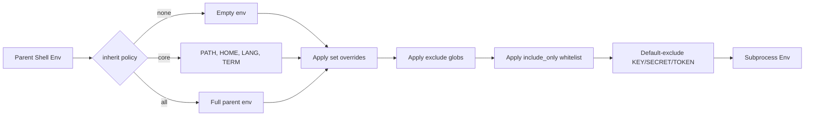

# Codex CLI Shell Integration: Completions, Functions, Environment Policies and Productivity Recipes


---

Codex CLI runs in your terminal, yet most guides skip the glue that makes it feel native: shell completions, wrapper functions, environment variable policies and the small recipes that turn `codex exec` into a composable Unix citizen. This article fills that gap, covering everything a senior developer needs to wire Codex into a daily shell workflow.

## Shell Completions

Tab completion is table stakes. Codex ships a `completion` subcommand that emits scripts for five shells[^1]:

```bash
codex completion bash
codex completion zsh
codex completion fish
codex completion power-shell
codex completion elvish
```

### Zsh Setup

Redirect the output into a directory on your `fpath` and reinitialise `compinit`[^1]:

```bash
codex completion zsh > "${fpath[1]}/_codex"
autoload -Uz compinit && compinit
```

If you see a `command not found: compdef` error, ensure the `compinit` call appears *before* the completion line in `~/.zshrc`[^2].

### Bash Setup

```bash
# Add to ~/.bashrc
eval "$(codex completion bash)"
```

### Fish Setup

```fish
codex completion fish | source
# Or persist:
codex completion fish > ~/.config/fish/completions/codex.fish
```

Once installed, `codex <Tab>` completes subcommands (`exec`, `resume`, `fork`, `completion`, `update`) and flags (`--sandbox`, `--json`, `--output-schema`)[^1].

## Shell Environment Policy

The `[shell_environment_policy]` section in `config.toml` controls which environment variables Codex passes to every subprocess it launches — tool commands, shell executions, and hook scripts[^3]. Getting this wrong either leaks secrets or breaks tool chains.

### How It Works



### Configuration Reference

```toml
[shell_environment_policy]
inherit = "none"                  # "none" | "core" | "all"
set = { PATH = "/usr/local/bin:/usr/bin", LANG = "en_GB.UTF-8" }
ignore_default_excludes = false   # keep the SECRET/TOKEN/KEY safety net
exclude = ["AWS_*", "AZURE_*", "GH_TOKEN"]
include_only = ["PATH", "HOME", "LANG", "TERM"]
```

Patterns are case-insensitive globs supporting `*`, `?` and `[A-Z]` character classes[^3].

### Recommended Profiles

| Profile | `inherit` | Use Case |
|---------|-----------|----------|
| Paranoid | `"none"` + explicit `set` | CI runners, untrusted repos |
| Developer | `"core"` + selective `include_only` | Daily interactive sessions |
| Legacy | `"all"` + `exclude` secrets | Quick prototyping (not recommended) |

The safest starting point is `inherit = "none"`, layering in only the variables your tool chain needs[^3]. The default safety filter automatically drops any variable whose name contains `KEY`, `SECRET` or `TOKEN`, even when you use `inherit = "all"`[^3].

## Shell Wrapper Functions

Aliases are brittle — zsh and bash handle word-splitting of alias expansions differently. Use functions instead[^4].

### Quick One-Shot Execution

```bash
# Ask Codex a question about the current repo, non-interactively
cx() {
  codex exec "$@"
}
```

### Commit Message Generator

Pipe `git diff` into `codex exec` to generate a conventional commit message:

```bash
cxcommit() {
  local msg
  msg=$(git diff --cached | codex exec \
    -e minimal \
    "Write a concise conventional commit message for this diff. \
     Output only the message, no explanation.")
  if [[ -n "$msg" ]]; then
    printf "Proposed commit message:\n\n%s\n\nCommit? [y/N] " "$msg"
    read -r confirm
    [[ "$confirm" =~ ^[Yy]$ ]] && git commit -m "$msg"
  fi
}
```

### PR Description from Branch Diff

```bash
cxpr() {
  local base="${1:-main}"
  git diff "${base}"...HEAD | codex exec \
    -e medium \
    "Write a pull request description with a Summary section \
     and a Test Plan section. Use markdown."
}
```

### Quick Code Review

```bash
cxreview() {
  local base="${1:-main}"
  git diff "${base}"...HEAD | codex exec \
    -e high \
    "Review this diff for bugs, security issues and style \
     problems. Be concise. Flag severity as [critical], \
     [warning] or [info]."
}
```

### Structured Output for Scripting

```bash
cxjson() {
  local schema="$1"; shift
  codex exec --output-schema "$schema" "$@"
}

# Example: extract metadata into stable JSON
cxjson ./schemas/project-meta.json "Extract project metadata from this repo"
```

### Resume Last Session

```bash
cxlast() {
  codex resume --last "$@"
}
```

## The Zsh Alias Inheritance Problem

A notable sharp edge: Codex does not inherit aliases defined in `~/.zshrc` when it spawns subprocesses[^5]. This is because Codex launches non-interactive, non-login shells that do not source `~/.zshrc`.

**Workaround:** Define critical helpers as functions in `~/.zshenv` instead, which is sourced by *all* zsh invocations[^5]:

```bash
# ~/.zshenv — sourced by every zsh process, including Codex subshells
mytest() { npm test -- --coverage; }
```

Alternatively, use the `set` key in `[shell_environment_policy]` to inject the specific variables or paths that your aliases depend on[^3].

## Shell Selection

On macOS (where zsh is the default since Catalina), Codex respects `$SHELL` from your environment[^6]. If you find Codex launching `bash` when you expect `zsh`, check that `$SHELL` is set correctly in the environment Codex inherits. With `inherit = "none"` in your `shell_environment_policy`, you may need to add `SHELL` explicitly:

```toml
[shell_environment_policy]
inherit = "core"
set = { SHELL = "/bin/zsh" }
```

## Composing with Unix Pipes

`codex exec` reads from stdin when you pass `-` as the prompt, making it a first-class Unix filter[^7]:

```bash
# Pipe test failures into Codex for triage
npm test 2>&1 | codex exec "Summarise failures and propose fixes"

# Chain with jq for structured pipelines
codex exec --json "List all TODO comments in src/" \
  | jq -r 'select(.type == "item.completed") | .content'

# Feed a prompt file
cat prompts/security-audit.md | codex exec -
```

### Pipeline Integration with `--output-last-message`

For scripts that need the final answer without JSONL event parsing:

```bash
codex exec \
  --output-last-message ./result.md \
  "Analyse the test coverage gaps in this project"

# result.md now contains only the final markdown response
```

## Profile-Based Shell Aliases

Combine named profiles in `config.toml` with shell aliases for instant context switching:

```toml
# ~/.codex/config.toml
[profiles.fast]
model = "gpt-4.1-mini"
model_reasoning_effort = "minimal"

[profiles.deep]
model = "gpt-5.5"
model_reasoning_effort = "high"

[profiles.ci]
model = "gpt-4.1-mini"
model_reasoning_effort = "low"
```

```bash
# ~/.zshrc
alias cxf='codex --profile fast'
alias cxd='codex --profile deep'
alias cxci='codex --profile ci exec'
```

Now `cxf` launches a fast interactive session, `cxd` a deep-reasoning session, and `cxci` runs non-interactively with CI-tuned settings[^8].

## Tmux and Terminal Multiplexer Patterns

Running multiple Codex sessions in parallel is natural with tmux:

```bash
# Launch three parallel Codex agents in tmux panes
cxparallel() {
  tmux new-session -d -s codex-sprint
  tmux send-keys "codex exec 'Refactor auth module'" C-m
  tmux split-window -h
  tmux send-keys "codex exec 'Add integration tests for payments'" C-m
  tmux split-window -v
  tmux send-keys "codex exec 'Update API documentation'" C-m
  tmux attach -t codex-sprint
}
```

Session managers like CCManager and Agent Deck build on this pattern to add cost tracking, log aggregation and conductor-agent orchestration across panes[^9].

## Putting It All Together

A complete `~/.zshrc` snippet wiring Codex into your daily flow:

```bash
# Shell completions
eval "$(codex completion zsh)"

# Quick aliases
alias cx='codex'
alias cxe='codex exec'

# Wrapper functions
cxcommit() {
  git diff --cached | codex exec -e minimal \
    "Write a conventional commit message. Output only the message."
}

cxpr() {
  git diff "${1:-main}"...HEAD | codex exec -e medium \
    "Write a PR description with Summary and Test Plan sections."
}

cxreview() {
  git diff "${1:-main}"...HEAD | codex exec -e high \
    "Review this diff. Flag issues as [critical], [warning] or [info]."
}

# Profile switching
alias cxf='codex --profile fast'
alias cxd='codex --profile deep'
```

## Summary

Codex CLI is designed to be a composable terminal tool, but the composability only pays off when you invest in the shell integration layer. Tab completions eliminate flag-guessing, `shell_environment_policy` prevents secret leakage, wrapper functions encode your team's workflows, and Unix pipes let you chain Codex into existing scripts. The upfront cost is a few dozen lines in your shell configuration; the return is an agent that fits your terminal as naturally as `git` or `jq`.

---

## Citations

[^1]: OpenAI, "Command line options — Codex CLI," OpenAI Developers, 2026. [https://developers.openai.com/codex/cli/reference](https://developers.openai.com/codex/cli/reference)

[^2]: GitHub, "`codex completion` without any arguments always returns the bash completion," openai/codex issue #3009, 2025. [https://github.com/openai/codex/issues/3009](https://github.com/openai/codex/issues/3009)

[^3]: OpenAI, "Advanced Configuration — Codex," OpenAI Developers, 2026. [https://developers.openai.com/codex/config-advanced](https://developers.openai.com/codex/config-advanced)

[^4]: EveryInc, "Local dev shell aliases — zsh and bunx fixes," compound-engineering-plugin docs, 2026. [https://github.com/EveryInc/compound-engineering-plugin/blob/main/docs/solutions/developer-experience/local-dev-shell-aliases-zsh-and-bunx-fixes-2026-03-26.md](https://github.com/EveryInc/compound-engineering-plugin/blob/main/docs/solutions/developer-experience/local-dev-shell-aliases-zsh-and-bunx-fixes-2026-03-26.md)

[^5]: GitHub, "Codex does not inherit zsh aliases from .zshrc during command execution," openai/codex issue #16551, 2026. [https://github.com/openai/codex/issues/16551](https://github.com/openai/codex/issues/16551)

[^6]: GitHub, "Codex does not respect the user's default terminal (launches bash instead of zsh)," openai/codex issue #3916, 2025. [https://github.com/openai/codex/issues/3916](https://github.com/openai/codex/issues/3916)

[^7]: OpenAI, "Non-interactive mode — Codex," OpenAI Developers, 2026. [https://developers.openai.com/codex/noninteractive](https://developers.openai.com/codex/noninteractive)

[^8]: OpenAI, "Config basics — Codex," OpenAI Developers, 2026. [https://developers.openai.com/codex/config-basic](https://developers.openai.com/codex/config-basic)

[^9]: CCManager GitHub repository, 2026. [https://github.com/ccmanager/ccmanager](https://github.com/ccmanager/ccmanager)
