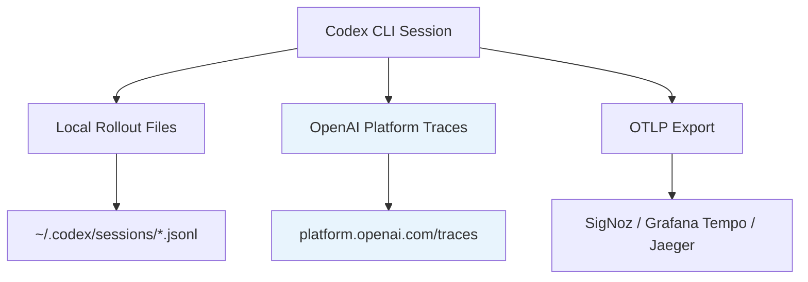
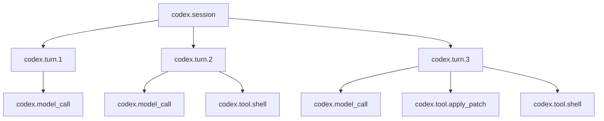

# Debugging Codex CLI Sessions with the OpenAI Traces Dashboard and OTLP Export


---

When a Codex CLI session produces unexpected results — a hallucinated file path, a tool call that silently fails, or a subagent that takes an inexplicable detour — the question is always the same: *what did the agent actually decide, and why?* Local rollout files provide a raw transcript, but the OpenAI Traces dashboard and OTLP-based export give you a structured, navigable view of every model call, tool invocation, and handoff that occurred during a session. This article covers the full debugging stack: the first-party platform dashboard, the `rollout-trace` debug reducer, and OTLP export to external backends.

## The Traces Landscape for Codex CLI

Codex CLI produces observability data at three levels, each serving a different debugging need:



| Layer | What it captures | Best for |
|-------|-----------------|----------|
| **Local rollout files** | Full append-only JSONL transcript | Audit trails, compliance, session replay |
| **Platform Traces** | Structured spans for model calls, tool calls, handoffs | Quick visual debugging, understanding agent decisions |
| **OTLP export** | OpenTelemetry spans to your own backend | Team-wide dashboards, alerting, long-term retention |

## The OpenAI Platform Traces Dashboard

### What Gets Captured

Since v0.125, Codex CLI's rollout tracing records tool invocations, code-mode transitions, session relationships, and multi-agent parent-child links automatically[^1]. When you run Codex with an API key (rather than a ChatGPT plan), these traces appear in the OpenAI platform at `Logs > Traces`[^2].

Each trace captures:

- **Model calls** — the prompt sent, tokens consumed (input, cached, output), reasoning effort level, and the response
- **Tool calls** — which tool was invoked (`shell`, `apply_patch`, `read_file`, MCP tools), arguments passed, and output returned
- **Handoffs** — when a subagent is spawned, its thread ID and relationship to the parent
- **Guardrail evaluations** — approval decisions, policy checks, and any hook-triggered interventions
- **Timing data** — wall-clock duration of each span, queue time, and token generation latency

### Navigating the Dashboard

The dashboard renders each session as a tree of spans. The root span represents the full agent run, with child spans for each turn in the conversation loop[^2]. Expanding a tool call span reveals:

1. The exact arguments the model chose (e.g., the shell command or patch content)
2. The tool's stdout/stderr output
3. Whether the call required approval and how it was resolved
4. The duration breakdown between queue time and execution time

### Filtering and Search

You can filter traces by:

- **Time range** — isolate sessions from a specific debugging window
- **Model** — compare behaviour across `gpt-5.5`, `gpt-5.4`, or `gpt-5.3-codex`
- **Status** — find traces that ended with errors or tool failures
- **Session/thread ID** — jump directly to a known session using the ID from `/status` or `codex resume`

### Privacy Controls

When using API-key mode, prompts and tool outputs are visible in the dashboard. Promptfoo's documentation notes that Codex applies best-effort redaction to traced command text, command output, agent messages, reasoning text, MCP inputs, and MCP errors before attaching them to span attributes[^3]. For sensitive environments, the `--ephemeral` flag prevents local rollout file creation, but platform traces may still be retained according to your organisation's data retention policy[^4].

## The Rollout-Trace Debug Reducer

For local debugging without leaving the terminal, Codex v0.125 introduced a debug reducer command that processes raw rollout traces into a condensed summary[^1]:

```bash
codex trace reduce ~/.codex/sessions/2026/05/06/rollout-2026-05-06T09-14-22-a1b2c3d4.jsonl
```

The reducer outputs a structured summary showing:

```
Session: a1b2c3d4-...
Duration: 4m 22s | Turns: 7 | Tools: 12 calls
Model: gpt-5.4 | Reasoning: medium

Turn 1 (0:00) → shell: git status
Turn 2 (0:08) → read_file: src/auth/handler.rs (lines 1-50)
Turn 3 (0:15) → apply_patch: src/auth/handler.rs (+12 -3)
Turn 4 (0:22) → shell: cargo test auth::
  ⚠️ EXIT 1 — test auth::refresh_token FAILED
Turn 5 (0:45) → read_file: src/auth/handler.rs (lines 40-80)
Turn 6 (0:52) → apply_patch: src/auth/handler.rs (+4 -2)
Turn 7 (1:01) → shell: cargo test auth::
  ✓ EXIT 0

Token usage: 42,180 input (38,200 cached) | 3,890 output | 1,200 reasoning
```

This gives you at-a-glance visibility into the agent's decision sequence without opening a browser or parsing raw JSONL.

### Useful Flags

```bash
# Show only failed tool calls
codex trace reduce --failures-only <rollout-file>

# Include full tool output (verbose)
codex trace reduce --verbose <rollout-file>

# Export as JSON for programmatic processing
codex trace reduce --json <rollout-file> | jq '.turns[] | select(.exit_code != 0)'
```

## OTLP Export Configuration

For teams that need traces in their own observability stack, Codex CLI exports OpenTelemetry spans via OTLP/gRPC[^5]. Configuration lives in `~/.codex/config.toml`:

```toml
[otel]
log_user_prompt = true
exporter = { otlp-grpc = {
  endpoint = "https://ingest.eu.signoz.cloud:443",
  headers = { "signoz-ingestion-key" = "your-key-here" }
}}
```

### Configuration Options

| Key | Type | Default | Description |
|-----|------|---------|-------------|
| `log_user_prompt` | boolean | `false` | Include user prompts in trace attributes |
| `exporter` | table | none | OTLP exporter configuration |
| `endpoint` | string | — | gRPC endpoint for span ingestion |
| `headers` | table | `{}` | Authentication headers |

### Self-Hosted Backends

For Jaeger, Grafana Tempo, or self-hosted SigNoz, adjust the endpoint and remove authentication headers:

```toml
[otel]
log_user_prompt = true
exporter = { otlp-grpc = {
  endpoint = "http://localhost:4317"
}}
```

### What Spans Look Like

Each Codex session produces spans following this hierarchy:



Key span attributes include:

- `codex.session_id` — correlates with the local rollout file and `codex resume` ID
- `codex.model` — the model used for the turn (e.g., `gpt-5.4`)
- `codex.tool.name` — tool identifier
- `codex.tool.exit_code` — for shell commands
- `codex.tokens.input`, `codex.tokens.cached_input`, `codex.tokens.output` — per-turn token consumption
- `codex.reasoning_effort` — the reasoning level applied

## Practical Debugging Workflows

### Workflow 1: Why Did the Agent Choose the Wrong File?

1. Open `platform.openai.com/traces` and filter by session ID
2. Expand the turn where the wrong file was edited
3. Inspect the model call's response — look at which `read_file` calls preceded the `apply_patch`
4. Check whether relevant files were in context or if the agent guessed based on naming conventions

### Workflow 2: Diagnosing Slow Sessions

```bash
codex trace reduce --json <rollout-file> \
  | jq '[.turns[] | {turn: .index, tool: .tool, duration_ms: .duration_ms}] | sort_by(-.duration_ms) | .[0:5]'
```

This identifies the five slowest tool calls. Common culprits:
- Large `read_file` operations pulling entire files when a range would suffice
- Shell commands waiting on network (npm install, docker pull)
- Subagent spawns with high queue latency

### Workflow 3: Token Spend Attribution

For teams tracking costs per task, OTLP spans carry token counts per turn. A Grafana query like:

```promql
sum by (codex.model) (
  rate(codex_tokens_output_total[5m])
)
```

Shows output token burn rate by model, helping teams identify sessions that would benefit from switching to `gpt-5.4-mini` for routine subagent work[^6].

### Workflow 4: Multi-Agent Relationship Mapping

When using MultiAgentV2 with subagents, the platform traces dashboard shows parent-child relationships between threads. Each subagent spawn creates a child trace linked to the parent via `codex.parent_session_id`[^1]. This lets you:

- Verify that subagents received the correct delegated instructions
- Identify subagents that exceeded their thread depth limit
- Correlate a subagent's tool failures with the parent's retry decisions

## Configuration Profiles for Debugging

You can create a `debug` profile that enables verbose tracing without affecting your normal workflow:

```toml
[profiles.debug]
model = "gpt-5.4"

[profiles.debug.otel]
log_user_prompt = true
exporter = { otlp-grpc = { endpoint = "http://localhost:4317" }}
```

Then activate it per session:

```bash
codex --profile debug "Investigate the failing auth tests"
```

## Limitations and Considerations

- **ChatGPT-plan sessions** do not appear in the API platform traces dashboard — you need an API key for platform-level visibility[^2]
- **MCP tool outputs** are traced but may be truncated for spans exceeding 64 KB[^5]
- **Reasoning tokens** are counted in spans but their content is not exposed (reasoning traces remain opaque)[^7]
- ⚠️ The `codex trace reduce` command was introduced in v0.125 and its output format is not yet considered stable — scripts parsing its JSON output should handle schema evolution gracefully
- ⚠️ OTLP export adds ~2-5% overhead to session wall-clock time due to span serialisation and network flush

## Summary

The debugging story for Codex CLI has matured considerably through 2026. Rather than relying solely on raw JSONL transcripts, practitioners now have three complementary tools: the platform traces dashboard for visual exploration, the rollout-trace reducer for terminal-native debugging, and OTLP export for team-wide observability. The key insight is that traces are not just for post-mortem analysis — they are the fastest path to understanding why an agent made the choices it did, and the primary feedback loop for improving AGENTS.md instructions, skill definitions, and approval policies.

---

## Citations

[^1]: OpenAI, "Changelog – Codex," v0.125.0 release notes, April 2026. Available: [https://developers.openai.com/codex/changelog](https://developers.openai.com/codex/changelog)

[^2]: OpenAI, "Evaluate agent workflows," OpenAI API Guides, 2026. Available: [https://developers.openai.com/api/docs/guides/agent-evals](https://developers.openai.com/api/docs/guides/agent-evals)

[^3]: Promptfoo, "OpenAI Codex SDK Provider," Promptfoo Documentation, 2026. Available: [https://www.promptfoo.dev/docs/providers/openai-codex-sdk/](https://www.promptfoo.dev/docs/providers/openai-codex-sdk/)

[^4]: OpenAI, "Command line options – Codex CLI," OpenAI Developers, 2026. Available: [https://developers.openai.com/codex/cli/reference](https://developers.openai.com/codex/cli/reference)

[^5]: SigNoz, "OpenAI Codex Observability & Monitoring with OpenTelemetry," SigNoz Documentation, 2026. Available: [https://signoz.io/docs/codex-monitoring/](https://signoz.io/docs/codex-monitoring/)

[^6]: OpenAI, "Models – Codex," OpenAI Developers, 2026. Available: [https://developers.openai.com/codex/models](https://developers.openai.com/codex/models)

[^7]: OpenAI, "Reasoning models," OpenAI API Guides, 2026. Available: [https://developers.openai.com/api/docs/guides/reasoning](https://developers.openai.com/api/docs/guides/reasoning)
