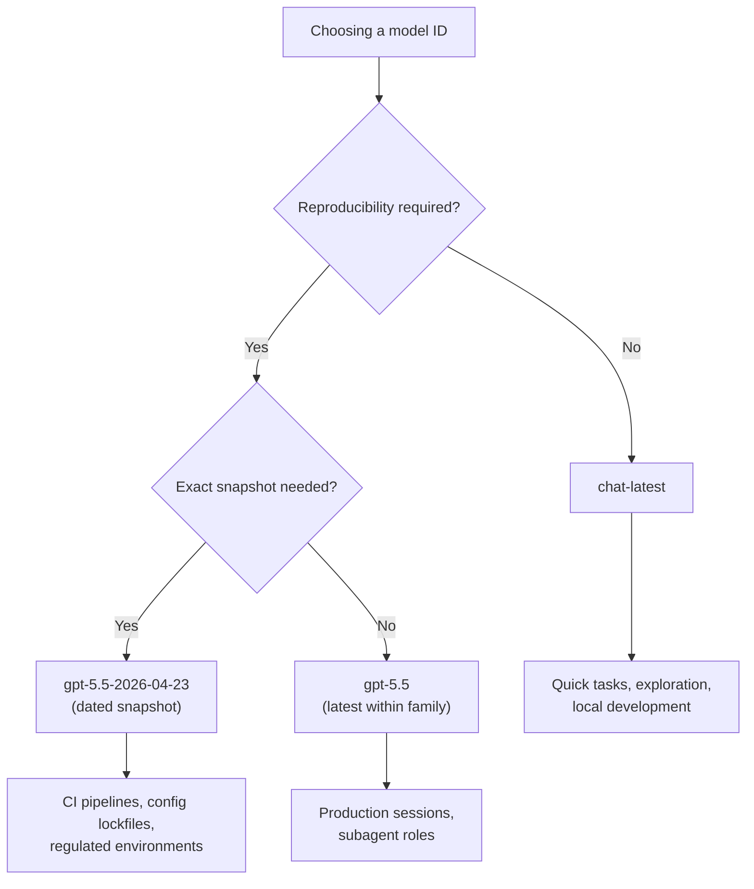

# GPT-5.5 Instant and chat-latest: Dynamic Model Pointers for Codex CLI Developers


---

On 5 May 2026, OpenAI replaced GPT-5.3 Instant with **GPT-5.5 Instant** as the default ChatGPT model and simultaneously shipped a new API model alias — `chat-latest` — that always resolves to the current Instant snapshot[^1][^2]. For Codex CLI developers, this creates a new class of configuration decision: should you pin a specific model version, or ride the `chat-latest` pointer and accept whatever OpenAI promotes next?

This article unpacks what GPT-5.5 Instant changes, how `chat-latest` works at the API layer, and what that means for your `config.toml` profiles.

## What Is GPT-5.5 Instant?

GPT-5.5 Instant is the consumer-optimised variant of the GPT-5.5 family. Where `gpt-5.5` targets complex agentic workloads — 1,050,000-token context window, \$5/\$30 per million input/output tokens, xhigh reasoning support[^3] — the Instant variant prioritises low latency and conciseness for everyday chat.

Key improvements over GPT-5.3 Instant[^1][^4]:

| Metric | Improvement |
|---|---|
| Hallucinated claims (high-stakes prompts) | **−52.5%** |
| Inaccurate claims (user-flagged conversations) | **−37.3%** |
| Output verbosity (words) | **−30.2%** |
| Output verbosity (lines) | **−29.2%** |
| AIME 2025 maths score | **81.2** (vs 65.4) |
| MMMU-Pro multimodal reasoning | **76** (vs 69.2) |

The model also gains improved visual reasoning, stronger STEM performance, and enhanced web search routing logic[^4]. For Codex CLI users who previously noticed the Instant tier drifting into verbose, hedging responses, the word-count reduction alone is significant.

## The chat-latest Model Pointer

`chat-latest` is a **dynamic model alias** in the OpenAI API. It resolves to whichever Instant snapshot currently powers ChatGPT[^2][^5]. Today that is GPT-5.5 Instant; when OpenAI ships the next Instant generation, `chat-latest` will silently advance.

This follows the precedent set by `chatgpt-4o-latest`, which tracked GPT-4o snapshots through 2025[^5]. The key characteristics:

- **No version suffix** — the pointer is deliberately unpinned
- **Regular updates** — OpenAI states the underlying snapshot will be "regularly updated"[^2]
- **Not recommended for production** — the documentation explicitly suggests using pinned model IDs like `gpt-5.5` for production API work[^2]

For developers, `chat-latest` occupies a specific niche: a zero-configuration way to track ChatGPT's current model without manually updating config files after each OpenAI release.

## Configuring Models in Codex CLI

Codex CLI reads the `model` key from `~/.codex/config.toml` (user-level) or `.codex/config.toml` (project-level)[^6]. Any model ID accepted by the Responses API works here, including `chat-latest`:

```toml
# ~/.codex/config.toml — ride the Instant pointer
model = "chat-latest"
```

Or pin to the full GPT-5.5 for agentic workloads:

```toml
# Pin to the frontier model
model = "gpt-5.5"
```

You can also override at invocation time without touching config files[^7]:

```bash
# One-off session with chat-latest
codex -m chat-latest "Refactor the auth middleware to use JWT"

# Override via -c flag
codex -c model="chat-latest" "Summarise this PR"
```

### Profile-Based Model Routing

The real power emerges when you combine `chat-latest` with Codex CLI's profile system. Profiles let you bundle model selection with reasoning effort, verbosity, and other settings under a named key[^8]:

```toml
# Daily driver — fast, cheap, tracks ChatGPT's latest
[profiles.quick]
model = "chat-latest"
model_reasoning_effort = "low"
model_verbosity = "low"

# Deep work — pinned frontier model, maximum reasoning
[profiles.deep]
model = "gpt-5.5"
model_reasoning_effort = "xhigh"
model_verbosity = "high"

# CI pipelines — pinned for reproducibility
[profiles.ci]
model = "gpt-5.5-2026-04-23"
model_reasoning_effort = "medium"
```

Switch profiles at the command line:

```bash
codex --profile quick "Fix the typo in README.md"
codex --profile deep "Design the migration strategy for the payments service"
```

## When to Use chat-latest vs Pinned Models

The choice between dynamic and pinned model IDs maps directly to your tolerance for behavioural drift.



### Use chat-latest When

- **Exploring or prototyping** — you want the newest capabilities without config churn
- **Quick one-off tasks** — commit messages, PR summaries, code explanations where exact reproducibility is irrelevant
- **Tracking ChatGPT parity** — you want Codex CLI to behave like the ChatGPT you use in the browser

### Avoid chat-latest When

- **CI/CD pipelines** — a model change mid-sprint can alter output format, break `--output-schema` assumptions, or shift token costs unpredictably
- **Config lockfiles** — if you use `debug.config_lockfile` for reproducible sessions, a dynamic pointer defeats the purpose[^9]
- **Subagent roles** — MultiAgentV2 custom agents should pin their model to avoid one subagent silently upgrading while others stay fixed[^10]
- **Regulated or audited environments** — you need to record exactly which model produced each output

## GPT-5.5 vs GPT-5.5 Instant: Which for Codex?

These are not interchangeable. The full `gpt-5.5` model and the Instant variant behind `chat-latest` serve different purposes within the Codex ecosystem.

| Dimension | `gpt-5.5` | `chat-latest` (GPT-5.5 Instant) |
|---|---|---|
| Context window | 1,050,000 tokens[^3] | ⚠️ Not publicly documented for Instant |
| Max output tokens | 128,000[^3] | ⚠️ Not publicly documented for Instant |
| Reasoning effort | Supports xhigh[^3] | Optimised for speed; reasoning depth unclear |
| Input pricing | \$5.00 / 1M tokens[^3] | ⚠️ Separate pricing not yet published |
| Output pricing | \$30.00 / 1M tokens[^3] | ⚠️ Separate pricing not yet published |
| Authentication | API key[^3] | API key (via `chat-latest` alias) |
| Target use case | Complex agentic coding, multi-file refactors, architecture | Quick tasks, chat, lightweight code generation |
| Behavioural stability | Pinned within family | Moves with each Instant release |

For Codex CLI's core strengths — multi-turn agentic sessions, `/goal` workflows, subagent orchestration — the full `gpt-5.5` remains the right default. Reserve `chat-latest` for the fast-feedback loop: quick explanations, commit messages, and exploratory prompts where latency matters more than depth.

## The Three-Month Deprecation Window

GPT-5.3 Instant remains available for paid users for three months following the 5 May announcement[^1]. This gives teams using `gpt-5.3-instant` or any alias that resolved to it a concrete migration window:

- **Now → August 2026**: Test `chat-latest` or `gpt-5.5` against your existing workflows
- **Verify `--output-schema` compatibility**: GPT-5.5's structured output behaviour may differ from 5.3's; run your CI eval suite
- **Update AGENTS.md model references**: If your AGENTS.md files reference specific model names in instructions, ensure they reflect the new lineup

## Prompt Caching Implications

Codex CLI relies heavily on prompt caching to keep costs down in multi-turn sessions — cached input tokens cost 90% less[^3][^11]. The cache requires an exact prefix match and works in 128-token increments for prompts exceeding 1,024 tokens[^11].

A dynamic model pointer introduces a subtle risk: if `chat-latest` advances mid-session (unlikely within a single session, but possible across sessions in a `/goal` workflow), the model change would invalidate the cache entirely. With a pinned model ID, this cannot happen.

For long-running `/goal` workflows that span hours or days, pin the model explicitly.

## Practical Recommendation

A sensible default for most Codex CLI users in May 2026:

```toml
# ~/.codex/config.toml
model = "gpt-5.5"                    # Pinned frontier default
model_reasoning_effort = "medium"    # Balanced baseline

[profiles.quick]
model = "chat-latest"                # Fast feedback loop
model_reasoning_effort = "low"
model_verbosity = "low"

[profiles.ci]
model = "gpt-5.5-2026-04-23"        # Snapshot-pinned for reproducibility
model_reasoning_effort = "medium"
```

This gives you three tiers: a stable daily driver, a fast-and-cheap profile for lightweight tasks, and a hermetically sealed CI profile. As GPT-5.5 matures and the Instant variant's specifications become fully documented, you can re-evaluate whether `chat-latest` deserves a larger role.

## Citations

[^1]: [OpenAI releases GPT-5.5 Instant, a new default model for ChatGPT — TechCrunch, 5 May 2026](https://techcrunch.com/2026/05/05/openai-releases-gpt-5-5-instant-a-new-default-model-for-chatgpt/)
[^2]: [OpenAI API Changelog — chat-latest model snapshot, May 2026](https://developers.openai.com/api/docs/changelog)
[^3]: [GPT-5.5 Model — OpenAI API Documentation](https://developers.openai.com/api/docs/models/gpt-5.5)
[^4]: [GPT-5.5 Instant launch details — ResultSense, 6 May 2026](https://www.resultsense.com/news/2026-05-06-openai-gpt55-instant-launch/)
[^5]: [Using GPT-5.5 — OpenAI API Guides](https://developers.openai.com/api/docs/guides/latest-model)
[^6]: [Config basics — Codex CLI, OpenAI Developers](https://developers.openai.com/codex/config-basic)
[^7]: [Command line options — Codex CLI Reference, OpenAI Developers](https://developers.openai.com/codex/cli/reference)
[^8]: [Advanced Configuration — Codex CLI, OpenAI Developers](https://developers.openai.com/codex/config-advanced)
[^9]: [Configuration Reference — Codex CLI, OpenAI Developers (debug.config_lockfile)](https://developers.openai.com/codex/config-reference)
[^10]: [Subagents — Codex CLI, OpenAI Developers](https://developers.openai.com/codex/subagents)
[^11]: [Prompt Caching 201 — OpenAI Cookbook](https://developers.openai.com/cookbook/examples/prompt_caching_201)
