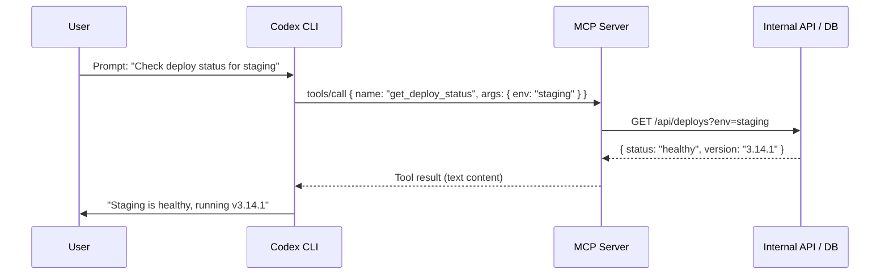
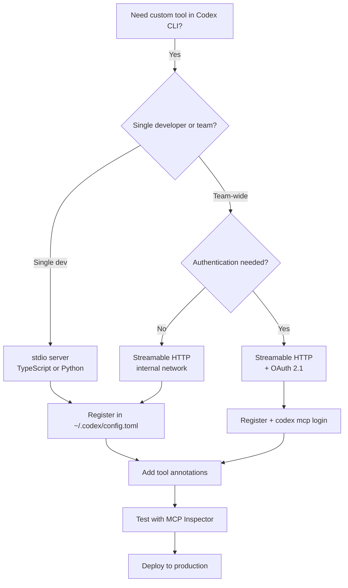

# Building Custom MCP Servers for Codex CLI: A Practical Guide in TypeScript and Python


---

Codex CLI ships with powerful built-in tools — shell execution, file editing via `apply_patch`, and web search — but production workflows inevitably demand domain-specific capabilities: querying internal APIs, running proprietary linters, fetching data from bespoke databases, or orchestrating custom deployment pipelines. The Model Context Protocol (MCP) gives you a standardised way to expose these capabilities as tools that Codex CLI discovers and invokes automatically [^1]. This article walks through building, registering, and hardening custom MCP servers in both TypeScript and Python, with Codex CLI as the consuming host.

## Why Build a Custom MCP Server?

Codex CLI's `mcp_servers` configuration already supports a growing catalogue of third-party servers — GitHub, Sentry, Playwright, Chromatic, and dozens more [^2]. But off-the-shelf servers cannot cover every internal system. A custom MCP server lets you:

- **Expose internal APIs** as agent-callable tools without modifying Codex CLI itself.
- **Enforce domain constraints** — validate inputs, rate-limit calls, redact sensitive fields — before the agent sees the result.
- **Compose with existing tooling** — wrap CLI utilities, database clients, or HTTP services behind a typed tool interface.
- **Control the blast radius** — MCP tool annotations declare whether a tool is read-only, destructive, or open-world, letting Codex CLI's approval system make informed decisions [^3].

## MCP Architecture in 30 Seconds



The protocol uses JSON-RPC 2.0 over two transport families [^4]:

| Transport | When to use |
|-----------|------------|
| **stdio** | Local servers spawned as child processes. Zero network setup. Best for single-developer workflows. |
| **Streamable HTTP** | Remote or shared servers accessed via URL. Supports OAuth 2.1 authentication. Best for team-wide or cloud-hosted tools. |

## Building a Stdio Server in TypeScript

The official `@modelcontextprotocol/sdk` package (v1.x) provides a high-level `McpServer` class [^5]. The following example exposes a single tool that queries a hypothetical internal deployment API.

### Project Setup

```bash
mkdir deploy-mcp-server && cd deploy-mcp-server
npm init -y
npm install @modelcontextprotocol/sdk zod
npm install -D typescript @types/node
npx tsc --init --target ES2022 --module NodeNext --moduleResolution NodeNext --outDir dist
```

Set `"type": "module"` in `package.json` and add a `bin` entry:

```json
{
  "type": "module",
  "bin": { "deploy-mcp-server": "./dist/index.js" }
}
```

### Server Implementation

```typescript
#!/usr/bin/env node
// src/index.ts
import { McpServer } from "@modelcontextprotocol/sdk/server/mcp.js";
import { StdioServerTransport } from "@modelcontextprotocol/sdk/server/stdio.js";
import { z } from "zod";

const server = new McpServer({
  name: "deploy-status",
  version: "1.0.0",
});

// Define a tool with typed input schema
server.tool(
  "get_deploy_status",
  "Returns the current deployment status for a given environment",
  {
    environment: z.enum(["staging", "production", "preview"]).describe(
      "Target deployment environment"
    ),
  },
  async ({ environment }) => {
    const res = await fetch(
      `${process.env.DEPLOY_API_URL}/api/deploys?env=${environment}`,
      { headers: { Authorization: `Bearer ${process.env.DEPLOY_API_KEY}` } }
    );

    if (!res.ok) {
      return {
        content: [{ type: "text", text: `API error: ${res.status} ${res.statusText}` }],
        isError: true,
      };
    }

    const data = await res.json();
    return {
      content: [{ type: "text", text: JSON.stringify(data, null, 2) }],
    };
  }
);

const transport = new StdioServerTransport();
await server.connect(transport);
```

Key points:

- **Zod schemas** define the `inputSchema` that Codex CLI presents to the model. The richer the descriptions, the better the model's tool selection [^6].
- **Error handling** returns `isError: true` so the agent loop can distinguish tool failures from empty results.
- **Secrets** come from environment variables, never hardcoded — Codex CLI's `env` and `env_vars` configuration forwards them to the child process.

### Registering with Codex CLI

Add the server to `~/.codex/config.toml` (or `.codex/config.toml` at project level):

```toml
[mcp_servers.deploy-status]
command = "npx"
args = ["deploy-mcp-server"]
env = { DEPLOY_API_URL = "https://internal.example.com" }
env_vars = ["DEPLOY_API_KEY"]  # forwarded from your shell environment
startup_timeout_sec = 15
tool_timeout_sec = 30
```

Or use the CLI shorthand:

```bash
codex mcp add deploy-status \
  --command npx \
  --args deploy-mcp-server \
  --env DEPLOY_API_URL=https://internal.example.com \
  --env-var DEPLOY_API_KEY
```

Verify registration with the `/mcp` TUI command — the server should appear with its tool listed [^7].

## Building a Streamable HTTP Server in Python

For team-shared servers or cloud-hosted tools, the Python SDK's `FastMCP` class provides a streamable HTTP transport out of the box [^8].

### Project Setup

```bash
mkdir ticket-mcp-server && cd ticket-mcp-server
python -m venv .venv && source .venv/bin/activate
pip install "mcp[cli]" httpx
```

### Server Implementation

```python
# server.py
from mcp.server.fastmcp import FastMCP
import httpx
import os

mcp = FastMCP(
    name="ticket-lookup",
    instructions="Query internal ticket system for issue details and status.",
)

TICKET_API = os.environ.get("TICKET_API_URL", "https://tickets.internal.example.com")
TICKET_TOKEN = os.environ.get("TICKET_API_TOKEN", "")


@mcp.tool(
    annotations={
        "readOnlyHint": True,
        "openWorldHint": False,
    }
)
async def get_ticket(ticket_id: str) -> str:
    """Fetch details for a ticket by its ID (e.g. PROJ-1234).

    Returns the ticket title, status, assignee, and description.
    """
    async with httpx.AsyncClient() as client:
        resp = await client.get(
            f"{TICKET_API}/api/tickets/{ticket_id}",
            headers={"Authorization": f"Bearer {TICKET_TOKEN}"},
            timeout=10.0,
        )
        resp.raise_for_status()
        data = resp.json()
        return (
            f"**{data['id']}**: {data['title']}\n"
            f"Status: {data['status']} | Assignee: {data.get('assignee', 'Unassigned')}\n"
            f"Description: {data.get('description', 'No description')}"
        )


@mcp.tool(
    annotations={
        "readOnlyHint": False,
        "destructiveHint": False,
        "openWorldHint": False,
    }
)
async def add_ticket_comment(ticket_id: str, comment: str) -> str:
    """Add a comment to an existing ticket.

    Use this to leave notes, status updates, or questions on a ticket.
    """
    async with httpx.AsyncClient() as client:
        resp = await client.post(
            f"{TICKET_API}/api/tickets/{ticket_id}/comments",
            json={"body": comment},
            headers={"Authorization": f"Bearer {TICKET_TOKEN}"},
            timeout=10.0,
        )
        resp.raise_for_status()
        return f"Comment added to {ticket_id}."


if __name__ == "__main__":
    mcp.run(transport="streamable-http", host="0.0.0.0", port=8080)
```

### Tool Annotations Matter

The `annotations` dictionary tells Codex CLI's approval system how to classify the tool [^3]:

| Annotation | Effect on Codex CLI |
|-----------|-------------------|
| `readOnlyHint: True` | Tool may be auto-approved under `:workspace` profile |
| `destructiveHint: True` | Forces approval prompt even in permissive profiles |
| `openWorldHint: True` | Signals network/external access; triggers network approval |

Without annotations, Codex CLI defaults to treating every MCP tool call as potentially write-capable, which means more approval prompts for your users.

### Registering a Remote Server

```toml
[mcp_servers.ticket-lookup]
url = "http://localhost:8080/mcp"
bearer_token_env_var = "TICKET_MCP_TOKEN"
tool_timeout_sec = 15
```

For production deployments behind an identity provider, use OAuth 2.1:

```bash
codex mcp login ticket-lookup
```

Codex CLI opens the browser, completes the PKCE flow, and stores the token in the platform keyring [^9].

## Testing Your Server

Before connecting to Codex CLI, validate your server independently:

```bash
# TypeScript stdio server — use the MCP Inspector
npx @modelcontextprotocol/inspector npx deploy-mcp-server

# Python HTTP server — curl the tool listing
curl -X POST http://localhost:8080/mcp \
  -H "Content-Type: application/json" \
  -d '{"jsonrpc":"2.0","id":1,"method":"tools/list"}'
```

The MCP Inspector provides a browser-based UI for calling tools interactively and inspecting JSON-RPC messages [^10]. It is invaluable for debugging schema mismatches before the model gets involved.

## Production Hardening

### Input Validation

Zod (TypeScript) and Pydantic/type hints (Python) handle schema validation at the MCP layer, but add domain validation too:

```typescript
// Reject ticket IDs that don't match the expected format
if (!/^[A-Z]+-\d+$/.test(ticketId)) {
  return { content: [{ type: "text", text: "Invalid ticket ID format" }], isError: true };
}
```

### Rate Limiting

Wrap tool handlers with a simple token-bucket or sliding-window limiter. Codex CLI's agent loop can call tools in rapid succession during multi-step reasoning, and an unprotected internal API will feel it [^11].

### Timeout Configuration

Set `tool_timeout_sec` in `config.toml` to match your API's expected latency. The default of 60 seconds is generous — tighten it to surface slow backends early rather than letting the agent wait silently.

### Logging

For stdio servers, write logs to stderr (not stdout) — stdout carries JSON-RPC messages and any stray output corrupts the protocol [^5]. For HTTP servers, standard logging libraries work normally.

```typescript
// Safe logging for stdio servers
console.error("[deploy-mcp] Fetching status for:", environment);
```

## Configuration Patterns

### Per-Project Scoping

Place MCP configuration in `.codex/config.toml` at the repository root to scope servers to specific projects. This keeps internal tools out of unrelated sessions:

```toml
# .codex/config.toml (project-scoped, trusted projects only)
[mcp_servers.project-db]
command = "python"
args = ["tools/db-mcp-server.py"]
env = { DB_URL = "postgresql://localhost:5432/myapp" }
enabled_tools = ["query_schema", "list_tables"]
```

### Tool Allow/Deny Lists

Use `enabled_tools` or `disabled_tools` to control which tools from a server are exposed to the agent:

```toml
[mcp_servers.ticket-lookup]
url = "http://localhost:8080/mcp"
enabled_tools = ["get_ticket"]  # expose read-only tool only
```

This is particularly useful when a server exposes both read and write tools but you want read-only access in certain profiles [^7].

### Profile-Based Server Selection

Combine MCP server configuration with Codex CLI named profiles to switch tool sets by context:

```toml
[profile.review]
model = "gpt-5.5"
[profile.review.mcp_servers.ticket-lookup]
url = "http://localhost:8080/mcp"
enabled_tools = ["get_ticket"]

[profile.deploy]
model = "gpt-5-codex"
[profile.deploy.mcp_servers.deploy-status]
command = "npx"
args = ["deploy-mcp-server"]
```

```bash
codex --profile review "Summarise the open tickets for this sprint"
codex --profile deploy "Check staging health before the release"
```

## Decision Framework



## Current Limitations

- **outputSchema support is partial** — Codex CLI v0.129 alpha adds typed tool declarations with MCP `outputSchema` details, but structured result parsing is not yet stable [^12]. For now, return well-formatted text or JSON strings.
- **`--output-schema` and MCP conflict** — the `codex exec` flag `--output-schema` is silently ignored when MCP servers are active [^13]. Extract structured results via marker-based output instead.
- **Hooks coverage gap** — `PreToolUse` and `PostToolUse` hooks fire reliably for shell calls but not consistently for MCP tool calls as of v0.128 [^14]. Do not rely on hooks for MCP-level gating; enforce constraints inside the server itself.
- **No hot reload** — changing a stdio server's code requires restarting the Codex CLI session. During development, use `/mcp` then restart with `/clear`.

## Summary

Building a custom MCP server is the cleanest way to extend Codex CLI with domain-specific tools. The protocol handles discovery, schema negotiation, and transport; your code handles the business logic. Start with a stdio server for local development, graduate to streamable HTTP when the team needs shared access, and annotate every tool so Codex CLI's approval system can make sensible decisions without pestering the developer.

---

## Citations

[^1]: Model Context Protocol, "Introduction," [modelcontextprotocol.io](https://modelcontextprotocol.io/introduction), 2026.
[^2]: OpenAI, "Model Context Protocol — Codex," [developers.openai.com/codex/mcp](https://developers.openai.com/codex/mcp), 2026.
[^3]: Model Context Protocol, "Tools — Annotations," [modelcontextprotocol.io/specification/2025-06-18/server/tools](https://modelcontextprotocol.io/specification/2025-06-18/server/tools), 2025.
[^4]: Model Context Protocol, "Transports," [modelcontextprotocol.io/docs/learn/transports](https://modelcontextprotocol.io/docs/learn/transports), 2026.
[^5]: Model Context Protocol, "Build an MCP Server," [modelcontextprotocol.io/docs/develop/build-server](https://modelcontextprotocol.io/docs/develop/build-server), 2026.
[^6]: OpenAI, "Best Practices — Codex," [developers.openai.com/codex/learn/best-practices](https://developers.openai.com/codex/learn/best-practices), 2026.
[^7]: OpenAI, "Configuration Reference — Codex," [developers.openai.com/codex/config-reference](https://developers.openai.com/codex/config-reference), 2026.
[^8]: Model Context Protocol, "Python SDK — FastMCP," [github.com/modelcontextprotocol/python-sdk](https://github.com/modelcontextprotocol/python-sdk), 2026.
[^9]: OpenAI, "MCP OAuth — Codex CLI," [developers.openai.com/codex/mcp](https://developers.openai.com/codex/mcp), 2026.
[^10]: Model Context Protocol, "MCP Inspector," [github.com/modelcontextprotocol/inspector](https://github.com/modelcontextprotocol/inspector), 2026.
[^11]: Lushbinary, "MCP Developer Guide 2026," [lushbinary.com/blog/mcp-model-context-protocol-developer-guide-2026](https://lushbinary.com/blog/mcp-model-context-protocol-developer-guide-2026/), 2026.
[^12]: OpenAI, "Codex Changelog — v0.129 alpha," [developers.openai.com/codex/changelog](https://developers.openai.com/codex/changelog), May 2026.
[^13]: GitHub Issue #15451, "--json and --output-schema are silently ignored when tools/MCP servers are active," [github.com/openai/codex/issues/15451](https://github.com/openai/codex/issues/15451), 2026.
[^14]: GitHub Issue #19385, "Support additionalContext in PreToolUse hooks or clarify Claude-style hook parity," [github.com/openai/codex/issues/19385](https://github.com/openai/codex/issues/19385), 2026.
