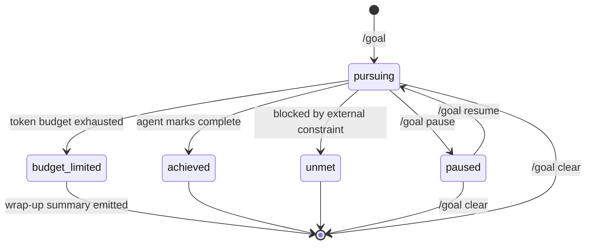

# Codex CLI /goal: Persisted Long-Horizon Workflows with Pause, Resume, and Token Budgets


---

Most Codex CLI interactions follow a prompt-diff-done cadence: you describe what you want, approve the plan, and move on. That works for targeted fixes and single-file changes. It falls apart the moment your objective spans multiple files, requires iterative verification, or simply takes longer than a single turn to complete. The `/goal` command, shipped in Codex CLI 0.128.0[^1], introduces a fundamentally different execution model — one where objectives persist across turns, survive session interruptions, and enforce structured completion audits before the agent declares victory.

## Why Single-Turn Prompts Hit a Ceiling

A standard Codex prompt is ephemeral. Once the model responds and you approve the diff, the objective is gone. If you need to continue — say, migrating twelve service files and updating the corresponding test suite — you must re-state context each turn, manually track which files are done, and hope the model does not lose the thread after context compaction.

`/goal` replaces this manual loop with a runtime-native persistence layer. The objective is stored as a first-class object in the Codex app-server's state[^2], surviving across turns, compactions, terminal crashes, and even machine reboots. When you resume, the agent picks up where it left off with full awareness of what remains.

## Enabling the Feature

Goals are gated behind a feature flag in `~/.codex/config.toml`[^3]:

```toml
[features]
goals = true
```

Without this flag, `/goal` slash commands are silently unrecognised. Some shells require a full session restart after changing the config — if the command does not appear after saving, close and reopen your terminal[^4].

## The Slash Command Surface

The TUI exposes four operations[^2]:

| Command | Effect |
|---|---|
| `/goal <objective>` | Create or replace the active goal |
| `/goal` | View current goal summary and status |
| `/goal pause` | Suspend continuation; preserve full audit context |
| `/goal resume` | Reactivate from preserved state |
| `/goal clear` | Delete the goal; revert to single-turn behaviour |

There is no `/goal status` subcommand. Status is rendered in the TUI footer chrome — showing elapsed time, token consumption, and current lifecycle state — and is queryable via the app-server APIs[^2].

## Goal Lifecycle and State Machine

A goal moves through five discrete states:



State transitions are driven by structured `update_goal` tool calls from the model, not by free-text output[^5]. Every completion claim is a parseable tool invocation with reasoning attached, making the lifecycle deterministic and externally auditable.

## How Continuation Works Under the Hood

Two internal prompt templates drive the loop[^5]:

1. **`continuation.md`** — injected at turn boundaries while the goal is in `pursuing` state. It instructs the agent to decompose the objective into testable deliverables, audit each requirement against concrete evidence (file inspection, command output, test results), and explicitly avoid marking completion on proxy signals alone.

2. **`budget_limit.md`** — injected on the final turn when the token budget is nearly exhausted. It receives template variables including `{{ objective }}`, `{{ time_used_seconds }}`, `{{ tokens_used }}`, and `{{ token_budget }}`, giving the model full visibility into resource state. The agent then summarises progress and remaining work rather than attempting new substantive changes.

This two-template design means the agent always knows whether it is in "work" mode or "wrap up" mode — and cannot silently switch between them.

## Token Budgets: Spend Control for Long-Running Goals

Unlike iteration-count limits, token budgets expose actual spend. The runtime tracks cumulative token consumption against a configured ceiling[^5]. Recommended starting points:

| Goal Scope | Token Budget |
|---|---|
| Small targeted fix (single module) | 100k–500k |
| Medium multi-file refactor | 500k–2M |
| Large migration or framework upgrade | 2M–10M |

When the budget is approached, `budget_limit.md` fires. The agent wraps up gracefully — it does not abort mid-edit. This is a soft stop, not a hard kill.

⚠️ There is currently no hard spend cap enforced at the API billing level. The budget is a runtime-advisory mechanism within the CLI. If the model overshoots on a single expensive turn, actual token usage may exceed the configured budget before the limit prompt fires[^6].

## Constrained Model Tools

The agent's access to goal lifecycle is deliberately limited[^5]:

- **`get_goal`** — read current objective and state
- **`create_goal`** — only functions when no goal exists (prevents the model from silently replacing your objective)
- **`update_goal`** — exposes only completion marking with mandatory reasoning

The user retains exclusive control over pause, resume, clear, and budget configuration. This asymmetry prevents runaway agents from hijacking their own objectives — a meaningful safety boundary for autonomous workflows.

## App-Server API Integration

Goals are not local TUI artifacts. The app-server exposes JSON-RPC endpoints[^2][^5]:

- `thread/goal/set` — create or update a persisted goal for a thread
- `thread/goal/get` — fetch the current persisted goal
- `thread/goal/clear` — clear persisted goals
- `thread/goal/updated` and `thread/goal/cleared` — server-sent notifications

This API surface enables:

- **IDE integrations** that display and control goals outside the terminal
- **CI pipelines** that launch goals headlessly via `codex exec` and await completion
- **Monitoring dashboards** that track goal state across multiple sessions
- **Structured audit trails** of every `update_goal` call with attached reasoning

## Practical Workflow: Migrating an Auth Module

Here is how a realistic goal-driven workflow looks for migrating an authentication module to JWT:

```bash
# Enable goals if not already set
codex features enable goals

# Start the goal
codex
```

Inside the TUI:

```
/goal Migrate the auth module from session-based to JWT. Update all service
files importing auth.session, replace middleware, update tests, and verify
the full test suite passes.
```

The agent begins working. You can close your laptop, commute, and resume later:

```
/goal resume
```

The agent continues from its preserved state, aware of which files it has already modified. If you need to review intermediate results:

```
/goal pause
```

Inspect the changes at leisure, then resume when satisfied.

## Combining with AGENTS.md and MCP Servers

`/goal` becomes significantly more effective when layered with project-level configuration:

- **AGENTS.md** provides always-on context — stack details, build commands, lint rules, protected directories[^7]. This eliminates the need to embed framework-level conventions in every goal objective.
- **MCP servers** grant the agent access to external systems (databases, design tools, monitoring)[^8]. Long-running goals that require real-world feedback — such as verifying API compatibility or checking deployment status — benefit substantially from MCP connectivity.
- **Named profiles** can configure model selection and approval policies per goal type. A migration goal might use a higher-capability model with stricter approval gates, whilst a test-coverage goal uses a faster, cheaper model in full-auto mode.

## Known Limitations

**Mid-turn compaction drift** (GitHub issue #19910): Long-running goals can lose continuation prompt injection after context compaction, leaving the agent without guardrails mid-turn[^5]. The practical workaround is to prefer smaller objectives with tighter budgets — break large goals into sequential smaller ones rather than attempting a single monolithic objective.

**Documentation gaps** (GitHub issue #20536): As of May 2026, the official CLI features documentation does not yet list `/goal`[^9]. The canonical reference remains the source prompt templates in the Codex repository and the changelog entry for 0.128.0.

**Feature flag discovery**: The most common failure mode is forgetting to set `goals = true` in config[^4]. The error is silent — the command simply does not appear — which can be confusing for developers expecting it to work out of the box.

**No real-time monitoring dashboard**: There is currently no built-in interface for monitoring agent activity during extended runs[^6]. You must check in via the TUI or query the app-server APIs programmatically.

## Decision Framework

Use `/goal` when your task has **all three** of these characteristics:

1. **Multi-step** — requires more than one tool call or file modification
2. **Verifiable** — has concrete, auditable completion criteria (tests pass, files exist, commands succeed)
3. **Interruptible** — you may need to pause, review, or resume across sessions

For single-turn diffs, quick explanations, or exploratory questions, standard prompts remain faster and simpler. `/goal` adds overhead — the continuation machinery, budget tracking, and audit requirements are unnecessary for work that fits in one turn.

## What Comes Next

The `/goal` infrastructure lays groundwork for capabilities not yet shipped: multi-agent goal delegation (where a parent agent assigns sub-goals to specialist subagents), goal-chaining (where completion of one goal triggers creation of the next), and team-level goal dashboards for engineering leads tracking agent-assisted work across a squad.

For now, `/goal` is the first production-quality answer to the question every Codex user eventually asks: "How do I give this thing a bigger job and walk away?"

---

## Citations

[^1]: [Codex CLI Changelog — v0.128.0 (April 30, 2026)](https://developers.openai.com/codex/changelog)
[^2]: [Codex /goal: What It Does, How to Use It, and Why It May Be Missing — LaoZhang AI](https://blog.laozhang.ai/en/posts/codex-goal)
[^3]: [Codex CLI Configuration Reference — OpenAI Developers](https://developers.openai.com/codex/cli/reference)
[^4]: [Codex /goal Command: OpenAI's Built-in Ralph Loop for Autonomous Coding — Ralphable](https://ralphable.com/blog/codex-goal-command-ralph-loop-openai-built-in-autonomous-coding-agent-2026)
[^5]: [OpenAI Codex /goal: The New Long-Horizon Mode for Agentic Coding — Kingy AI](https://kingy.ai/ai/openai-codex-goal-the-new-long-horizon-mode-for-agentic-coding/)
[^6]: [OpenAI Just Added /goal to Codex CLI: How It Compares to Claude Code Agents — DevToolPicks](https://devtoolpicks.com/blog/codex-goal-command-vs-claude-code-agents-2026)
[^7]: [Custom Instructions with AGENTS.md — OpenAI Developers](https://developers.openai.com/codex/guides/agents-md)
[^8]: [MCP Integration — Codex CLI | OpenAI Developers](https://developers.openai.com/codex/cli)
[^9]: [Features — Codex CLI | OpenAI Developers](https://developers.openai.com/codex/cli/features)
