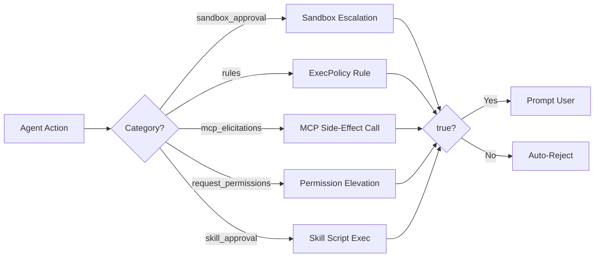
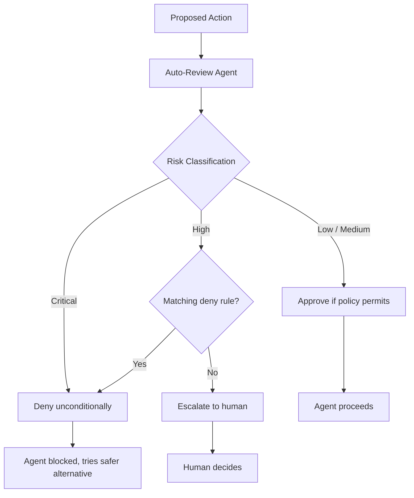

# Codex CLI Granular Approval Policies and the Auto-Review Subagent: Autonomous Yet Secure Workflows


Every Codex CLI user eventually confronts the same tension: you want the agent to work autonomously, but you also want to sleep at night. The original approval model offered three coarse-grained modes — `untrusted`, `on-request`, and `never` — which forced a binary choice between interrupt-heavy safety and reckless autonomy[^1]. Since v0.122, Codex CLI has shipped two mechanisms that dissolve this trade-off: **granular approval policies** and the **auto-review subagent**. Together, they let you specify precisely which categories of action require human oversight, and delegate the rest to a security-focused reviewer that catches 96.1% of malicious behaviour while reducing human interruptions by roughly 200×[^2].

## The Problem with Coarse-Grained Modes

The three legacy approval policies each carry a distinct cost:

| Policy | Behaviour | Trade-off |
|--------|-----------|-----------|
| `untrusted` | Only known-safe read-only commands auto-run; everything else prompts | Interrupt-heavy; impractical for long sessions |
| `on-request` | Model decides when to ask (default) | Good general balance but no category-level control |
| `never` | No prompts; agent proceeds within sandbox constraints | No safety net for boundary-crossing actions |

For a team running a trusted local MCP server alongside an untrusted third-party one, none of these modes fits. You want MCP elicitations from the trusted server to proceed silently whilst the untrusted server's calls require explicit approval. Coarse modes cannot express this distinction[^1].

## Granular Approval Policies

The `granular` approval policy, introduced in the v0.122–v0.125 release cycle[^3], replaces the single policy string with a table of five independently controllable categories:

```toml
# ~/.codex/config.toml
approval_policy = { granular = {
  sandbox_approval    = true,   # sandbox boundary escalations
  rules               = true,   # execpolicy prompt-rule triggers
  mcp_elicitations    = true,   # MCP tool calls with side effects
  request_permissions = false,  # permission elevation requests
  skill_approval      = false   # skill-script execution prompts
} }
```

When a category is set to `true`, the corresponding prompt surfaces for human review. When `false`, Codex **auto-rejects** the request — the action is denied silently rather than auto-approved[^4]. This is a critical distinction: `false` means "fail closed", not "proceed without asking".

### The Five Categories Explained



**`sandbox_approval`** controls whether the agent can request expansion of its sandbox boundaries — for example, writing outside the workspace directory or accessing a new network endpoint. Set to `true` in most workflows; set to `false` in CI runners where the sandbox must never expand[^4].

**`rules`** governs prompts triggered by execution-policy rules defined in `requirements.toml` or managed configuration. These are organisation-level guardrails. In enterprise environments, keep this `true` so policy violations surface immediately[^5].

**`mcp_elicitations`** determines whether MCP tools that advertise side effects (database writes, API mutations, message sends) can prompt for approval. When `false`, all side-effecting MCP calls are silently blocked — useful for locking down untrusted third-party servers whilst permitting read-only MCP tools[^4].

**`request_permissions`** controls whether the agent can ask to elevate its own permissions mid-session. Setting this to `false` prevents the agent from requesting broader filesystem or network access than initially configured[^4].

**`skill_approval`** governs whether skills containing executable scripts (shell commands, Python hooks) require approval before running. In a mature skill library that has been audited, setting this to `false` prevents unnecessary interruptions. For newly installed third-party skills, keep it `true`[^4].

### Profile-Based Granular Policies

Combine granular policies with named profiles to create context-specific approval stacks:

```toml
[profiles.ci]
approval_policy = { granular = {
  sandbox_approval    = false,
  rules               = false,
  mcp_elicitations    = false,
  request_permissions = false,
  skill_approval      = false
} }

[profiles.dev]
approval_policy = { granular = {
  sandbox_approval    = true,
  rules               = true,
  mcp_elicitations    = true,
  request_permissions = false,
  skill_approval      = true
} }

[profiles.review]
approval_policy = { granular = {
  sandbox_approval    = false,
  rules               = true,
  mcp_elicitations    = false,
  request_permissions = false,
  skill_approval      = false
} }
```

Switch at launch with `codex --profile ci` or mid-session with `/permissions`[^6].

## The Auto-Review Subagent

Granular policies control which categories of action can prompt at all. The **auto-review subagent** controls _who_ evaluates those prompts when they do surface. By default, `approvals_reviewer = "user"` routes every eligible prompt to the human operator. Setting it to `"auto_review"` interposes a separate agent — architecturally distinct from the coding agent — that evaluates each boundary-crossing request against a security policy before deciding to approve, deny, or escalate to the human[^2].

```toml
# Enable auto-review
approvals_reviewer = "auto_review"

# Custom policy instructions (Markdown)
[auto_review]
policy = """
## Review Policy
- DENY any command that reads ~/.ssh, ~/.aws, or ~/.gnupg
- DENY any network request to domains not in the project's package.json
- APPROVE npm install, npm test, and npm run build without prompting
- ESCALATE any rm -rf command to the human operator
"""
```

### How Auto-Review Evaluates Actions

The reviewer agent receives the proposed action, the user's original intent, the current environment state, and the security policy. It classifies the action into one of three risk tiers[^2]:



### Performance Numbers

OpenAI's alignment team published performance data for auto-review that merits careful reading[^2]:

| Metric | Value |
|--------|-------|
| Approval rate on escalated actions | 99.1% |
| Effective approval across all actions | 99.93% |
| Overeagerness recall (unintended harm prevention) | 90.3% |
| Prompt injection detection | 99.3% |
| MonitoringBench (malicious behaviour detection) | 96.1% |
| Human interruption reduction | ~200× fewer stops |

These numbers are impressive but come with a caveat the OpenAI team themselves emphasise: "auto-review should not be treated as a guarantee of security"[^2]. The system is non-deterministic, differs fundamentally from traditional allow-list security, and has been shown to be vulnerable to sophisticated attacks in red-teaming exercises[^2].

### Writing Effective Review Policies

The `auto_review.policy` field accepts Markdown instructions that the reviewer agent interprets. Effective policies share three characteristics:

1. **Specific deny rules** — name exact paths, commands, or patterns rather than vague prohibitions
2. **Explicit approve rules** — list the routine actions that should never interrupt the workflow
3. **Escalation criteria** — define the grey area where human judgement is genuinely needed

⚠️ Avoid overly broad deny rules like "deny anything that modifies the filesystem" — these will conflict with the agent's core function and trigger constant rejections, effectively breaking the workflow.

## Combining Granular Policies with Auto-Review

The most powerful configuration layers both mechanisms. Granular policies act as the **structural filter** (which categories of prompt exist at all), whilst auto-review acts as the **intelligent evaluator** (deciding outcomes within permitted categories):

```toml
# Production-ready autonomous configuration
approval_policy = { granular = {
  sandbox_approval    = true,
  rules               = true,
  mcp_elicitations    = true,
  request_permissions = false,
  skill_approval      = false
} }

approvals_reviewer = "auto_review"

[auto_review]
policy = """
## Security Policy — Project Alpha
- APPROVE: git operations within the workspace
- APPROVE: npm/yarn/pnpm install, test, build, lint
- APPROVE: sandbox expansion to ./dist and ./coverage
- DENY: any access to .env, .env.*, or credentials.json
- DENY: network requests to non-HTTPS endpoints
- DENY: git push to main or master branches
- ESCALATE: any rm -rf or git reset --hard
- ESCALATE: network access to domains not in package.json
"""
```

With this configuration:
- **Permission elevation** and **skill execution** are silently blocked (granular `false`)
- **Sandbox escalations**, **policy-rule triggers**, and **MCP side-effect calls** reach the auto-review agent
- The auto-review agent applies the Markdown policy to approve, deny, or escalate
- Only genuinely ambiguous situations reach the human operator

### Enterprise Enforcement

In managed environments, administrators can set `auto_review.guardian_policy_config` in `requirements.toml` to override local review policies. This prevents individual developers from weakening the security review with permissive local policies[^5]:

```toml
# /etc/codex/requirements.toml (admin-managed)
[auto_review]
guardian_policy_config = """
- DENY: any command executed as root or with sudo
- DENY: any write outside $PROJECT_ROOT
- DENY: network access to internal corporate domains
"""
```

The managed policy takes precedence over local `auto_review.policy` — developers cannot override it[^5].

## Decision Framework

Use the following decision tree when configuring approval behaviour:

| Scenario | Granular Settings | Reviewer | Rationale |
|----------|------------------|----------|-----------|
| Solo developer, trusted project | All `true` | `auto_review` | Maximum autonomy with intelligent safety net |
| Team CI runner | All `false` | N/A | No prompts possible; sandbox constraints are the only guardrail |
| Enterprise, mixed MCP servers | `mcp_elicitations = true`, rest `false` | `auto_review` with strict policy | Lock down everything except MCP, which gets reviewed |
| Security-sensitive codebase | All `true` | `user` | Human reviews every boundary-crossing action |
| Onboarding new skill library | `skill_approval = true`, rest per preference | `user` | Verify skill scripts before trusting them |

## Limitations and Known Issues

**Auto-review is not deterministic.** Unlike traditional firewall rules, the reviewer agent uses probabilistic reasoning. The same action may receive different verdicts across runs[^2].

**Red-team vulnerabilities exist.** OpenAI's alignment team found cases where the auto-review agent could be manipulated into approving unauthorised commands through careful prompt construction[^2]. Defence in depth — combining auto-review with sandbox constraints and managed `requirements.toml` policies — is essential.

**Granular `false` means reject, not approve.** A common misconfiguration is setting categories to `false` expecting auto-approval. The actual behaviour is auto-rejection — the action is silently denied[^4]. If you want an action to proceed without prompting, you need the combination of `true` (allow the prompt) plus `auto_review` (delegate the decision to the reviewer agent).

## Citations

[^1]: [Agent approvals & security — Codex | OpenAI Developers](https://developers.openai.com/codex/agent-approvals-security)
[^2]: [Auto-review of agent actions without synchronous human oversight — OpenAI Alignment](https://alignment.openai.com/auto-review)
[^3]: [Changelog — Codex | OpenAI Developers](https://developers.openai.com/codex/changelog)
[^4]: [Configuration Reference — Codex | OpenAI Developers](https://developers.openai.com/codex/config-reference)
[^5]: [Managed configuration — Codex | OpenAI Developers](https://developers.openai.com/codex/enterprise/managed-configuration)
[^6]: [Advanced Configuration — Codex | OpenAI Developers](https://developers.openai.com/codex/config-advanced)
