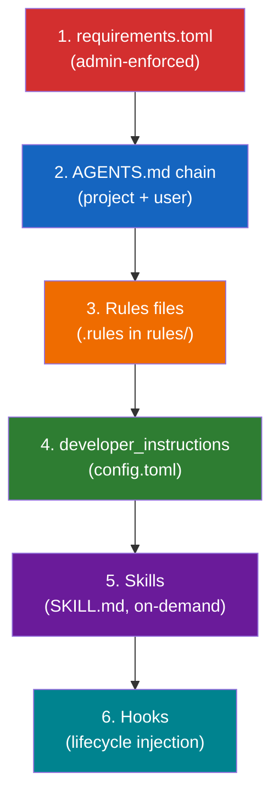
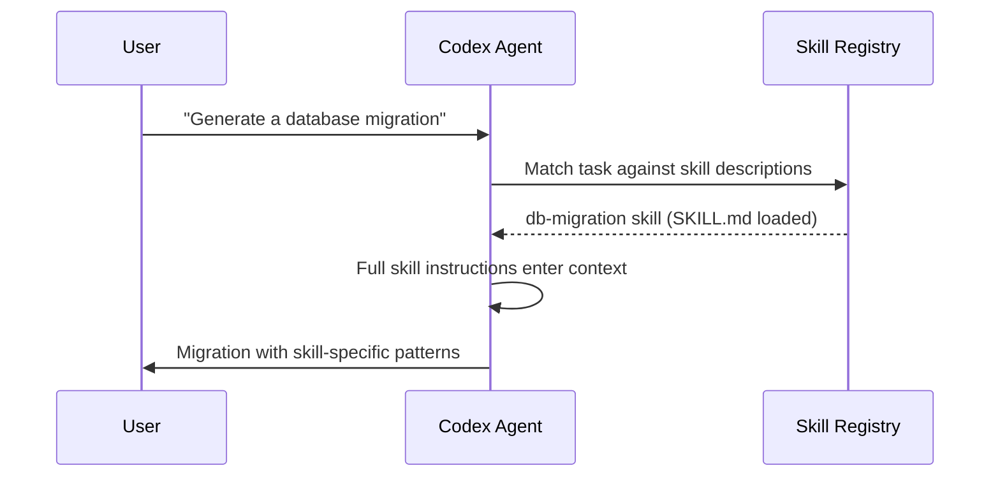

# The Codex CLI Instruction Stack: How Six Configuration Surfaces Shape Agent Behaviour


---

Codex CLI does not read a single instruction file. It assembles a composite instruction set from **six distinct surfaces**, each with its own scope, precedence, and purpose. Understanding how these surfaces compose at runtime is the difference between a well-governed agent and one that ignores half your guidance because a higher-precedence layer overwrote it.

This article maps the full instruction architecture as of Codex CLI v0.128/v0.129-alpha, explains where each surface wins, and provides practical patterns for layering them in team repositories and enterprise environments.

---

## The Six Instruction Surfaces

When Codex starts a session, it constructs the agent's system prompt from these sources, resolved in a specific order:



Each surface operates at a different layer of the stack. They do not simply concatenate — some constrain, some guide, some inject at runtime, and some only activate when the agent selects them.

---

## 1. requirements.toml — The Admin Override

The highest-precedence instruction surface is `requirements.toml`, available to organisations using ChatGPT Business, Enterprise, or macOS MDM [^1]. This file enforces security-sensitive constraints that **users cannot override**:

- Approval policy floors (e.g. forcing `approval_policy = "on-request"`)
- Sandbox mode ceilings (preventing `danger-full-access`)
- Web search restrictions
- Managed hooks that inject lifecycle scripts from an admin-controlled directory
- MCP server allow/deny lists

```toml
# /etc/codex/requirements.toml (system-level)
# or cloud-managed via Codex Policies page

[requirements]
approval_policy = "on-request"
sandbox_mode = "workspace-write"
web_search = "cached"

[hooks]
managed_dir = "/etc/codex/managed-hooks"
```

When a user's `config.toml` conflicts with an enforced requirement, Codex silently falls back to the compliant value and notifies the user [^2]. This surface exists purely for constraint — it does not add creative guidance or project-specific knowledge.

**Precedence:** Cloud-managed requirements take priority over MDM requirements, which take priority over system-level `/etc/codex/requirements.toml` [^3].

---

## 2. AGENTS.md — The Project Knowledge Base

`AGENTS.md` is the primary surface for project-specific instructions. Codex builds an instruction chain by walking the directory tree [^4]:

1. **User scope:** `~/.codex/AGENTS.override.md` → `~/.codex/AGENTS.md` (first non-empty file wins)
2. **Project scope:** From the Git root down to the current working directory, checking each level for `AGENTS.override.md` → `AGENTS.md` → fallback filenames

Files concatenate from root downward, separated by blank lines. At most one file loads per directory level. The combined output is capped at `project_doc_max_bytes` (default: 32 KiB) [^5].

```
repo/
├── AGENTS.md                    # Global: coding standards, architecture
├── services/
│   ├── payments/
│   │   └── AGENTS.override.md   # Overrides AGENTS.md at this level
│   └── search/
│       └── AGENTS.md            # Search-specific patterns
└── .codex/
    └── config.toml
```

### Override Mechanics

`AGENTS.override.md` replaces — not supplements — the regular `AGENTS.md` at the same directory level [^4]. This is useful when a subdirectory needs fundamentally different guidance (e.g. a legacy module that should not follow the repository's standard patterns).

### Surviving Compaction

AGENTS.md instructions are re-read on every turn and survive context compaction intact [^6]. This makes them the right place for invariants: coding standards, architectural boundaries, and safety rules that must persist across long sessions.

---

## 3. Rules Files — Command Execution Policy

Rules control **what shell commands Codex may execute** without human approval. Written in Starlark (a Python-like language designed for safe evaluation), rule files live in `rules/` directories next to active config layers [^7]:

- `~/.codex/rules/default.rules` — user-level policies
- `<repo>/.codex/rules/` — project-level policies (requires project trust)

```python
# ~/.codex/rules/default.rules

prefix_rule(
    pattern = ["rm", ["-rf", "-r"]],
    decision = "forbidden",
    justification = "Recursive deletion is never agent-initiated"
)

prefix_rule(
    pattern = ["docker", "compose", "up"],
    decision = "prompt",
    justification = "Container lifecycle changes need human review"
)

prefix_rule(
    pattern = ["pytest"],
    decision = "allow",
    justification = "Test execution is always safe in sandbox"
)
```

When multiple rules match a command, Codex applies the **most restrictive** decision: `forbidden` > `prompt` > `allow` [^7]. You can validate rules before deployment with `codex execpolicy check --rules` [^7].

Rules do not add knowledge or guidance — they constrain **actions**. They complement AGENTS.md (which constrains **thinking**) and requirements.toml (which constrains **configuration**).

---

## 4. developer_instructions — The Config-Level Injection

The `developer_instructions` key in `config.toml` injects additional text into the agent's system prompt without modifying any file in the repository [^8]:

```toml
# ~/.codex/config.toml

developer_instructions = """
Always use British English spelling.
Prefer explicit error handling over try/catch blocks.
When writing tests, use property-based testing where applicable.
"""
```

This surface is ideal for **personal preferences** that should not live in the project's `AGENTS.md`:

- Spelling and formatting preferences
- Preferred testing frameworks
- Response style guidance
- CI-specific instructions (via profile-scoped config)

A related key, `model_instructions_file`, points to an external file that **replaces** the built-in system instructions entirely [^8]. This is a power-user escape hatch — misuse it and you lose Codex's default tool-use behaviour.

### Profile-Scoped Instructions

Combined with named profiles, `developer_instructions` enables per-workflow instruction sets:

```toml
[profiles.review]
developer_instructions = """
Focus on security, error handling, and test coverage gaps.
Do not suggest stylistic changes unless they affect readability.
"""

[profiles.ci]
developer_instructions = """
Output structured JSON summaries. Do not ask clarifying questions.
Fail fast on any ambiguity.
"""
```

Activate with `codex --profile review` or set `profile = "review"` as the default.

---

## 5. Skills — On-Demand Instruction Packages

Skills are the only instruction surface that loads **conditionally**. A skill's `SKILL.md` instructions enter the context only when the agent determines the current task matches the skill's description, or when the user explicitly invokes it via `/skills` or `$skill-name` [^9].

Codex discovers skills from four scopes, in priority order [^9]:

| Scope | Path | Typical Use |
|-------|------|-------------|
| Repository | `.agents/skills/` at repo root and parent directories | Team workflows |
| User | `$HOME/.agents/skills/` | Personal cross-project skills |
| Admin | `/etc/codex/skills/` | Organisation-wide defaults |
| System | Bundled with Codex | Built-in skills |

The initial skills list costs roughly 2% of the context window (~8,000 characters) [^9]. When Codex selects a skill, it reads the full `SKILL.md` instructions — potentially adding thousands of tokens. This progressive disclosure model keeps the base prompt lean while allowing deep specialisation when needed.



Skills differ from AGENTS.md in a critical way: AGENTS.md is **always loaded** and survives compaction. Skills are **loaded on demand** and may be evicted during compaction if the agent determines they are no longer relevant.

---

## 6. Hooks — Runtime Instruction Injection

Hooks are the only surface that injects instructions **during** a turn rather than at session start. Through the `systemMessage` field, a hook script can add contextual guidance after observing a tool call or its output [^10]:

```json
{
  "hooks": [
    {
      "event": "PostToolUse",
      "matcher": { "tool_name": "shell" },
      "command": ["./scripts/check-test-coverage.sh"],
      "status_message": "Checking test coverage..."
    }
  ]
}
```

When the hook script returns a `systemMessage`, it appears as a warning in the UI and enters the agent's context for subsequent reasoning [^10]. This enables patterns like:

- **PostToolUse test gates:** After every shell command, check whether tests still pass and inject a correction instruction if they don't
- **PreToolUse guardrails:** Deny specific commands and inject an explanation of why they are forbidden in this project
- **SessionStart context loading:** Inject environment-specific configuration details at startup

Hooks are discovered from `~/.codex/hooks.json`, `~/.codex/config.toml`, `.codex/hooks.json`, and `.codex/config.toml`, in that order [^10]. Project-level hooks only load when the project is trusted.

---

## How the Surfaces Compose

The six surfaces are not a simple priority stack. They operate at different times and constrain different aspects of behaviour:

| Surface | When Loaded | What It Constrains | Survives Compaction |
|---------|-------------|--------------------|--------------------|
| requirements.toml | Session start | Configuration values | N/A (config, not prompt) |
| AGENTS.md | Every turn | Thinking and approach | Yes (re-read each turn) |
| Rules | Command evaluation | Shell command execution | N/A (evaluated per command) |
| developer_instructions | Session start | Thinking and style | No (in system prompt) |
| Skills | On demand | Task-specific patterns | No (may be evicted) |
| Hooks | During turns | Runtime corrections | No (injected per event) |

### Practical Layering Patterns

**For an individual developer:**

```
~/.codex/AGENTS.md           → Personal coding standards
~/.codex/config.toml          → developer_instructions for style
~/.codex/rules/default.rules  → Safety rules (no rm -rf, no force push)
$HOME/.agents/skills/         → Personal productivity skills
```

**For a team repository:**

```
AGENTS.md                     → Architecture, conventions, boundaries
.codex/rules/safety.rules     → Command policies for this codebase
.codex/hooks.json              → PostToolUse test verification
.agents/skills/                → Team-specific workflow skills
```

**For an enterprise:**

```
/etc/codex/requirements.toml   → Enforced sandbox and approval floors
/etc/codex/skills/              → Organisation-wide compliance skills
Cloud-managed requirements      → Remote policy updates without MDM
```

---

## Common Mistakes

**Putting everything in AGENTS.md.** If your AGENTS.md exceeds 10 KiB, you are almost certainly mixing concerns. Move command policies to rules, personal preferences to `developer_instructions`, and specialised workflows to skills [^5].

**Ignoring project trust.** Project-level `.codex/config.toml`, hooks, and rules only load when the project is trusted. If your team's hooks are not firing, the most common cause is an untrusted project — not a configuration error [^11].

**Using `model_instructions_file` casually.** This key replaces the entire built-in system prompt. Unless you are building a custom harness, you almost certainly want `developer_instructions` (which appends) rather than `model_instructions_file` (which replaces) [^8].

**Forgetting that skills are evictable.** During long sessions, context compaction may drop skill instructions. If a skill's guidance must persist, promote it to an AGENTS.md section instead.

---

## Verifying Your Stack

Two commands reveal the assembled instruction set:

```bash
# Show which config layers and files are active
codex /debug-config

# Ask the agent to summarise its instructions
codex --ask-for-approval never "Summarise the current instructions."
```

The first shows configuration layering. The second shows the composed prompt from the agent's perspective — including AGENTS.md content, developer_instructions, and any active skill instructions.

---

## Citations

[^1]: [Managed configuration – Codex | OpenAI Developers](https://developers.openai.com/codex/enterprise/managed-configuration)
[^2]: [Admin Setup – Codex | OpenAI Developers](https://developers.openai.com/codex/enterprise/admin-setup)
[^3]: [Codex CLI Network Security: requirements.toml Enforcement](https://codex.danielvaughan.com/2026/03/31/codex-cli-network-security-requirements-toml/)
[^4]: [Custom instructions with AGENTS.md – Codex | OpenAI Developers](https://developers.openai.com/codex/guides/agents-md)
[^5]: [Configuration Reference – Codex | OpenAI Developers](https://developers.openai.com/codex/config-reference)
[^6]: [Best practices – Codex | OpenAI Developers](https://developers.openai.com/codex/learn/best-practices)
[^7]: [Rules – Codex | OpenAI Developers](https://developers.openai.com/codex/rules)
[^8]: [Config basics – Codex | OpenAI Developers](https://developers.openai.com/codex/config-basic)
[^9]: [Agent Skills – Codex | OpenAI Developers](https://developers.openai.com/codex/skills)
[^10]: [Hooks – Codex | OpenAI Developers](https://developers.openai.com/codex/hooks)
[^11]: [Advanced Configuration – Codex | OpenAI Developers](https://developers.openai.com/codex/config-advanced)
