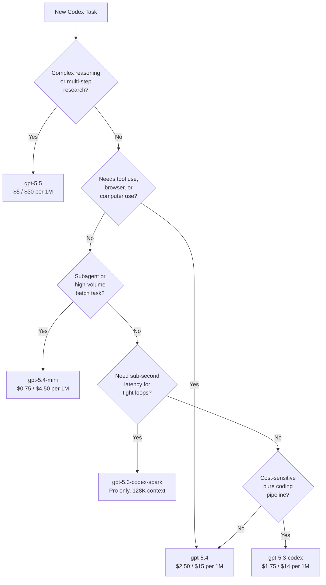

# Codex CLI Model Routing in May 2026: GPT-5.5, GPT-5.4, Codex-Spark, and When to Use Each


---

The model lineup available to Codex CLI developers has changed materially since March 2026. GPT-5.5 arrived in late April as the new frontier[^1], GPT-5.4 brought native computer-use and stronger tool orchestration[^2], GPT-5.4-mini carved out a niche as the purpose-built subagent model[^3], and GPT-5.3-Codex-Spark continues to offer sub-second latency for real-time iteration[^4]. Choosing the right model for each task — and configuring Codex CLI to route automatically — is now a first-class engineering decision. This article maps the current roster, benchmarks, pricing, and practical configuration patterns for May 2026.

## The May 2026 Model Roster

Five models are currently available in Codex CLI, documented at the official models page[^5]. Their capabilities, context windows, and price points differ enough that no single model is optimal for every workflow.

| Model | Context Window | Input / Cached / Output (per 1M tokens) | SWE-Bench Pro | Terminal-Bench 2.0 | Key Strength |
|---|---|---|---|---|---|
| `gpt-5.5` | 1M (922K in + 128K out) | \$5.00 / \$0.50 / \$30.00 | — | 82.7% | Frontier reasoning, research, long-horizon |
| `gpt-5.4` | 1M (272K standard) | \$2.50 / \$0.25 / \$15.00 | 57.7% | — | Tool use, computer use, professional tasks |
| `gpt-5.4-mini` | 400K | \$0.75 / \$0.075 / \$4.50 | 54.4% | 60.0% | Fast subagents, high-volume tasks |
| `gpt-5.3-codex` | 400K | \$1.75 / \$0.175 / \$14.00 | 56.8% | 77.3% | Proven coding workhorse |
| `gpt-5.3-codex-spark` | 128K | Research preview (Pro only) | — | — | Real-time iteration at 1,000+ tok/s |

Note: GPT-5.5 applies a 2x input surcharge beyond 272K tokens[^1]. GPT-5.4 applies the same surcharge beyond its 272K standard window[^6]. GPT-5.3-Codex-Spark is text-only and available exclusively to ChatGPT Pro subscribers[^4].

## Model Profiles in Detail

### GPT-5.5: The New Frontier

Released 23 April 2026, GPT-5.5 is OpenAI's most capable model across reasoning, coding, and agentic tasks[^1]. It holds state-of-the-art results on Terminal-Bench 2.0 (82.7%), OSWorld-Verified (78.7%), and FrontierMath Tier 4 (35.4%)[^1]. In Codex, the official recommendation is to "start with `gpt-5.5` when it appears in your model picker"[^5].

GPT-5.5 is available when authenticating with a ChatGPT account. It is **not** available via API-key authentication at this time[^5].

**Best for:** Complex refactoring across large codebases, multi-step research tasks, long-horizon goal workflows, and sessions requiring deep reasoning.

### GPT-5.4: The Professional Workhorse

GPT-5.4 launched 5 March 2026 as the first mainline model to incorporate GPT-5.3-Codex's frontier coding capabilities directly[^2]. Its distinguishing feature is native computer-use support — the first general-purpose model with state-of-the-art desktop automation, scoring 75% on OSWorld (surpassing the 72.4% human expert baseline)[^2].

**Best for:** Tasks involving tool orchestration, browser interaction, desktop automation, professional document workflows, and coding tasks that benefit from strong tool-calling capabilities.

### GPT-5.4-mini: The Subagent Specialist

Pushed to the API on 17 March 2026, GPT-5.4-mini was explicitly designed for the subagent era[^3]. It scores 54.4% on SWE-Bench Pro whilst being twice as fast as its predecessor and costing roughly 30% of the GPT-5.4 quota in Codex[^3]. For most narrowly-scoped subtasks — searching a codebase, reviewing a single file, processing supporting documents — the quality difference from the full model is negligible.

**Best for:** Subagent delegation, parallel file searches, code review of individual files, batch processing, and any high-volume task where latency and cost matter more than peak reasoning.

### GPT-5.3-Codex: The Proven Specialist

GPT-5.3-Codex (released 5 February 2026) remains a strong choice for pure coding tasks[^7]. At 56.8% on SWE-Bench Pro and 77.3% on Terminal-Bench 2.0, it trades breadth for coding depth — and at \$1.75/\$14.00 per million tokens, it undercuts GPT-5.4 on cost whilst maintaining competitive coding benchmarks[^7].

**Best for:** Pure software engineering tasks where tool-use and computer-use are unnecessary, CI/CD automation via `codex exec`, and cost-sensitive pipelines.

**Deprecation note:** GPT-5.3-Codex is being phased out in favour of newer models[^8]. Plan migration to GPT-5.4 or GPT-5.5 for new projects.

### GPT-5.3-Codex-Spark: Real-Time Iteration

Codex-Spark is the product of OpenAI's partnership with Cerebras, running on the Wafer-Scale Engine 3 at over 1,000 tokens per second[^4]. With a 128K text-only context window and research-preview status, it trades capability for raw speed.

**Best for:** Tight edit-test loops, rapid prototyping, interactive TUI sessions where latency frustration outweighs reasoning depth, and exploratory coding.

## Configuration Patterns

### Setting a Default Model

In `~/.codex/config.toml`:

```toml
model = "gpt-5.5"
```

Or override per session:

```bash
codex --model gpt-5.4 "Refactor the auth module"
```

### Named Profiles for Model Routing

Codex v0.128 expanded profile support with built-in defaults[^9]. Define workflow-specific profiles that select models automatically:

```toml
[profile.deep-work]
model = "gpt-5.5"

[profile.fast-iterate]
model = "gpt-5.3-codex-spark"

[profile.ci-pipeline]
model = "gpt-5.4-mini"
```

Activate a profile from the command line:

```bash
codex --profile deep-work "Analyse this codebase and propose an architecture migration"
codex --profile fast-iterate "Fix the failing test in auth.test.ts"
codex --profile ci-pipeline "Summarise the open bugs in JSON format"
```

### Subagent Model Configuration

Configure subagents to use cheaper, faster models whilst the orchestrator retains the frontier model[^10]:

```toml
model = "gpt-5.5"

[agents]
model = "gpt-5.4-mini"
```

This pattern routes the primary session through GPT-5.5 for planning and coordination, whilst delegated subtasks run on GPT-5.4-mini at roughly one-sixth the cost per output token.

### Mid-Session Model Switching

Use the `/model` slash command to switch models without restarting:

```
/model gpt-5.3-codex-spark
```

This is useful when transitioning from a planning phase (where deeper reasoning helps) to a rapid implementation phase (where speed matters more).

## The Decision Framework



## Cost Comparison: A Practical Example

Consider a typical 30-minute coding session consuming approximately 50K input tokens and 20K output tokens (accounting for prompt caching hitting roughly 60% of input):

| Model | Input Cost | Cached Savings | Output Cost | Total |
|---|---|---|---|---|
| `gpt-5.5` | \$0.25 | -\$0.135 | \$0.60 | **\$0.715** |
| `gpt-5.4` | \$0.125 | -\$0.0675 | \$0.30 | **\$0.358** |
| `gpt-5.4-mini` | \$0.0375 | -\$0.020 | \$0.09 | **\$0.107** |
| `gpt-5.3-codex` | \$0.0875 | -\$0.047 | \$0.28 | **\$0.320** |

Over a team of ten developers each running five sessions daily, the difference between routing everything through GPT-5.5 and routing routine work through GPT-5.4-mini adds up to roughly **\$150/day** — or **\$3,000/month** — in savings.

## The Prompt Caching Advantage

All models in the roster support prompt caching at 90% input cost reduction[^11]. This has significant routing implications:

- **Long sessions** benefit disproportionately from caching, making GPT-5.5's higher base price less painful as the session progresses
- **Repeated `codex exec` invocations** with similar prompts (CI pipelines, batch operations) can achieve 60-80% cache hit rates
- **Subagent spawns** that share the parent session's context inherit cached prefixes

Configure caching behaviour in `config.toml`:

```toml
[model]
prompt_caching = true
```

## Authentication and Model Availability

A critical routing consideration: model availability depends on your authentication method[^5].

| Authentication | GPT-5.5 | GPT-5.4 | GPT-5.4-mini | GPT-5.3-Codex | Spark |
|---|---|---|---|---|---|
| ChatGPT (Plus/Pro) | Yes | Yes | Yes | Yes | Pro only |
| API Key | No | Yes | Yes | Yes | No |

For CI/CD pipelines using API-key authentication, GPT-5.4 is the ceiling. Teams that need GPT-5.5 in automated workflows should evaluate the Codex SDK with ChatGPT authentication or the `codex-action` GitHub Action[^12].

## Deprecation Timeline

GPT-5.3-Codex follows a standard three-month deprecation window from the point a successor reaches general availability[^8]. With GPT-5.4 having launched in March 2026, expect GPT-5.3-Codex to reach end-of-life by June 2026. The `chat-latest` dynamic pointer (currently resolving to GPT-5.5 Instant) provides an alternative for teams that want automatic model upgrades without configuration changes[^13].

## Recommendations

1. **Default to GPT-5.5** for interactive TUI sessions where you authenticate via ChatGPT — it is the recommended starting point[^5]
2. **Use GPT-5.4 as the CI/CD workhorse** — it is the most capable model available via API key and handles tool-calling workflows well
3. **Route subagents to GPT-5.4-mini** — the 30% quota cost and 2x speed make it the clear choice for delegated subtasks[^3]
4. **Reserve Codex-Spark for tight iteration loops** — when latency is the bottleneck, nothing else comes close at 1,000+ tokens per second
5. **Migrate off GPT-5.3-Codex** for new projects — it remains competitive on pure coding benchmarks but faces deprecation
6. **Enable prompt caching everywhere** — the 90% input cost reduction compounds across sessions and is model-agnostic

## Citations

[^1]: [Introducing GPT-5.5 — OpenAI](https://openai.com/index/introducing-gpt-5-5/)
[^2]: [Introducing GPT-5.4 — OpenAI](https://openai.com/index/introducing-gpt-5-4/)
[^3]: [Introducing GPT-5.4 mini and nano — OpenAI](https://openai.com/index/introducing-gpt-5-4-mini-and-nano/)
[^4]: [Introducing GPT-5.3-Codex-Spark — OpenAI](https://openai.com/index/introducing-gpt-5-3-codex-spark/)
[^5]: [Models — Codex — OpenAI Developers](https://developers.openai.com/codex/models)
[^6]: [GPT-5.4 Model — OpenAI API Docs](https://developers.openai.com/api/docs/models/gpt-5.4)
[^7]: [Introducing GPT-5.3-Codex — OpenAI](https://openai.com/index/introducing-gpt-5-3-codex/)
[^8]: [GPT-5.3 Codex: Features, Benchmarks, and Migration Guide — Digital Applied](https://www.digitalapplied.com/blog/gpt-5-3-codex-release-features-benchmarks-guide)
[^9]: [Codex CLI Changelog v0.128.0 — GitHub Releases](https://github.com/openai/codex/releases/tag/rust-v0.128.0)
[^10]: [Subagents — Codex — OpenAI Developers](https://developers.openai.com/codex/subagents)
[^11]: [Pricing — OpenAI API](https://developers.openai.com/api/docs/pricing)
[^12]: [GitHub Action — Codex — OpenAI Developers](https://developers.openai.com/codex/github-action)
[^13]: [GPT-5.5 Instant and chat-latest: Dynamic Model Pointers for Codex CLI Developers — Codex Blog](https://codex.danielvaughan.com/2026/05/06/gpt-5-5-instant-chat-latest-dynamic-model-pointers-codex-cli/)
