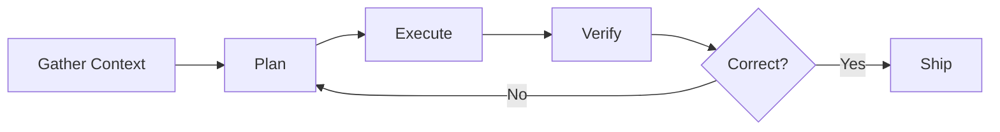
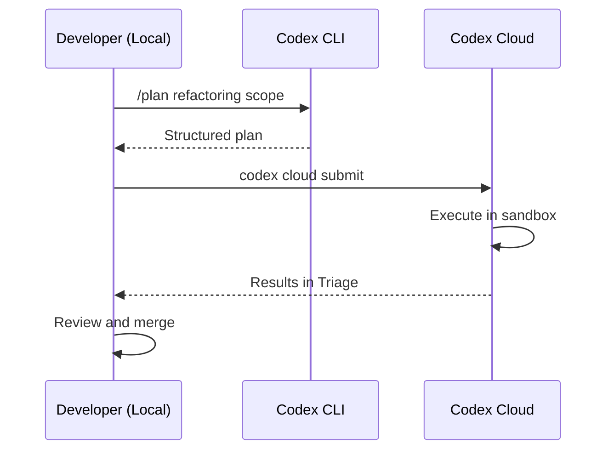
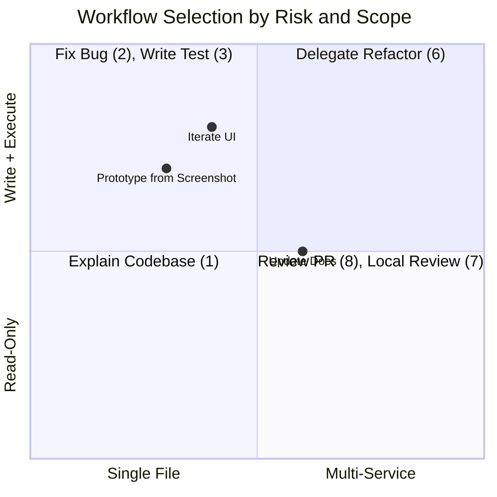

# Codex CLI Official Workflow Recipes: Nine Patterns That Structure the Developer Loop


---

OpenAI's developer documentation now includes a dedicated Workflows page that codifies nine canonical patterns for using Codex CLI across the software development lifecycle [^1]. These are not abstract suggestions — they are concrete, repeatable recipes that map to the slash commands, configuration options, and model capabilities available in Codex CLI v0.128+ [^2]. This article walks through each workflow with the configuration and commands you need to make it work.

## The Underlying Loop

Every workflow shares a common skeleton: gather context, plan the work, execute with sandbox guardrails, verify the result, and ship. OpenAI's best practices documentation formalises this as the four-part prompt structure: **Goal**, **Context**, **Constraints**, and **Done-when** [^3]. The nine workflows below are specialisations of this loop for different stages of development.



## 1. Explain a Codebase

**When to use:** Onboarding to a new project, inheriting a service, or reasoning about an unfamiliar data model or request flow [^1].

This workflow is read-only by design. Start in `read-only` sandbox mode so Codex cannot accidentally modify anything whilst exploring:

```bash
codex --sandbox-mode read-only
```

Inside the session, use `@` file fuzzy search to attach specific files, then ask targeted questions:

```
@src/api/middleware.ts @src/models/user.ts
Explain the authentication flow from request entry to database lookup.
Trace which middleware runs before the User model is instantiated.
```

**Tip:** Pair this with `/plan` mode. Codex will gather context and produce a structured explanation without touching files [^3].

## 2. Fix a Bug

**When to use:** You have a failing test, error trace, or reproducible behaviour to resolve [^1].

The key is giving Codex a tight reproduction loop. Paste the error output directly, reference the failing test file, and define the completion criterion explicitly:

```
@tests/api/test_auth.py
This test fails with "AssertionError: expected 200, got 403".
The regression was introduced after commit abc123.
Fix the bug. Done when `pytest tests/api/test_auth.py` passes.
```

Codex will iterate — running the test, reading the traceback, editing code, and re-running — until the test passes or it requests guidance. This is the workflow where `workspace-write` sandbox mode with `on-request` approval earns its keep [^4]:

```toml
# .codex/config.toml
sandbox_mode = "workspace-write"
approval_policy = "on-request"
```

## 3. Write a Test

**When to use:** You need unit or integration tests for a function, module, or endpoint [^1].

Effective test generation requires Codex to see both the implementation and any existing test conventions. Reference both:

```
@src/billing/invoice.py @tests/billing/test_charges.py
Write unit tests for the `calculate_pro_rata` function.
Follow the same fixtures and assertion patterns as test_charges.py.
Done when all new tests pass and coverage for invoice.py exceeds 80%.
```

The over-mocking problem is real — agent-generated tests often mock too aggressively, producing tests that pass but verify nothing [^5]. Counter this by specifying constraints: "Use real database fixtures, not mocks, for integration paths."

## 4. Prototype from a Screenshot

**When to use:** You have a design mock or reference screenshot and need a working implementation [^1].

Codex accepts image input via the `-i` flag [^6]:

```bash
codex -i design-mock.png "Implement this login form using React and Tailwind CSS. Match the spacing, colours, and typography as closely as possible."
```

This workflow benefits from higher reasoning effort. In `config.toml` or via `/model`, select a model with strong visual capabilities:

```toml
model = "gpt-5.5"
```

GPT-5.5 achieves 82.7% on Terminal-Bench 2.0 and is OpenAI's recommended choice for implementation tasks [^7].

## 5. Iterate on UI with Live Updates

**When to use:** You are running a dev server and want rapid visual refinement [^1].

Start your development server in a background terminal, then iterate within the same Codex session. Codex can observe the running process via the `/ps` command [^6]:

```
Start the Next.js dev server on port 3000.
Then adjust the header component: reduce padding to 12px,
change the background to #1a1a2e, and make the navigation
links 14px semibold.
```

Each edit triggers a hot reload. If you have browser-use capability enabled (available in the Codex app), Codex can verify its changes visually [^8].

## 6. Delegate Refactor to Cloud

**When to use:** A large refactoring task that should run in a cloud environment whilst you continue working locally [^1].

This is a two-phase workflow. First, plan locally:

```
/plan
Refactor the payment module from callbacks to async/await.
Scope: src/payments/*.ts (12 files).
Constraints: maintain all existing test assertions.
Do not change the public API surface.
```

Once the plan is approved, submit to Codex cloud [^9]:

```bash
codex cloud submit --prompt "Execute the refactoring plan in PLANS.md" \
  --project ./payment-service
```

The cloud environment runs with its own sandbox, and results appear in your Triage queue for review.



## 7. Do a Local Code Review

**When to use:** You want a second pair of eyes on uncommitted changes before committing [^1].

The `/review` slash command is purpose-built for this [^6]:

```
/review
```

By default, it reviews uncommitted working-tree changes. You can also target a specific base branch:

```
/review --base main
```

Or review only staged changes:

```
/review --staged
```

Codex operates in a read-only reviewer mode — it does not modify your working tree. It produces structured feedback covering correctness, style, security concerns, and test coverage gaps [^1]. For teams, combine this with the auto-review subagent for automated approval decisions [^10]:

```toml
approval_policy = "on-request"
approvals_reviewer = "auto_review"
```

## 8. Review a GitHub Pull Request

**When to use:** A PR needs review and you do not want to check it out locally [^1].

Tag `@codex` in a PR comment, and Codex reviews the diff directly on GitHub. This integrates through the Codex GitHub app or via the CLI with the `gh` tool:

```bash
codex exec "Review the PR at https://github.com/org/repo/pull/42. \
Focus on security implications of the new authentication middleware. \
Comment inline on any concerns."
```

For CI integration, `codex exec --json` now reports reasoning-token usage alongside input and output tokens, making it straightforward to track review costs programmatically [^2]:

```json
{
  "input_tokens": 12450,
  "cached_input_tokens": 8200,
  "output_tokens": 3100,
  "reasoning_output_tokens": 1800
}
```

## 9. Update Documentation

**When to use:** Documentation has drifted from the implementation, or you need to add docs for new features [^1].

This workflow requires both code context and documentation context:

```
@src/api/routes/*.ts @docs/api-reference.md
The API reference is out of date. Compare the route handlers
with the documented endpoints. Update docs/api-reference.md
to reflect the current implementation. Verify all URLs are valid.
Done when the doc accurately describes every public endpoint.
```

Documentation workflows pair well with hooks. A `PostToolUse` hook can validate that modified Markdown files pass a linter [^11]:

```toml
[[hooks.PostToolUse]]
matcher = "^apply_patch$"

[[hooks.PostToolUse.hooks]]
type = "command"
command = 'markdownlint docs/'
timeout = 15
statusMessage = "Linting documentation"
```

## Configuration Profiles for Workflows

Rather than reconfiguring for each workflow, define named profiles in `config.toml` and switch with `codex --profile <name>` [^12]:

```toml
[profiles.explore]
sandbox_mode = "read-only"
model = "gpt-5.5"

[profiles.fix]
sandbox_mode = "workspace-write"
approval_policy = "on-request"
model = "gpt-5.5"

[profiles.review]
sandbox_mode = "read-only"
approval_policy = "never"
approvals_reviewer = "auto_review"
model = "gpt-5.4"

[profiles.fast]
sandbox_mode = "workspace-write"
approval_policy = "on-request"
model = "gpt-5.3-codex-spark"
```

The `explore` profile maps to workflows 1 (Explain) and 9 (Docs). The `fix` profile suits workflows 2 (Bug Fix), 3 (Tests), 4 (Prototype), and 5 (UI iteration). The `review` profile covers workflows 7 and 8. The `fast` profile uses Codex-Spark at over 1,000 tokens per second for rapid iteration tasks [^13].

## The Workflow Decision Framework

Choosing the right workflow depends on two axes: **risk level** (read-only vs write) and **scope** (single file vs multi-file/multi-service).



## Sequencing Workflows in Practice

A realistic development session chains several workflows. A typical bug-fix cycle:

1. **Explain** (`/plan` mode) — understand the failing area
2. **Fix** — implement the repair with test verification
3. **Write Test** — add regression coverage
4. **Local Review** (`/review`) — self-review before pushing
5. **PR Review** — request Codex review on the PR

Each step uses the same session context. Use `/fork` when branching to exploratory work, and `/side` for quick tangential questions that should not pollute the main thread [^6].

## Key Takeaways

- The nine workflows are not prescriptive — they are composable building blocks.
- Named profiles eliminate configuration friction when switching between workflows.
- Plan mode (`/plan` or Shift+Tab) should precede any multi-file or ambiguous task [^3].
- The four-part prompt structure (Goal, Context, Constraints, Done-when) applies universally.
- Use `/review` as a habit before every commit, not just for formal reviews.

The workflows page represents OpenAI's opinionated answer to a question most Codex users eventually ask: "What should I actually use this for?" The answer is structured, repeatable loops — not one-off prompts.

## Citations

[^1]: [Workflows - Codex | OpenAI Developers](https://developers.openai.com/codex/workflows)
[^2]: [Changelog - Codex | OpenAI Developers](https://developers.openai.com/codex/changelog)
[^3]: [Best Practices - Codex | OpenAI Developers](https://developers.openai.com/codex/learn/best-practices)
[^4]: [Agent Approvals & Security - Codex | OpenAI Developers](https://developers.openai.com/codex/agent-approvals-security)
[^5]: [Over-Mocked Tests: Agent-Generated Test Quality](https://codex.danielvaughan.com/2026/05/02/over-mocked-tests-agent-generated-test-quality-codex-cli-realistic-testing/) - Codex Blog, 2 May 2026
[^6]: [Features - Codex CLI | OpenAI Developers](https://developers.openai.com/codex/cli/features)
[^7]: [Introducing GPT-5.5 | OpenAI](https://openai.com/index/introducing-gpt-5-5/)
[^8]: [In-app Browser - Codex App | OpenAI Developers](https://developers.openai.com/codex/app/browser)
[^9]: [Codex CLI vs Codex Cloud: When to Use Each](https://codex.danielvaughan.com/2026/04/18/codex-cli-vs-codex-cloud-when-to-use-each/) - Codex Blog, 18 April 2026
[^10]: [Codex CLI Granular Approval Policies and the Auto-Review Subagent](https://codex.danielvaughan.com/2026/05/07/codex-cli-granular-approval-policies-auto-review-subagent-autonomous-secure-workflows/) - Codex Blog, 7 May 2026
[^11]: [Hooks - Codex | OpenAI Developers](https://developers.openai.com/codex/hooks)
[^12]: [Configuration Reference - Codex | OpenAI Developers](https://developers.openai.com/codex/config-reference)
[^13]: [Introducing GPT-5.3-Codex-Spark | OpenAI](https://openai.com/index/introducing-gpt-5-3-codex-spark/)
