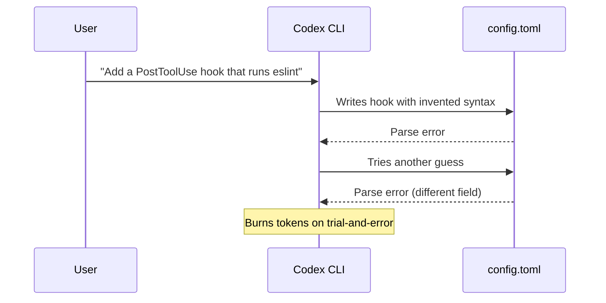
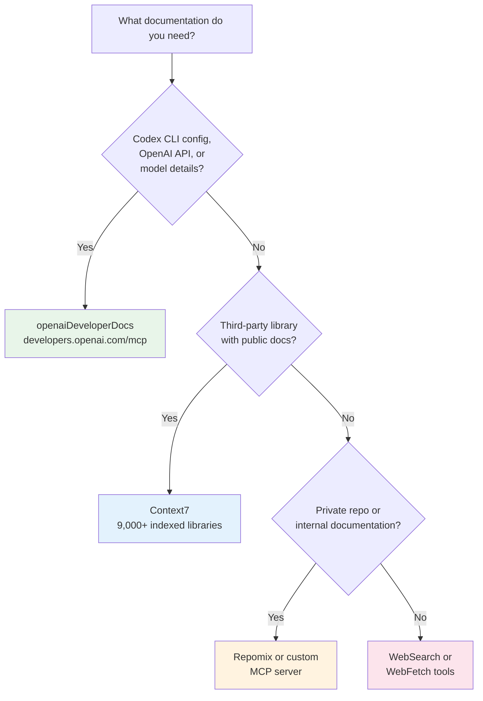

# The OpenAI Developer Docs MCP Server: Giving Codex CLI Live Access to Its Own Documentation


---

## Introduction

Documentation MCP servers have become essential infrastructure for coding agents. Context7 indexes thousands of third-party libraries; Repomix serves private repository documentation on demand. But there is one documentation source that matters more than any other when you are configuring Codex CLI itself: **OpenAI's own developer documentation**.

Since April 2026, OpenAI has published a dedicated MCP server at `https://developers.openai.com/mcp` that exposes the full OpenAI developer documentation — including Codex CLI configuration, API references, model specifications, and best-practice guides — as queryable tools[^1]. This creates a self-referential loop: Codex CLI can consult its own documentation in real time, verify configuration syntax before applying it, and answer questions about its own capabilities without relying on stale training data.

This article covers setup, integration with the skills system, practical AGENTS.md patterns, and cross-editor configuration for teams that use Codex CLI alongside VS Code or Cursor.

---

## Why Self-Referential Documentation Matters

Codex CLI's configuration surface has grown substantially. Between v0.115 and v0.128, the project introduced split permissions[^2], named profiles, hook lifecycle events, custom subagent definitions, structured output schemas for `codex exec`, and the skills system itself[^3]. The pace of change means that even recent model training data lags reality.

Without live documentation access, a common failure mode looks like this:



With the Docs MCP server connected, the agent queries the configuration reference before writing, gets the correct schema on the first attempt, and avoids the guess-and-retry loop entirely.

---

## Setup

### One-Command Registration

The fastest path uses `codex mcp add` with the streamable HTTP transport:

```bash
codex mcp add openaiDeveloperDocs --url https://developers.openai.com/mcp
```

This writes the server entry into your global `~/.codex/config.toml`[^4]. For project-scoped configuration — recommended when you want the entire team to benefit — add it to `.codex/config.toml` at the repository root instead:

```toml
# .codex/config.toml
[mcp_servers.openaiDeveloperDocs]
url = "https://developers.openai.com/mcp"
```

No API key is required. The server uses streamable HTTP transport, which means no local process to manage and no `npx` dependency — a significant operational advantage over stdio-based MCP servers like Context7[^5].

### Verifying the Connection

After adding the server, start a new Codex CLI session and confirm the tools are available:

```
codex "List the tools available from the openaiDeveloperDocs MCP server"
```

The server exposes tools for searching and reading OpenAI documentation pages. The agent can query for specific topics (e.g. "hook lifecycle events") and receive current, authoritative content.

---

## Integration with the Skills System

Codex CLI's skills system provides progressive disclosure of capabilities through SKILL.md files[^3]. The built-in `$openai-docs` skill — bundled with Codex CLI since v0.120 — automatically declares a dependency on the Docs MCP server.

### How Skill Dependencies Work

When a skill declares an MCP dependency in its `agents/openai.yaml` file, Codex CLI ensures the server is available before activating the skill[^3]:

```yaml
# agents/openai.yaml — dependency declaration
dependencies:
  tools:
    - type: "mcp"
      value: "openaiDeveloperDocs"
      description: "OpenAI Docs MCP server"
      transport: "streamable_http"
      url: "https://developers.openai.com/mcp"
```

If the MCP server is not configured in the user's `config.toml`, the skill can still activate — but the dependency declaration signals to the user (and to skill installers like `$skill-installer`) that adding the server will improve the skill's effectiveness.

### Building Custom Skills That Reference OpenAI Docs

Any custom skill that helps with Codex CLI configuration should declare this dependency. For example, a "config auditor" skill that reviews and improves `config.toml` files:

```markdown
<!-- SKILL.md -->
# Config Auditor

Reviews Codex CLI configuration files for correctness, security,
and best-practice alignment.

## When to use
- User asks to review or improve their config.toml
- User reports configuration errors
- User wants to set up a new permission profile

## Approach
1. Read the user's config.toml
2. Query the OpenAI Docs MCP server for the current configuration reference
3. Compare the user's config against the documented schema
4. Suggest corrections and improvements with citations
```

The skill's `agents/openai.yaml` would declare the MCP dependency as shown above, ensuring the documentation lookup is always available.

---

## AGENTS.md Patterns for Automatic Documentation Lookup

The most practical use of the Docs MCP server is in AGENTS.md instructions that direct Codex CLI to consult documentation before making configuration changes. Three patterns have emerged as particularly effective.

### Pattern 1: Verify Before You Write

```markdown
<!-- AGENTS.md -->
## Configuration Changes

When modifying any Codex CLI configuration file (.codex/config.toml,
AGENTS.md, or skill files):
1. Query the openaiDeveloperDocs MCP server for the relevant
   configuration reference page
2. Verify that all keys and values match the current documented schema
3. Apply the change
4. Cite the documentation page that confirms the syntax
```

This eliminates the trial-and-error loop for configuration changes and produces self-documenting commits — each change references the authoritative source.

### Pattern 2: Self-Updating Onboarding

```markdown
<!-- AGENTS.md -->
## New Developer Setup

When a developer asks "how do I configure Codex CLI for this project":
1. Query openaiDeveloperDocs for the latest setup guide
2. Cross-reference with this project's .codex/config.toml
3. Produce step-by-step instructions using current CLI syntax
4. Include links to the relevant documentation pages
```

This pattern ensures that onboarding instructions stay current even as Codex CLI evolves — the agent fetches the latest documentation rather than relying on potentially outdated README content.

### Pattern 3: Capability Discovery

```markdown
<!-- AGENTS.md -->
## Feature Exploration

When the user asks "can Codex CLI do X?" or "is there a way to...":
1. Search openaiDeveloperDocs for the relevant feature
2. If the feature exists, explain it with the current syntax
3. If the feature does not exist, say so clearly
4. Never invent configuration keys or CLI flags
```

This is arguably the highest-value pattern. It converts Codex CLI from a tool that knows what it knew at training time into one that knows what it can do *right now*.

---

## Cross-Editor Configuration

Teams rarely use Codex CLI in isolation. The same Docs MCP server works across editors that support MCP, ensuring consistent documentation access regardless of the developer's preferred environment.

### VS Code

```json
// .vscode/mcp.json
{
  "servers": {
    "openaiDeveloperDocs": {
      "type": "http",
      "url": "https://developers.openai.com/mcp"
    }
  }
}
```

### Cursor

Cursor's MCP configuration accepts the same format. Add the server through Cursor Settings → MCP Servers, or place an equivalent JSON configuration in `.cursor/mcp.json`[^1].

### Windsurf and Other MCP Clients

Any MCP-compatible client can connect to the server using the streamable HTTP URL. No client-specific adapters are needed — the transport is standardised[^6].

Committing the `.vscode/mcp.json` alongside `.codex/config.toml` ensures that every team member gets documentation access regardless of their editor choice.

---

## Decision Framework: When to Use Which Documentation MCP Server



The servers are complementary, not competing. A well-configured project uses all three — OpenAI Docs for Codex CLI itself, Context7 for third-party libraries, and Repomix for internal code:

```toml
# .codex/config.toml — full documentation stack
[mcp_servers.openaiDeveloperDocs]
url = "https://developers.openai.com/mcp"

[mcp_servers.context7]
command = "npx"
args = ["-y", "@upstash/context7-mcp"]

[mcp_servers.repomix]
command = "npx"
args = ["-y", "repomix", "--mcp"]
```

---

## Limitations and Caveats

**Coverage scope.** The Docs MCP server covers OpenAI developer documentation — Codex CLI, the API, models, and guides. It does not index community content, GitHub issues, or third-party tutorials. For community-sourced troubleshooting, web search remains necessary.

**Latency.** HTTP-transported MCP calls add network latency compared to locally-running stdio servers. In practice, the latency is comparable to a standard API call and rarely noticeable during interactive sessions. For CI pipelines running `codex exec` at high volume, consider whether the documentation lookups are worth the per-task overhead.

**No write access.** The server is read-only — the agent can query documentation but cannot submit feedback or corrections. If the agent encounters documentation that appears outdated, it should flag this to the user rather than silently working around it.

---

## Practical Takeaways

1. **Add the server to every project.** The one-line `config.toml` entry costs nothing and prevents configuration guesswork across the team.

2. **Use AGENTS.md to enforce documentation-first configuration changes.** The "verify before you write" pattern eliminates trial-and-error loops for config.toml modifications.

3. **Declare the MCP dependency in custom skills.** Any skill that touches Codex CLI configuration should include the `openaiDeveloperDocs` dependency in its `agents/openai.yaml`.

4. **Commit cross-editor MCP configuration.** A `.vscode/mcp.json` alongside `.codex/config.toml` ensures consistent documentation access for the whole team.

5. **Stack documentation servers.** OpenAI Docs, Context7, and Repomix serve different purposes. Use all three for comprehensive coverage.

---

## Citations

[^1]: [Set up the Docs MCP Server — OpenAI Developers](https://developers.openai.com/learn/docs-mcp)

[^2]: [Configuration Reference — Codex | OpenAI Developers](https://developers.openai.com/codex/config-reference)

[^3]: [Skills — Codex | OpenAI Developers](https://developers.openai.com/codex/concepts/skills)

[^4]: [Command line options — Codex CLI | OpenAI Developers](https://developers.openai.com/codex/cli/reference)

[^5]: [MCP — Codex | OpenAI Developers](https://developers.openai.com/codex/concepts/mcp)

[^6]: [Model Context Protocol — Specification](https://spec.modelcontextprotocol.io/specification/2025-03-26/basic/transports/)
