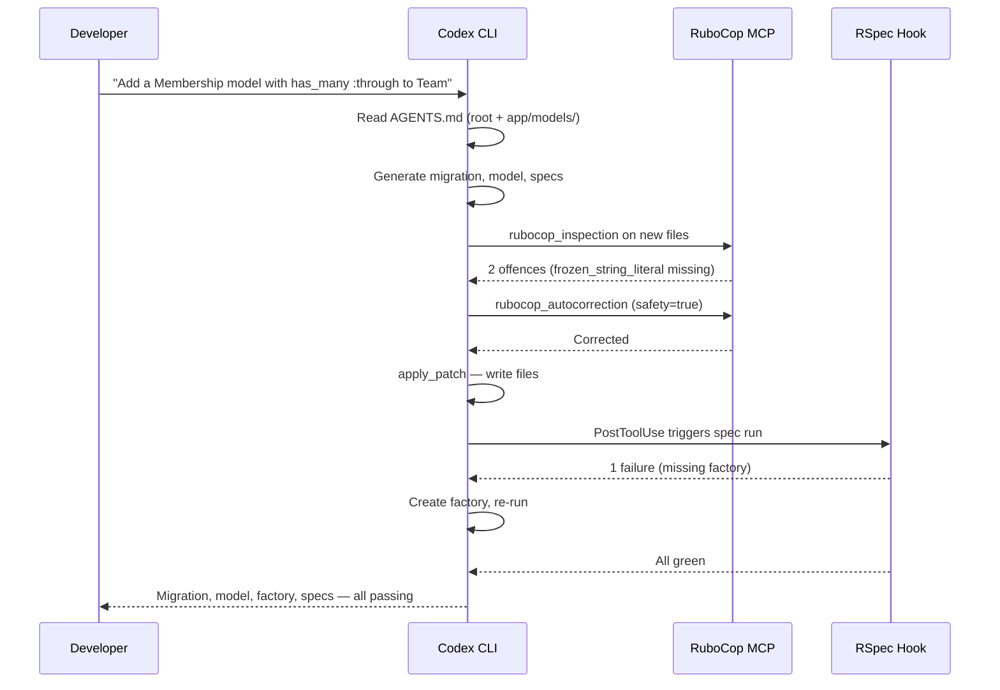

# Codex CLI for Ruby on Rails Teams: RuboCop MCP, RSpec Workflows, and Convention-Friendly AGENTS.md Patterns


---

Rails has always been opinionated about structure. Models live in `app/models/`, controllers in `app/controllers/`, views in `app/views/`. That predictability — the same convention-over-configuration philosophy that made Rails productive for humans — turns out to be equally valuable for AI coding agents[^1]. When Codex CLI drops into a Rails repository, the consistent naming, the MVC boundaries, and the standardised file layout give the agent a head start that less conventional frameworks cannot match.

This article covers the practical setup for running Codex CLI against a Rails codebase: writing an AGENTS.md that exploits Rails conventions, wiring RuboCop's built-in MCP server for live linting, configuring hooks for RSpec verification, and structuring profiles that match how Rails teams actually work.

## Why Rails and Codex CLI Fit Together

Rails 8's strengthened conventions — Solid Queue replacing Sidekiq as the default queue, built-in authentication, Active Storage for uploads — reduce the number of external dependencies an agent needs to reason about[^1]. The Enumerable-heavy Ruby idiom (`map`, `select`, `inject`) gives the model a narrow surface area of collection patterns to learn once and reuse everywhere[^1]. And RuboCop, which virtually every production Rails team runs, now ships a built-in MCP server that Codex CLI can connect to directly[^2].

The result is a toolchain where the agent writes code, the linter catches style violations in-session, and RSpec confirms behaviour — all without leaving the Codex CLI loop.

## AGENTS.md for Rails Projects

The Rails framework itself now ships an AGENTS.md in its repository root, authored by Rafael França as a guide for AI agents contributing to the monorepo[^3]. For application teams, the pattern is the same but scoped to your domain.

### Root-Level AGENTS.md

```markdown
# AGENTS.md

## Project Overview
Ruby on Rails 8.x application. Ruby 3.4. PostgreSQL 17. Redis for caching and Action Cable.

## Architecture
Standard Rails MVC with Hotwire (Turbo + Stimulus). API namespace under `app/controllers/api/v1/`.
Background jobs via Solid Queue. File uploads via Active Storage (S3 backend).

## Coding Standards
- Follow RuboCop defaults. Run `bundle exec rubocop` before committing.
- Use `frozen_string_literal: true` in every Ruby file.
- Prefer `assert_not` over `refute` in Minitest; prefer `eq(exact_value)` over `be_truthy` in RSpec.
- Controllers: thin. Push logic into models or service objects under `app/services/`.
- Database migrations: always reversible. Include `safety_assured` blocks for strong_migrations checks.

## Testing
- RSpec for application specs. Run with `bundle exec rspec`.
- Factory Bot for fixtures. Factories live in `spec/factories/`.
- Request specs preferred over controller specs.
- Feature specs use Capybara with Playwright driver.

## File Map
- `app/services/` — domain logic extracted from controllers
- `app/queries/` — complex Active Record scopes
- `lib/tasks/` — Rake tasks
- `config/initializers/` — boot-time configuration
```

### Directory-Scoped AGENTS.md

Codex CLI reads the nearest AGENTS.md relative to the files being edited, with local files overriding the root[^4]. For a Rails monolith with distinct domains, drop targeted instructions into subdirectories:

```markdown
# app/services/payments/AGENTS.md

## Payment Services
All classes inherit from `Payments::BaseService`. Must handle `Stripe::StripeError`
and log to `Rails.logger.tagged("payments")`. Never store raw card numbers.
Integration tests hit Stripe's test-mode API — run with `STRIPE_TEST=1 bundle exec rspec spec/services/payments/`.
```

This layering exploits Rails' directory conventions. The agent editing a payment service inherits global style rules from the root AGENTS.md and domain-specific constraints from the payments directory[^4].

## RuboCop MCP Server: Live Linting in the Agent Loop

RuboCop 1.85 introduced a built-in MCP server that exposes two tools: `rubocop_inspection` (analyse code for violations) and `rubocop_autocorrection` (apply safe fixes)[^2]. This means Codex CLI can lint Ruby code without shelling out to a separate process on every edit.

### Configuration

Add the RuboCop MCP server to your project-scoped `config.toml`:

```toml
# .codex/config.toml

[[mcp_servers]]
name = "rubocop"
type = "stdio"
command = "bundle"
args = ["exec", "rubocop", "--mcp"]
cwd = "."
```

The `mcp` gem must be in your Gemfile[^2]:

```ruby
# Gemfile
group :development do
  gem "mcp", "~> 0.6"
end
```

After `bundle install`, Codex CLI picks up the server on session start. The agent can now call `rubocop_inspection` to check a file and `rubocop_autocorrection` to fix violations — all within the same turn, before you ever see the diff.

### Safety Modes

The `rubocop_autocorrection` tool accepts a `safety` boolean parameter. When `true` (the default), only safe corrections are applied. Setting it to `false` permits riskier transformations — useful for bulk style migrations but not recommended during feature work[^2]. Encode this preference in your AGENTS.md:

```markdown
## RuboCop
- Always run rubocop_inspection after editing Ruby files.
- Use rubocop_autocorrection with safety=true only. Never apply unsafe corrections without human review.
```

## RSpec Verification with PostToolUse Hooks

RuboCop catches style violations, but you also want the agent to run relevant specs after making changes. A PostToolUse hook can trigger RSpec automatically whenever Codex CLI modifies a Ruby file[^5][^6].

### Hook Configuration

```json
{
  "hooks": {
    "PostToolUse": [
      {
        "command": "node /path/to/rspec-runner.mjs --post"
      }
    ]
  }
}
```

### Hook Script

The hook script reads the tool output from stdin, checks whether any `.rb` files were modified, and runs the corresponding specs:

```javascript
// rspec-runner.mjs
import { readFileSync } from "fs";
import { execSync } from "child_process";

const input = JSON.parse(readFileSync("/dev/stdin", "utf-8"));

// Only trigger after file edits, not after shell commands
if (input.tool_name !== "apply_patch") {
  process.stdout.write(JSON.stringify({}));
  process.exit(0);
}

// Extract modified file paths
const files = (input.output || "")
  .split("\n")
  .filter(line => line.match(/^[+-]{3} [ab]\/.*\.rb$/))
  .map(line => line.replace(/^[+-]{3} [ab]\//, ""));

if (files.length === 0) {
  process.stdout.write(JSON.stringify({}));
  process.exit(0);
}

// Map source files to spec files
const specFiles = files
  .map(f => f.replace(/^app\//, "spec/").replace(/\.rb$/, "_spec.rb"))
  .filter(f => {
    try { return require("fs").statSync(f).isFile(); }
    catch { return false; }
  });

if (specFiles.length > 0) {
  try {
    execSync(`bundle exec rspec ${specFiles.join(" ")} --format progress`, {
      stdio: "pipe", timeout: 60000
    });
    process.stdout.write(JSON.stringify({
      systemMessage: `RSpec passed for ${specFiles.length} spec(s).`
    }));
  } catch (err) {
    process.stdout.write(JSON.stringify({
      systemMessage: `RSpec failed:\n${err.stdout?.toString().slice(-500)}`,
      stopReason: "rspec_failure"
    }));
  }
} else {
  process.stdout.write(JSON.stringify({}));
}
```

When a spec fails, the hook sends a `stopReason` back to Codex CLI, halting the agent and surfacing the failure message. The agent can then read the error and attempt a fix — a tight red-green loop driven entirely by the tool[^5].

⚠️ Note: as of v0.128, PostToolUse hooks fire reliably for shell commands and `apply_patch` file edits, but coverage for MCP tool calls remains incomplete[^6]. Test your hook configuration locally before relying on it in CI.

## Prefix Rules for Rails Commands

Rails teams repeatedly run the same commands: `bundle exec rspec`, `bundle exec rubocop`, `rails db:migrate`, `rails console`. Without execution policy rules, Codex CLI prompts for approval on every invocation. Define prefix rules to eliminate the fatigue[^7]:

```python
# .codex/rules/rails.rules

prefix_rule(
    pattern = ["bundle", "exec", ["rspec", "rubocop", "rails"]],
    decision = "allow",
    justification = "Standard Rails toolchain commands"
)

prefix_rule(
    pattern = ["rails", ["db:migrate", "db:rollback", "db:seed"]],
    decision = "prompt",
    justification = "Database mutations require human confirmation"
)

prefix_rule(
    pattern = ["rails", "console"],
    decision = "forbidden",
    justification = "Interactive console not supported in agent context"
)
```

The precedence model is strict: `forbidden` overrides `prompt`, which overrides `allow`[^7]. This means `rails console` is always blocked even if a broader rule allows `rails` subcommands.

## Configuration Profiles for Rails Workflows

Different Rails tasks demand different model configurations. A profile for quick RSpec runs should optimise for speed; a profile for complex refactoring should maximise reasoning depth[^8].

```toml
# ~/.codex/config.toml

[profiles.rails-quick]
model = "gpt-5.4-mini"
model_reasoning_effort = "low"

[profiles.rails-deep]
model = "gpt-5.5"
model_reasoning_effort = "high"

[profiles.rails-review]
model = "gpt-5.4"
model_reasoning_effort = "medium"
```

Launch with the appropriate profile:

```bash
# Quick spec generation
codex --profile rails-quick "Add request specs for the UsersController#update action"

# Deep refactoring
codex --profile rails-deep "Extract the payment logic from OrdersController into a PaymentService"

# Code review
codex --profile rails-review
/review Focus on N+1 queries and missing index coverage
```

## Practical Workflow: Feature Development

Bringing it all together, a typical feature development session looks like this:



The developer issues a single prompt. The agent handles the round trips — linting, fixing, testing, fixing again — and surfaces a clean result. The AGENTS.md constrains style, the RuboCop MCP enforces it, and the RSpec hook verifies behaviour.

## What to Watch

Rails' convention-over-configuration philosophy aligns well with agent-driven development, but there are edges to be aware of:

- **Strong Migrations**: If your team uses `strong_migrations`, add a PostToolUse hook or AGENTS.md instruction to run `bundle exec rails db:migrate` in a dry-run mode before accepting migration files.
- **Hotwire/Stimulus**: Codex CLI handles ERB and Stimulus controllers reasonably well, but complex Turbo Frame interactions benefit from explicit AGENTS.md instructions describing the expected request/response cycle.
- **RuboCop extensions**: If you use `rubocop-rails`, `rubocop-rspec`, or `rubocop-performance`, ensure they are loaded in your `.rubocop.yml` — the MCP server respects the same configuration file[^2].

Rails teams already have the conventions. The work is in making those conventions machine-readable — and with AGENTS.md, RuboCop MCP, and PostToolUse hooks, the gap is narrower than you might expect.

## Citations

[^1]: Katsikanis, N. "Harnessing Rails for AI-Friendly, Testable Code." [https://nikoskatsikanis.com/blog/4-harnessing-rails-for-ai-friendly-testable-code/](https://nikoskatsikanis.com/blog/4-harnessing-rails-for-ai-friendly-testable-code/)
[^2]: RuboCop Documentation. "MCP (Model Context Protocol)." [https://docs.rubocop.org/rubocop/latest/usage/mcp.html](https://docs.rubocop.org/rubocop/latest/usage/mcp.html)
[^3]: Rails/Rails PR #55991. "Add AGENTS.md with Rails codebase guide for AI coding agents." [https://github.com/rails/rails/pull/55991](https://github.com/rails/rails/pull/55991)
[^4]: OpenAI. "Custom instructions with AGENTS.md — Codex." [https://developers.openai.com/codex/guides/agents-md](https://developers.openai.com/codex/guides/agents-md)
[^5]: OpenAI. "Hooks — Codex." [https://developers.openai.com/codex/hooks](https://developers.openai.com/codex/hooks)
[^6]: Agentic Control Plane. "Codex CLI hook governance: what works today (and what doesn't)." [https://agenticcontrolplane.com/blog/codex-cli-hooks-reference](https://agenticcontrolplane.com/blog/codex-cli-hooks-reference)
[^7]: OpenAI. "Rules — Codex." [https://developers.openai.com/codex/rules](https://developers.openai.com/codex/rules)
[^8]: OpenAI. "Advanced Configuration — Codex." [https://developers.openai.com/codex/config-advanced](https://developers.openai.com/codex/config-advanced)
