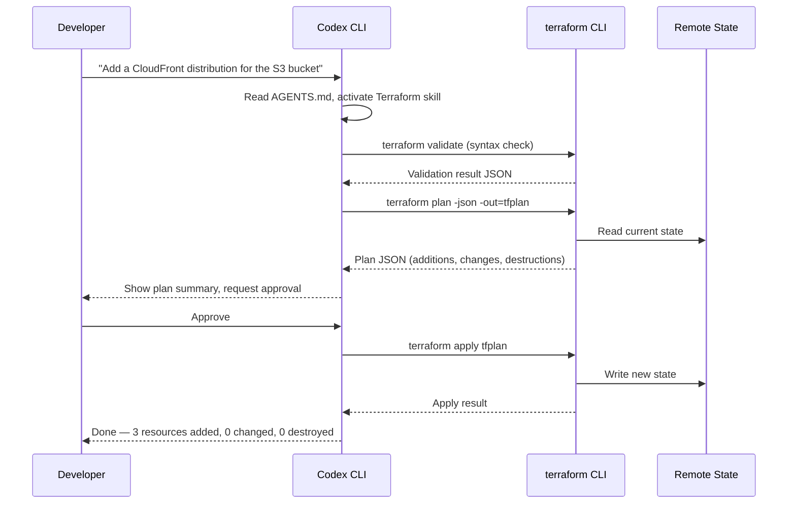
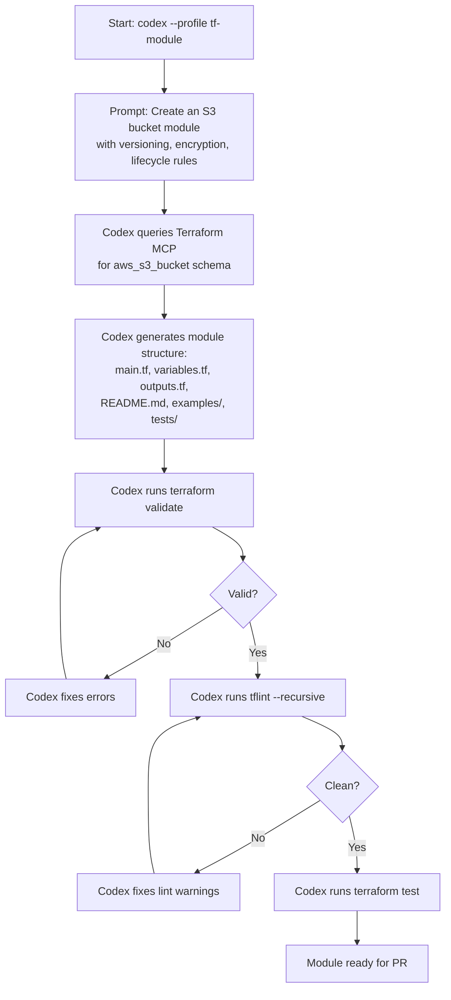

# Codex CLI for Terraform and OpenTofu Teams: MCP Servers, Safety Hooks, and AGENTS.md Patterns for Infrastructure as Code


---

Infrastructure as code occupies an unusual position in the AI-assisted coding landscape. The blast radius of a bad change is not a failing test or a broken UI — it is a misconfigured security group, a deleted database, or a billing spike that compounds by the hour. That asymmetry makes IaC teams the most cautious adopters of coding agents, and rightly so. Yet Terraform's `-json` output, its explicit plan-then-apply lifecycle, and its declarative HCL syntax make it one of the most agent-friendly toolchains available[^1]. This article shows how to configure Codex CLI as a safe, productive partner for Terraform and OpenTofu workflows using the official MCP server, lifecycle hooks, AGENTS.md layering, and the community Terraform skill.

## Why Terraform Is Agent-Friendly

Terraform's plan-apply separation maps directly onto the plan-review-execute loop that Codex CLI encourages[^2]. Every `terraform plan` produces a machine-readable JSON change set. Every `terraform validate` returns structured diagnostics. Every provider publishes a typed schema. These properties give an agent far more to work with than a raw imperative script.



OpenTofu follows the same pattern — same HCL syntax, same provider ecosystem, same state format — differing only in the binary name (`tofu` vs `terraform`)[^3]. Everything in this article applies equally to both.

## The HashiCorp Terraform MCP Server

HashiCorp ships an official MCP server that gives Codex CLI real-time access to the Terraform Registry[^4]. It provides tools for searching provider documentation, retrieving module inputs and outputs, finding Sentinel policies, and listing HCP Terraform workspaces. The server supports both stdio and Streamable HTTP transports[^5].

### Registration

Add the server to your project-scoped `config.toml`:

```toml
[mcp_servers.terraform]
command = "npx"
args    = ["-y", "@hashicorp/terraform-mcp-server"]
```

Or for a Streamable HTTP deployment shared across a team:

```toml
[mcp_servers.terraform]
url = "http://localhost:8080/mcp"
```

### What It Unlocks

With the MCP server active, Codex can look up the correct resource arguments for any provider without hallucinating attribute names. Ask it to "create an `aws_cloudfront_distribution` with an S3 origin" and it will query the registry for the current `aws` provider schema rather than relying on training data that may reference deprecated arguments[^4].

Restrict the tool surface if you want tighter control:

```toml
[mcp_servers.terraform]
command      = "npx"
args         = ["-y", "@hashicorp/terraform-mcp-server"]
allowed_tools = ["resolveProviderDocID", "getProviderDocs", "resolveModuleDocID", "getModuleDocs"]
```

This keeps workspace management tools out of the agent's reach whilst still providing documentation access[^6].

## The Community Terraform Skill

Anton Babenko's `terraform-skill` packages Terraform and OpenTofu best practices into the SKILL.md format that Codex auto-discovers[^7]. It covers module naming conventions (`terraform-<PROVIDER>-<NAME>`), testing strategy decision matrices, state management patterns, and CI/CD integration templates.

### Installation

```bash
git clone https://github.com/antonbabenko/terraform-skill.git \
  ~/.agents/skills/terraform-skill
```

Codex discovers it automatically from `~/.agents/skills/`[^7]. The skill activates when it detects `.tf` files in the working directory. It enforces patterns drawn from `terraform-best-practices.com` and the `terraform-aws-modules` collection.

## AGENTS.md for Infrastructure Repositories

A well-structured `AGENTS.md` is the single most important safety mechanism for IaC work. Place it at the repository root:

```markdown
# AGENTS.md

## Working Agreements

- All infrastructure changes MUST go through `terraform plan` before apply.
- Never run `terraform apply` without the `-auto-approve` flag being explicitly
  approved by the developer. Default to `terraform apply tfplan` using a saved
  plan file.
- Use the `terraform-<PROVIDER>-<NAME>` module naming convention.
- Pin provider versions with pessimistic constraints: `~> 5.0`.
- All resources MUST have a `tags` block including `ManagedBy = "terraform"`.

## Testing Requirements

- Run `terraform validate` before every plan.
- Run `tflint --recursive` after generating or modifying HCL.
- For modules, include at least one native test in `tests/`.

## Review Guidelines

- P0 (block merge): Security group rules open to 0.0.0.0/0, IAM policies
  with `*` resource, unencrypted storage resources, hardcoded credentials.
- P1 (require justification): Resources without lifecycle rules,
  count/for_each without description, missing variable descriptions.
- P2 (suggestion): Naming inconsistencies, missing outputs.

## Forbidden Patterns

- Never use `terraform taint` — use `terraform apply -replace` instead.
- Never store secrets in `.tfvars` files. Use a secrets manager reference.
- Never use `local-exec` provisioners for configuration management.
```

For monorepos with multiple environments, use directory-scoped overrides. Codex walks from the repository root to the current working directory, concatenating instructions at each level[^8]:

```
infrastructure/
  AGENTS.md                  # Root: global conventions
  modules/
    AGENTS.md                # Modules: "Always include README.md with examples"
    networking/
      AGENTS.md              # Networking: "Use CIDR /24 minimum for subnets"
  environments/
    production/
      AGENTS.md              # Production: "NEVER auto-approve. Always diff against staging state."
    staging/
      AGENTS.md              # Staging: "Auto-approve for non-destructive changes is acceptable."
```

## Safety Hooks: The Plan-Gate Pattern

The highest-risk moment in IaC work is `terraform apply`. Codex CLI hooks let you intercept dangerous commands before they execute[^9]. The plan-gate pattern uses a `PreToolUse` hook to block any `apply` that was not preceded by a reviewed plan:

```toml
[[hooks]]
event   = "PreToolUse"
tool    = "shell"
command = ".codex/hooks/terraform-plan-gate.sh"
```

The hook script:

```bash
#!/usr/bin/env bash
# .codex/hooks/terraform-plan-gate.sh
# Blocks `terraform apply` unless a saved plan file is referenced.

COMMAND="$CODEX_TOOL_INPUT"

if echo "$COMMAND" | grep -qE 'terraform\s+apply' && \
   ! echo "$COMMAND" | grep -qE 'terraform\s+apply\s+\S+\.tfplan'; then
  echo '{"status": "reject", "reason": "terraform apply must reference a saved plan file (.tfplan). Run terraform plan -out=change.tfplan first."}' >&2
  exit 1
fi

echo '{"status": "approve"}' >&2
exit 0
```

Add a second hook to block `terraform destroy` outright in production directories:

```toml
[[hooks]]
event   = "PreToolUse"
tool    = "shell"
command = ".codex/hooks/block-destroy.sh"
```

```bash
#!/usr/bin/env bash
# .codex/hooks/block-destroy.sh

COMMAND="$CODEX_TOOL_INPUT"

if echo "$COMMAND" | grep -qE 'terraform\s+destroy' && \
   echo "$PWD" | grep -q '/production/'; then
  echo '{"status": "reject", "reason": "terraform destroy is blocked in production directories. Use a PR-based workflow."}' >&2
  exit 1
fi

echo '{"status": "approve"}' >&2
exit 0
```

These hooks work alongside the sandbox's built-in network restrictions. For IaC work, you will typically need `workspace-write` access and selective network access to your Terraform state backend and provider APIs[^10].

## Configuration Profiles for IaC Workflows

Named profiles let you switch between IaC tasks without editing `config.toml` every time[^6]:

```toml
[profile.tf-plan]
model                    = "o3"
sandbox                  = "workspace-write"
approval_policy          = "unless-allow-listed"
developer_instructions   = "You are a Terraform planning assistant. Generate HCL, validate, and produce saved plan files. Never apply."

[profile.tf-review]
model                    = "o3"
sandbox                  = "read-only"
developer_instructions   = "Review the terraform plan output. Flag security risks, cost implications, and state drift. Use the Terraform MCP server for schema validation."

[profile.tf-module]
model                    = "o3"
sandbox                  = "workspace-write"
developer_instructions   = "You are building a reusable Terraform module. Follow terraform-aws-modules conventions. Include README, examples/, tests/, and complete variable descriptions."
```

Launch with:

```bash
codex --profile tf-plan
codex --profile tf-review
codex --profile tf-module
```

## A Practical Workflow: Module Development

Here is a complete module development session using the configuration above:



The key insight is that Codex handles the iterative validate-lint-test loop automatically. Each tool invocation produces structured output that the agent can parse and act on without human intervention. The hooks ensure it never accidentally runs `apply` during module development.

## State Backend and Network Configuration

IaC workflows require network access that the default Codex sandbox blocks. Configure `requirements.toml` to allow only the endpoints your backend needs[^10]:

```toml
# requirements.toml — for AWS S3 backend + DynamoDB locking
[network]
allowed_domains = [
  "s3.eu-west-1.amazonaws.com",
  "dynamodb.eu-west-1.amazonaws.com",
  "registry.terraform.io",
  "releases.hashicorp.com",
]
```

For HCP Terraform (formerly Terraform Cloud) backends:

```toml
[network]
allowed_domains = [
  "app.terraform.io",
  "registry.terraform.io",
  "releases.hashicorp.com",
]
```

Keep the allow-list as narrow as possible. If your provider needs to reach cloud APIs during `plan` (e.g., AWS, GCP, Azure for data source reads), add only the specific regional endpoints rather than wildcarding the entire cloud domain.

## CI/CD Integration with codex exec

For automated IaC review in pull requests, use `codex exec` in your CI pipeline[^11]:


```yaml
# .github/workflows/terraform-review.yml
name: Terraform PR Review
on:
  pull_request:
    paths: ['infrastructure/**']

jobs:
  review:
    runs-on: ubuntu-latest
    steps:
      - uses: actions/checkout@v4
      - uses: openai/codex-action@v1
        id: review
        with:
          openai-api-key: ${{ secrets.OPENAI_API_KEY }}
          model: o3
          sandbox: read-only
          prompt-file: .codex/prompts/terraform-review.md
          output-file: review.json
          output-schema-file: .codex/schemas/terraform-review.json
          codex-home: .codex
      - uses: actions/github-script@v7
        with:
          script: |
            const review = JSON.parse(require('fs').readFileSync('review.json', 'utf8'));
            await github.rest.pulls.createReview({
              owner: context.repo.owner,
              repo: context.repo.repo,
              pull_number: context.issue.number,
              body: review.summary,
              event: review.verdict === 'approve' ? 'APPROVE' : 'REQUEST_CHANGES',
            });
```


## Current Limitations

- **State file sensitivity:** Terraform state can contain secrets. Running `codex exec` with `workspace-write` in CI means the agent can read state files. Use remote backends with encryption and restrict the agent to `read-only` when reviewing[^10].
- **Provider authentication:** The agent needs cloud credentials for `plan` to resolve data sources. Use short-lived tokens (OIDC federation) rather than long-lived keys, and scope IAM permissions to read-only for planning.
- **MCP server maturity:** The HashiCorp Terraform MCP server is currently in beta and not recommended for production use[^5]. It provides registry documentation lookups but does not yet expose plan or apply operations through MCP tools.
- **OpenTofu MCP gap:** There is no official OpenTofu MCP server. OpenTofu teams rely on the community `tfmcp` project or configure the HashiCorp server against compatible registries[^12].

## Decision Framework

| Scenario | Profile | Sandbox | MCP Server | Hooks |
|----------|---------|---------|------------|-------|
| Generate new module | `tf-module` | `workspace-write` | Terraform Registry | Plan gate, destroy block |
| Review plan output | `tf-review` | `read-only` | Terraform Registry | None needed |
| Fix failing CI | `tf-plan` | `workspace-write` | Terraform Registry | Plan gate |
| Refactor existing HCL | `tf-module` | `workspace-write` | Terraform Registry | Plan gate |
| Production change | Manual only | N/A | N/A | N/A |

The golden rule for IaC: Codex CLI generates, validates, plans, and reviews. A human approves and applies to production. No exceptions.

## Citations

[^1]: [Terraform Latest Trends 2026: Infrastructure as Code in a Fractured Ecosystem](https://clankercloud.ai/blog/terraform-latest-trends-2026-infrastructure-as-code) — Clanker Cloud, 2026
[^2]: [Best Practices — Codex CLI](https://developers.openai.com/codex/learn/best-practices) — OpenAI Developers, 2026
[^3]: [OpenTofu vs Terraform in 2026: Is the Fork Finally Worth It?](https://dev.to/mechcloud_academy/opentofu-vs-terraform-in-2026-is-the-fork-finally-worth-it-3nd1) — DEV Community, 2026
[^4]: [Terraform MCP Server Overview](https://developer.hashicorp.com/terraform/mcp-server) — HashiCorp Developer, 2026
[^5]: [Deploy the Terraform MCP Server](https://developer.hashicorp.com/terraform/mcp-server/deploy) — HashiCorp Developer, 2026
[^6]: [Configuration Reference — Codex CLI](https://developers.openai.com/codex/cli/reference) — OpenAI Developers, 2026
[^7]: [terraform-skill: Terraform & OpenTofu Skill for AI Agents](https://github.com/antonbabenko/terraform-skill) — Anton Babenko, GitHub, 2026
[^8]: [Custom Instructions with AGENTS.md — Codex](https://developers.openai.com/codex/guides/agents-md) — OpenAI Developers, 2026
[^9]: [Hooks — Codex CLI](https://developers.openai.com/codex/hooks) — OpenAI Developers, 2026
[^10]: [Agent Approvals & Security — Codex](https://developers.openai.com/codex/agent-approvals-security) — OpenAI Developers, 2026
[^11]: [GitHub Action — Codex](https://developers.openai.com/codex/github-action) — OpenAI Developers, 2026
[^12]: [tfmcp: Terraform Model Context Protocol Tool](https://github.com/nwiizo/tfmcp) — GitHub, 2026
