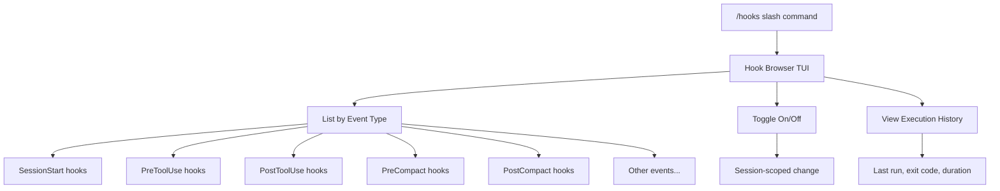
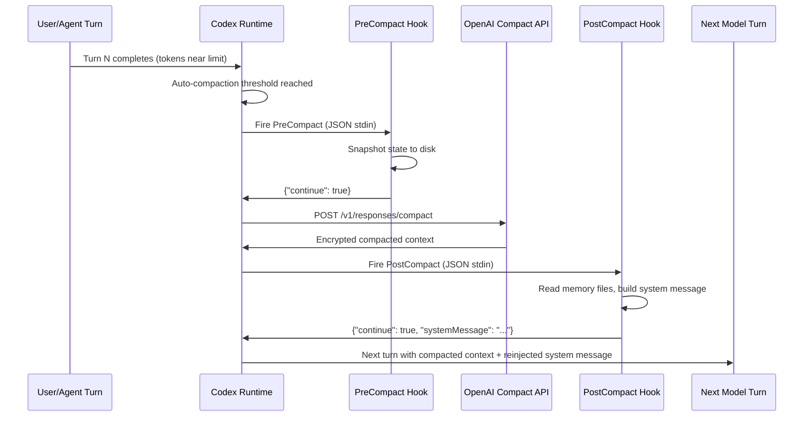

# Codex CLI v0.129: The /hooks Browser, Compaction Hooks, and Runtime Hook Management


---

Codex CLI v0.129.0, released on 7 May 2026, ships three hook-related capabilities that developers have been requesting since the hooks engine stabilised in v0.124[^1]. The headline additions are a `/hooks` browser for inspecting and toggling hooks at runtime, pre/post-compaction hook events that fire around context compaction, and `PreToolUse` context enrichment that gives hook scripts more decision-making data[^2]. Together, they close the largest remaining gap in the hook lifecycle — the inability to act deterministically when the context window is compressed.

This article walks through the new features, explains the compaction hook lifecycle, and shows practical patterns for memory reinjection, state persistence, and observability in long-running sessions.

## Why Compaction Hooks Matter

Context compaction is the mechanism Codex CLI uses when a conversation approaches the model's context window limit[^3]. The agent compresses earlier turns into a compact representation — an encrypted blob on OpenAI's servers — and continues the session with a smaller context[^4]. Before v0.129, this happened silently. External tooling that needed to react to compaction (persisting state, reinjecting memories, updating dashboards) had to resort to polling JSONL session logs under `~/.codex/sessions/` and scanning for `context_compacted` structural events[^5]. That approach was brittle: it depended on undocumented log formats, could miss events during partial writes, and offered only best-effort timing rather than a guaranteed lifecycle point.

Issues #16098 and #19061 on the Codex repository tracked the demand for first-class compaction hooks, and both were consolidated into #17148[^6][^7]. The v0.129 release resolves that tracking issue.

## The New Hook Events: PreCompact and PostCompact

v0.129 introduces two compaction lifecycle events that sit alongside the existing six (`SessionStart`, `PreToolUse`, `PostToolUse`, `PermissionRequest`, `UserPromptSubmit`, `Stop`)[^8]:

| Event | Fires | Receives | Can Block? |
|-------|-------|----------|------------|
| `PreCompact` | Immediately before compaction begins | Session ID, thread ID, turn count, compaction trigger (auto/manual), token usage snapshot | Yes — exit non-zero to defer compaction by one turn |
| `PostCompact` | After compaction completes successfully | Session ID, thread ID, compaction type, timestamp, pre/post token counts | No — informational only |

### Configuration

Compaction hooks use the same schema as all other lifecycle hooks. You can define them in `hooks.json` or inline in `config.toml`:

```toml
[hooks.PreCompact]
type = "command"
command = "python3 ~/.codex/scripts/pre-compact.py"
timeout = 30
statusMessage = "Saving state before compaction..."

[hooks.PostCompact]
type = "command"
command = "python3 ~/.codex/scripts/post-compact.py"
timeout = 30
statusMessage = "Reinjecting memory after compaction..."
```

Or equivalently in `hooks.json`:

```json
{
  "PreCompact": [
    {
      "type": "command",
      "command": "python3 ~/.codex/scripts/pre-compact.py",
      "timeout": 30
    }
  ],
  "PostCompact": [
    {
      "type": "command",
      "command": "python3 ~/.codex/scripts/post-compact.py",
      "timeout": 30
    }
  ]
}
```

### Input Payload

Both hooks receive JSON on stdin with shared fields plus event-specific data:

```json
{
  "session_id": "sess_abc123",
  "cwd": "/home/dev/project",
  "hook_event_name": "PostCompact",
  "model": "o3",
  "transcript_path": "/home/dev/.codex/sessions/sess_abc123/transcript.jsonl",
  "compaction_type": "auto",
  "pre_compaction_tokens": 118420,
  "post_compaction_tokens": 24300,
  "turn_count": 47,
  "timestamp": "2026-05-07T14:32:01Z"
}
```

### Output Contract

`PostCompact` hooks can return a `systemMessage` string that Codex injects into the next turn's system context — the key mechanism for deterministic memory reinjection:

```json
{
  "continue": true,
  "systemMessage": "REINJECTED CONTEXT: The user is refactoring the auth module. Key files: src/auth/oauth.ts, src/auth/session.ts. Current branch: feat/oauth-pkce. 3 tests still failing in auth.test.ts."
}
```

## The /hooks Browser

The second major addition is the `/hooks` slash command, which opens an interactive browser within the TUI[^2]. Previously, the only way to inspect which hooks were active was to read configuration files or run `/debug-config`. The `/hooks` browser provides:

- **A list of all registered hooks** grouped by event type, showing source (user config, project config, plugin, or managed/enterprise)
- **Toggle hooks on or off** without editing configuration files — changes persist for the current session only
- **Matcher and command details** for each hook, including timeout values and status messages
- **Execution history** showing the last run time, exit code, and duration for each hook

This is particularly valuable when debugging hook interactions. If a `PostToolUse` hook is interfering with a compaction hook, you can disable it temporarily from within the TUI, test in isolation, and re-enable it — all without leaving Codex or touching a config file.



## Practical Pattern: Deterministic Memory Reinjection

The most requested use case for compaction hooks is reinjecting critical context that would otherwise be lost during compression[^5]. Here is a production-ready `PostCompact` hook script:

```python
#!/usr/bin/env python3
"""PostCompact hook: reinject project-critical context after compaction."""

import json
import sys
from pathlib import Path

def main():
    payload = json.load(sys.stdin)
    cwd = Path(payload["cwd"])

    # Gather context from well-known project files
    context_parts = []

    # 1. Active branch and recent commits
    git_head = cwd / ".git" / "HEAD"
    if git_head.exists():
        ref = git_head.read_text().strip()
        branch = ref.replace("ref: refs/heads/", "") if ref.startswith("ref:") else ref[:12]
        context_parts.append(f"Branch: {branch}")

    # 2. Project-specific memory file (maintained by PreCompact or manually)
    memory_file = cwd / ".codex" / "compaction-memory.md"
    if memory_file.exists():
        context_parts.append(memory_file.read_text().strip())

    # 3. Active goal if /goal is in use
    goal_file = cwd / ".codex" / "goal.md"
    if goal_file.exists():
        context_parts.append(f"Active goal:\n{goal_file.read_text().strip()}")

    if context_parts:
        system_msg = "REINJECTED POST-COMPACTION CONTEXT:\n\n" + "\n\n---\n\n".join(context_parts)
    else:
        system_msg = ""

    json.dump({"continue": True, "systemMessage": system_msg}, sys.stdout)

if __name__ == "__main__":
    main()
```

The companion `PreCompact` hook writes the memory file:

```python
#!/usr/bin/env python3
"""PreCompact hook: snapshot critical state before compaction."""

import json
import sys
from pathlib import Path
from datetime import datetime, timezone

def main():
    payload = json.load(sys.stdin)
    cwd = Path(payload["cwd"])

    codex_dir = cwd / ".codex"
    codex_dir.mkdir(exist_ok=True)

    memory = {
        "captured_at": datetime.now(timezone.utc).isoformat(),
        "turn_count": payload.get("turn_count", "unknown"),
        "token_usage": payload.get("pre_compaction_tokens", "unknown"),
        "trigger": payload.get("compaction_type", "unknown"),
    }

    memory_file = codex_dir / "compaction-memory.md"
    memory_file.write_text(
        f"# Compaction Snapshot\n\n"
        f"- **Captured:** {memory['captured_at']}\n"
        f"- **Turn count:** {memory['turn_count']}\n"
        f"- **Tokens before compaction:** {memory['token_usage']}\n"
        f"- **Trigger:** {memory['trigger']}\n"
    )

    # Allow compaction to proceed
    json.dump({"continue": True}, sys.stdout)

if __name__ == "__main__":
    main()
```

## Practical Pattern: Compaction Observability

For teams running Codex CLI in CI or long autonomous sessions, compaction events are valuable telemetry signals. A `PostCompact` hook can push metrics to your observability stack:

```bash
#!/usr/bin/env bash
# PostCompact hook: emit compaction metrics to StatsD
set -euo pipefail

INPUT=$(cat)
PRE_TOKENS=$(echo "$INPUT" | jq -r '.pre_compaction_tokens // 0')
POST_TOKENS=$(echo "$INPUT" | jq -r '.post_compaction_tokens // 0')
RATIO=$(echo "scale=2; $POST_TOKENS / $PRE_TOKENS" | bc)
SESSION_ID=$(echo "$INPUT" | jq -r '.session_id')

echo "codex.compaction.pre_tokens:${PRE_TOKENS}|g|#session:${SESSION_ID}" | nc -u -w1 localhost 8125
echo "codex.compaction.post_tokens:${POST_TOKENS}|g|#session:${SESSION_ID}" | nc -u -w1 localhost 8125
echo "codex.compaction.ratio:${RATIO}|g|#session:${SESSION_ID}" | nc -u -w1 localhost 8125

echo '{"continue": true}'
```

## Compaction Hook Lifecycle Sequence

The following diagram shows how compaction hooks integrate with the existing session lifecycle:



## PreCompact as a Compaction Gate

A distinctive feature of `PreCompact` is its ability to defer compaction. If the hook exits with a non-zero status, Codex postpones compaction by one turn[^2]. This is useful when:

- A multi-step tool sequence is in progress and compaction would disrupt continuity
- An external system needs time to checkpoint state
- You want to log a warning and let a human decide whether to proceed

This deferral is limited — Codex will force compaction if the context window is critically full — but it provides a valuable one-turn buffer for coordinating external systems.

## Hook Management with /hooks

The `/hooks` browser supports several interaction patterns:

| Action | Effect | Persistence |
|--------|--------|-------------|
| Toggle a hook off | Hook stops firing for all matching events | Session only |
| Toggle a hook on | Re-enables a previously disabled hook | Session only |
| View execution log | Shows last exit code, duration, stdout snippet | Read-only |
| Filter by event | Narrows the list to a single event type | UI state only |

For teams using enterprise managed hooks via `requirements.toml`, managed hooks appear in the browser but cannot be toggled off — they are marked with a lock icon indicating admin enforcement[^9].

## Migration from Log-Polling Workarounds

If you previously used JSONL log scanning to detect compaction, here is a migration checklist:

1. **Replace log-scanning scripts** with a `PostCompact` hook — the hook fires at a guaranteed lifecycle point with structured data
2. **Move state snapshots** into a `PreCompact` hook instead of periodically dumping state on a timer
3. **Remove `context_compacted` event parsers** — the hook payload provides `pre_compaction_tokens`, `post_compaction_tokens`, and `compaction_type` directly
4. **Test with `/compact`** — manual compaction via the slash command triggers the same hook pipeline as automatic compaction, making it easy to verify your hooks without waiting for a full context window

## Limitations and Caveats

- **Documentation lag:** As of 7 May 2026, the official hooks documentation at `developers.openai.com/codex/hooks` has not yet been updated to list `PreCompact` and `PostCompact` events[^8]. The release notes and source code are the current references.
- **Session-only toggle scope:** Hook toggling via `/hooks` does not persist across sessions. If you need permanent changes, edit `config.toml` or `hooks.json` directly.
- **Deferral limits:** `PreCompact` can defer compaction by at most one turn. If the context window is critically full, Codex overrides the deferral. ⚠️ The exact threshold for forced compaction is not documented.
- **Concurrent hook execution:** Multiple hooks registered for the same compaction event run concurrently[^8]. If your `PreCompact` hooks have ordering dependencies, consolidate them into a single script.

## Conclusion

The v0.129 hook additions transform compaction from a black-box runtime event into a programmable lifecycle surface. The `/hooks` browser makes the entire hook system inspectable and controllable without leaving the TUI. For anyone running sessions that regularly hit context limits — CI pipelines, large refactors, multi-file feature builds — compaction hooks eliminate the class of brittle workarounds that characterised long-session hook management before this release.

---

## Citations

[^1]: OpenAI, "Changelog – Codex CLI v0.124.0," *OpenAI Developers*, 23 April 2026. [https://developers.openai.com/codex/changelog](https://developers.openai.com/codex/changelog)

[^2]: OpenAI, "Release 0.129.0 – openai/codex," *GitHub*, 7 May 2026. [https://github.com/openai/codex/releases](https://github.com/openai/codex/releases)

[^3]: OpenAI, "Features – Codex CLI," *OpenAI Developers*, 2026. [https://developers.openai.com/codex/cli/features](https://developers.openai.com/codex/cli/features)

[^4]: Justin3go, "Shedding Heavy Memories: Context Compaction in Codex, Claude Code, and OpenCode," April 2026. [https://justin3go.com/en/posts/2026/04/09-context-compaction-in-codex-claude-code-and-opencode](https://justin3go.com/en/posts/2026/04/09-context-compaction-in-codex-claude-code-and-opencode)

[^5]: GitHub, "Add a post-compaction hook for deterministic memory reinjection – Issue #19061," *openai/codex*, 2026. [https://github.com/openai/codex/issues/19061](https://github.com/openai/codex/issues/19061)

[^6]: GitHub, "Add pre_compact and post_compact hooks for context compaction – Issue #16098," *openai/codex*, 2026. [https://github.com/openai/codex/issues/16098](https://github.com/openai/codex/issues/16098)

[^7]: GitHub, "Pre and PostCompact hooks – Issue #17148," *openai/codex*, 2026. [https://github.com/openai/codex/issues/17148](https://github.com/openai/codex/issues/17148)

[^8]: OpenAI, "Hooks – Codex," *OpenAI Developers*, 2026. [https://developers.openai.com/codex/hooks](https://developers.openai.com/codex/hooks)

[^9]: OpenAI, "Configuration Reference – Codex," *OpenAI Developers*, 2026. [https://developers.openai.com/codex/config-reference](https://developers.openai.com/codex/config-reference)
