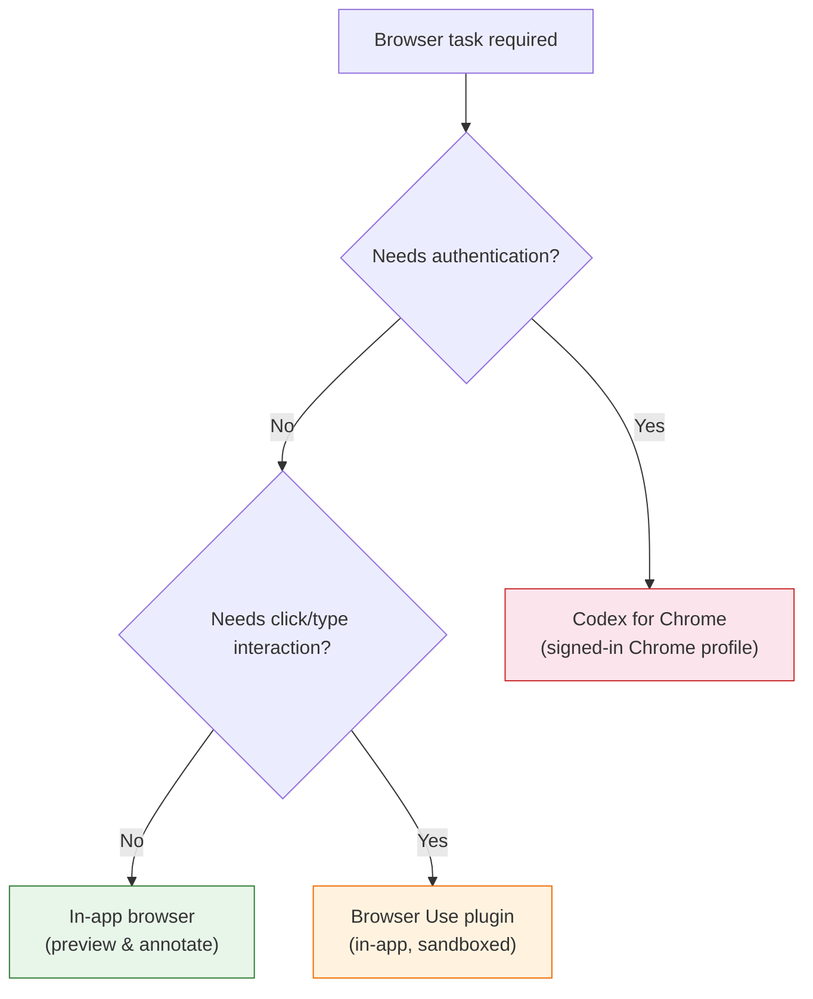
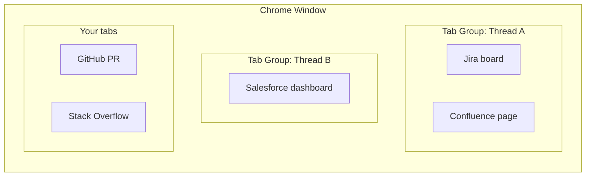
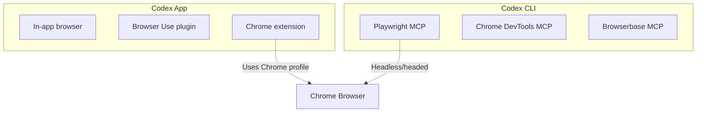

# Codex for Chrome: Browser Integration for Authenticated Workflows


---

Codex has always been strongest in the terminal and the editor. But a surprising number of developer tasks live behind a browser login — updating a Jira board, reviewing a Salesforce dashboard, triaging a PagerDuty alert, or nudging a colleague on Slack. Until now, the options were either the Codex in-app browser (sandboxed, unauthenticated) or full computer-use screen control (powerful but heavyweight). The **Codex for Chrome** extension, released on 7 May 2026 alongside CLI v0.129.0[^1], fills the gap: it lets Codex operate Chrome tabs using your existing signed-in browser state, without surrendering your entire screen.

This article covers the architecture, security model, setup, and practical patterns — and, critically, where the extension sits alongside Codex's two other browser surfaces.

## Three Browser Surfaces, Three Trust Models

Codex now offers three distinct ways to interact with web content. Choosing the right one matters for both security and reliability.



| Surface | Authentication | Isolation | Best for |
|---------|---------------|-----------|----------|
| **In-app browser** | None — no cookies, no extensions, no profile[^2] | Full sandbox | Localhost preview, public pages, visual annotation |
| **Browser Use plugin** | None | Sandboxed in-app | Click/type on public pages, screenshot verification |
| **Codex for Chrome** | Full Chrome profile — cookies, sessions, extensions[^3] | Per-domain approval | Signed-in SaaS tools, internal dashboards, authenticated APIs |

The in-app browser is the default recommendation for anything that does not require sign-in[^2]. The Chrome extension exists specifically for tasks that need your authenticated browser state.

## Architecture and Installation

The extension uses Chrome's Manifest V3 extension framework and communicates with the Codex desktop app via Chrome's native messaging bridge[^3]. It requires broad permissions at install time — page debugger access, all-site data read/modify, browsing history, tab group management, and native application communication[^3] — because Codex needs the ability to observe and drive any page the user authorises.

### Setup

1. Open **Codex → Plugins**
2. Add the **Chrome** plugin
3. Follow the guided setup flow — this installs the extension and walks through Chrome's permission prompts[^3]
4. Verify the extension shows **Connected** in the Chrome toolbar

The extension is listed on the Chrome Web Store as **Codex Chrome Bridge**[^4].

### Tab Group Isolation

When Codex drives Chrome, each thread's browser work runs in a dedicated **Chrome tab group**[^3]. This keeps agent-opened tabs visually separated from your normal browsing. If you have three Codex threads running browser tasks concurrently, you get three distinct tab groups — each collapsible and colour-coded by Chrome's native tab group UI.



## The Domain Approval Model

This is where the security model earns its keep. By default, Codex **asks before interacting with each new website**, scoped by hostname (e.g. `example.com`)[^3].

When prompted, three options are available:

- **Allow for this chat** — permits access for the current thread only
- **Always allow** — adds the domain to a persistent allowlist; no future prompts
- **Decline** — blocks access for this request

### Managing Allow and Block Lists

In **Computer Use settings**, you can manage two lists:

- **Allowlist** — domains Codex can use without asking. Removing a domain forces re-confirmation next time.
- **Blocklist** — domains Codex must never touch. Removing a domain merely permits future prompts; it does not auto-allow.

There is also an **"Always allow browser content"** toggle that disables all domain confirmation prompts[^3]. The documentation marks this as **Elevated Risk** — and rightly so. Enabling it means Codex can navigate to any domain using your full authenticated session without asking. For enterprise users, this is almost certainly the wrong choice.

### Browser History Access

History access is treated separately from page interaction. Codex must request approval for each history lookup, with no "always allow" option[^3]. The documentation notes that browser history "can include sensitive telemetry, internal URLs, search terms" — a pragmatic acknowledgement that history data has a different threat profile from page content.

## Security Considerations

The Chrome extension sits in a fundamentally different trust zone from the in-app browser. It operates with your full Chrome identity — cookies, OAuth tokens, session storage, saved passwords auto-filled by Chrome. This demands careful thought.

### Prompt Injection via Page Content

OpenAI's own security documentation warns that prompt injection can occur "when the agent retrieves and follows instructions from untrusted content (for example, a web page)"[^5]. The Chrome extension amplifies this risk because it operates on live, authenticated pages where content is dynamic and potentially attacker-influenced.

The mitigation is explicit in the docs: "Treat page content as untrusted context, and review the website before allowing Codex to continue"[^3]. In practice, this means:

- Keep your blocklist populated with domains you do not want Codex visiting
- Avoid the "Always allow browser content" toggle
- Review what Codex proposes to do on each new domain before approving

### Data Handling

OpenAI stores browser activity (screenshots, text reads, summaries, tool calls) only when it is integrated into the thread context[^3]. There is no separate complete log of all browser actions. Standard ChatGPT/Codex data controls apply to any content that is processed.

If Codex Memories are enabled, relevant information from browser sessions may be saved as memories and surfaced in future threads[^3].

## Practical Patterns

### Pattern 1: Triage Authenticated Dashboards

```
@Chrome open PagerDuty and summarise the top 3 unacknowledged
incidents. For each, check the linked Datadog dashboard and note
whether the metric has recovered.
```

Codex opens PagerDuty in a tab group, reads incident details using your signed-in session, then navigates to Datadog (also authenticated) to correlate metrics. The domain approval model means you approve `pagerduty.com` and `datadoghq.com` on first use, then subsequent requests in the same chat proceed without interruption.

### Pattern 2: Update Project Management Tools

```
@Chrome open the Linear team board and move all issues tagged
"v2.4-ready" from "In Review" to "Done". Add a comment on each:
"Shipped in v2.4.0 — verified by automated regression suite."
```

This leverages Chrome's authenticated session with Linear. The tab group keeps all Linear tabs together, and Codex can handle the repetitive click-through that would otherwise consume ten minutes of manual work.

### Pattern 3: Cross-Reference Internal Wikis

```
Read the error in server.log, then @Chrome search our Confluence
for the error code and summarise any existing runbooks.
```

Here Codex combines its native file-reading capability with Chrome-based Confluence access. The key advantage over the in-app browser is that Confluence requires SSO authentication — the Chrome extension inherits your active session.

## Codex for Chrome vs. CLI Browser MCP

For CLI-only users, browser interaction typically comes via Playwright MCP or similar tool servers[^6]. The Chrome extension is a **Codex app feature**, not a CLI feature — the documentation makes no mention of CLI integration[^3]. If you work exclusively in the terminal, your browser automation story remains MCP-based.



This distinction matters for CI/CD pipelines. `codex exec` cannot trigger the Chrome extension — browser-in-the-loop automation in CI should use Playwright MCP with headless Chrome instead.

## Limitations

- **Codex app only** — no CLI support. Terminal-first developers must use MCP-based browser tools[^3].
- **Single Chrome profile** — the extension uses whichever profile it was installed in. Multi-profile workflows (e.g. personal vs. work) require manual switching.
- **Chrome must be running** — Codex can auto-launch Chrome if needed, but the extension cannot operate without an active Chrome process[^3].
- **No granular page-element permissions** — the approval model is per-domain, not per-action. Once you allow `github.com`, Codex can read any page on that domain.
- **Browser history approval is per-request** — useful for security, but can become repetitive in history-heavy workflows.
- ⚠️ **No documented API for programmatic domain list management** — allowlists and blocklists appear to be UI-only at present.

## Troubleshooting

The official troubleshooting sequence[^3]:

1. Verify the extension shows **Connected** in the Chrome toolbar
2. Confirm the Chrome plugin is enabled in Codex **Plugins**
3. Ensure you are using the same Chrome profile where the extension was installed
4. Start a new thread to clear state
5. Restart both Codex and Chrome
6. Reinstall the extension and re-add the plugin
7. Run `/feedback` with the thread ID for unresolved issues

## When to Reach for It

The Chrome extension is not a replacement for the in-app browser or for MCP-based browser tools. It is a targeted solution for a specific problem: **tasks that require your authenticated browser identity**. If your workflow involves checking public pages, previewing localhost, or automating browser interactions in CI — use the other surfaces. If you need to update a Salesforce record, triage PagerDuty, or search an SSO-protected Confluence — the Chrome extension is the right tool.

The per-domain approval model is the critical safety feature. Resist the temptation to toggle "Always allow browser content" and instead let the allowlist grow organically as you verify each domain is safe for agent interaction.

## Citations

[^1]: [Codex Changelog — May 7, 2026](https://developers.openai.com/codex/changelog), OpenAI Developers, accessed 7 May 2026.
[^2]: [In-app browser — Codex app](https://developers.openai.com/codex/app/browser), OpenAI Developers, accessed 7 May 2026.
[^3]: [Codex Chrome extension — Codex app](https://developers.openai.com/codex/app/chrome-extension), OpenAI Developers, accessed 7 May 2026.
[^4]: [Codex Chrome Bridge — Chrome Web Store](https://chromewebstore.google.com/detail/codex-chrome-bridge/bpdlgcaopbfacedplnkopcilkmodnmcc), Google Chrome Web Store, accessed 7 May 2026.
[^5]: [Security — Codex](https://developers.openai.com/codex/security), OpenAI Developers, accessed 7 May 2026.
[^6]: [Browser in the Loop: Playwright + Chrome DevTools MCP with Codex CLI](https://codex.danielvaughan.com/2026/04/24/browser-in-the-loop-testing-playwright-chrome-devtools-mcp-codex-cli/), Daniel Vaughan, 24 April 2026.
