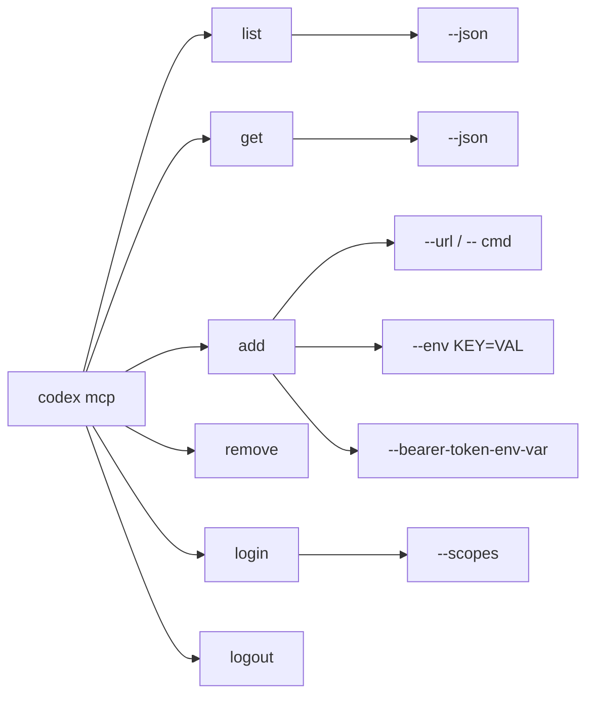
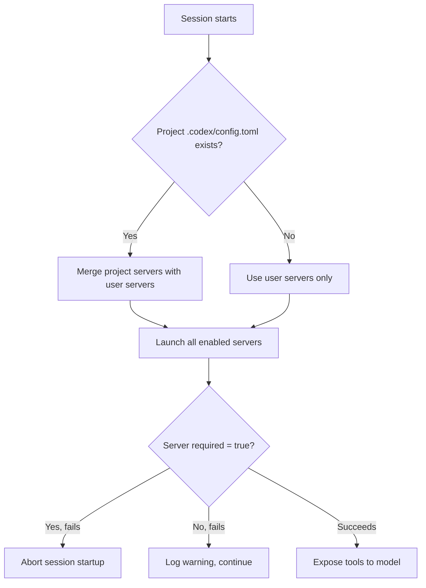

# codex mcp: Managing MCP Servers Entirely from the Terminal


---

The Model Context Protocol gives Codex CLI access to third-party tools — GitHub operations, database queries, documentation lookups, browser automation — but wiring those servers into your configuration has historically meant hand-editing TOML. The `codex mcp` subcommand replaces that manual plumbing with a proper CLI workflow: add, remove, list, inspect, authenticate, and scope servers without ever opening `config.toml` yourself.

This article walks through every `codex mcp` sub-subcommand, explains the two transport models it supports, covers OAuth authentication for remote servers, and shows how to combine it all with project-scoped configuration and tool allow/deny lists.

## The Six Subcommands at a Glance



| Subcommand | Purpose |
|------------|---------|
| `list` | Show all configured servers, with auth status |
| `get <name>` | Inspect a single server's config |
| `add <name>` | Register a new stdio or HTTP server |
| `remove <name>` | Delete a server entry |
| `login <name>` | Start OAuth 2.0 authentication |
| `logout <name>` | Remove stored OAuth credentials |

All write operations target `~/.codex/config.toml` (or `$CODEX_HOME/config.toml`) by default [^1]. The underlying implementation uses a `ConfigEditsBuilder` abstraction to ensure atomic updates — no half-written TOML tables if the process is interrupted [^2].

## Adding Servers

### Stdio Transport

Stdio servers are local processes that Codex launches and communicates with via standard input/output. The trailing `--` separates the server name from the launch command:

```bash
# Register a Context7 documentation server
codex mcp add context7 -- npx -y @upstash/context7-mcp

# Register with environment variables
codex mcp add postgres -- node pg-mcp-server.js \
  --env DATABASE_URL=postgresql://localhost:5432/mydb

# Multiple --env flags are repeatable
codex mcp add sentry -- python -m sentry_mcp \
  --env SENTRY_DSN=https://key@sentry.io/123 \
  --env SENTRY_ORG=my-org
```

The generated TOML entry looks like this [^1]:

```toml
[mcp_servers.context7]
command = "npx"
args = ["-y", "@upstash/context7-mcp"]
```

### Streamable HTTP Transport

Remote servers use `--url` instead of a trailing command:

```bash
# GitHub's hosted MCP server
codex mcp add github --url https://api.githubcopilot.com/mcp/ \
  --bearer-token-env-var GITHUB_PAT_TOKEN

# A custom internal server
codex mcp add internal-docs --url https://mcp.internal.example.com/v1
```

The `--bearer-token-env-var` flag tells Codex which environment variable holds the bearer token — the token itself is never written to disk [^3]. The generated config:

```toml
[mcp_servers.github]
url = "https://api.githubcopilot.com/mcp/"
bearer_token_env_var = "GITHUB_PAT_TOKEN"
```

When adding a streamable HTTP server, the CLI automatically probes the endpoint for OAuth support. If detected, it may prompt you to authenticate immediately via `perform_oauth_login_retry_without_scopes()` [^2].

## Listing and Inspecting Servers

```bash
# Human-readable table with auth status
codex mcp list

# Machine-readable JSON for scripting
codex mcp list --json

# Inspect a single server
codex mcp get github
codex mcp get github --json
```

Both `list` and `get` call `compute_auth_statuses()` internally, which checks three things for each server [^2]:

1. Whether a `bearer_token_env_var` is configured and the variable is set
2. Whether stored OAuth tokens exist in the local credential store
3. Whether the HTTP endpoint advertises OAuth discovery metadata

This means the output tells you not just what is configured, but whether authentication is actually live — useful when debugging why a server's tools are not appearing in your session.

## OAuth Authentication

OAuth is only supported for streamable HTTP servers [^1]. The flow works like any browser-based OAuth consent screen:

```bash
# Authenticate with default scopes advertised by the server
codex mcp login github

# Request specific scopes
codex mcp login linear --scopes "read,write,issues"

# Remove stored credentials
codex mcp logout github
```

### How Credentials Are Stored

Codex offers three credential storage backends, controlled by the `mcp_oauth_credentials_store` key in `config.toml` [^4]:

| Value | Behaviour |
|-------|-----------|
| `auto` | Use system keyring if available, fall back to file |
| `keyring` | macOS Keychain, Windows Credential Manager, or Linux Secret Service |
| `file` | Encrypted file in `$CODEX_HOME` |

### OAuth Callback Configuration

By default, Codex binds an ephemeral port for the OAuth callback. Two config keys let you override this [^4]:

```toml
# Fix the callback port (useful behind firewalls)
mcp_oauth_callback_port = 8976

# Override the full callback URL (useful in devboxes or remote environments)
mcp_oauth_callback_url = "https://my-devbox.example.com/oauth/callback"
```

When `mcp_oauth_callback_url` is set, Codex binds to `0.0.0.0` rather than `127.0.0.1`, allowing the remote ingress to reach the local listener [^4].

## Removing Servers

```bash
codex mcp remove context7
```

This deletes the `[mcp_servers.context7]` table from `config.toml`. It does not remove any stored OAuth credentials — run `codex mcp logout` first if the server used OAuth [^2].

## Beyond the CLI: Configuration You Still Need TOML For

The `codex mcp add` command covers the basics — transport, environment variables, and bearer tokens. Several advanced settings currently require direct TOML editing [^1] [^4]:

```toml
[mcp_servers.chrome_devtools]
url = "http://localhost:3000/mcp"

# Only expose these two tools to the model
enabled_tools = ["open", "screenshot"]

# Block destructive tools
disabled_tools = ["delete_all"]

# Fail startup if this server is unreachable
required = true

# Extend timeouts for slow-starting servers
startup_timeout_sec = 20
tool_timeout_sec = 120

# Temporarily disable without removing
enabled = false
```

### Tool Allow/Deny Lists

The `enabled_tools` allowlist runs first; `disabled_tools` is then applied as a denylist on the result [^4]. This two-pass approach means you can broadly allowlist a category and then carve out exceptions:

```toml
[mcp_servers.github]
url = "https://api.githubcopilot.com/mcp/"
bearer_token_env_var = "GITHUB_PAT_TOKEN"
enabled_tools = ["list_repos", "get_issue", "create_issue", "list_prs", "get_pr"]
disabled_tools = ["delete_repo"]
```

### Remote Environment Variables

For servers running on remote executors (such as Codex's own remote sandbox), you can forward variables with a `source = "remote"` annotation [^5]:

```toml
[mcp_servers.deploy]
command = "deploy-server"
env_vars = [
  "LOCAL_TOKEN",
  { name = "REMOTE_TOKEN", source = "remote" }
]
```

## Project-Scoped vs User-Scoped Servers

Servers added via `codex mcp add` go into `~/.codex/config.toml` (user scope). For project-scoped servers, create `.codex/config.toml` in your repository root [^1]:

```toml
# .codex/config.toml — checked into version control
[mcp_servers.project_docs]
command = "node"
args = ["./tools/docs-mcp-server.js"]
```

Project-scoped servers are only loaded when Codex is launched from within that directory tree. This is ideal for team-shared tooling — commit the config alongside the codebase so every developer gets the same MCP servers automatically.



## Verifying Your Setup

Once servers are configured, verify they are live within an interactive session:

1. **Launch Codex** and wait for the session to initialise
2. **Type `/mcp`** in the TUI to list connected servers and their available tools [^6]
3. **Test a tool** with a natural-language prompt: "List my GitHub repositories" or "Show the docs for React useState"

If a server does not appear, check:

- `codex mcp list` shows the server and its auth status is valid
- The server process starts successfully (for stdio, try running the command manually)
- `startup_timeout_sec` is long enough for servers that need to download dependencies (e.g., `npx -y`)
- For OAuth servers, `codex mcp login <name>` completes without errors

## Practical Recipes

### Recipe 1: GitHub + Linear + Sentry Stack

```bash
codex mcp add github --url https://api.githubcopilot.com/mcp/ \
  --bearer-token-env-var GITHUB_PAT_TOKEN
codex mcp add linear --url https://mcp.linear.app/sse
codex mcp login linear --scopes "read,write"
codex mcp add sentry -- npx -y @sentry/mcp-server \
  --env SENTRY_AUTH_TOKEN="$(op read 'op://Dev/Sentry/token')"
```

### Recipe 2: CI-Only Server Registration

In a GitHub Actions workflow, register servers ephemerally before running `codex exec`:

```bash
codex mcp add gh-review --url https://api.githubcopilot.com/mcp/ \
  --bearer-token-env-var GITHUB_TOKEN
codex exec "Review this PR and suggest improvements" \
  --sandbox read-only
```

### Recipe 3: Auditing Server Configuration in Scripts

```bash
# List all servers as JSON, pipe to jq for analysis
codex mcp list --json | jq '.[].name'

# Check a specific server's auth status
codex mcp get github --json | jq '.auth_status'
```

## Current Limitations

- **No project-scope flag on `add`**: The CLI always writes to user-scope `config.toml`. For project-scoped servers, you must edit `.codex/config.toml` manually [^1].
- **No `enable`/`disable` subcommand**: Issue #16439 tracks adding `codex mcp enable|disable <server>` as dedicated subcommands [^7]. For now, toggle `enabled = false` in TOML.
- **OAuth credential cleanup on `remove`**: Removing a server does not automatically revoke or delete stored OAuth tokens [^2]. Run `logout` before `remove` to clean up fully.
- **No tool filtering on `add`**: The `enabled_tools` and `disabled_tools` arrays must be set via direct TOML editing [^4].

## Citations

[^1]: [Model Context Protocol — Codex | OpenAI Developers](https://developers.openai.com/codex/mcp)
[^2]: [MCP CLI Commands | openai/codex | DeepWiki](https://deepwiki.com/openai/codex/6.3-mcp-cli-commands)
[^3]: [GitHub MCP Server Installation Guide for Codex](https://github.com/github/github-mcp-server/blob/main/docs/installation-guides/install-codex.md)
[^4]: [Configuration Reference — Codex | OpenAI Developers](https://developers.openai.com/codex/config-reference)
[^5]: [Sample Configuration — Codex | OpenAI Developers](https://developers.openai.com/codex/config-sample)
[^6]: [Features — Codex CLI | OpenAI Developers](https://developers.openai.com/codex/cli/features)
[^7]: [Add `codex mcp enable|disable <server>` CLI subcommands — Issue #16439 — openai/codex](https://github.com/openai/codex/issues/16439)
