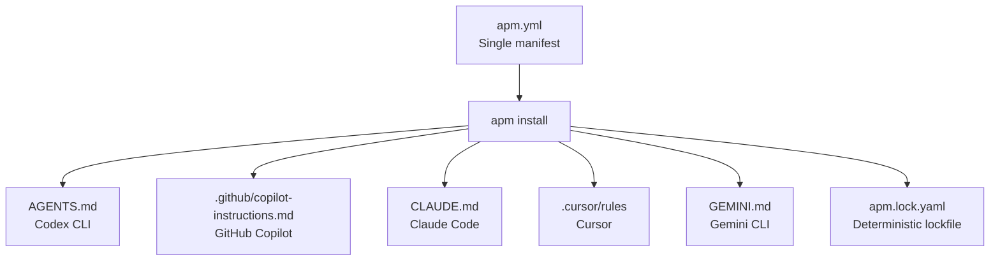
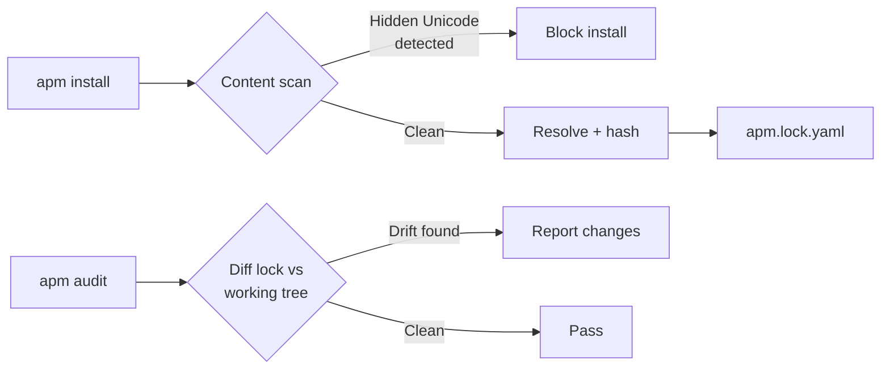

# Microsoft APM: The Package Manager for AI Agents and What It Means for Codex CLI Teams


---

Every software team has solved dependency management for application code — `package.json`, `requirements.txt`, `Cargo.toml`. But agent configuration remains artisanal. Each developer's `AGENTS.md`, MCP server setup, skills collection, and plugin list is hand-curated, undocumented, and unreproducible. Microsoft's **Agent Package Manager (APM)** aims to fix that[^1].

Released as open source under MIT licence, APM reached v0.12.2 on 5 May 2026[^1] and has accumulated 2.3K GitHub stars across 1,112 commits. It supports seven AI coding agents — GitHub Copilot, Claude Code, Cursor, OpenCode, Codex CLI, Gemini CLI, and Windsurf — from a single manifest file[^1]. For Codex CLI teams managing multi-agent workflows, APM introduces a configuration layer that sits above any individual tool.

## The Core Concept: One Manifest, Every Agent

APM's `apm.yml` serves the same role as `package.json` does for Node projects: a declarative specification of everything an agent needs[^1].

```yaml
name: backend-api
version: 1.0.0
dependencies:
  apm:
    - anthropics/skills/skills/frontend-design
    - github/awesome-copilot/plugins/context-engineering
    - microsoft/apm-sample-package#v1.0.0
  mcp:
    - name: io.github.github/github-mcp-server
      transport: http
```

Running `apm install` resolves dependencies from any git host — GitHub, GitLab, Bitbucket, Azure DevOps — and deploys them to the correct locations for each agent[^1]. An `apm.lock.yaml` file pins resolved sources and content hashes, ensuring deterministic reproduction[^1].



The `apm compile -t copilot` command can target a specific agent, generating its native configuration format without touching others[^1]. This is the key differentiator from manual copy-paste: a single source of truth that compiles down to each agent's expected format.

## What APM Manages

APM handles five categories of agent dependency[^1]:

| Category | Examples | Codex CLI mapping |
|----------|----------|-------------------|
| **Instructions** | Coding standards, review guidelines | `AGENTS.md` content |
| **Skills** | Reusable task procedures (`SKILL.md`) | Skills directory |
| **Plugins** | Bundled tools and hooks | Plugin marketplace installs |
| **Agents** | Agent persona definitions (`.agent.md`) | Custom agent definitions in `config.toml` |
| **MCP servers** | Tool servers with transport config | `[mcp.servers]` in `config.toml` |

The format builds on two open standards: the **Agent Skills** specification from agentskills.io, now adopted by 36+ tools[^2], and the **Model Context Protocol** for tool server declarations[^3].

## How Codex CLI Fits Today

APM's Codex CLI integration has a notable limitation: Codex CLI does not yet support remote MCP servers via streamable HTTP[^1]. When `apm install` encounters an MCP dependency with `transport: http`, it skips the Codex target with a notice. Local Docker-based MCP servers work if you omit `--transport http` and set `GITHUB_PERSONAL_ACCESS_TOKEN`[^1].

This means APM's current value for Codex CLI teams lies in three areas:

1. **Standardising `AGENTS.md` content** across repositories — APM resolves transitive instruction dependencies and assembles them into the files Codex CLI discovers at startup
2. **Distributing skills** — `apm install vercel-labs/agent-skills --skill deploy-to-vercel` fetches and installs a specific skill, persisting it to the manifest[^1]
3. **Cross-agent consistency** — teams using both Codex CLI and Claude Code (or Copilot) get identical instructions without maintaining separate files

Once Codex CLI gains remote MCP support — likely via the streamable HTTP transport already available in the app server — APM becomes the unified configuration layer for instructions, skills, plugins, and tool servers alike.

## Security: Content Scanning and Drift Detection

Agent configuration is a supply-chain attack surface. An `AGENTS.md` file pulled from a compromised repository could instruct the agent to exfiltrate code or bypass review policies. APM addresses this with three mechanisms[^1]:

**Content scanning** runs during `apm install`, blocking packages that contain hidden Unicode characters designed to hijack agent behaviour[^1]. This directly addresses the prompt injection via invisible text attacks documented against coding agents in early 2026.

**Lockfile integrity** pins every resolved dependency to a content hash in `apm.lock.yaml`[^1]. If a dependency changes upstream between installs, the hash mismatch prevents silent mutation.

**Drift detection** via `apm audit` rebuilds the expected configuration from the manifest and diffs it against the working tree[^1]. This catches hand-edits that bypass the manifest — the agent configuration equivalent of editing `node_modules` directly.



## Policy Governance for Enterprise Teams

The most enterprise-relevant feature is `apm-policy.yml`, which enforces organisational constraints on agent configuration[^1]:

```yaml
# apm-policy.yml
version: 1.0.0
policy:
  sources:
    allowed:
      - github.com/myorg/*
      - github.com/microsoft/*
    blocked:
      - github.com/untrusted-vendor/*
  primitives:
    blocked:
      - mcp  # No MCP servers without explicit approval
  enforcement: block  # warn | block
```

Policies follow a **tighten-only inheritance model**: enterprise policies are the most restrictive, organisation policies can only narrow further, and repository policies can only tighten beyond that[^1]. A repository cannot relax a constraint set at the enterprise level.

This maps directly to the permission profile hierarchy that Codex CLI introduced in v0.128.0[^4]. Where Codex CLI's permission profiles govern what the agent *can do* at runtime, APM policies govern what configuration the agent *starts with*. Together, they form a complete governance stack: APM controls the supply chain, permission profiles control the sandbox.

## APM and agentrc: Measure Then Manage

Microsoft ships a companion tool, **agentrc**, that analyses a codebase and generates tailored agent instruction files[^5]. It scores AI-readiness across nine pillars using a five-level maturity model, then creates `.instructions.md` files specific to the repository's stack[^5].

The workflow is complementary: agentrc *generates* the initial configuration, APM *manages and distributes* it. Both tools share the `.instructions.md` format, so output from agentrc feeds directly into `apm.yml` as a dependency[^5].

For Codex CLI teams, this translates to: run `agentrc` on your repository to generate stack-specific instructions, add the output to your `apm.yml`, and let `apm install` deploy it as `AGENTS.md` content that Codex CLI discovers automatically.

## Practical Setup for a Codex CLI Project

```bash
# Install APM
curl -sSL https://aka.ms/apm-unix | sh

# Initialise in your repository
cd my-project
apm init

# Add a skill
apm install anthropics/skills/skills/frontend-design --skill frontend-design

# Add organisational standards
apm install myorg/agent-standards#v2.1.0

# Install to all supported agents
apm install

# Verify nothing has drifted
apm audit
```

After `apm install`, your repository gains an `AGENTS.md` (or updated content within it) that Codex CLI reads on startup, plus equivalent files for any other supported agents your team uses.

## Limitations

APM is young software. Several constraints are worth noting:

- **No remote MCP for Codex CLI** — the most significant gap; MCP server declarations are skipped[^1]
- **Python runtime dependency** — APM is 97% Python, adding a runtime requirement to what is otherwise a Rust-native Codex CLI toolchain[^1]
- **No Codex CLI plugin marketplace integration** — APM installs skills and instructions but does not interact with Codex CLI's built-in plugin marketplace
- **Policy governance requires CI/CD integration** — without GitHub rulesets or equivalent enforcement, policies are advisory only

## When to Adopt APM

**Today**, if your team uses multiple coding agents (Codex CLI plus Claude Code, Copilot, or Cursor) and wants consistent instructions across all of them. The cross-agent portability alone justifies the setup cost.

**Soon**, once Codex CLI gains remote MCP support, if you manage MCP server configurations across repositories and want lockfile-based reproducibility.

**Not yet**, if you are a solo Codex CLI user with a single repository — the overhead of a manifest file and lockfile exceeds the benefit when `AGENTS.md` and `config.toml` already handle everything.

---

## Citations

[^1]: Microsoft, "APM — Agent Package Manager," GitHub, 2026. [https://github.com/microsoft/apm](https://github.com/microsoft/apm)

[^2]: Agent Skills, "A standardized way to give AI agents new capabilities and expertise," agentskills.io, 2026. [https://agentskills.io](https://agentskills.io)

[^3]: Anthropic, "Model Context Protocol," modelcontextprotocol.io, 2026. [https://modelcontextprotocol.io](https://modelcontextprotocol.io)

[^4]: OpenAI, "Codex CLI Changelog — v0.128.0," OpenAI Developers, April 2026. [https://developers.openai.com/codex/changelog](https://developers.openai.com/codex/changelog)

[^5]: Microsoft, "agentrc — Context Engineering for AI Coding Agents," GitHub, 2026. [https://github.com/microsoft/agentrc](https://github.com/microsoft/agentrc)
