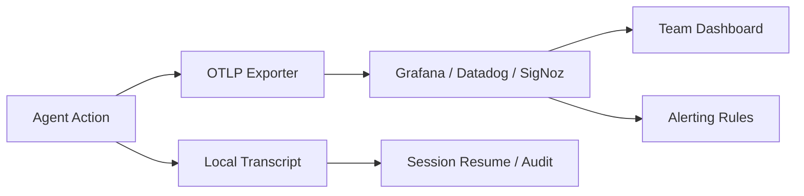

# Agent-Native Infrastructure: Karpathy's Software 3.0 Requirements and How Codex CLI Meets Them


---

At Sequoia's AI Ascent 2026, Andrej Karpathy laid out a framework that every engineering team shipping AI-assisted code should internalise. His argument: we have entered **Software 3.0**, where humans program LLMs through prompts, context, tools, examples, and memory rather than writing explicit code or curating training data [^1]. The unit of programming has shifted from lines of code to delegating macro actions — "implement this feature", "refactor this subsystem" — and the scarcity has moved from code generation to understanding, taste, evaluation design, and security [^1].

Karpathy identified six properties that agent-native infrastructure must possess before autonomous agents can operate safely and productively at scale [^1]. This article maps each of those requirements to concrete Codex CLI features, configuration keys, and operational patterns available today in v0.129.

## The Six Requirements

Karpathy's agent-native infrastructure checklist [^1]:

1. **Markdown documentation** — machine-readable project knowledge
2. **CLIs and APIs** — programmatic interfaces agents can invoke
3. **Machine-readable schemas** — structured, parseable output
4. **Safe permissioning models** — granular, principle-of-least-privilege access
5. **Auditable action logs** — every agent action traceable and reviewable
6. **Headless setup flows** — zero-touch provisioning without interactive wizards

These are not aspirational; they are prerequisites. The Opsera AI Coding Impact 2026 Benchmark Report, analysing 250,000+ developers across 60+ enterprises, found that AI-generated pull requests wait **4.6x longer** in review than human-written ones, code duplication rose from 10.5% to 13.5%, and AI-generated code introduces 15–18% more security vulnerabilities per line [^2]. The infrastructure deficit — not the model — is the bottleneck.

## Requirement 1: Markdown Documentation

Karpathy's "sensors" concept — agents need to extract world state from the codebase [^1]. Codex CLI implements this through a hierarchical AGENTS.md system that serves as machine-readable project documentation [^3].

```
~/.codex/AGENTS.md              # Global defaults (keep under 3 KB)
~/project/AGENTS.md             # Project root
~/project/AGENTS.override.md    # Override (replaces, not supplements)
~/project/src/AGENTS.md         # Subdirectory refinements
```

The resolution algorithm walks from the Git root down to the current working directory, concatenating files with later entries taking precedence [^3]. A size budget of 32 KiB (configurable via `project_doc_max_bytes`) prevents context bloat [^4].

```toml
# ~/.codex/config.toml
project_doc_max_bytes = 32768
```

For teams maintaining multiple agents, the override mechanism is critical: `AGENTS.override.md` at any level replaces `AGENTS.md` at that level entirely, enabling per-environment or per-developer customisation without touching the shared file [^3].

## Requirement 2: CLIs and APIs

Codex CLI is itself an agent-native CLI. The `codex exec` subcommand runs non-interactively, streaming progress to stderr and reserving stdout for the final response [^5]:

```bash
# One-shot task in CI
codex exec "run the test suite and summarise failures" | tee report.md

# Piped context
git diff HEAD~5 | codex exec "review these changes for security issues"
```

For embedding in applications, the Codex SDK wraps the CLI's app-server, communicating over JSON-RPC 2.0 [^6]. This gives TypeScript and Python applications the same agent capabilities without shelling out:

```typescript
import { CodexAgent } from "@openai/codex";

const agent = new CodexAgent({ model: "gpt-5.5" });
const result = await agent.run("refactor the auth module");
```

The `--ephemeral` flag prevents session persistence for stateless CI jobs, and `codex exec resume --last` enables multi-step workflows across pipeline stages [^5].

## Requirement 3: Machine-Readable Schemas

Karpathy's framework demands structured, parseable output — not prose [^1]. Codex CLI provides two mechanisms:

**JSON Lines streaming** for real-time event processing:

```bash
codex exec --json "analyse repository structure" | jq 'select(.type == "turn.completed")'
```

**Structured schema output** for downstream automation:

```json
// schema.json
{
  "type": "object",
  "properties": {
    "risk_areas": { "type": "array", "items": { "type": "string" } },
    "severity": { "type": "string", "enum": ["low", "medium", "high", "critical"] },
    "recommended_actions": { "type": "array", "items": { "type": "string" } }
  },
  "required": ["risk_areas", "severity"]
}
```

```bash
codex exec "assess security posture of this repository" \
  --output-schema ./schema.json \
  -o ./security-report.json
```

As of v0.129, `codex exec --json` also reports reasoning-token usage, enabling programmatic cost tracking in automation pipelines [^7].

> **Known limitation:** `--output-schema` and MCP tool calls conflict — when MCP servers are active, the model may ignore schema constraints [^8]. A two-pass workaround (MCP-enabled analysis pass, then schema-constrained summary pass) is documented in the community.

## Requirement 4: Safe Permissioning Models

This is where the Opsera data bites hardest. With 15–18% more vulnerabilities in AI-generated code [^2], safe permissioning is non-negotiable. Codex CLI implements a **two-layer security model**: OS-level sandbox enforcement plus approval policies [^9].

### Built-in Permission Profiles

```toml
# Minimal: read-only consultation
codex --sandbox read-only "explain this authentication flow"

# Standard: write within project boundaries
codex --sandbox workspace-write "fix the failing tests"

# Dangerous: full access (containers only)
codex --sandbox danger-full-access "set up the development environment"
```

### Custom Profiles with Granular Rules

```toml
# ~/.codex/config.toml
[permissions.ci-worker]
[permissions.ci-worker.filesystem]
":project_roots" = "write"
"/tmp" = "write"
"~" = "none"

[permissions.ci-worker.network]
enabled = true
mode = "limited"

[permissions.ci-worker.network.domains]
"api.openai.com" = "allow"
"registry.npmjs.org" = "allow"
"*" = "deny"
```

### Approval Policies

```toml
# Granular control over what needs human sign-off
[approval_policy]
granular = { sandbox_approval = "on-request", mcp_elicitations = "on-request", rules = "never" }
approvals_reviewer = "auto_review"  # Guardian sub-agent reviews instead of human
```

The `auto_review` Guardian sub-agent can handle approval decisions autonomously in CI, applying a separate model instance to evaluate proposed actions before they execute [^9].

## Requirement 5: Auditable Action Logs

Every Codex CLI session produces a full transcript of agent reasoning, tool invocations, file modifications, and command executions. But Karpathy's requirement goes further — logs need to flow into organisational observability systems [^1].

Codex CLI ships with built-in OpenTelemetry export [^10]:

```toml
# ~/.codex/config.toml
[otel]
exporter = "otlp-grpc"
endpoint = "https://otel-collector.internal:4317"
environment = "production"
log_user_prompt = true

[otel.tls]
ca_cert = "/etc/ssl/certs/internal-ca.pem"
```

This emits structured traces and spans for every API call, tool execution, and approval decision. Teams running Grafana, Datadog, SigNoz, or Jaeger can ingest these traces directly [^10].

For local audit trails, session transcripts persist in `~/.codex/sessions/` and can be resumed or inspected:

```bash
codex resume           # Interactive picker
codex resume --last    # Jump to most recent session
```



Hooks add programmable audit checkpoints. A `PostToolUse` hook can log every file modification to an external system before the agent continues [^11]:

```json
{
  "hooks": [{
    "event": "PostToolUse",
    "command": "python3 audit-log.py --action $EVENT_TYPE --file $TOOL_OUTPUT"
  }]
}
```

## Requirement 6: Headless Setup Flows

Agent-native infrastructure must be provisionable without interactive wizards. Codex CLI supports fully headless operation through:

**Environment-based authentication:**
```bash
export CODEX_API_KEY="sk-..."
codex exec --ignore-user-config "generate release notes"
```

**CLI flags for complete configuration:**
```bash
codex exec \
  --model gpt-5.5 \
  --sandbox workspace-write \
  --ignore-user-config \
  --ignore-rules \
  --ephemeral \
  "migrate the database schema"
```

**Profile-based switching** for different environments:

```toml
# ~/.codex/config.toml
[profiles.ci]
model = "codex-mini-latest"
model_reasoning_effort = "low"
service_tier = "flex"

[profiles.deep-review]
model = "gpt-5.5"
model_reasoning_effort = "high"
service_tier = "fast"
```

```bash
codex --profile ci exec "lint and fix"
codex --profile deep-review exec "security audit"
```

The official `codex-action` GitHub Action wraps this headless flow for CI/CD [^12]:


```yaml
- uses: openai/codex-action@v1
  with:
    codex_api_key: ${{ secrets.OPENAI_API_KEY }}
    prompt: "Review this PR for security issues"
    sandbox: "read-only"
    model: "gpt-5.5"
```


## The Gap Analysis

Karpathy's framework also highlights where current tooling falls short:

| Requirement | Codex CLI Status | Gap |
|---|---|---|
| Markdown documentation | AGENTS.md hierarchy | No built-in validation or linting of AGENTS.md quality |
| CLIs and APIs | `codex exec`, SDK, app-server | SDK is TypeScript-first; Python SDK wraps subprocess |
| Machine-readable schemas | `--output-schema`, `--json` | Schema conflicts with MCP tools [^8] |
| Safe permissioning | Two-layer model, custom profiles | No runtime permission escalation auditing |
| Auditable logs | OTLP, session transcripts | No built-in log aggregation across team members |
| Headless setup | Env vars, profiles, `codex-action` | Device auth for headless servers still requires initial browser flow |

The honest assessment: Codex CLI covers roughly 85% of Karpathy's agent-native checklist. The remaining gaps — cross-team log aggregation, schema–MCP compatibility, and truly zero-touch device provisioning — are active areas of development visible in the v0.130 alpha releases [^7].

## Practical Takeaway

Karpathy's closing argument at Sequoia Ascent was that "you can outsource your thinking, but you can't outsource your understanding" [^1]. For engineering teams, this means investing in agent-native infrastructure is not optional — it is the prerequisite for extracting value from AI coding agents rather than accumulating technical debt and review bottlenecks.

The configuration is already available. The question is whether your team has adopted it.

---

## Citations

[^1]: Karpathy, A. (2026). "Sequoia Ascent 2026 Summary." [https://karpathy.bearblog.dev/sequoia-ascent-2026/](https://karpathy.bearblog.dev/sequoia-ascent-2026/)

[^2]: Opsera. (2026). "AI Coding Impact 2026 Benchmark Report." [https://opsera.ai/resources/report/ai-coding-impact-2026-benchmark-report/](https://opsera.ai/resources/report/ai-coding-impact-2026-benchmark-report/)

[^3]: OpenAI. (2026). "Custom instructions with AGENTS.md." [https://developers.openai.com/codex/guides/agents-md](https://developers.openai.com/codex/guides/agents-md)

[^4]: OpenAI. (2026). "Configuration Reference." [https://developers.openai.com/codex/config-reference](https://developers.openai.com/codex/config-reference)

[^5]: OpenAI. (2026). "Non-interactive mode." [https://developers.openai.com/codex/noninteractive](https://developers.openai.com/codex/noninteractive)

[^6]: OpenAI. (2026). "Codex SDK." [https://developers.openai.com/codex/sdk](https://developers.openai.com/codex/sdk)

[^7]: OpenAI. (2026). "Codex Changelog." [https://developers.openai.com/codex/changelog](https://developers.openai.com/codex/changelog)

[^8]: GitHub. (2026). "Issue #15451: --json and --output-schema silently ignored when MCP servers active." [https://github.com/openai/codex/issues/15451](https://github.com/openai/codex/issues/15451)

[^9]: OpenAI. (2026). "Agent Approvals & Security." [https://developers.openai.com/codex/agent-approvals-security](https://developers.openai.com/codex/agent-approvals-security)

[^10]: OpenAI. (2026). "Configuration Reference — OpenTelemetry." [https://developers.openai.com/codex/config-reference](https://developers.openai.com/codex/config-reference)

[^11]: OpenAI. (2026). "Hooks." [https://developers.openai.com/codex/hooks](https://developers.openai.com/codex/hooks)

[^12]: OpenAI. (2026). "GitHub Action." [https://developers.openai.com/codex/github-action](https://developers.openai.com/codex/github-action)
