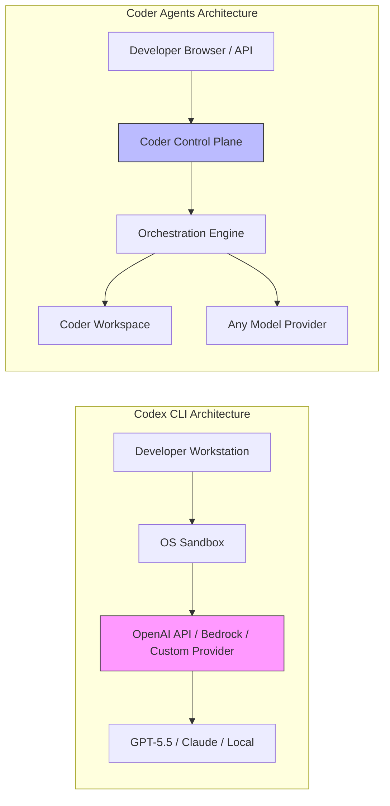
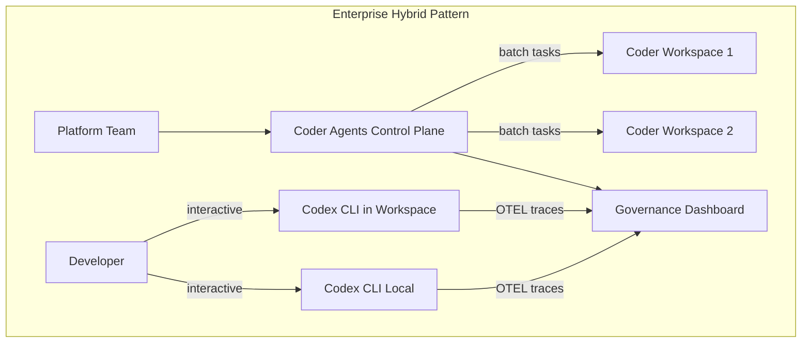

# Coder Agents vs Codex CLI: Self-Hosted, Model-Agnostic Agent Infrastructure and What It Means for Enterprise AI Coding

---

On 6 May 2026, Coder Technologies released Coder Agents to public beta — a native AI coding agent that runs entirely on customer-owned infrastructure and supports any model provider[^1]. Two days later, the Codex CLI ecosystem sits at v0.129 with its own multi-provider story, including Amazon Bedrock, Ollama, LM Studio, and custom provider endpoints[^2]. For engineering leaders evaluating their agent strategy, these two products represent fundamentally different architectural bets. This article compares them honestly and maps out the decision points.

## Two Philosophies of Agent Infrastructure

The core divergence is where the agent loop runs and who controls the model.

**Codex CLI** is a local-first terminal agent. The CLI binary runs on your workstation (or in CI via `codex exec`), authenticates through OpenAI's API or a ChatGPT subscription, and executes commands inside an OS-level sandbox (Seatbelt on macOS, Bubblewrap on Linux, restricted tokens on Windows)[^3]. The model inference always calls an external provider — OpenAI by default, though v0.129 supports Amazon Bedrock, Ollama, LM Studio, and fully custom provider endpoints[^2].

**Coder Agents** takes a different approach. The entire system — control plane, orchestration engine, and execution environment — runs inside the customer's network perimeter[^1]. Coder provides the agent runtime; you bring your own models from Anthropic, OpenAI, Google, AWS Bedrock, or self-hosted inference servers. Source code and prompts never leave your infrastructure[^4].

## Where Codex CLI Excels

### Model Quality and Ecosystem Depth

Codex CLI's tight coupling with OpenAI models is a constraint, but it is also a strength. The GPT-5.x Codex model family has been specifically trained on the V4A patch format that `apply_patch` uses[^5], and features like `--output-schema`, reasoning-effort controls (`Alt+,` / `Alt+.`), and the Guardian `auto_review` agent are tuned for these models[^6]. Third-party models work — Bedrock and Ollama support shipped in recent releases — but the first-party experience remains the tightest.

### Developer-Centric Workflow

Codex CLI is a single `npm install -g codex` away from a working agent. The TUI offers session resume, `/fork`, `/diff`, `/review`, Vim modal editing, and configurable keymaps[^7]. The plugin marketplace, skill definitions, and AGENTS.md hierarchy give individual developers fine-grained control over agent behaviour without waiting for an infrastructure team to provision anything.

### Sandboxing Without Infrastructure

The OS-level sandbox runs on every developer's laptop with zero infrastructure overhead. Bubblewrap namespaces on Linux provide network isolation and filesystem boundaries that approximate container-level security without a container runtime[^3].

### CI and Automation

`codex exec` powers non-interactive pipelines, including structured JSON output via `--output-schema`, JSONL event streams via `--json`, and the `codex-action` GitHub Action for PR-triggered agent workflows[^8]. The agent runs wherever Node.js runs — no orchestration platform required.

## Where Coder Agents Excels

### True Air-Gap Capability

Coder Agents supports fully air-gapped deployments where no traffic leaves the network perimeter[^1]. Codex CLI, even with a custom provider endpoint, still needs outbound connectivity to reach the model API — unless you run a local inference server, which limits you to open-weight models rather than frontier models like GPT-5.5.

### Model Agnosticism as a First-Class Feature

Platform teams can centrally control which models are available, and developers choose from approved options[^4]. Switching from Anthropic to OpenAI to a self-hosted Llama variant requires no client-side reconfiguration. Codex CLI's `model_providers` table supports custom endpoints, but the tooling (apply_patch, Guardian, structured output) is optimised for OpenAI models.

### Centralised Governance

Coder Agents provides organisation-wide visibility into agent usage, output quality, and policy compliance from a single control plane[^1]. Codex CLI's governance story relies on `requirements.toml` pushed to repositories, OTEL trace export, and hook-based audit trails — powerful but distributed across repositories rather than centralised[^9].

### Workspace Isolation

Each agent task runs in a dedicated Coder workspace — an ephemeral cloud development environment with its own filesystem, network policy, and resource limits[^10]. Codex CLI's sandbox is process-level rather than machine-level, which is lighter but offers a smaller blast radius.

## The Overlap: Complementary Rather Than Competing

These tools are not mutually exclusive. Coder has supported running Codex CLI inside Coder workspaces since 2025[^10], and the pattern still works with Coder Agents:

1. **Coder Agents for batch orchestration** — trigger repository-scale tasks (test generation, dependency upgrades, security scans) from the Coder control plane using a centrally governed model.
2. **Codex CLI for interactive development** — individual developers run Codex CLI locally or inside a Coder workspace for real-time pair-programming, using the TUI's rich session management.

## Decision Framework

| Criterion | Codex CLI | Coder Agents |
|-----------|-----------|--------------|
| **Deployment** | Local binary, zero infrastructure | Control plane + workspace fleet |
| **Model lock-in** | OpenAI-optimised, multi-provider capable | Fully model-agnostic by design |
| **Air-gap support** | Partial (local models only) | Full (self-hosted models + inference) |
| **Governance** | Distributed (OTEL, hooks, requirements.toml) | Centralised control plane |
| **Developer UX** | Rich TUI, plugins, skills, session resume | Browser-based, API-driven |
| **Setup time** | Minutes (npm install) | Hours to days (infrastructure provisioning) |
| **Cost model** | Per-token (OpenAI API / ChatGPT subscription) | Infrastructure + model inference costs |
| **Sandbox** | OS-level (Seatbelt/Bubblewrap/DACL) | Workspace-level (container/VM) |
| **Maturity** | GA, v0.129, 4M+ users[^11] | Public beta, free through September 2026[^1] |

## Practical Considerations

### For Regulated Industries

If your compliance regime requires that source code and prompts never leave your network — common in financial services, defence, and healthcare — Coder Agents' architecture is purpose-built for this constraint[^4]. Codex CLI can approximate it with Ollama and local models, but you sacrifice access to frontier model capabilities.

### For Startup and Mid-Market Teams

Codex CLI's zero-infrastructure model is hard to beat. A team of five can be productive within an hour. The ChatGPT Pro subscription at \$200/month per seat gives unlimited access to GPT-5.5 for coding[^12]. Coder Agents requires provisioning infrastructure — worthwhile at scale, but overhead for smaller teams.

### For Platform Engineering Teams

If you already run Coder for cloud development environments, Coder Agents is a natural extension of your existing investment. If your developers primarily work locally, Codex CLI with OTEL export to a centralised observability stack may provide sufficient governance without a new control plane.

## What to Watch

Coder Agents is in beta with no usage-based limits through September 2026[^1]. The key question is whether its native agent can match the quality of purpose-built agents like Codex CLI that have been trained alongside their model family. Conversely, Codex CLI's multi-provider support continues to mature — if future releases close the UX gap for non-OpenAI models, the architectural distinction narrows.

The broader trend is clear: enterprises want agent infrastructure that separates the agent runtime from the model provider, and both Coder and OpenAI are converging on this pattern from opposite starting points.

## Citations

[^1]: Coder, "Coder Sets a New Standard for AI Coding with Self-Hosted, AI Model Agnostic Coder Agents," GlobeNewsWire, 6 May 2026. [https://www.globenewswire.com/news-release/2026/05/06/3288916/0/en/Coder-Sets-a-New-Standard-for-AI-Coding-with-Self-Hosted-AI-Model-Agnostic-Coder-Agents.html](https://www.globenewswire.com/news-release/2026/05/06/3288916/0/en/Coder-Sets-a-New-Standard-for-AI-Coding-with-Self-Hosted-AI-Model-Agnostic-Coder-Agents.html)

[^2]: OpenAI, "Configuration Reference – Codex CLI," OpenAI Developers, accessed 8 May 2026. [https://developers.openai.com/codex/config-reference](https://developers.openai.com/codex/config-reference)

[^3]: OpenAI, "Sandbox – Codex," OpenAI Developers, accessed 8 May 2026. [https://developers.openai.com/codex/concepts/sandboxing](https://developers.openai.com/codex/concepts/sandboxing)

[^4]: Coder, "Self-Hosted AI Model Agnostic Coder Agents," Coder Blog, 6 May 2026. [https://coder.com/blog/self-hosted-ai-model-agnostic-coder-agents](https://coder.com/blog/self-hosted-ai-model-agnostic-coder-agents)

[^5]: OpenAI, "Apply Patch," OpenAI API Docs, accessed 8 May 2026. [https://developers.openai.com/api/docs/guides/tools-apply-patch](https://developers.openai.com/api/docs/guides/tools-apply-patch)

[^6]: OpenAI, "Agent Approvals & Security – Codex," OpenAI Developers, accessed 8 May 2026. [https://developers.openai.com/codex/agent-approvals-security](https://developers.openai.com/codex/agent-approvals-security)

[^7]: OpenAI, "Features – Codex CLI," OpenAI Developers, accessed 8 May 2026. [https://developers.openai.com/codex/cli/features](https://developers.openai.com/codex/cli/features)

[^8]: OpenAI, "Non-interactive Mode – Codex," OpenAI Developers, accessed 8 May 2026. [https://developers.openai.com/codex/noninteractive](https://developers.openai.com/codex/noninteractive)

[^9]: OpenAI, "Advanced Configuration – Codex," OpenAI Developers, accessed 8 May 2026. [https://developers.openai.com/codex/config-advanced](https://developers.openai.com/codex/config-advanced)

[^10]: Coder, "Cloud Development Environments," Coder Documentation, accessed 8 May 2026. [https://coder.com/docs](https://coder.com/docs)

[^11]: SD Times, "May 8, 2026: AI updates from the past week," 8 May 2026. [https://sdtimes.com/ai/may-8-2026-ai-updates-from-the-past-week-coder-agents-launch-snyk-claude-partnership-opsera-cursor-partnership-and-more/](https://sdtimes.com/ai/may-8-2026-ai-updates-from-the-past-week-coder-agents-launch-snyk-claude-partnership-opsera-cursor-partnership-and-more/)

[^12]: OpenAI, "Pricing – Codex," OpenAI Developers, accessed 8 May 2026. [https://developers.openai.com/codex/pricing](https://developers.openai.com/codex/pricing)
