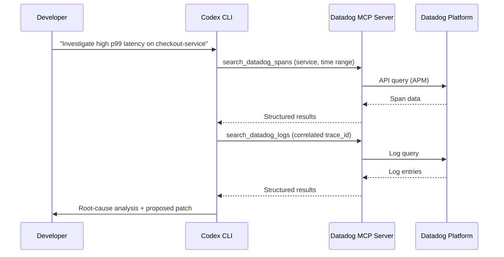

# Codex CLI + Datadog MCP Server: Observability-Driven Development from Your Terminal


---

On-call pages arrive at 03:00. You SSH into a jumpbox, open three browser tabs — Datadog dashboards, APM traces, log explorer — and start cross-referencing timestamps by hand. By the time you have found the offending span, the incident channel has escalated twice. That workflow is now obsolete. Since March 2026, Datadog ships a remote MCP server that exposes logs, metrics, traces, monitors, incidents, and more as tool calls any MCP-capable agent can invoke [^1]. Wire it into Codex CLI and the agent can query your production telemetry, correlate the data, and propose a fix — all inside a single terminal session.

This article walks through the integration end to end: architecture, configuration, toolset selection, security hardening, and three practical workflows that turn observability data into code changes.

## Architecture at a Glance



The Datadog MCP server is a **remote, streamable-HTTP** endpoint hosted by Datadog [^2]. Codex CLI connects over HTTPS using either OAuth 2.0 or API-key headers — no local sidecar process required. Every tool call maps to a Datadog API query, and the server enforces the same RBAC permissions as the Datadog web application [^3].

## Prerequisites

| Requirement | Detail |
|---|---|
| Codex CLI | v0.129.0+ (`npm install -g @openai/codex@latest`) |
| Datadog account | Any paid tier; the MCP server is available on all commercial sites [^3] |
| Permissions | `mcp_read` role for read operations; `mcp_write` for notebook/dashboard creation [^3] |
| Supported sites | `app.datadoghq.com`, `us3`, `us5`, `app.datadoghq.eu`, `ap1`, `ap2` (GovCloud excluded) [^3] |

## Configuration

### Minimal Setup

Add the server to `~/.codex/config.toml`:

```toml
[mcp_servers.datadog]
url = "https://app.datadoghq.com/mcp/sse"
```

Then authenticate via OAuth:

```bash
codex mcp login datadog
```

This opens a browser-based OAuth 2.0 flow. Once complete, Codex stores the token and refreshes it automatically [^4].

### API-Key Authentication

For headless environments — CI runners, remote devboxes — OAuth is impractical. Use scoped API credentials instead:

```toml
[mcp_servers.datadog]
url = "https://app.datadoghq.com/mcp/sse"
env_http_headers = { DD-API-KEY = "DD_API_KEY", DD-APPLICATION-KEY = "DD_APPLICATION_KEY" }
```

Export the variables from your secrets manager before launching Codex. Use a **service account** with minimal permissions rather than personal keys [^3].

### Selecting Toolsets

By default, Codex receives only the **core** toolset — roughly 22 tools covering logs, metrics, spans, monitors, incidents, dashboards, and hosts [^5]. You can widen or narrow scope via query parameters on the URL:

```toml
# Core + APM + Error Tracking + Software Delivery
[mcp_servers.datadog]
url = "https://app.datadoghq.com/mcp/sse?toolsets=core,apm,error_tracking,software_delivery"
```

Available toolsets include `alerting`, `apm`, `cases`, `dashboards`, `dbm`, `ddsql`, `error_tracking`, `feature_flags`, `kubernetes`, `networks`, `onboarding`, `reference_tables`, `security`, `software_delivery`, `synthetics`, and `workflows` [^5]. Enabling everything (`?toolsets=all`) is tempting but adds substantial token overhead per turn — each tool definition consumes context window. A pragmatic default for backend engineers:

```toml
url = "https://app.datadoghq.com/mcp/sse?toolsets=core,apm,error_tracking,software_delivery"
```

### Hardening with Tool Allow-Lists

Even within a toolset, you may want to restrict which tools the agent can call. Use `enabled_tools` to create an explicit allow-list [^4]:

```toml
[mcp_servers.datadog]
url = "https://app.datadoghq.com/mcp/sse?toolsets=core,apm"
enabled_tools = [
  "search_datadog_logs",
  "analyze_datadog_logs",
  "search_datadog_spans",
  "get_datadog_trace",
  "search_datadog_monitors",
  "search_datadog_incidents",
  "get_datadog_incident",
  "get_datadog_metric",
]
```

This prevents the agent from creating dashboards or notebooks unattended — sensible if you run with `approval_policy = "unless-allow-listed"` [^6].

## Rate Limits

The Datadog MCP server enforces fair-use limits [^3]:

| Window | Limit |
|---|---|
| 10-second burst | 50 requests |
| Daily | 5,000 tool calls |
| Monthly | 50,000 tool calls |

For sustained incident investigation these limits are generous, but automated batch scripts calling `codex exec` in a loop can exhaust the daily budget quickly. Monitor consumption via the `datadog.mcp.tool.usage` metric emitted by the server itself [^3].

## Practical Workflows

### 1. Incident Triage: From Page to Patch

An on-call engineer receives a PagerDuty alert linked to a Datadog monitor. Rather than context-switching to the browser:

```bash
codex --approval-mode suggest \
  "Datadog monitor 'checkout-p99-latency' fired 10 minutes ago. \
   Use the Datadog MCP tools to: \
   1. Get the monitor details and current status \
   2. Search APM spans for checkout-service in the last 30 minutes \
   3. Search logs correlated with any slow traces \
   4. Identify the root cause and suggest a fix"
```

Codex calls `search_datadog_monitors`, `search_datadog_spans`, `search_datadog_logs`, and `get_datadog_trace` in sequence, correlates trace IDs across the results, and presents a root-cause summary with a proposed code change. The engineer reviews the diff, approves, and the fix ships — all without leaving the terminal.

### 2. Deploy Verification with CI Pipeline Telemetry

After a deploy, verify that error rates and latency have not regressed:

```bash
codex exec "Use Datadog MCP tools to compare the error rate and p99 latency \
  of payment-service for the 30 minutes before and after the deploy at 14:00 UTC today. \
  Output a markdown summary with pass/fail verdict."
```

With the `software_delivery` toolset enabled, the agent can also cross-reference CI pipeline events via `search_datadog_ci_pipeline_events` to link the deploy commit hash to any metric regression [^5].

### 3. Database Slow-Query Investigation

Enable the `dbm` toolset and point the agent at a sluggish endpoint:

```bash
codex "The /api/orders endpoint has degraded to 800ms p95. \
  Use Datadog DBM tools to find the slowest queries hitting the orders database, \
  retrieve their explain plans, and suggest index optimisations."
```

The agent calls `find_datadog_database_instances`, `get_datadog_database_query_performance`, `get_datadog_database_explain_plans`, and `optimize_datadog_database_query` to produce actionable index recommendations with the SQL to apply them [^5].

## Combining with AGENTS.md

Encode your observability workflow standards in your repository's `AGENTS.md`:

```markdown
## Observability

- Before claiming a performance fix is complete, use Datadog MCP tools to verify
  the relevant metric has improved in the last 5 minutes of staging traffic.
- When investigating incidents, always correlate APM traces with logs using
  trace_id before proposing a root cause.
- Never create or modify Datadog dashboards or monitors without human approval.
```

This ensures that any engineer on the team — or any `codex exec` CI job — follows the same investigative discipline.

## Combining with Hooks

Use a `PostToolUse` hook to audit every Datadog query the agent makes:

```toml
[[hooks]]
event = "PostToolUse"
tool_name_regex = "^(search|get|analyze)_datadog_.*"
command = "echo \"$(date -u +%Y-%m-%dT%H:%M:%SZ) DATADOG_QUERY tool=$CODEX_TOOL_NAME\" >> /var/log/codex-datadog-audit.log"
```

For write operations, enforce manual approval regardless of the global approval policy:

```toml
[[hooks]]
event = "PostToolUse"
tool_name_regex = "^(create|edit|upsert|delete)_datadog_.*"
command = "echo 'BLOCKED: Write operation requires manual approval' && exit 1"
```

## Security Considerations

| Risk | Mitigation |
|---|---|
| Agent exfiltrates production data | Sandbox network policy restricts outbound to Datadog endpoints only; `enabled_tools` limits read surface [^4] [^6] |
| Credential leakage in session logs | Use `bearer_token_env_var` or `env_http_headers` — never inline secrets in `config.toml` [^4] |
| Unintended dashboard/monitor mutation | Restrict to `mcp_read` role; use `enabled_tools` to omit write tools; add PostToolUse guard hooks |
| Rate-limit exhaustion | Monitor `datadog.mcp.tool.usage` metric; set daily budget alerts in Datadog itself [^3] |
| HIPAA / compliance | The MCP server is HIPAA-eligible, but verify your AI agent's data handling meets your compliance requirements [^3] |

## Known Limitations

- **GovCloud not supported.** The MCP server is unavailable on `app.ddog-gov.com` and `us2.ddog-gov.com` [^3].
- **No streaming results.** Large log or span queries return complete result sets; very broad time ranges may hit response-size limits or timeouts.
- **Context window cost.** Each enabled toolset adds tool definitions to the prompt. Enabling all toolsets can consume 10,000+ tokens before the first user message. Choose toolsets deliberately.
- **APM toolset is in preview.** Tools like `apm_trace_comparison` and `apm_latency_bottleneck_analysis` may change or be removed [^5].
- **Usage data retained 120 days.** Datadog retains MCP session metadata per its privacy policy [^3].

## Conclusion

The Datadog MCP server turns Codex CLI into an observability-aware coding agent. Instead of a human manually correlating dashboards, traces, and logs, the agent does the cross-referencing and presents a synthesised diagnosis. The key to making this practical is **toolset discipline** — enable only what you need, lock down write operations, and encode investigative standards in `AGENTS.md`. For on-call engineers, the payoff is measured in minutes saved at 03:00.

## Citations

[^1]: Datadog, "Datadog MCP Server: Connect your AI agents to Datadog tools and context," Datadog Blog, March 2026. [https://www.datadoghq.com/blog/datadog-remote-mcp-server/](https://www.datadoghq.com/blog/datadog-remote-mcp-server/)

[^2]: Datadog, "MCP Server | AI Agent-Ready Observability," Datadog Product Page, 2026. [https://www.datadoghq.com/product/ai/mcp-server/](https://www.datadoghq.com/product/ai/mcp-server/)

[^3]: Datadog, "Datadog MCP Server — Documentation," Datadog Docs, 2026. [https://docs.datadoghq.com/bits_ai/mcp_server/](https://docs.datadoghq.com/bits_ai/mcp_server/)

[^4]: OpenAI, "Model Context Protocol — Codex CLI," OpenAI Developers, 2026. [https://developers.openai.com/codex/mcp](https://developers.openai.com/codex/mcp)

[^5]: Datadog, "Datadog MCP Server Tools," Datadog Docs, 2026. [https://docs.datadoghq.com/bits_ai/mcp_server/tools/](https://docs.datadoghq.com/bits_ai/mcp_server/tools/)

[^6]: OpenAI, "Agent Approvals & Security — Codex CLI," OpenAI Developers, 2026. [https://developers.openai.com/codex/agent-approvals-security](https://developers.openai.com/codex/agent-approvals-security)

[^7]: Datadog, "Set Up the Datadog MCP Server," Datadog Docs, 2026. [https://docs.datadoghq.com/bits_ai/mcp_server/setup/](https://docs.datadoghq.com/bits_ai/mcp_server/setup/)

[^8]: Datadog & OpenAI, "Datadog + OpenAI: Codex CLI integration for AI-assisted DevOps," Datadog Blog, 2025. [https://www.datadoghq.com/blog/openai-datadog-ai-devops-agent/](https://www.datadoghq.com/blog/openai-datadog-ai-devops-agent/)
