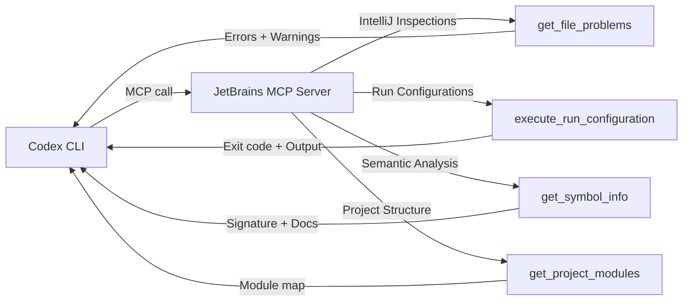
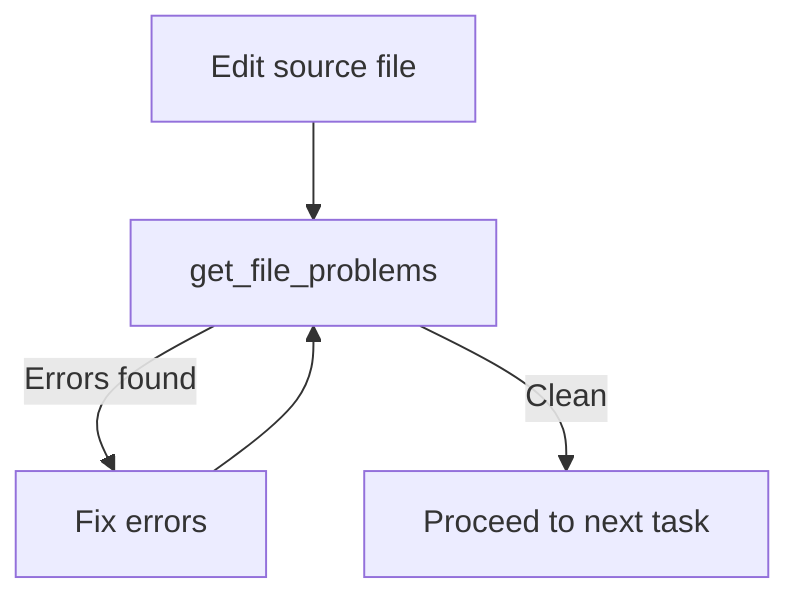

# Codex CLI + JetBrains MCP Server: Giving Your Terminal Agent IDE-Grade Intelligence


---

Codex CLI is a powerful terminal agent, but it operates blind to the rich static analysis, inspections, and run configurations that JetBrains IDEs accumulate over years of language-specific tooling. Since IntelliJ IDEA 2025.2, JetBrains ships a built-in MCP server that exposes over twenty IDE tools to any external client — including Codex CLI [^1]. The result is a terminal agent that can query IntelliJ inspections, execute run configurations, perform semantic renames, and reformat code without ever opening the IDE's GUI.

Skyscanner's engineering team published the first public case study of this integration in early 2026, reporting tighter feedback loops, fewer wasted iteration cycles, and higher first-attempt compilation success rates [^2]. This article walks through the architecture, configuration, available tools, and practical patterns for wiring JetBrains MCP into your Codex CLI workflow.

## Why This Matters

Terminal agents like Codex CLI read files, run shell commands, and call the Responses API — but they lack the deep semantic understanding that a running IDE provides. A JetBrains IDE with an indexed project knows about unresolved symbols, type mismatches, deprecated API usage, and available quick-fixes *before* any code is compiled or tested. Exposing that knowledge via MCP closes the feedback gap.



Without MCP, Codex discovers errors only after executing a build or test command — a slow, noisy process. With JetBrains MCP, Codex can call `get_file_problems` immediately after editing a file and receive a typed list of errors, warnings, and their exact locations, all powered by the same inspection engine that highlights problems in the IDE gutter [^1].

## The Tool Surface

The JetBrains MCP server exposes tools in three categories [^1][^3]:

### Code Intelligence

| Tool | Purpose |
|------|---------|
| `get_file_problems` | Run IntelliJ inspections on a file; returns severity, description, and location |
| `get_symbol_info` | Retrieve name, signature, and documentation for a symbol at a given position |
| `rename_refactoring` | Perform a project-wide semantic rename |
| `reformat_file` | Apply the project's code style rules |
| `search_in_files_by_regex` | Search using IntelliJ's regex engine with file masks |
| `search_in_files_by_text` | Substring search via IntelliJ's indexing |

### Project Structure

| Tool | Purpose |
|------|---------|
| `get_project_modules` | List all modules with their types |
| `get_project_dependencies` | Return all library dependencies |
| `get_run_configurations` | List available run/debug configurations |
| `get_all_open_file_paths` | Return files currently open in editor tabs |
| `find_files_by_name_keyword` | Fast indexed file lookup by name fragment |
| `find_files_by_glob` | Glob-based file search within the project |
| `list_directory_tree` | Directory contents in tree format |
| `get_repositories` | List VCS roots |

### Execution and Editing

| Tool | Purpose |
|------|---------|
| `execute_run_configuration` | Run a named configuration; returns exit code and output |
| `execute_terminal_command` | Run a shell command in the integrated terminal |
| `create_new_file` | Create a file with optional content |
| `replace_text_in_file` | Targeted find-and-replace |
| `open_file_in_editor` | Open a file in the IDE |

JetBrains also exposes **database tools** when the Database Tools and SQL plugin is active, including `execute_sql_query`, `list_database_connections`, and `preview_table_data` [^1]. For teams running local development databases, this turns Codex into a data-aware agent without additional MCP servers.

## Configuration

### Step 1: Enable the JetBrains MCP Server

In your JetBrains IDE, navigate to **Settings | Tools | MCP Server** and enable the server. Note the transport — JetBrains supports both SSE (HTTP) and stdio transports [^1].

### Step 2: Configure Codex CLI

For SSE transport (recommended when the IDE is already running):

```toml
# ~/.codex/config.toml  (user-scoped)
# or .codex/config.toml  (project-scoped, trusted projects only)

[mcp_servers.jetbrains]
url = "http://127.0.0.1:6340/mcp"
startup_timeout_sec = 15
tool_timeout_sec = 120

# Optional: restrict to the tools you actually need
enabled_tools = [
  "get_file_problems",
  "execute_run_configuration",
  "get_run_configurations",
  "get_symbol_info",
  "rename_refactoring",
  "reformat_file",
  "find_files_by_name_keyword",
]
```

For stdio transport (Codex launches the server process):

```toml
[mcp_servers.jetbrains]
command = "npx"
args = ["-y", "@anthropic-ai/mcp-jetbrains"]
startup_timeout_sec = 15
```

Verify the connection inside the TUI with the `/mcp` slash command, which lists all connected servers and their available tools [^4].

### Step 3: Add AGENTS.md Instructions

The JetBrains MCP is only useful if Codex knows *when* to call it. Add targeted instructions to your project's `AGENTS.md`:

```markdown
## IDE Integration (JetBrains MCP)

After editing any source file, call `get_file_problems` to check for
compilation errors and inspection warnings before proceeding.

When you need to run tests, use `get_run_configurations` to discover
available configurations, then `execute_run_configuration` to run them.
Prefer this over raw `./gradlew test` as it uses the IDE's classpath
and environment.

Use `reformat_file` after making changes to maintain code style.
Use `rename_refactoring` for renames — never find-and-replace manually.
```

This mirrors the pattern Skyscanner adopted: explicit instructions that tell the agent to query the IDE at decision points rather than relying on shell-based compilation [^2].

## The Skyscanner Pattern

Skyscanner's case study demonstrated a concrete failure mode that JetBrains MCP prevents [^2]. When generating Java code for a Databricks SDK integration, Codex produced:

```java
var stubError = new NotFound("dummy error");
```

The `NotFound` class does not accept a single-string constructor. Without MCP, this error surfaces only at compile time — typically after Codex has already moved on to the next file. With `get_file_problems` wired into the workflow, the inspection engine flags the constructor mismatch immediately, and Codex corrects it in the same turn.

The measured benefits Skyscanner reported:

- **Tighter feedback loops** — errors caught by inspections rather than compilation
- **Fewer iteration cycles** — reduced prompting back-and-forth
- **Higher first-attempt success** — code compiles and passes tests more often on the first try
- **No parallel tooling** — uses existing IDE configurations rather than duplicating linter/formatter setup

## Practical Workflow Patterns

### Pattern 1: Edit-Inspect-Fix Loop

The most common pattern is a tight loop where Codex edits a file, inspects it, and fixes any problems before moving to the next task:



### Pattern 2: Test-Driven with Run Configurations

For test-driven workflows, Codex discovers and executes run configurations rather than guessing `gradle` or `maven` invocations:

```bash
# In AGENTS.md:
# "Always use execute_run_configuration with the project's
#  test configuration rather than running gradle directly."
```

This is particularly valuable in monorepos where the correct test command varies by module, or where run configurations include environment variables and JVM arguments that shell commands would miss.

### Pattern 3: Semantic Refactoring

When Codex needs to rename a class, method, or variable, `rename_refactoring` performs a project-wide semantic rename that updates all references — including string literals in framework annotations, XML configuration files, and test fixtures. This is dramatically more reliable than regex-based find-and-replace.

### Pattern 4: Database-Aware Development

For teams using the JetBrains Database Tools plugin, Codex can query local development databases directly:

```toml
# Enable database tools alongside code intelligence
enabled_tools = [
  "get_file_problems",
  "execute_run_configuration",
  "list_database_connections",
  "execute_sql_query",
  "preview_table_data",
]
```

This enables workflows where Codex inspects the actual schema before generating migration scripts or repository code.

## Security Considerations

The JetBrains MCP server runs locally and exposes powerful capabilities — including file creation, terminal command execution, and database queries. Apply defence in depth [^5]:

1. **Tool allow-lists**: Use `enabled_tools` in `config.toml` to expose only the tools your workflow requires. Avoid enabling `execute_terminal_command` and `create_new_file` unless your approval policy catches side effects.

2. **Approval policies**: Codex's granular `approval_policy` configuration gates MCP tool calls. For JetBrains tools that mutate state (renames, file creation, terminal commands), ensure `mcp_tool_calls` requires approval [^5].

3. **Project-scoped configuration**: Place JetBrains MCP configuration in `.codex/config.toml` within the project rather than user-scoped config, so the integration only activates for projects that need it.

4. **Network binding**: The JetBrains MCP server binds to `127.0.0.1` by default. Do not expose it on `0.0.0.0` unless you have authenticated the transport.

## Limitations

- **IDE must be running**: The MCP server requires an active JetBrains IDE instance with the project open and indexed. If the IDE is closed, MCP calls fail silently or time out.
- **Indexing latency**: After Codex creates or modifies files via shell commands (not via JetBrains MCP tools), the IDE's index may take a few seconds to catch up. A brief `tool_timeout_sec` buffer helps.
- **Plugin coverage varies**: Not all JetBrains plugins expose their inspections through the MCP interface. Database tools require the paid Database Tools and SQL plugin [^1].
- **No debugging integration**: The MCP server cannot attach a debugger or set breakpoints programmatically — `execute_run_configuration` runs in "run" mode only.
- **Single project scope**: Each MCP server instance is bound to one project. Multi-project setups require multiple server instances or a project-switching workflow.

## Who Should Use This

This integration is most valuable for teams that:

- Work primarily in JetBrains IDEs (IntelliJ, PyCharm, WebStorm, Rider, GoLand)
- Have complex run configurations with environment variables and JVM arguments
- Maintain strict code style rules enforced by IntelliJ inspections
- Use JetBrains' database tooling for local development
- Want Codex to benefit from the same feedback loop human developers use

For teams that work exclusively in the terminal or use VS Code, the JetBrains MCP adds unnecessary complexity. The Codex CLI's built-in shell execution and the VS Code extension's native integration are better fits.

## Citations

[^1]: JetBrains, "MCP Server | IntelliJ IDEA Documentation," 2026. [https://www.jetbrains.com/help/idea/mcp-server.html](https://www.jetbrains.com/help/idea/mcp-server.html)

[^2]: Jack Waller / OpenAI, "Supercharging Codex with JetBrains MCP at Skyscanner," OpenAI Developers Blog, 2026. [https://developers.openai.com/blog/skyscanner-codex-jetbrains-mcp](https://developers.openai.com/blog/skyscanner-codex-jetbrains-mcp)

[^3]: JetBrains, "MCP Server — JetBrains Marketplace Plugin," 2026. [https://plugins.jetbrains.com/plugin/26071-mcp-server](https://plugins.jetbrains.com/plugin/26071-mcp-server)

[^4]: OpenAI, "Model Context Protocol — Codex | OpenAI Developers," 2026. [https://developers.openai.com/codex/mcp](https://developers.openai.com/codex/mcp)

[^5]: OpenAI, "Agent Approvals & Security — Codex | OpenAI Developers," 2026. [https://developers.openai.com/codex/agent-approvals-security](https://developers.openai.com/codex/agent-approvals-security)
