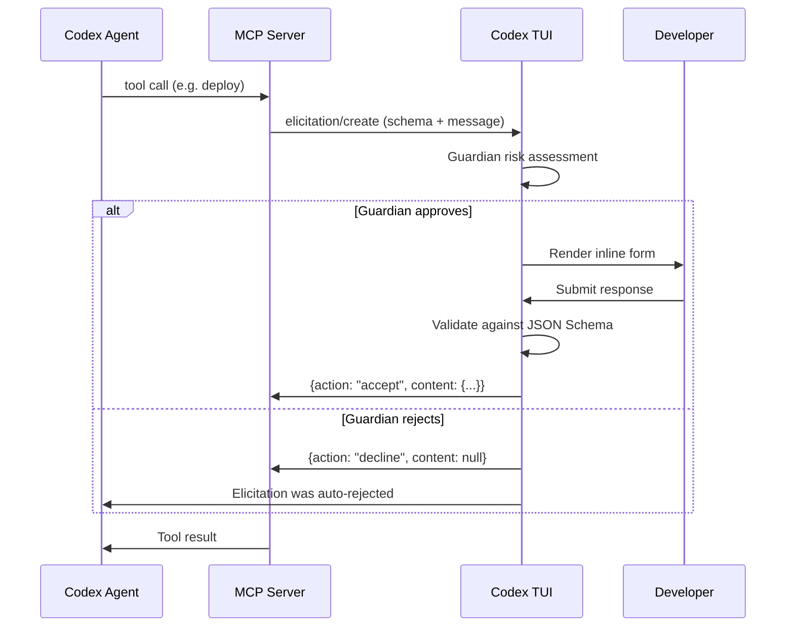

# MCP Elicitations in Codex CLI: Human-in-the-Loop Structured Input for Agent Workflows


---

Until Codex CLI v0.129, MCP servers were strictly one-directional during tool execution: the model called a tool, the server ran it, the result came back. If a server needed clarification — "which deployment environment?", "confirm destructive migration?" — it had no standard way to ask. Developers resorted to hard-coding defaults, environment variables, or splitting workflows into multiple turns.

MCP elicitations change that. They give any MCP server a protocol-level mechanism to pause execution, present a structured form to the user, validate the response against a JSON Schema, and resume — all within a single tool call [^1]. Codex CLI v0.129.0 surfaces these elicitations through its TUI and Guardian approval flows, making them a first-class part of the agent security model [^2].

## What Is an MCP Elicitation?

An elicitation is a JSON-RPC request from an MCP server to its client (in this case, Codex CLI) asking for structured user input mid-execution. The server sends an `elicitation/create` message with a human-readable prompt and a JSON Schema describing the expected response [^1].

```json
{
  "jsonrpc": "2.0",
  "id": 1,
  "method": "elicitation/create",
  "params": {
    "message": "Select the target deployment environment",
    "requestedSchema": {
      "type": "object",
      "properties": {
        "environment": {
          "type": "string",
          "enum": ["staging", "production", "canary"],
          "enumNames": ["Staging", "Production", "Canary"]
        },
        "confirm_destructive": {
          "type": "boolean",
          "title": "I confirm this may cause downtime"
        }
      },
      "required": ["environment", "confirm_destructive"]
    }
  }
}
```

The client renders this as a form, validates user input against the schema, and responds with one of three actions [^1] [^3]:

| Action | Meaning |
|--------|---------|
| `accept` | User submitted validated data |
| `decline` | User explicitly rejected the request |
| `cancel` | User dismissed without choosing |

```json
{
  "jsonrpc": "2.0",
  "id": 1,
  "result": {
    "action": "accept",
    "content": {
      "environment": "staging",
      "confirm_destructive": true
    }
  }
}
```

## Supported Schema Types

Elicitation schemas are deliberately constrained to flat objects with primitive properties — no nested objects, no complex arrays [^3]. This keeps client rendering simple and predictable:

| Type | Validation Constraints |
|------|----------------------|
| `string` | `minLength`, `maxLength`, `pattern`, formats: `email`, `uri`, `date`, `date-time` |
| `number` / `integer` | `minimum`, `maximum` |
| `boolean` | `default` value |
| `enum` | Single-select via `enum` array with optional `enumNames` |

This constraint is intentional. Elicitations are for quick, structured confirmation — not for building multi-page wizards inside a terminal.

## How Codex CLI Surfaces Elicitations

### TUI Rendering

When an MCP server sends an `elicitation/create` request during a tool call, Codex CLI pauses the agent turn and renders an inline form in the TUI. The user fills in the fields, and Codex validates against the JSON Schema before sending the response back to the server [^2].

The flow integrates with the existing Guardian approval pipeline. If `approvals_reviewer = "auto_review"` is configured, the Guardian evaluates the elicitation request for risk indicators — data exfiltration patterns, credential probing, destructive operations — before deciding whether to surface it to the user or auto-reject it [^4].



### Approval Policy Configuration

MCP elicitations are controlled through the granular approval policy in `config.toml` [^5]:

```toml
[approval_policy.granular]
mcp_elicitations = true    # Surface elicitation prompts to the user
sandbox_approval = false   # Auto-approve sandbox operations
rules = false              # Auto-approve rule prompts
request_permissions = false
skill_approval = false
```

When `mcp_elicitations = true`, elicitation prompts surface in the TUI. When `false` (or when the parent policy is `"never"`), they are silently auto-rejected — the MCP server receives a `decline` action and must handle it gracefully [^5].

This is critical for CI/CD pipelines where `approval_policy = "never"` is standard. Servers that rely on elicitations will receive `decline` responses in non-interactive contexts, so they must implement sensible fallback behaviour.

### The Three Approval Modes

The interaction between the top-level `approval_policy` and the granular `mcp_elicitations` flag determines what happens:

```toml
# Mode 1: Full interactive (default for TUI sessions)
approval_policy = "on-request"
# All elicitations surface to the user

# Mode 2: Selective — only elicitations are interactive
[approval_policy.granular]
mcp_elicitations = true
sandbox_approval = false

# Mode 3: Fully autonomous (CI/CD)
approval_policy = "never"
# All elicitations auto-rejected
```

## Writing an MCP Server That Uses Elicitations

Server-side, elicitations are straightforward. The server accesses the elicitation capability through the tool execution context [^1]:

```typescript
import { McpServer } from "@modelcontextprotocol/sdk/server/mcp.js";

const server = new McpServer({
  name: "deploy-server",
  version: "1.0.0",
  capabilities: { elicitation: {} }
});

server.tool("deploy", "Deploy to an environment", {
  branch: { type: "string", description: "Git branch to deploy" }
}, async ({ branch }, { sendElicitationRequest }) => {
  // Ask the user which environment
  const result = await sendElicitationRequest({
    message: `Deploy branch '${branch}' — select target environment`,
    requestedSchema: {
      type: "object",
      properties: {
        env: {
          type: "string",
          enum: ["staging", "production"],
          enumNames: ["Staging", "Production"]
        }
      },
      required: ["env"]
    }
  });

  if (result.action !== "accept") {
    return { content: [{ type: "text", text: "Deployment cancelled by user." }] };
  }

  const env = result.content.env;
  // Proceed with deployment...
  return {
    content: [{ type: "text", text: `Deployed ${branch} to ${env}` }]
  };
});
```

### Capability Negotiation

Clients declare elicitation support during the MCP `initialize` handshake [^3]:

```json
{
  "capabilities": {
    "elicitation": {
      "form": {}
    }
  }
}
```

Servers should check for this capability before attempting an elicitation. If the client does not declare support, the server must not send `elicitation/create` requests — it should fall back to defaults or fail with a clear error.

## Security Considerations

Elicitations introduce a new attack surface. A malicious or compromised MCP server could use elicitations to phish for credentials, trick users into confirming destructive operations, or exfiltrate data through carefully crafted form fields [^4].

Codex CLI mitigates this through several mechanisms:

1. **Guardian review** — When `approvals_reviewer = "auto_review"` is set, the Guardian agent evaluates each elicitation for risk indicators before surfacing it [^4].

2. **Schema constraints** — Only flat primitive types are permitted. No file uploads, no arbitrary HTML rendering, no embedded URLs in form mode [^3].

3. **Credential isolation** — The MCP spec explicitly states that sensitive data (passwords, API keys, OAuth tokens) must not be requested via form-mode elicitations. URL-mode elicitations exist for authentication flows, routing through agent-owned connect endpoints rather than exposing raw OAuth URLs [^3].

4. **Granular policy control** — Administrators can disable elicitations entirely via managed configuration whilst keeping other MCP functionality active [^5].

### Enterprise Hardening

For enterprise deployments using managed configuration, the recommended posture is:

```toml
# Managed config (admin-controlled, user cannot override)
[approval_policy.granular]
mcp_elicitations = true      # Allow elicitations from vetted servers
sandbox_approval = false
request_permissions = false

# Combined with MCP server allow-listing
[mcp_servers.internal-deploy]
command = "deploy-mcp-server"
enabled_tools = ["deploy", "rollback"]
# Only allow-listed servers can send elicitations
```

## Practical Patterns

### Database Migration Confirmation

An MCP server wrapping a migration tool can elicit confirmation before applying destructive changes:

```typescript
const result = await sendElicitationRequest({
  message: "Migration includes DROP TABLE. Confirm target database:",
  requestedSchema: {
    type: "object",
    properties: {
      database: { type: "string", enum: ["dev", "staging"] },
      acknowledge_data_loss: { type: "boolean" }
    },
    required: ["database", "acknowledge_data_loss"]
  }
});

if (!result.content?.acknowledge_data_loss) {
  return { content: [{ type: "text", text: "Migration aborted." }] };
}
```

### Multi-Step Workflow Gating

Combine elicitations with Codex CLI hooks for defence-in-depth. A `PreToolUse` hook can audit which MCP servers are attempting elicitations, whilst the elicitation itself confirms the specific action:

```toml
# config.toml — hook that logs elicitation-capable server activity
[[hooks]]
event = "PreToolUse"
command = "bash -c 'echo \"$(date): MCP tool $CODEX_TOOL_NAME called\" >> /tmp/mcp-audit.log'"
```

## Limitations

- **No nested schemas** — Complex configuration objects must be flattened or split across multiple elicitations [^3].
- **No file input** — Elicitations cannot request file uploads; use MCP resource subscriptions instead.
- **CI/CD incompatibility** — In non-interactive contexts (`approval_policy = "never"`), all elicitations are auto-rejected. Servers must handle `decline` gracefully [^5].
- **No elicitation history** — Unlike tool calls, elicitation interactions are not currently persisted in session logs for replay. ⚠️
- **Rate limiting** — The spec does not define limits on how frequently a server can send elicitation requests. A poorly written server could flood the TUI with prompts. ⚠️

## When to Use Elicitations

Elicitations are the right choice when:
- A tool needs **runtime parameters** that cannot be determined from context (target environment, confirmation of destructive action)
- The information is **security-sensitive** enough to warrant explicit user consent
- The workflow benefits from **staying in a single turn** rather than splitting into multiple agent interactions

They are not appropriate for:
- Collecting complex, multi-page configuration (use a separate config file)
- Authentication flows (use URL-mode elicitations or OAuth via `codex mcp login`)
- Data that the agent could infer from the codebase or AGENTS.md context

## Citations

[^1]: MCP Elicitation: Human-in-the-Loop for MCP Servers — [dev.to/kachurun](https://dev.to/kachurun/mcp-elicitation-human-in-the-loop-for-mcp-servers-m6a)

[^2]: Codex CLI v0.129.0 Changelog — [developers.openai.com/codex/changelog](https://developers.openai.com/codex/changelog)

[^3]: Elicitation: Structured User Input — Agent Client Protocol RFD — [agentclientprotocol.com/rfds/elicitation](https://agentclientprotocol.com/rfds/elicitation)

[^4]: Agent Approvals & Security — Codex CLI — [developers.openai.com/codex/agent-approvals-security](https://developers.openai.com/codex/agent-approvals-security)

[^5]: Configuration Reference — Codex CLI — [developers.openai.com/codex/config-reference](https://developers.openai.com/codex/config-reference)
