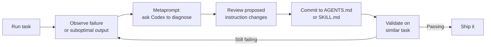

# Codex CLI Metaprompting: Using the Agent to Improve Its Own Instructions


Most developers treat their AGENTS.md and skills as write-once configuration. They scaffold an initial file with `/init`, tweak a few lines, and never touch it again. This leaves substantial performance on the table. OpenAI's own Codex Prompting Guide includes a section on *metaprompting* — asking the model to propose instruction changes that address specific performance issues[^1] — yet few teams apply this technique systematically.

This article covers the metaprompting feedback loop: detecting behavioural drift in Codex CLI sessions, using the agent itself to diagnose root causes, encoding fixes into durable instruction surfaces, and validating that the changes actually stick.

## What Metaprompting Is (and Is Not)

Metaprompting uses one LLM invocation to improve the prompts consumed by subsequent invocations[^2]. In the Codex CLI context, it means asking Codex to analyse its own failures and propose concrete edits to AGENTS.md, skills, or config.toml — the three instruction surfaces that persist across sessions[^3].

It is *not* a self-modifying agent loop. The human remains in the approval path. Codex proposes; you review and commit. The distinction matters: uncurated, self-generated skill improvements produce zero measurable benefit, whereas human-curated improvements can lift pass rates by over sixteen percentage points[^4].



## The Three Instruction Surfaces

Before running a metaprompting session, understand where your fix should land:

| Surface | Scope | Survives compaction? | Best for |
|---------|-------|---------------------|----------|
| `AGENTS.md` | Per-directory, inherited downward | Yes (reloaded per run) | Repository conventions, build commands, architectural constraints |
| `SKILL.md` | Global or project-scoped | Yes (loaded on match) | Reusable workflow patterns, tool-specific procedures |
| `config.toml` | User or project profile | Yes (static config) | Model selection, reasoning effort, sandbox policies |

Codex builds its instruction chain once per run by walking from `~/.codex/AGENTS.md` (or `AGENTS.override.md`) through every directory from the Git root to the current working directory[^5]. Combined file size defaults to 32 KiB[^5], so metaprompting sessions should also propose *removals* — stale instructions that waste context budget.

## Pattern 1: Post-Session Retrospective

The simplest metaprompting pattern runs at the end of a session that went sideways. Rather than closing the terminal and manually editing AGENTS.md, ask Codex directly:

```
You just completed a task but made two mistakes:
1. You ran `npm test` instead of `pnpm test`
2. You created a CommonJS module in an ESM-only project

Review the current AGENTS.md and propose a minimal diff
that would prevent both mistakes in future sessions.
Output the diff as a fenced apply_patch block.
```

Codex has full context: the conversation history, the mistakes, and the current AGENTS.md contents. Its proposed diff is typically precise because it can correlate the failure with the missing instruction.

OpenAI's best practices make this pattern explicit: "When Codex makes the same mistake twice, ask it for a retrospective and update AGENTS.md"[^6].

## Pattern 2: Batch Metaprompting via `codex exec`

For teams running Codex across many repositories, a non-interactive metaprompting pass scales better:

```bash
codex exec "Read AGENTS.md and the last 5 session transcripts \
in ~/.codex/sessions/. Identify the three most common correction \
patterns where I overrode your initial approach. For each, propose \
a concrete AGENTS.md addition that would eliminate the correction. \
Output as a single Markdown file." \
  --sandbox read-only \
  -o /tmp/metaprompt-report.md
```

The `--sandbox read-only` flag ensures Codex cannot modify anything during analysis[^7]. The output file becomes a review artefact: skim it, cherry-pick the useful rules, discard the rest.

## Pattern 3: Skill Refinement Loop

Skills use progressive disclosure — Codex initially sees only the name and description, loading full instructions only when activated[^8]. A poor description means the skill never fires; an over-broad one fires when it should not.

Metaprompting can tighten both:

```
I have a skill at ~/.agents/skills/api-scaffold/SKILL.md.
It should activate when I ask to create a new REST endpoint
but NOT when I'm debugging an existing endpoint.

Review the current name, description, and trigger terms.
Propose updated frontmatter that improves activation precision.
Include three match examples and three non-match examples
I can use as manual test cases.
```

The match/non-match examples mirror the `match` and `not_match` validation arrays in Starlark policy rules[^9] — a testing pattern worth borrowing for skill descriptions.

## Pattern 4: Reasoning Effort Calibration

Metaprompting is not limited to natural-language instructions. You can ask Codex to recommend configuration changes:

```
I'm running a polyglot monorepo with Go services and React frontends.
My current config.toml uses model_reasoning_effort = "medium" globally.

Based on the types of tasks I typically run (test generation,
refactoring, code review), propose a profile-based config.toml
that uses different reasoning effort levels for different workflows.
Explain the cost/quality trade-off for each.
```

Profile-based reasoning effort tuning can reduce token spend by 50–70% compared to a flat medium setting, while maintaining quality where it matters[^10].

```toml
# Example output from a metaprompting session
[profile.plan]
model = "gpt-5.5"
model_reasoning_effort = "high"

[profile.implement]
model = "gpt-5.4"
model_reasoning_effort = "low"

[profile.review]
model = "gpt-5.5"
model_reasoning_effort = "high"
```

## Anti-Patterns to Avoid

**Over-specification.** Metaprompting can generate verbose, hyper-specific rules that bloat AGENTS.md past the 32 KiB limit. Every rule added should pass a simple test: does this prevent a *recurring* failure, or a one-off mistake? One-off corrections belong in the prompt, not the config.

**Uncurated automation.** Running metaprompting in a fully automated loop — where proposed changes are committed without review — degrades instruction quality over time[^4]. The human review step is load-bearing.

**Stale instructions.** Instructions that referenced deprecated commands, old model names, or defunct APIs actively mislead the agent. Each metaprompting session should include a pruning pass: "Which existing instructions in AGENTS.md reference tools, commands, or conventions that no longer apply?"

## Validation: Did It Actually Work?

After committing a metaprompting-derived change, validate it:

```bash
# Replay the original failing scenario
codex exec "Create a new user endpoint in services/users/" \
  --sandbox workspace-write \
  --json 2>&1 | jq '.type'
```

If the agent now follows the corrected pattern without manual intervention, the instruction change is validated. If it still drifts, the instruction may be too vague or contradicted by another layer in the instruction chain. Use `/debug-config` inside an interactive session to inspect which files were loaded and in what order[^5].

## A Practical Weekly Cadence

For teams adopting metaprompting as a practice rather than an ad-hoc fix:

1. **Monday**: Review the previous week's session transcripts. Flag repeated corrections.
2. **Tuesday**: Run a batch metaprompting pass (`codex exec`) to generate proposed AGENTS.md and skill changes.
3. **Wednesday**: Review proposals in a PR. Prune stale instructions.
4. **Thursday–Friday**: Run with updated instructions. Note any new drift patterns.

This cadence treats agent instructions as living documentation — versioned, reviewed, and continuously refined — rather than static configuration[^6].

## Conclusion

Metaprompting closes the loop between observing agent behaviour and improving it. The technique is already embedded in OpenAI's official prompting guide[^1], yet most Codex CLI users never apply it deliberately. The patterns above — post-session retrospectives, batch analysis via `codex exec`, skill refinement, and reasoning effort calibration — provide concrete starting points. The key constraint remains human curation: let Codex propose, but always review before committing.

## Citations

[^1]: OpenAI, "Codex Prompting Guide — Metaprompting for Improvement," OpenAI Cookbook, February 2026. [https://developers.openai.com/cookbook/examples/gpt-5/codex_prompting_guide](https://developers.openai.com/cookbook/examples/gpt-5/codex_prompting_guide)

[^2]: Promptingguide.ai, "Meta Prompting," 2026. [https://www.promptingguide.ai/techniques/meta-prompting](https://www.promptingguide.ai/techniques/meta-prompting)

[^3]: OpenAI, "The Codex CLI Instruction Stack," OpenAI Developers, 2026. [https://developers.openai.com/codex/config-reference](https://developers.openai.com/codex/config-reference)

[^4]: IntuitionLabs, "Meta-Prompting: LLMs Crafting & Enhancing Their Own Prompts," 2026. [https://intuitionlabs.ai/articles/meta-prompting-llm-self-optimization](https://intuitionlabs.ai/articles/meta-prompting-llm-self-optimization)

[^5]: OpenAI, "Custom Instructions with AGENTS.md," OpenAI Developers, 2026. [https://developers.openai.com/codex/guides/agents-md](https://developers.openai.com/codex/guides/agents-md)

[^6]: OpenAI, "Best Practices — Codex," OpenAI Developers, 2026. [https://developers.openai.com/codex/learn/best-practices](https://developers.openai.com/codex/learn/best-practices)

[^7]: OpenAI, "Non-interactive Mode — Codex," OpenAI Developers, 2026. [https://developers.openai.com/codex/noninteractive](https://developers.openai.com/codex/noninteractive)

[^8]: OpenAI, "Agent Skills — Codex," OpenAI Developers, 2026. [https://developers.openai.com/codex/skills](https://developers.openai.com/codex/skills)

[^9]: OpenAI, "Rules — Codex," OpenAI Developers, 2026. [https://developers.openai.com/codex/rules](https://developers.openai.com/codex/rules)

[^10]: OpenAI, "Codex CLI Performance Optimisation: Token Overhead, Hidden Costs and Tuning Tactics," Codex Blog, April 2026. [https://codex.danielvaughan.com/2026/04/08/codex-cli-performance-optimization/](https://codex.danielvaughan.com/2026/04/08/codex-cli-performance-optimization/)
