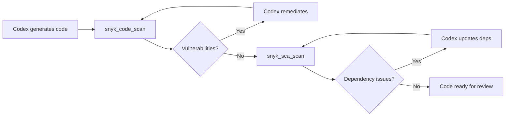
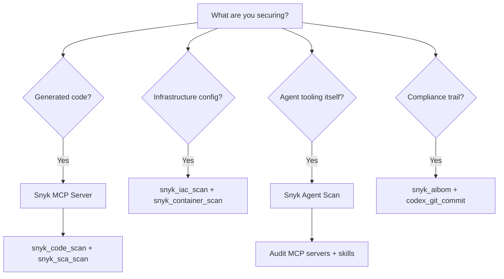

# Codex CLI + Snyk MCP Server: Security Scanning for AI-Generated Code and the Agent Supply Chain


---

AI coding agents generate code at a pace that outstrips traditional review workflows. Codex CLI's sandboxed execution model keeps agent commands contained, but the *output* — the code itself — still needs scrutiny. Snyk's MCP server integration brings static analysis, dependency scanning, container checks, and a novel AI Bill of Materials directly into the agent loop, turning security from a downstream gate into an inline guardrail.

This article covers the full Snyk surface available to Codex CLI: the MCP server's ten tools, practical `config.toml` setup, AGENTS.md conventions for "secure at inception" workflows, PostToolUse hooks for automated scanning gates, and Snyk Agent Scan for auditing Codex's own MCP and skills supply chain.

## Why AI-Generated Code Needs Inline Security

The Opsera 2026 AI Coding Impact Benchmark found that AI-assisted commits introduced 15–18% more security vulnerabilities than human-only commits, whilst simultaneously creating a 4.6× review bottleneck [^1]. Traditional SAST and SCA gates run *after* a pull request is raised — by which point the developer has context-switched and the fix cycle lengthens.

Snyk's MCP integration shifts scanning left — into the agent's own turn loop. When Codex generates a file, the same session can immediately invoke `snyk_code_scan` and remediate before the code ever leaves the working directory [^2].

## Setting Up the Snyk MCP Server

### Prerequisites

You need Snyk CLI v1.1298.0 or later and a Snyk account (free tier works for open-source projects) [^3]. The MCP server ships as a built-in subcommand of the Snyk CLI — no separate package required.

### config.toml Configuration

Add the following to your project-level `.codex/config.toml` or user-level `~/.codex/config.toml`:

```toml
[mcp_servers.snyk]
command = "npx"
args = ["-y", "snyk@latest", "mcp", "-t", "stdio"]
```

If you have the Snyk CLI installed globally, use the direct path instead:

```toml
[mcp_servers.snyk]
command = "/usr/local/bin/snyk"
args = ["mcp", "-t", "stdio"]
```

The `-t stdio` flag selects the standard I/O transport — the recommended mode for local integrations [^3]. Snyk also supports SSE transport, but stdio avoids network overhead and keeps all traffic local.

### Authentication

On first invocation, the MCP server triggers a browser-based authentication flow. For headless or CI environments, export your Snyk API token:

```bash
export SNYK_TOKEN="your-snyk-api-token"
```

You can also prompt Codex directly: *"Authenticate my Snyk account"* to trigger the `snyk_auth` tool [^4].

### Tool Allow-Listing

To restrict which Snyk tools the agent can invoke, use Codex's `enabled_tools` mechanism:

```toml
[mcp_servers.snyk]
command = "npx"
args = ["-y", "snyk@latest", "mcp", "-t", "stdio"]
enabled_tools = [
  "snyk_code_scan",
  "snyk_sca_scan",
  "snyk_iac_scan",
  "snyk_container_scan"
]
```

This keeps the agent focused on scanning and prevents unintended calls to `snyk_logout` or `snyk_trust` [^5].

## The Snyk MCP Tool Surface

The Snyk MCP server exposes ten tools across three categories [^6] [^7]:

### Core Scanning Tools

| Tool | Purpose | What It Analyses |
|------|---------|------------------|
| `snyk_code_scan` | SAST | First-party source code across 30+ languages |
| `snyk_sca_scan` | SCA | Open-source dependency vulnerabilities |
| `snyk_iac_scan` | IaC scanning | Terraform, CloudFormation, Kubernetes manifests |
| `snyk_container_scan` | Container security | Docker images and base image vulnerabilities |

### Supply Chain Management Tools

| Tool | Purpose |
|------|---------|
| `snyk_sbom_scan` | Analyses existing Software Bill of Materials files |
| `snyk_aibom` | Generates an AI Bill of Materials for AI-generated code |

### Utility Tools

| Tool | Purpose |
|------|---------|
| `snyk_auth` | Authenticates the Snyk session |
| `snyk_trust` | Marks a folder as trusted before scanning |
| `snyk_version` | Returns Snyk CLI version information |
| `snyk_logout` | Terminates the Snyk session |

**Important caveat:** `snyk_sca_scan` may execute third-party build tools (Gradle, Maven, pip) on your machine to resolve the dependency tree [^3]. Under Codex's sandboxed execution, these tools need network access — ensure your sandbox policy permits it or run SCA scans in a pre-configured environment.

## The Secure-at-Inception Workflow

The most valuable pattern combines Codex's code generation with immediate inline scanning. The workflow looks like this:



### AGENTS.md Security Directives

Encode the scan-fix loop in your project's `AGENTS.md` so every session follows the same pattern:

```markdown
## Security Standards

- After generating or modifying any source file, run `snyk_code_scan` on the
  changed files before proceeding to the next task.
- After adding or updating any dependency, run `snyk_sca_scan` and remediate
  all high and critical severity findings before committing.
- For any Terraform or Kubernetes manifest changes, run `snyk_iac_scan` and
  fix all misconfigurations before proceeding.
- Re-scan after each remediation to confirm zero new issues.
- Never suppress or ignore critical-severity findings without explicit
  human approval.
```

These directives are re-read on every turn and survive context compaction, ensuring the security policy persists across long sessions [^8].

## PostToolUse Hooks for Automated Gates

For stricter enforcement, pair the AGENTS.md conventions with a PostToolUse hook that automatically triggers a scan after file modifications:

```toml
[[hooks]]
event = "post_tool_use"
tool = "apply_patch"
command = "snyk code test --severity-threshold=high --json"
timeout_ms = 30000
```

When the hook's exit code is non-zero (vulnerabilities found), Codex receives the JSON output as context and can act on it immediately [^9]. This converts security scanning from a suggestion into a hard gate.

For dependency changes specifically:

```toml
[[hooks]]
event = "post_tool_use"
tool = "apply_patch"
command = "bash -c 'git diff --name-only HEAD | grep -qE \"package\\.json|go\\.mod|requirements\\.txt|Cargo\\.toml\" && snyk test --severity-threshold=high || true'"
timeout_ms = 60000
```

## The AI Bill of Materials (AIBOM)

The `snyk_aibom` tool generates an AI-specific bill of materials — a structured record of what was generated by AI, which model produced it, and when [^6]. This is increasingly relevant for enterprise compliance frameworks that require AI provenance tracking.

A typical invocation from the Codex session:

> *"Generate an AIBOM for this project's AI-generated components and save it to `docs/aibom.json`."*

The AIBOM complements Codex's own `codex_git_commit` attribution feature, which appends `Co-authored-by:` trailers to commits [^10]. Together, they provide a dual-layer audit trail: git history shows *which* commits involved AI, whilst the AIBOM captures *what* the AI contributed at a component level.

## Auditing the Agent Supply Chain with Snyk Agent Scan

Security scanning of *generated* code is one dimension. The other is the supply chain of *tools the agent itself uses* — MCP servers, skills, and plugins. Snyk's ToxicSkills study found that 13.4% of agent skills on public registries contained at least one critical-level security issue, including malware distribution, prompt injection attacks, and exposed secrets [^11].

Snyk Agent Scan is a standalone CLI tool that audits your Codex installation:

```bash
# Install
uvx snyk-agent-scan@latest

# Authenticate
export SNYK_TOKEN="your-snyk-api-token"

# Scan all MCP server configurations
snyk-agent-scan

# Include skills in the scan
snyk-agent-scan --skills

# Scan a specific config file
snyk-agent-scan ~/.codex/config.toml
```

Agent Scan auto-discovers configurations for Codex CLI alongside Claude Code, Cursor, Gemini CLI, and other agents [^12]. It detects over 15 distinct security risks:

- **Prompt injection** in tool descriptions
- **Tool poisoning** — malicious behaviour hidden in MCP server implementations
- **Tool shadowing** — a server registering tools that impersonate trusted tools
- **Toxic data flows** — sensitive data leaking through tool call chains
- **Supply chain compromise** — known-vulnerable dependencies in server code

⚠️ **Important:** Agent Scan executes the `command` defined in your MCP configurations during scanning. Run it in a sandboxed environment when evaluating untrusted configurations, and review the interactive consent prompts carefully [^12].

For JSON output suitable for CI pipelines:

```bash
snyk-agent-scan --json > agent-scan-results.json
```

## Enterprise Hardening Patterns

### Profile-Based Security Levels

Define different scanning profiles for different contexts:

```toml
[profile.security-strict]
model = "gpt-5.5"

[profile.security-strict.mcp_servers.snyk]
command = "snyk"
args = ["mcp", "-t", "stdio"]
enabled_tools = [
  "snyk_code_scan",
  "snyk_sca_scan",
  "snyk_iac_scan",
  "snyk_container_scan",
  "snyk_sbom_scan",
  "snyk_aibom"
]

[profile.security-quick]
model = "gpt-5.4-mini"

[profile.security-quick.mcp_servers.snyk]
command = "snyk"
args = ["mcp", "-t", "stdio"]
enabled_tools = ["snyk_code_scan", "snyk_sca_scan"]
```

Switch profiles at invocation:

```bash
codex --profile security-strict    # Full scanning for production code
codex --profile security-quick     # Lightweight scanning for prototypes
```

### CI Pipeline Integration

Combine `codex exec` with Snyk scanning for automated security-aware code generation:

```bash
codex exec "Refactor the authentication module to use argon2id \
  for password hashing. After changes, run snyk_code_scan and \
  snyk_sca_scan. Report any findings." \
  --model gpt-5.5 \
  --output-schema '{"type":"object","properties":{"files_changed":{"type":"array","items":{"type":"string"}},"snyk_findings":{"type":"integer"},"status":{"type":"string"}}}'
```

## Known Limitations

| Limitation | Impact | Workaround |
|-----------|--------|------------|
| `snyk_sca_scan` runs build tools | May fail in strict sandbox modes | Use `workspace-write` sandbox or run SCA outside the sandbox |
| Browser auth required on first use | Blocks headless/CI environments | Pre-set `SNYK_TOKEN` environment variable |
| `snyk_trust` needed per folder | Scanning untrusted folders prompts confirmation | Pass `--disable-trust` for headless workflows ⚠️ |
| Agent Scan executes MCP commands | Scanning untrusted configs is itself a risk | Use sandboxed environment and review consent prompts |
| Free tier rate limits | May throttle frequent scanning in long sessions | Use a paid Snyk plan for team/enterprise use |

## Decision Framework



## Conclusion

Snyk's MCP integration gives Codex CLI teams a practical path to shifting security left — not just to the pull request, but into the agent's own execution loop. The combination of inline SAST/SCA scanning, AGENTS.md directives, PostToolUse hooks, and Agent Scan for supply-chain auditing covers both the code the agent writes and the tools the agent uses.

The scan-fix-rescan loop encoded in AGENTS.md is the key pattern: it turns security scanning from a phase-gate into a continuous background discipline that runs every time the agent touches code.

---

## Citations

[^1]: Opsera, "2026 AI Coding Impact Benchmark Report," April 2026. [https://opsera.io/resources/ai-coding-impact-benchmark-2026](https://opsera.io/resources/ai-coding-impact-benchmark-2026)

[^2]: Snyk, "Secure AI Coding With Snyk: Now Supporting Model Context Protocol (MCP)," 2026. [https://snyk.io/articles/secure-ai-coding-with-snyk-now-supporting-model-context-protocol-mcp/](https://snyk.io/articles/secure-ai-coding-with-snyk-now-supporting-model-context-protocol-mcp/)

[^3]: Snyk, "Codex CLI Guide — Snyk User Docs," 2026. [https://docs.snyk.io/integrations/snyk-studio-agentic-integrations/quickstart-guides-for-snyk-studio/codex-cli-guide](https://docs.snyk.io/integrations/snyk-studio-agentic-integrations/quickstart-guides-for-snyk-studio/codex-cli-guide)

[^4]: Snyk, "Agentic Security with Snyk Studio — Snyk User Docs," 2026. [https://docs.snyk.io/integrations/snyk-studio-agentic-integrations](https://docs.snyk.io/integrations/snyk-studio-agentic-integrations)

[^5]: OpenAI, "Agent Approvals & Security — Codex CLI," 2026. [https://developers.openai.com/codex/agent-approvals-security](https://developers.openai.com/codex/agent-approvals-security)

[^6]: Snyk, "Catch Vulnerabilities Early: Your Snyk MCP Cheat Sheet," 2026. [https://snyk.io/articles/snyk-mcp-cheat-sheet/](https://snyk.io/articles/snyk-mcp-cheat-sheet/)

[^7]: Snyk, "Snyk Studio MCP — GitHub," 2026. [https://github.com/snyk/studio-mcp](https://github.com/snyk/studio-mcp)

[^8]: OpenAI, "Custom Instructions with AGENTS.md — Codex," 2026. [https://developers.openai.com/codex/guides/agents-md](https://developers.openai.com/codex/guides/agents-md)

[^9]: OpenAI, "Hooks — Codex CLI," 2026. [https://developers.openai.com/codex/hooks](https://developers.openai.com/codex/hooks)

[^10]: OpenAI, "Codex CLI Changelog — v0.129.0," May 2026. [https://developers.openai.com/codex/changelog](https://developers.openai.com/codex/changelog)

[^11]: Snyk, "ToxicSkills: Malicious AI Agent Skills — ClawHub and skills.sh Study," February 2026. [https://snyk.io/blog/toxicskills-malicious-ai-agent-skills-clawhub/](https://snyk.io/blog/toxicskills-malicious-ai-agent-skills-clawhub/)

[^12]: Snyk, "Agent Scan — GitHub," 2026. [https://github.com/snyk/agent-scan](https://github.com/snyk/agent-scan)
