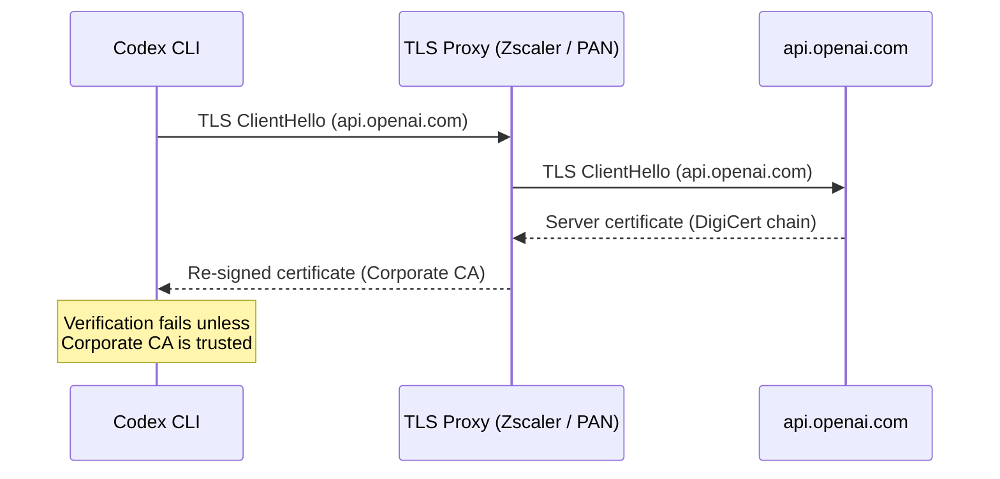
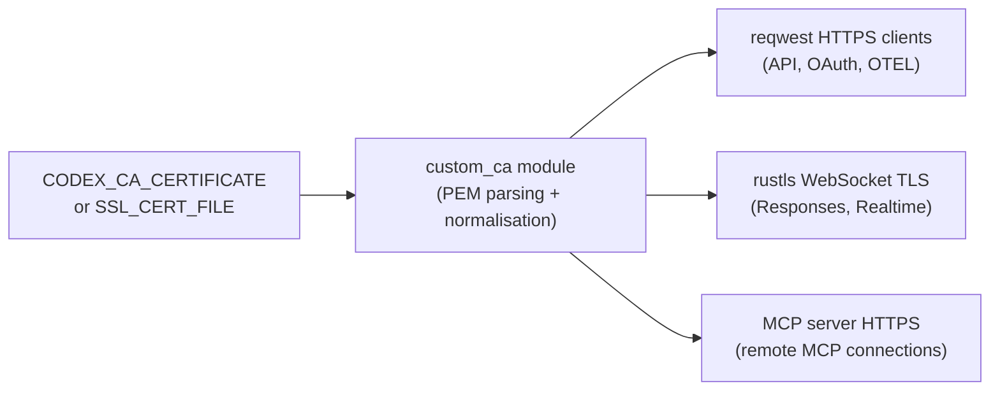

# Codex CLI Behind TLS-Inspecting Proxies: Custom CA Certificates for Enterprise Networks


---

Enterprise networks rarely let HTTPS traffic pass uninspected. Appliances from Zscaler, Palo Alto Networks, Fortinet, and others terminate TLS connections, inspect the cleartext, and re-encrypt with certificates signed by an internal root CA[^1]. Every developer tool that makes outbound HTTPS calls must trust that internal CA — or fail with opaque certificate-verification errors. Codex CLI was no exception: until recently, its OAuth login, API calls, and WebSocket streaming each handled certificates independently, leaving gaps that broke enterprise adoption. As of v0.129.0, a unified custom-CA subsystem covers every outbound connection[^2].

This article explains the architecture, walks through configuration, and provides a debugging runbook for teams deploying Codex CLI behind TLS-inspecting proxies.

## Why TLS Inspection Breaks Developer Tools

A TLS-inspecting proxy acts as a man-in-the-middle. When Codex CLI connects to `api.openai.com`, the proxy intercepts the TLS handshake, presents its own certificate (signed by the corporate root CA), and opens a separate TLS session to the real server. The tool sees a certificate chain that terminates at a root it does not recognise, and the connection fails[^3].



The symptom is consistent: the browser-based OAuth redirect completes successfully (the browser trusts the corporate CA via the OS trust store), but the token exchange — an HTTPS POST from the CLI process itself — fails with a certificate error[^4].

## The Three-Tier CA Precedence Model

Codex CLI resolves custom CA certificates using a strict precedence chain[^5]:

| Priority | Source | How to set |
|----------|--------|------------|
| 1 (highest) | `CODEX_CA_CERTIFICATE` | Environment variable pointing to a PEM file |
| 2 | `SSL_CERT_FILE` | Standard OpenSSL environment variable |
| 3 (default) | System roots | Platform trust store (Keychain on macOS, `ca-certificates` on Linux) |

The `CODEX_CA_CERTIFICATE` variable takes precedence because it allows Codex-specific overrides without affecting other tools on the same machine. If unset, Codex falls back to `SSL_CERT_FILE`, which most enterprise provisioning tools already configure[^6].

### Basic Setup

```bash
# Point to your corporate CA bundle
export CODEX_CA_CERTIFICATE=/etc/pki/tls/certs/corporate-root-ca.pem

# Authenticate — the login flow now trusts the proxy's certificate
codex login
```

The PEM file can contain a single certificate or a multi-certificate bundle. Codex parses each `-----BEGIN CERTIFICATE-----` block independently[^5].

## Unified Coverage: HTTPS and WebSocket

Before PR #14239 (merged into v0.129.0), custom CA handling only applied to the login flow. API calls succeeded because they happened to use a different HTTP client that respected the system trust store on some platforms — but WebSocket connections for streaming responses and Realtime voice sessions silently failed[^7].

The fix centralised CA policy into a single Rust module (`codex-client::custom_ca`) that constructs both `reqwest` HTTP clients and `rustls` TLS configurations from the same certificate bundle[^7]. Every outbound connection now passes through this shared path:



This means a single environment variable now covers:

- **OAuth login** — browser callback token exchange
- **API requests** — chat completions, responses, model queries
- **WebSocket streaming** — real-time response streaming
- **Realtime voice** — WebRTC signalling over secure WebSocket
- **MCP connections** — remote MCP server HTTPS calls
- **OTEL export** — telemetry sent to enterprise observability platforms

## Handling Non-Standard PEM Formats

Enterprise CA bundles often contain artefacts that trip up strict PEM parsers. Codex handles two common edge cases[^5]:

### OpenSSL TRUSTED CERTIFICATE Labels

OpenSSL's `c_rehash` tool sometimes emits certificates with `-----BEGIN TRUSTED CERTIFICATE-----` headers instead of the standard `-----BEGIN CERTIFICATE-----`. These blocks contain an `X509_AUX` trailer with trust metadata. Codex normalises them by stripping the trailer bytes and converting to standard DER before passing to `rustls`[^5].

### CRL Sections

Some bundles include Certificate Revocation Lists (`-----BEGIN X509 CRL-----`). Codex silently skips these sections during parsing rather than failing[^5].

### Validation Errors

If the PEM file is malformed or empty, Codex surfaces a diagnostic error that identifies:

- Which environment variable triggered the load (`CODEX_CA_CERTIFICATE` or `SSL_CERT_FILE`)
- The file path that failed
- Whether the failure was at file read, PEM parse, or certificate registration stage
- Recovery instructions[^5]

```
error: failed to load CA certificates from CODEX_CA_CERTIFICATE=/etc/pki/corp-ca.pem
  → file contains no valid PEM certificate blocks
  hint: ensure the file contains at least one -----BEGIN CERTIFICATE----- block
```

## OTEL Exporter TLS Configuration

For teams exporting telemetry to an internal Grafana, Datadog, or Jaeger instance that also sits behind TLS inspection, the OTEL exporter has its own certificate settings in `config.toml`[^8]:

```toml
[otel.exporter.corp]
endpoint = "https://otel-collector.internal.example.com:4318"

[otel.exporter.corp.tls]
ca-certificate = "/etc/pki/tls/certs/corporate-root-ca.pem"
client-certificate = "/etc/pki/tls/certs/codex-client.pem"
client-private-key = "/etc/pki/tls/private/codex-client-key.pem"
```

These paths are separate from `CODEX_CA_CERTIFICATE` because the OTEL collector may require mutual TLS (mTLS) with client certificates, which the main API connections do not need[^8].

## Device Authentication for Headless Environments

Corporate jump boxes and remote development servers often lack a browser. The standard OAuth flow requires a localhost callback, which fails when port forwarding is unavailable or blocked by policy. Codex offers device-code authentication as an alternative[^9]:

```bash
export CODEX_CA_CERTIFICATE=/etc/pki/tls/certs/corporate-root-ca.pem
codex login --device-auth
```

This initiates a device-code flow: Codex displays a URL and a short code. You open the URL on any machine with a browser, enter the code, and the CLI polls for the token over HTTPS — through the proxy, using the custom CA[^9].

## Sandbox Environment Variable Passthrough

By default, Codex's sandbox inherits a filtered set of environment variables to prevent credential leakage[^10]. If your `CODEX_CA_CERTIFICATE` or `SSL_CERT_FILE` is not reaching sandboxed subprocesses (for example, a sandboxed `npm install` failing with certificate errors), explicitly include them:

```toml
[shell_environment]
inherit = "core"

[shell_environment.include]
CODEX_CA_CERTIFICATE = true
SSL_CERT_FILE = true
NODE_EXTRA_CA_CERTS = true
REQUESTS_CA_BUNDLE = true
```

This ensures that tools invoked inside the sandbox (Node.js, Python, curl) also trust the corporate CA[^10].

## Debugging Runbook

When certificate issues arise, work through this sequence:

### 1. Verify the PEM Bundle

```bash
# Count certificates in the bundle
openssl storeutl -noout -text -certs \
  "$CODEX_CA_CERTIFICATE" 2>/dev/null | grep -c "Subject:"

# Verify the corporate root can validate a proxy-issued cert
openssl s_client -connect api.openai.com:443 \
  -CAfile "$CODEX_CA_CERTIFICATE" \
  -proxy proxy.corp.example.com:8080 2>&1 | grep "Verify return code"
```

A return code of `0 (ok)` confirms the bundle is correct.

### 2. Check Environment Variable Precedence

```bash
# Confirm which variable Codex will use
echo "CODEX_CA_CERTIFICATE=${CODEX_CA_CERTIFICATE:-<unset>}"
echo "SSL_CERT_FILE=${SSL_CERT_FILE:-<unset>}"
```

If both are set, `CODEX_CA_CERTIFICATE` wins. Ensure they do not point to different bundles with conflicting roots.

### 3. Test the Login Flow

```bash
RUST_LOG=codex_client::custom_ca=debug codex login 2>&1 | head -20
```

Debug logging from the `custom_ca` module shows which file was loaded, how many certificates were parsed, and whether any normalisation was applied[^7].

### 4. Test WebSocket Connectivity

If login succeeds but streaming responses hang or fail:

```bash
# Quick WebSocket test through the proxy
codex exec "echo hello" --model o4-mini 2>&1
```

If this fails with a TLS error after login succeeded, the CA bundle is reaching HTTPS clients but not WebSocket clients — upgrade to v0.129.0 or later where this is fixed[^7].

### 5. Check Sandbox Egress

```bash
# Inside a Codex session, test outbound connectivity
codex exec "curl -sI https://api.openai.com/v1/models" 2>&1
```

If this fails but direct CLI commands work, the sandbox is not passing through the CA variables. Add them to `[shell_environment.include]` as shown above.

## Common Enterprise Proxy Products

| Proxy Product | Certificate Location (typical) | Notes |
|---------------|-------------------------------|-------|
| Zscaler | `/usr/local/share/ca-certificates/zscaler-root.crt` | Often deployed via MDM; check `security find-certificate -c Zscaler` on macOS[^1] |
| Palo Alto Networks | `/etc/pki/ca-trust/source/anchors/pan-root.pem` | RHEL/CentOS path; Ubuntu uses `/usr/local/share/ca-certificates/` |
| Fortinet | Varies by FortiProxy deployment | Check with your network team |
| Netskope | `/Library/Application Support/Netskope/STAgent/data/nscacert.pem` | macOS default path |

## A Complete Enterprise Profile

Pulling the pieces together into a single `~/.codex/config.toml` for a corporate environment:

```toml
# Model provider behind an enterprise LLM proxy
[model_providers.corp]
name = "Corporate OpenAI Proxy"
base_url = "https://llm-proxy.internal.example.com/v1"
env_key = "OPENAI_API_KEY"

[model_providers.corp.http_headers]
X-Corp-Team = "platform-engineering"

# Shell environment — pass CA certs into sandbox
[shell_environment]
inherit = "core"

[shell_environment.include]
CODEX_CA_CERTIFICATE = true
SSL_CERT_FILE = true
NODE_EXTRA_CA_CERTS = true
REQUESTS_CA_BUNDLE = true

# OTEL to internal collector with mTLS
[otel.exporter.corp]
endpoint = "https://otel.internal.example.com:4318"

[otel.exporter.corp.tls]
ca-certificate = "/etc/pki/tls/certs/corporate-root-ca.pem"

# Credential storage in OS keyring
[auth]
cli_auth_credentials_store = "keyring"
```

Pair this with a shell profile entry:

```bash
# ~/.bashrc or ~/.zshrc
export CODEX_CA_CERTIFICATE="/etc/pki/tls/certs/corporate-root-ca.pem"
export NODE_EXTRA_CA_CERTS="$CODEX_CA_CERTIFICATE"
export REQUESTS_CA_BUNDLE="$CODEX_CA_CERTIFICATE"
```

## Limitations

- **Certificate pinning**: If OpenAI ever implements certificate pinning on API endpoints, custom CA interception will fail regardless of configuration. This is not currently the case, but enterprise teams should monitor for changes[^3].
- **macOS Keychain quirks**: On macOS, `CODEX_CA_CERTIFICATE` bypasses the system Keychain entirely. If your corporate CA is only in the Keychain (not exported as a PEM file), you must export it first: `security find-certificate -a -p /Library/Keychains/System.keychain > /tmp/system-cas.pem`.
- **Sandbox network mode**: In `network.enabled = false` mode, no outbound connections are permitted regardless of CA configuration. The CA settings only matter when the sandbox allows network access.
- **No per-provider CA overrides**: The `CODEX_CA_CERTIFICATE` applies globally. You cannot specify different CA bundles for different model providers. ⚠️ This may change in a future release.

## Citations

[^1]: Zscaler, "Setting Up SSL Inspection in Developer Environments," Zscaler Product Insights Blog, 2026. https://www.zscaler.com/blogs/product-insights/ssl-inspection-developer-environments-unlock-advanced-threat-protection

[^2]: OpenAI, "Codex Changelog — May 7, 2026 (v0.129.0)," OpenAI Developers, 2026. https://developers.openai.com/codex/changelog

[^3]: OpenAI, "OAuth Login Fails Behind Corporate Proxy with Custom CA Certificates," GitHub Issue #6849, 2026. https://github.com/openai/codex/issues/6849

[^4]: OpenAI, "Authentication — Codex," OpenAI Developers, 2026. https://developers.openai.com/codex/auth

[^5]: joshka-oai, "login: add custom CA support for login flows," GitHub PR #14178, 2026. https://github.com/openai/codex/pull/14178

[^6]: OpenAI, "Configuration Reference — Codex," OpenAI Developers, 2026. https://developers.openai.com/codex/config-reference

[^7]: joshka-oai, "client: extend custom CA handling across HTTPS and websocket clients," GitHub PR #14239, 2026. https://github.com/openai/codex/pull/14239

[^8]: OpenAI, "Advanced Configuration — Codex," OpenAI Developers, 2026. https://developers.openai.com/codex/config-advanced

[^9]: OpenAI, "Authentication — Codex: Headless Device Authentication," OpenAI Developers, 2026. https://developers.openai.com/codex/auth

[^10]: OpenAI, "Sandbox — Codex Concepts," OpenAI Developers, 2026. https://developers.openai.com/codex/concepts/sandboxing
