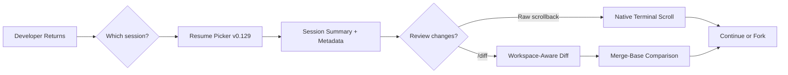
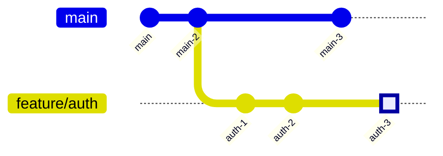
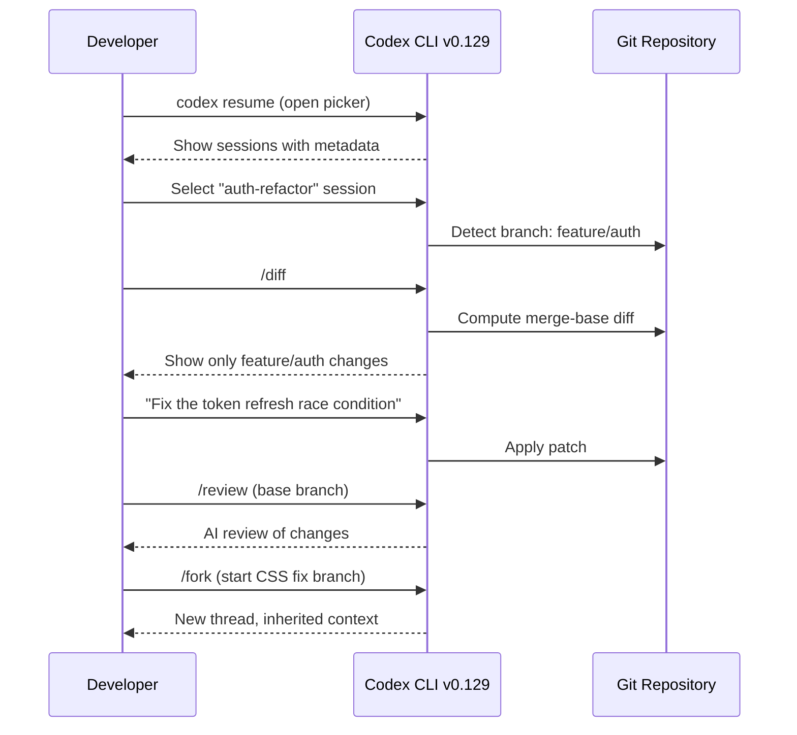

# Codex CLI v0.129 Session Workflow Upgrades: The Redesigned Resume Picker, Raw Scrollback, and Workspace-Aware /diff


---

Codex CLI v0.129.0, released on 7 May 2026, is a feature-dense release spanning Vim editing, plugin marketplace upgrades, and compaction hooks[^1]. Buried beneath those headline items is a quieter set of changes that affect every interactive session: a redesigned resume/fork picker, a raw scrollback mode for terminal-native output review, and a workspace-aware `/diff` command that understands your branch topology. Individually they are quality-of-life improvements. Together they reshape how experienced practitioners navigate multi-session workflows.

This article unpacks each change, shows the configuration knobs, and maps them into the daily rhythms of a developer who runs multiple Codex sessions across feature branches.

---

## The Session Problem v0.129 Solves

Before v0.129, resuming a Codex session meant choosing between two extremes. `codex resume --last` jumped straight to the most recent session, which was fast but brittle — it often selected a stale session from the wrong directory[^2]. The full picker (`codex resume`) listed every session without enough context to distinguish them at a glance. And once you resumed, reviewing what the agent had actually done required scrolling through the alternate-screen TUI or hunting through `~/.codex/sessions/` JSONL files manually.

The v0.129 improvements address three points on this workflow:

1. **Picking the right session** — the redesigned resume/fork picker now shows richer metadata per session.
2. **Reviewing what happened** — raw scrollback mode renders session output in your terminal's native scrollback buffer.
3. **Understanding what changed** — workspace-aware `/diff` computes diffs against the correct merge base, not just the working tree.



---

## The Redesigned Resume/Fork Picker

### What Changed

The session picker in v0.129 is a full-screen TUI panel rather than the earlier minimal list[^1]. Each entry now displays:

- **Session title** (auto-generated or user-set via `/title`)
- **Working directory** at session creation
- **Timestamp** of last activity
- **Turn count** and approximate token usage
- **Session summary** visible on highlight without opening the session

This means you can distinguish a "refactor auth middleware" session from a "fix CSS regression" session without resuming either.

### Usage Patterns

From the command line:

```bash
# Open the full picker
codex resume

# Skip the picker — resume last session from current directory
codex resume --last

# Show sessions from all directories, not just cwd
codex resume --all

# Target a specific session by ID
codex resume abc123-def456
```

From within an active session, the `/resume` slash command opens the same picker without exiting the TUI[^3]. The `/fork` command creates a new thread that inherits the parent's history but diverges from a chosen point[^4]. In v0.129 the fork picker now lets you walk back through the transcript using **Esc** (pressed twice with an empty composer) and select any earlier turn as the fork point[^1].

### Practical Tip: Directory-Scoped Sessions

By default, `codex resume` filters sessions to the current working directory. This is the right behaviour for monorepos where each package has its own Codex workflow. If you work from a single root, `codex resume --all` gives a global view. Configure this per-profile if you want different defaults:

```toml
# ~/.codex/config.toml
[profiles.monorepo]
# No config key exists yet to change the default —
# use --all as a CLI flag or alias:
# alias cra='codex resume --all'
```

---

## Raw Scrollback Mode

### The Alternate-Screen Trade-Off

Codex CLI runs in the terminal's **alternate screen buffer** by default[^5]. This gives a clean full-screen experience but means your terminal's native scrollback is empty when Codex exits — the output vanishes. Terminal multiplexers like tmux preserve the alternate buffer, but Zellij and VS Code's integrated terminal handle it inconsistently[^6][^7].

### What Raw Scrollback Does

Raw scrollback mode, introduced in v0.129, renders session output into the terminal's **main buffer** instead of the alternate screen[^1]. When the session ends or you scroll up, the content is in your terminal's native scrollback — selectable, searchable, and persistent until the buffer wraps.

This is controlled by the existing `tui.alternate_screen` configuration key:

```toml
# ~/.codex/config.toml
[tui]
# "auto" — skip alternate screen in Zellij; use it elsewhere
# "always" — always use alternate screen (clean but no scrollback)
# "never" — raw scrollback mode; output stays in main buffer
alternate_screen = "never"
```

You can also force it per-session with the `--no-alt-screen` CLI flag[^5]:

```bash
codex --no-alt-screen "refactor the auth module"
```

### When to Use It

| Scenario | Recommended Mode |
|---|---|
| Quick exploratory session you want to scroll back through | `never` (raw scrollback) |
| Long multi-turn session where TUI layout matters | `always` or `auto` |
| Running inside Zellij | `auto` (detects Zellij and skips alternate screen) |
| Running inside tmux | `always` (tmux preserves alternate buffer natively) |
| VS Code integrated terminal | `never` (avoids xterm.js alternate-screen quirks)[^7] |
| Piping output or running in CI | Use `codex exec` instead |

### Limitation: Full-Screen Redraws

Raw scrollback works well for reviewing completed output, but the TUI still performs cursor-addressed redraws for interactive elements (approval prompts, plan mode, progress indicators). In terminals that do not handle in-place updates gracefully, you may see rendering artefacts in the scrollback[^6]. The v0.129 release tightened this by "bounding terminal probes" and "clearing the first inline viewport render"[^1], but it remains an area of active development.

---

## Workspace-Aware /diff

### Before v0.129

The `/diff` slash command existed before v0.129, showing staged, unstaged, and untracked changes with syntax highlighting[^3]. But it operated on the working tree only — it did not know which branch you were on or what the merge base was. For feature-branch workflows, this meant the diff included upstream changes that had been merged into your branch, making it noisy and unhelpful for pre-review checks.

### The v0.129 Upgrade

Workspace-aware `/diff` now understands your branch topology[^1]. When you run `/diff`, it:

1. Detects your current branch
2. Finds the merge base against its upstream tracking branch
3. Computes a diff that shows **only your changes** since the branch point

This is the same merge-base logic that `/review` uses when you select "Review against a base branch"[^8], but `/diff` gives you the raw diff without the AI commentary — a quick sanity check before committing or before running `/review`.



In this graph, running `/diff` on `feature/auth` shows only the changes in `auth-1`, `auth-2`, and `auth-3` — not `main-3`. The merge base is `main-2`.

### Combining /diff and /review

A typical pre-PR workflow in v0.129 now looks like:

1. Run `/diff` — scan the raw diff for obvious issues (forgotten debug statements, accidental file inclusions)
2. Run `/review` and select "Review against a base branch" — get AI-powered risk analysis of the same changes
3. Address findings in-session
4. Run `/diff` again to confirm the fixes

This two-pass pattern catches different classes of issues: `/diff` is instant and deterministic; `/review` is slower but catches semantic problems like race conditions or missing error handling[^8].

---

## Theme-Aware Status Line with Branch Context

v0.129 also upgraded the TUI status line to show **theme-aware colours** and optional **PR and branch-change summaries**[^1]. The status line is configured as an ordered array of item identifiers:

```toml
# ~/.codex/config.toml
[tui]
status_line = ["model", "sandbox", "branch", "tokens"]
```

The `branch` item — new in v0.129 — displays your current Git branch and, when available, a summary of pending changes relative to the upstream. Combined with theme-aware colours, the status line now adapts to your chosen syntax theme (configured via `tui.theme`)[^9].

The `/statusline` slash command lets you reconfigure these fields interactively without editing `config.toml`, and `/title` does the same for the terminal window title[^3].

---

## /keymap debug: Diagnosing Key Binding Issues

A smaller but valuable v0.129 addition is `/keymap debug`, which enters a mode where every keypress is displayed as its raw terminal escape sequence[^1]. This is invaluable when:

- Custom keymaps do not trigger as expected
- Terminal multiplexers swallow or remap keys (common with Alt+key combinations in tmux)
- You need to verify that your terminal sends the correct sequences for Vim-mode bindings

Run `/keymap debug`, press the problematic key combination, note the escape sequence, then press **Esc** to exit. You can then map that exact sequence in your keymap configuration.

---

## Putting It Together: A Multi-Branch Workflow

Here is how these v0.129 features compose in a real development session:



The session picker gets you to the right context fast. `/diff` shows you exactly what you have changed on this branch. `/review` catches what you missed. And `/fork` lets you branch off without losing your place.

---

## Configuration Summary

| Key | Type | Default | Purpose |
|---|---|---|---|
| `tui.alternate_screen` | `auto \| always \| never` | `auto` | Controls scrollback mode[^5] |
| `tui.status_line` | `array<string> \| null` | (built-in default) | Status line items[^9] |
| `tui.terminal_title` | `array<string> \| null` | `["spinner", "project"]` | Terminal title items[^9] |
| `history.persistence` | `save-all \| none` | `save-all` | Whether sessions are saved[^9] |

---

## What Is Still Missing

These improvements are welcome, but gaps remain:

- **Session tagging and search** — the picker shows metadata but cannot filter by tag, date range, or keyword across session contents. Community tools like `agent-sessions`[^10] fill this gap with a separate UI.
- **Cross-surface resume** — sessions created in the Codex desktop app or IDE extension cannot always be resumed in the CLI and vice versa, though the app-server protocol is converging towards full interoperability[^11].
- **Scrollback in Zellij** — while `auto` mode disables the alternate screen in Zellij, full-screen redraws still interfere with clean scrollback in some configurations[^6]. ⚠️ This is a known limitation as of v0.129.

---

## Conclusion

The session workflow upgrades in Codex CLI v0.129 are the kind of changes that disappear into muscle memory within a week. The redesigned picker removes the guesswork from `codex resume`. Raw scrollback mode lets your terminal do what terminals do best — scroll. And workspace-aware `/diff` ensures you review your changes, not the entire branch history. None of these are headline features, but together they make the difference between a tool you tolerate and one you trust.

---

## Citations

[^1]: Codex CLI v0.129.0 release notes. [https://github.com/openai/codex/releases/tag/rust-v0.129.0](https://github.com/openai/codex/releases/tag/rust-v0.129.0)

[^2]: GitHub Issue #17302 — `codex resume --last` can start a fresh session even when picker can continue. [https://github.com/openai/codex/issues/17302](https://github.com/openai/codex/issues/17302)

[^3]: Codex CLI Slash Commands documentation. [https://developers.openai.com/codex/cli/slash-commands](https://developers.openai.com/codex/cli/slash-commands)

[^4]: Codex CLI Features documentation — session resume and fork. [https://developers.openai.com/codex/cli/features](https://developers.openai.com/codex/cli/features)

[^5]: Codex CLI TUI Alternate Screen documentation. [https://github.com/openai/codex/blob/main/docs/tui-alternate-screen.md](https://github.com/openai/codex/blob/main/docs/tui-alternate-screen.md)

[^6]: GitHub Issue #10331 — Zellij scrollback broken with --no-alt-screen. [https://github.com/openai/codex/issues/10331](https://github.com/openai/codex/issues/10331)

[^7]: GitHub Issue #14277 — --no-alt-screen does not preserve scrollback in xterm.js terminals. [https://github.com/openai/codex/issues/14277](https://github.com/openai/codex/issues/14277)

[^8]: Codex CLI Features documentation — /review and base branch review. [https://developers.openai.com/codex/cli/features](https://developers.openai.com/codex/cli/features)

[^9]: Codex CLI Configuration Reference. [https://developers.openai.com/codex/config-reference](https://developers.openai.com/codex/config-reference)

[^10]: agent-sessions — session browser for Codex CLI, Claude Code, and other agents. [https://github.com/jazzyalex/agent-sessions](https://github.com/jazzyalex/agent-sessions)

[^11]: Codex CLI App Server documentation. [https://developers.openai.com/codex/app-server](https://developers.openai.com/codex/app-server)
