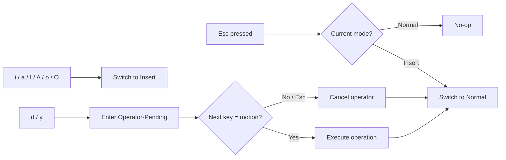

# Vim Modal Editing in the Codex CLI Composer: Configuration, Keymaps, and Terminal-Native Workflows


---

Codex CLI v0.129.0 shipped a feature that terminal-native developers have been requesting since the project's earliest days: modal Vim editing inside the TUI composer [^1]. The feature arrived as PR #18595 [^2], closing a gap that had driven users back to Claude Code purely for its `/vim` command [^3]. This article covers how to enable it, what it supports, how to customise keymaps, and where the boundaries lie.

## Why Vim Mode in the Composer Matters

AI coding agents live inside a tight prompt-edit-submit loop. Every time you reach for `Ctrl+G` to launch an external editor, you lose visual context — the agent's output scrolls off-screen, and your mental model of the conversation fractures [^3]. Inline Vim editing keeps the entire transcript visible while you restructure a multi-line prompt using motions you already know.

The distinction matters: this is not Neovim-inside-Codex. It is a focused, composer-scoped modal keymap that covers the subset of Vim operations useful for prompt editing. No `:wq`, no registers, no macros — just fast, muscle-memory cursor movement and text manipulation without leaving the input box [^2].

## Enabling Vim Mode

There are three ways to activate it.

### Runtime Toggle

Type `/vim` in the composer to toggle modal editing on or off for the current session [^1]. The mode indicator in the composer border switches between `NOR` and `INS` to reflect the active state.

### Persistent Configuration

Add the following to `~/.config/codex/config.toml` (or the project-scoped `.codex/config.toml`):

```toml
[tui]
vim_mode_default = true
```

This starts every session in Vim normal mode [^2]. The composer opens with a block cursor, ready for navigation commands rather than direct text entry.

### Global Keybinding

You can bind a key to toggle Vim mode from any context:

```toml
[tui.keymap.global]
toggle_vim_mode = "ctrl-\\"
```

Codex validates this binding against editor keys to prevent conflicts — if you pick a key already bound to a composer action, the CLI rejects it at startup [^2].

## Supported Keybindings

The implementation covers the core Vim motions and operators that matter for prompt editing. It deliberately omits features like registers, marks, and ex commands that add complexity without clear value in a single-input-field context [^2].

### Normal Mode

| Key | Action |
|-----|--------|
| `h` / `l` | Move cursor left / right |
| `j` / `k` | Move cursor down / up (or navigate command history at boundaries) |
| `w` / `b` | Jump forward / backward by word |
| `e` | Jump to end of word |
| `^` / `$` | Jump to first non-whitespace / end of line |
| `0` | Jump to start of line |
| `i` | Enter insert mode at cursor |
| `a` | Enter insert mode after cursor |
| `I` | Enter insert mode at line start |
| `A` | Enter insert mode at line end |
| `o` / `O` | Open line below / above and enter insert mode |
| `x` | Delete character under cursor |
| `dd` | Delete entire line |
| `yy` | Yank entire line |
| `p` | Paste after cursor |
| `u` | Undo |
| `/` | Open slash-command entry |
| `!` | Enter shell mode |

### Operator-Pending Mode

Typing `d` or `y` enters operator-pending mode, where the next motion determines the scope of the operation [^2]:

```
dw   → delete to next word boundary
d$   → delete to end of line
db   → delete backward one word
yw   → yank to next word boundary
y$   → yank to end of line
```

Invalid sequences (e.g., `d` followed by `i`) cancel the pending operator rather than entering insert mode — a deliberate safety decision to prevent accidental text loss [^2].

### Insert Mode

Insert mode behaves identically to the standard (non-Vim) composer. Press `Esc` to return to normal mode. Paste operations only function in insert mode [^2].

## Keymap Contexts and Customisation

Codex v0.129 introduced two new keymap contexts alongside the existing `global`, `chat`, `composer`, `editor`, `pager`, `list`, and `approval` contexts [^4]:

- **`vim_normal`** — active when the composer is in Vim normal mode
- **`vim_operator`** — active during operator-pending state (after pressing `d` or `y`)

You can override default bindings in `config.toml`:

```toml
[tui.keymap.vim_normal]
# Remap word-forward to W (WORD motion)
word_forward = "shift-w"

[tui.keymap.vim_operator]
# No customisations — use defaults
```

Context-specific bindings override `tui.keymap.global`, so a key bound in `vim_normal` takes precedence over the same key in `global` when the composer is in normal mode [^4].

### Inspecting Active Bindings

The `/keymap` slash command opens an interactive picker showing all active bindings across every context [^5]. For lower-level debugging — useful when terminal multiplexers swallow key sequences — use `/keymap debug` to inspect raw terminal key events [^1].



## Cursor Behaviour

The TUI render path changes cursor shape to reflect the active mode [^2]:

| Mode | Cursor |
|------|--------|
| Normal | Block (█) |
| Insert | Bar (│) |
| Operator-pending | Underline (_) |

Cursor styling is applied and restored on each render frame, so quitting Codex — or toggling Vim mode off — returns the terminal to its original cursor shape [^2].

## Interaction with Other TUI Features

### Command History

In normal mode, `j` and `k` navigate through command history when the cursor is at the top or bottom boundary of the input. Mid-text, they move the cursor vertically as expected [^2].

### Slash Commands

Pressing `/` in normal mode opens the slash-command picker rather than searching (there is no in-composer `/` search). This matches the existing Codex interaction model where `/` always means "run a command" [^5].

### Ctrl+G External Editor

The external editor escape hatch still works in Vim mode. `Ctrl+G` launches `$EDITOR` with the current composer content. On return, the composer repopulates and Vim mode state resets to normal [^6].

### Submission

Pressing `Enter` in insert mode submits the prompt (the standard behaviour). After a successful submission, the composer resets to normal mode if `vim_mode_default` is `true`, or to insert mode otherwise [^2].

## Comparison with Claude Code /vim

Claude Code shipped its `/vim` toggle earlier in 2025 [^3]. The implementations share the same core philosophy — opt-in, composer-scoped, no full Vim parity — but differ in specifics:

| Aspect | Codex CLI v0.129 | Claude Code |
|--------|-----------------|-------------|
| Activation | `/vim` toggle or `config.toml` | `/vim` toggle |
| Persistent config | `tui.vim_mode_default = true` | Stores preference per project |
| Keymap customisation | Full `tui.keymap.vim_normal` overrides | Not customisable |
| Operator-pending mode | `d`/`y` + motion | `d`/`y` + motion |
| Cursor shape changes | Yes (block/bar/underline) | Yes (block/bar) |
| `/keymap debug` | Yes | No equivalent |

The meaningful differentiator is Codex's keymap customisation layer. If your terminal multiplexer swallows `Ctrl+W` or your muscle memory maps `jk` to `Esc`, you can remap without patching source [^4].

## Practical Tips

1. **Start with runtime toggle.** Use `/vim` for a few sessions before committing to `vim_mode_default = true`. The muscle-memory conflict between "Enter submits" and "Enter opens a new line" catches people out.

2. **Bind `jk` to Esc in insert mode** if you use that mapping in Neovim. This is not built in but can be approximated by binding `escape` to `j k` in the `composer` context — check `/keymap` for current support.

3. **Use `/keymap debug`** when key sequences behave unexpectedly. Tmux, Zellij, and screen all intercept certain key combinations before they reach Codex [^1].

4. **Combine with `/side`** for complex prompt crafting. Start a side conversation in Vim mode to draft a detailed prompt, then paste the refined version into your main thread.

5. **Operator-pending timeout.** There is no timeout on operator-pending state — `d` waits indefinitely for a motion. If you accidentally press `d`, press `Esc` to cancel cleanly [^2].

## Limitations

- **No visual mode.** Character and line selection (`v`, `V`) are not implemented. Use the terminal's native selection for copy operations.
- **No registers.** `"a` through `"z` do not exist. Yank and paste use a single internal clipboard.
- **No `.` repeat.** The dot-repeat command is absent — repeat your last edit manually.
- **No `:` ex commands.** There is no command-line mode; use Codex slash commands instead.
- **Paste in normal mode is ignored.** Terminal paste events only register in insert mode [^2].

These omissions are intentional. The composer is a prompt input field, not a text editor. Features that would require maintaining a full Vim state machine add complexity without proportional value in this context.

## Citations

[^1]: [Codex CLI v0.129.0 Changelog](https://developers.openai.com/codex/changelog) — OpenAI, May 2026.
[^2]: [PR #18595: Vim composer mode for Codex TUI](https://github.com/openai/codex/pull/18595) — openai/codex, merged May 2026.
[^3]: [vi editing mode (like claude code /vim) — Issue #9184](https://github.com/openai/codex/issues/9184) — openai/codex, community feature request with 42 upvotes.
[^4]: [Configuration Reference — Codex CLI](https://developers.openai.com/codex/config-reference) — OpenAI Developers, keymap context documentation.
[^5]: [Slash Commands in Codex CLI](https://developers.openai.com/codex/cli/slash-commands) — OpenAI Developers, `/keymap` command reference.
[^6]: [Features — Codex CLI](https://developers.openai.com/codex/cli/features) — OpenAI Developers, external editor (`Ctrl+G`) documentation.
