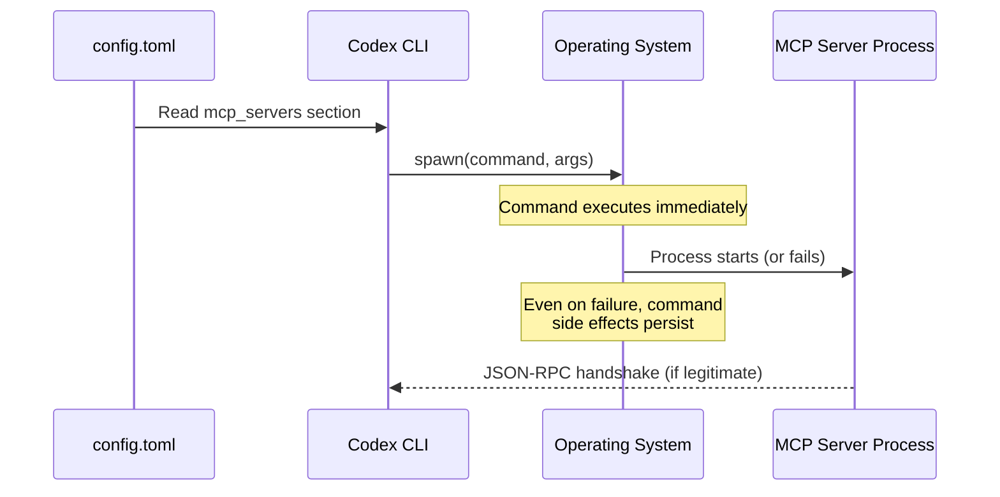
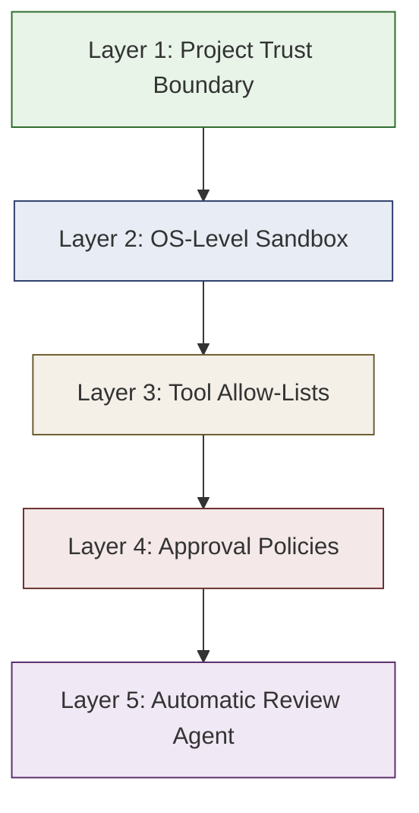

# The MCP STDIO Remote Code Execution Flaw: 200,000 Vulnerable Servers and How Codex CLI's Layered Defences Respond


---

In April 2026, OX Security disclosed an architectural flaw at the heart of Anthropic's Model Context Protocol that enables arbitrary command execution on any system running a vulnerable MCP implementation[^1]. The vulnerability affects every official MCP SDK — Python, TypeScript, Java, and Rust — and has yielded at least eleven CVEs across tools ranging from LiteLLM to Windsurf[^2]. With over 200,000 potentially affected server instances and 150 million cumulative downloads across the ecosystem, this is the most significant security event to hit the MCP landscape since the protocol's launch[^3].

For Codex CLI teams, the question is not whether MCP is safe in the abstract, but whether the specific way Codex configures, launches, and governs MCP servers mitigates the flaw in practice. This article dissects the vulnerability, maps it against Codex CLI's security model, and provides concrete hardening patterns.

## The Vulnerability: Configuration-to-Execution Without Sanitisation

### How STDIO Transport Works

MCP's STDIO transport launches a local process by executing a user-specified command. The host application (in this case, Codex CLI) spawns the process, connects to its standard input and output streams, and exchanges JSON-RPC messages over them[^4].

The architectural flaw is deceptively simple: **the command specified in the STDIO configuration is executed by the operating system regardless of whether the resulting process represents a legitimate MCP server**. If a malicious actor can write or modify the `command` field in an MCP server configuration, arbitrary code runs on the host machine the moment the application starts the server[^1].



### Why Anthropic Declined to Patch

Anthropic confirmed the behaviour is by design, stating that the STDIO execution model represents a secure default and that input sanitisation is the developer's responsibility[^3]. Their position is defensible in isolation — STDIO transport is inherently a local execution primitive — but it places the entire burden of trust on configuration integrity and host-side controls.

### The Eleven CVEs

OX Security's responsible disclosure campaign produced at least eleven CVEs from this single architectural pattern[^2]:

| CVE | Product | Attack Vector |
|-----|---------|--------------|
| CVE-2026-30615 | Windsurf | Zero-click prompt injection |
| CVE-2026-30623 | LiteLLM | Unauthenticated command injection (patched) |
| CVE-2026-30624 | Agent Zero | STDIO command injection |
| CVE-2026-30618 | Fay Framework | STDIO command injection |
| CVE-2026-33224 | Bisheng/Jaaz | STDIO injection (partially patched) |
| CVE-2026-30617 | Langchain-Chatchat | STDIO command injection |
| CVE-2026-30625 | Upsonic | STDIO command injection |
| CVE-2026-40933 | Flowise | STDIO command injection |
| CVE-2025-65720 | GPT Researcher | STDIO command injection |

The four exploitation families identified by OX Security are[^2]:

1. **Unauthenticated command injection** — web-facing AI frameworks accept STDIO server configurations via API, enabling remote RCE.
2. **Hardening bypass** — tools that implemented command allow-lists still permitted injection through argument manipulation.
3. **Zero-click prompt injection** — configuration files edited via IDE integrations execute without user interaction.
4. **Marketplace-triggered execution** — MCP server directories or registries inject hidden configurations during installation.

## How Codex CLI Launches MCP Servers

Codex CLI reads MCP server definitions from `config.toml` at two scopes[^4]:

```toml
# User-global: ~/.codex/config.toml
[mcp_servers.my-server]
command = "npx"
args = ["-y", "@example/mcp-server"]

# Project-scoped: .codex/config.toml (trusted projects only)
[mcp_servers.project-db]
command = "uvx"
args = ["db-mcp-server"]
env_vars = ["DATABASE_URL"]
```

Servers are spawned when a session starts. The `command` field is passed directly to the operating system — meaning Codex CLI is, at the protocol level, subject to the same STDIO execution pattern disclosed by OX Security[^4].

The critical difference lies in what surrounds that execution.

## Codex CLI's Layered Defence Model

Codex CLI does not rely on a single control to mitigate MCP-related risks. Instead, five independent layers create defence in depth[^5][^6]:



### Layer 1: Project Trust Boundary

Project-scoped `.codex/config.toml` files only take effect in trusted projects[^6]. When you open Codex CLI in an untrusted repository for the first time, project-level MCP server definitions are **not loaded** until you explicitly grant trust. This blocks the most dangerous variant of the flaw — a malicious repository shipping a `.codex/config.toml` with a weaponised `command` field.

### Layer 2: OS-Level Sandbox

Every command Codex executes — including the spawned MCP server processes — runs inside an OS-level sandbox[^5]:

- **macOS**: Seatbelt policies enforced at the kernel level, restricting filesystem access and network operations.
- **Linux**: Bubblewrap (`bwrap`) with mount/PID/network namespaces, plus seccomp BPF syscall filtering. Landlock LSM provides an additional fallback.
- **Windows**: Restricted tokens with DACL grants limiting the spawned process's capabilities.

A malicious STDIO command injected into config would still execute, but the sandbox constrains what it can access. A payload attempting to read `~/.ssh/id_rsa` or exfiltrate data over the network would hit sandbox deny rules in the default `workspace-write` profile[^5].

### Layer 3: Tool Allow-Lists

Even if an MCP server starts successfully, Codex CLI provides granular control over which tools the agent can invoke[^4]:

```toml
[mcp_servers.project-db]
command = "uvx"
args = ["db-mcp-server"]
enabled_tools = ["query", "list_tables"]
disabled_tools = ["drop_table", "execute_raw"]
```

The `enabled_tools` allow-list means only explicitly permitted tools are visible to the model. The `disabled_tools` deny-list is applied after `enabled_tools` for belt-and-braces filtering. A compromised MCP server that advertises unexpected tools (a common supply-chain attack pattern) would have those tools silently filtered out[^4].

### Layer 4: Approval Policies

Codex CLI's approval system provides a human-in-the-loop checkpoint for MCP tool calls[^6]:

- Tool calls that advertise **destructive annotations** always require approval, regardless of the configured policy.
- The `approval_policy.mcp_tool_calls` setting controls approval requirements for non-destructive MCP operations.
- In the default `on-request` mode, the Guardian UI surfaces each MCP tool call for explicit user approval before execution.

```toml
[approval_policy]
mcp_tool_calls = "always-approve"  # or "on-request", "never"
```

### Layer 5: Automatic Review Agent

For teams running Codex in CI or batch mode where a human cannot approve each call, the `auto_review` sub-agent evaluates MCP tool calls against policy before execution[^6]. The reviewer checks for data exfiltration patterns, credential probing, and destructive actions, approving low-risk operations and denying anything that matches critical-risk heuristics.

## Practical Hardening for Codex CLI Teams

### 1. Audit Your MCP Server Sources

Every `command` in your `config.toml` is a trust decision. Audit them:

```bash
# List all configured MCP servers and their commands
codex mcp list
```

Verify that each command resolves to a known, trusted package. Pin versions rather than using `latest` or `-y` flags that fetch whatever is current:

```toml
# Instead of:
command = "npx"
args = ["-y", "@example/mcp-server"]

# Pin the version:
command = "npx"
args = ["-y", "@example/mcp-server@1.2.3"]
```

### 2. Restrict Tool Surfaces

Apply the principle of least privilege to every MCP server:

```toml
[mcp_servers.github]
command = "npx"
args = ["-y", "@anthropic/github-mcp@2.1.0"]
enabled_tools = ["search_code", "get_file_contents", "list_pull_requests"]
```

If you do not know which tools a server exposes, start with an empty `enabled_tools` list and add tools as you need them. Use `/mcp verbose` in the TUI to inspect the full tool surface before committing to a configuration[^7].

### 3. Keep Project Trust Boundaries Tight

Never pre-trust repositories you have not audited:

```bash
# Check current trust status
codex config trust-status
```

For open-source contributions where you clone unfamiliar repositories, the default untrusted state means their `.codex/config.toml` — including any weaponised MCP server definitions — is inert until you explicitly opt in.

### 4. Use Network-Restricted Sandbox Profiles

The default `workspace-write` sandbox profile blocks network access. If your MCP server genuinely needs network connectivity, create a named profile that allows only the required endpoints:

```toml
[profile.db-work]
sandbox = "workspace-write"

[profile.db-work.sandbox_permissions]
network_allowed_hosts = ["db.internal.example.com:5432"]
```

### 5. Monitor MCP Server Behaviour with Hooks

Use a `PostMcpToolCall` hook to log every MCP tool invocation for audit:

```toml
[[hooks]]
event = "PostMcpToolCall"
command = "jq -r '.tool_name + \" \" + .server_name' >> /tmp/mcp-audit.log"
```

This creates a tamper-evident trail of which MCP tools were called during each session, useful for post-incident analysis and compliance reporting.

## What Codex CLI Cannot Defend Against

Honesty demands acknowledging the limits. Two scenarios remain challenging:

1. **Trusted-but-compromised servers**: If a pinned MCP server package is itself compromised upstream (a supply-chain attack on the package registry), the server process launches inside the sandbox but could still abuse its legitimate tool surface — returning poisoned data to the model rather than executing arbitrary commands.

2. **Overly permissive configurations**: Teams running `sandbox = "danger-full-access"` with `approval_policy.mcp_tool_calls = "never"` have voluntarily disabled every layer except the trust boundary. The vulnerability becomes fully exploitable.

## The Broader Lesson

The MCP STDIO flaw is not a bug in the traditional sense — it is an architectural decision that prioritises developer ergonomics over defence in depth. Anthropic's position that sanitisation is the developer's responsibility is technically correct but operationally unrealistic across 200,000+ server instances[^3].

Codex CLI's response is instructive: rather than treating MCP server launch as a trusted operation, it wraps it in project trust boundaries, OS-level sandboxing, tool allow-lists, approval policies, and automated review. No single layer is sufficient. Together, they reduce the attack surface from "arbitrary RCE" to "constrained execution within a sandboxed, monitored, human-approved boundary."

For teams integrating MCP servers into their Codex CLI workflows, the message is clear: **treat every `command` field in your `config.toml` as a security-critical decision**, pin your dependencies, restrict your tool surfaces, and let the layered defences do their work.

## Citations

[^1]: OX Security, "The Mother of All AI Supply Chains: Critical, Systemic Vulnerability at the Core of Anthropic's MCP," April 2026. [https://www.ox.security/blog/the-mother-of-all-ai-supply-chains-critical-systemic-vulnerability-at-the-core-of-the-mcp/](https://www.ox.security/blog/the-mother-of-all-ai-supply-chains-critical-systemic-vulnerability-at-the-core-of-the-mcp/)

[^2]: OX Security, "MCP Supply Chain Advisory: RCE Vulnerabilities Across the AI Ecosystem," April 2026. [https://www.ox.security/blog/mcp-supply-chain-advisory-rce-vulnerabilities-across-the-ai-ecosystem/](https://www.ox.security/blog/mcp-supply-chain-advisory-rce-vulnerabilities-across-the-ai-ecosystem/)

[^3]: Infosecurity Magazine, "Systemic Flaw in MCP Protocol Could Expose 150 Million Downloads," April 2026. [https://www.infosecurity-magazine.com/news/systemic-flaw-mcp-expose-150/](https://www.infosecurity-magazine.com/news/systemic-flaw-mcp-expose-150/)

[^4]: OpenAI, "Model Context Protocol — Codex," OpenAI Developers Documentation, 2026. [https://developers.openai.com/codex/mcp](https://developers.openai.com/codex/mcp)

[^5]: OpenAI, "Sandboxing — Codex," OpenAI Developers Documentation, 2026. [https://developers.openai.com/codex/sandboxing](https://developers.openai.com/codex/sandboxing)

[^6]: OpenAI, "Agent Approvals & Security — Codex," OpenAI Developers Documentation, 2026. [https://developers.openai.com/codex/agent-approvals-security](https://developers.openai.com/codex/agent-approvals-security)

[^7]: OpenAI, "Slash Commands — Codex CLI," OpenAI Developers Documentation, 2026. [https://developers.openai.com/codex/cli/slash-commands](https://developers.openai.com/codex/cli/slash-commands)
