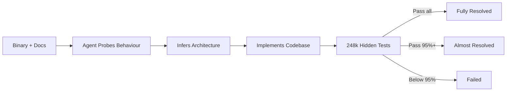
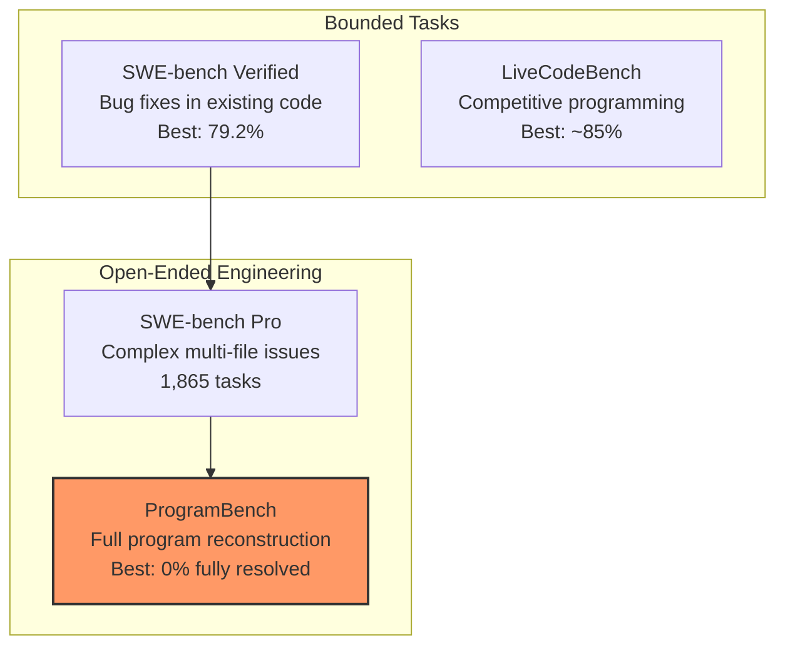

# ProgramBench and the Zero-Percent Problem: What a Cleanroom Benchmark Reveals About Architectural Reasoning in Codex CLI


---

On 5 May 2026, researchers from Meta Superintelligence Labs, Stanford, and Harvard published ProgramBench — a benchmark that asks AI coding agents to reconstruct entire programs from nothing but a compiled binary and its documentation[^1]. The headline result: every frontier model, including GPT-5.4 and Claude Opus 4.7, scored **0% fully resolved** across all 200 tasks[^2]. That number deserves unpacking, because the failure modes it exposes map directly to configuration choices Codex CLI practitioners make every day.

---

## What ProgramBench Actually Tests

SWE-bench asks agents to fix bugs in existing codebases. ProgramBench inverts the problem entirely. The agent receives an executable binary and its usage documentation — nothing else. No source code, no decompiler, no internet access[^1]. It must:

1. Probe the binary's behaviour through input/output experimentation
2. Infer the internal architecture from observed behaviour and documentation
3. Implement a complete, buildable codebase that passes 248,853 hidden behavioural tests[^3]

Tasks range from small CLI utilities to projects the scale of FFmpeg, SQLite, and the PHP interpreter[^1].



The two-tier scoring matters. **Fully resolved** requires a perfect behavioural match. **Almost resolved** means the submission passes at least 95% of tests — a partial-credit tier that currently provides the only separation between models[^2].

---

## The Scoreboard: May 2026

| Model | Fully Resolved | Almost Resolved |
|---|---|---|
| Claude Opus 4.7 | 0.0% | 3.0% |
| Claude Opus 4.6 | 0.0% | 2.5% |
| Claude Sonnet 4.6 | 0.0% | 1.0% |
| GPT-5.4 | 0.0% | 0.0% |
| Gemini 3.1 Pro | 0.0% | 0.0% |

*Source: ProgramBench public leaderboard, May 2026*[^2][^4]

Every model submitted final answers in 98% of evaluation runs[^3] — they did not time out or refuse. They confidently produced implementations that were architecturally wrong.

---

## Seven Failure Modes and What They Mean for Practitioners

The ProgramBench authors and independent reviewers identified seven recurring failure patterns[^3][^5]. Each maps to a concrete Codex CLI configuration decision.

### 1. Shallow Probing

Models ran obvious inputs and moved on, missing edge cases. In Codex CLI terms, this is the agent that reads one file and starts coding. The mitigation: force exploration before implementation.

### 2. Premature Implementation

Agents began writing code before discovering requirements. The paper notes they "favor monolithic, single-file implementations that diverge sharply from human-written code"[^1].

### 3. Missing Negative Cases

Error handling, invalid flags, and non-zero exit codes were routinely ignored. Agents handled the happy path and stopped.

### 4. Weak Architecture

Implementations were structurally brittle — designed around demo scenarios rather than the full specification.

### 5. Poor Self-Testing

Models rarely built automated comparisons between their output and the original binary, despite having the binary available for comparison.

### 6. Overconfidence

Agents submitted incomplete work prematurely. Most failures were not caused by timeouts — the agents chose to stop[^3].

### 7. Tool-Loop Fragility

The agent harness itself sometimes failed, preventing fair evaluation of the underlying model[^5].

---

## Configuring Codex CLI to Counter These Patterns

ProgramBench tests a scenario most practitioners never face: reconstructing unknown software from a binary. But the failure modes it surfaces — shallow exploration, premature implementation, weak architecture — appear in everyday development too. Here is how to configure Codex CLI to resist them.

### Force Plan-Before-Code with Plan Mode

The single most effective countermeasure to premature implementation is plan mode. When Codex operates in plan mode, it gathers context, asks clarifying questions, and builds a structured plan before touching any code[^6].

```toml
# ~/.codex/config.toml
[model]
plan_mode_reasoning_effort = "high"
model_reasoning_effort = "low"
```

This dual-effort pattern gives the model time to think during planning whilst keeping execution fast[^7]. For architecturally complex tasks, bump to `"xhigh"` — the model explores more of the codebase, raises more edge cases, and produces more precise acceptance criteria[^7].

### Write Architectural Constraints into AGENTS.md

The ProgramBench failure of monolithic single-file implementations is directly addressable through AGENTS.md. When you specify structural expectations, the agent follows them[^8].

```markdown
<!-- .codex/AGENTS.md -->
## Architecture Rules

- Never place more than 300 lines in a single file.
- Every new module must include a README explaining its responsibility.
- Use the existing directory structure; do not flatten into root.
- Before implementing, list every file you will create or modify and explain why.
```

### Require Self-Testing via Hooks

ProgramBench agents rarely compared their output against the original. In production, the equivalent is writing code without running the test suite. A `PostToolUse` hook can enforce verification after every code change[^9]:

```toml
[[hooks.PostToolUse]]
matcher = "^(Bash|apply_patch)$"

[[hooks.PostToolUse.hooks]]
type = "command"
command = '/bin/sh -c "cd $(git rev-parse --show-toplevel) && make test 2>&1 | tail -20"'
timeout = 60
statusMessage = "Running test suite"
```

### Use Goal Mode for Long-Horizon Architectural Tasks

ProgramBench tasks demand sustained, multi-step reasoning across an entire codebase. The `/goal` command in Codex CLI v0.129 provides exactly this — a persistent objective that survives context compaction and guides the agent across extended sessions[^10].

```
/goal "Reconstruct the behaviour of the target binary. Phase 1: probe all documented flags and record input-output pairs. Phase 2: design a modular architecture. Phase 3: implement module by module with tests after each."
```

### Raise Reasoning Effort for Discovery Phases

The shallow-probing failure is a direct consequence of low reasoning effort. For tasks that require exploratory investigation, override the default:

```bash
codex --reasoning-effort xhigh "Analyse the behaviour of ./target-binary across all documented flags, edge cases, and error conditions. Record findings in ANALYSIS.md before writing any implementation code."
```

---

## Where ProgramBench Sits in the Benchmark Landscape



SWE-bench Verified scores now exceed 79%[^11]. ProgramBench scores 0%. The gap is not a contradiction — it measures fundamentally different capabilities. SWE-bench tests "local surgery": find a bug, understand its context, apply a fix. ProgramBench tests architectural reasoning: given a specification, design and build an entire system[^1].

This distinction matters for how you assign work to Codex CLI. The evidence says:

- **High confidence**: Bug fixes, feature additions within existing architecture, test generation, refactoring bounded modules
- **Moderate confidence**: Multi-file changes following established patterns, API integrations with clear specifications
- **Low confidence**: Greenfield architecture, system-level design, reconstructing undocumented behaviour

---

## The Monolithic-File Anti-Pattern

One of ProgramBench's sharpest findings is that models "favor monolithic, single-file implementations that diverge sharply from human-written code"[^1]. This is not an abstract benchmark curiosity — it happens in production. When Codex CLI tackles a large task without structural guidance, it gravitates toward fewer, larger files.

The defence is explicit. In your AGENTS.md, specify:

```markdown
## File Structure Policy

When creating new functionality:
1. Follow the existing module boundary conventions in this repository.
2. Each file should have a single, clear responsibility.
3. If a new file exceeds 200 lines, decompose it before proceeding.
4. Mirror the test directory structure against the source directory structure.
```

This is not hand-holding — it is context engineering. The model cannot infer your team's architectural preferences from the task description alone[^8].

---

## Practical Takeaways

1. **ProgramBench is a frontier stress test, not a deployment benchmark.** No team is asking Codex CLI to rebuild FFmpeg from a binary. But the failure modes it reveals — shallow exploration, premature coding, monolithic output — appear in everyday sessions at lower intensity.

2. **Plan mode is your primary architectural guardrail.** Force it for any task involving structural decisions. Set `plan_mode_reasoning_effort` to `"high"` or `"xhigh"`[^7].

3. **AGENTS.md is your architectural specification.** Without explicit structural guidance, models default to monolithic implementations. Write your team's conventions into the instruction stack[^8].

4. **Self-testing hooks close the verification gap.** ProgramBench agents rarely validated their own output. A `PostToolUse` hook running the test suite after every change prevents the same mistake in production[^9].

5. **Right-size the task.** The benchmark confirms what practitioners already know: AI coding agents excel at bounded modifications within existing code and struggle with open-ended architectural work. Decompose accordingly[^6].

6. **Watch this benchmark.** When ProgramBench fully-resolved scores climb above zero, it signals a genuine step change in architectural reasoning — and a meaningful expansion of what you can safely delegate to Codex CLI.

---

## Citations

[^1]: Yang, J., Lieret, K., Ma, J., Thakkar, P., Pedchenko, D., Sootla, S., McMilin, E., Yin, P., Hou, R., Synnaeve, G., Yang, D., & Press, O. (2026). "ProgramBench: Can Language Models Rebuild Programs From Scratch?" *arXiv:2605.03546*. [https://arxiv.org/abs/2605.03546](https://arxiv.org/abs/2605.03546)

[^2]: ProgramBench Public Leaderboard, May 2026. [https://programbench.com/](https://programbench.com/)

[^3]: BenchLM.ai. "ProgramBench Benchmark Explained: Can LLMs Rebuild Programs From Binaries?" [https://benchlm.ai/blog/posts/programbench-cleanroom-coding-benchmark](https://benchlm.ai/blog/posts/programbench-cleanroom-coding-benchmark)

[^4]: BenchLM.ai. "ProgramBench Benchmark 2026: 9 model averages." [https://benchlm.ai/benchmarks/programBench](https://benchlm.ai/benchmarks/programBench)

[^5]: AI Feed Today. "ProgramBench Benchmark Review: Why Top AI Models Score 0%." [https://aifeedtoday.com/programbench-benchmark-review/](https://aifeedtoday.com/programbench-benchmark-review/)

[^6]: OpenAI. "Best practices — Codex." [https://developers.openai.com/codex/learn/best-practices](https://developers.openai.com/codex/learn/best-practices)

[^7]: SmartScope. "Complete Guide to Codex Plan Mode (2026): Stop AI Drift with Plan-Execute." [https://smartscope.blog/en/generative-ai/chatgpt/codex-plan-mode-complete-guide/](https://smartscope.blog/en/generative-ai/chatgpt/codex-plan-mode-complete-guide/)

[^8]: OpenAI. "Custom instructions with AGENTS.md — Codex." [https://developers.openai.com/codex/guides/agents-md](https://developers.openai.com/codex/guides/agents-md)

[^9]: OpenAI. "Hooks — Codex." [https://developers.openai.com/codex/hooks](https://developers.openai.com/codex/hooks)

[^10]: OpenAI. "Features — Codex CLI." [https://developers.openai.com/codex/cli/features](https://developers.openai.com/codex/cli/features)

[^11]: SWE-bench Leaderboards, May 2026. [https://www.swebench.com/](https://www.swebench.com/)
