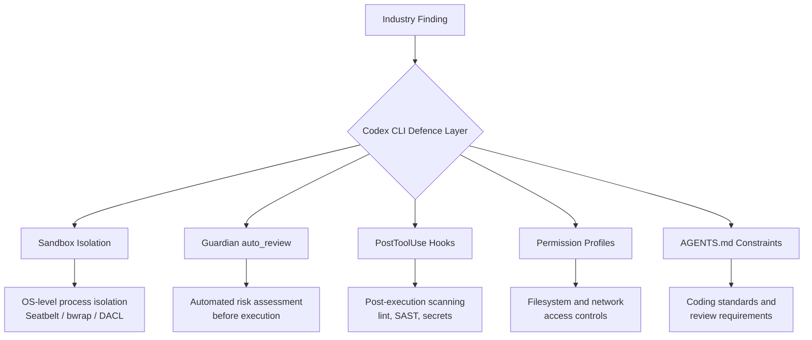

# The AI Coding Agent Quality Crisis: What the Opsera and Sourcery Intel 2026 Reports Reveal — and How to Configure Codex CLI to Stay Ahead of the Data


Two major industry reports landed in early 2026 and painted a sobering picture: AI coding agents demonstrably accelerate delivery, but they also introduce measurably more vulnerabilities, duplicate more code, and create a review bottleneck that most teams are not equipped to handle. The Opsera *AI Coding Impact 2026 Benchmark Report*[^1] analysed 250,000+ developers across 60+ enterprises. The Sourcery Intel *State of AI Coding Agents — 2026*[^2] synthesised market, benchmark, and security data across the entire agent landscape.

This article distils the hard numbers from both reports, maps each finding to a concrete Codex CLI defence, and provides ready-to-paste configuration for teams that want the speed without the risk.

---

## The Numbers That Matter

### Vulnerability Rates

The Sourcery Intel report, drawing on a Stanford-MIT study of over two million code snippets, found that **14.3% of AI-generated code contains security vulnerabilities versus 9.1% for human-written code** — a 57% relative increase[^2]. The Opsera report corroborates this from a different angle: AI-generated code introduces **15–18% more security vulnerabilities** per line compared with human-written code[^1].

These are not theoretical risks. The EU AI Act's full obligations for high-risk systems take effect on 2 August 2026[^2], and the FTC has already taken the position that **deployer liability** applies — the organisation shipping the code is responsible, not the AI vendor[^2].

### The Review Bottleneck

The Opsera data reveals a startling paradox: AI-assisted workflows cut **Time-to-Pull-Request by 48–58%**, yet AI-generated pull requests sit **4.6× longer** in the review queue than human-written ones[^1]. The acceleration in code production has outpaced the capacity to review it. Teams produce more PRs, but reviewers cannot keep up, creating an ever-growing backlog of unreviewed — and potentially vulnerable — code.

### Code Duplication

Code duplication rose from **10.5% to 13.5%** across the Opsera sample[^1]. Duplicated code is not merely an aesthetic problem; it multiplies the surface area for vulnerabilities and makes refactoring harder, especially when agents generate near-identical blocks across multiple files.

### The Productivity Paradox

Senior engineers realise **nearly five times** the productivity gains of junior engineers[^1]. Meanwhile, 21% of AI coding licences go unused because organisations have not integrated them into a coherent workflow[^1]. The data is clear: AI agents are a force multiplier for experienced developers and a potential liability without governance.

---

## Mapping the Data to Codex CLI Defences

Each finding above maps to a specific layer of Codex CLI's security architecture. The following sections walk through the configuration.



### Defence 1: Guardian auto_review — Addressing the Review Bottleneck

The 4.6× review delay exists because human reviewers are the only gate. Codex CLI's **Guardian auto_review** inserts an automated reviewer agent between the coding agent and execution[^3]. It evaluates every approval request against four criteria: data exfiltration, credential probing, persistent security weakening, and destructive actions.

```toml
# ~/.codex/config.toml or .codex/config.toml

approval_policy = "on-request"
approvals_reviewer = "auto_review"
```

Low and medium risk actions proceed automatically. Critical actions are denied outright. High-risk actions require explicit human authorisation[^3]. This does not replace human code review, but it does remove the trivial approvals that account for the bulk of the queue.

For enterprise teams, the Guardian policy itself can be customised:

```toml
guardian_policy_config = "https://internal.example.com/codex-guardian-policy.json"
```

### Defence 2: PostToolUse Hooks — Automated Security Scanning

The 14.3% vulnerability rate drops when every code change is scanned before it reaches a commit. Codex CLI hooks fire after tool execution, enabling automated SAST, linting, and secrets detection as part of the agent loop[^4].

```toml
# .codex/config.toml

[[hooks]]
event = "PostToolUse"
match_tool = "apply_patch"
command = "python3 .codex/hooks/scan-patch.py"
timeout_ms = 30000
```

A minimal scanning hook:

```python
#!/usr/bin/env python3
"""PostToolUse hook: scan patched files for secrets and known vulnerability patterns."""
import json, subprocess, sys

event = json.loads(sys.stdin.read())
changed_files = event.get("changed_files", [])

if not changed_files:
    json.dump({"status": "ok"}, sys.stdout)
    sys.exit(0)

# Run a secrets scanner over changed files
result = subprocess.run(
    ["gitleaks", "detect", "--no-git", "--source", ".", "--report-format", "json"],
    capture_output=True, text=True
)

if result.returncode != 0:
    json.dump({
        "status": "error",
        "systemMessage": "Secrets detected in generated code. Review before committing.",
        "stopReason": "secrets_detected"
    }, sys.stdout)
else:
    json.dump({"status": "ok"}, sys.stdout)
```

The hook can return `"continue": false` to halt the agent loop when a critical finding is detected[^4].

### Defence 3: Permission Profiles — Limiting Blast Radius

The duplication and vulnerability data argue for **least-privilege execution**. Codex CLI's named permission profiles restrict filesystem and network access to precisely what a task requires[^5].

```toml
# .codex/config.toml

[profiles.secure-review]
sandbox = "workspace-write"
approval_policy = "on-request"
approvals_reviewer = "auto_review"
web_search = "cached"

[profiles.secure-review.permissions.workspace.filesystem]
":project_roots" = { "." = "write", "**/*.env" = "none", "**/.secrets" = "none" }

[profiles.secure-review.sandbox_workspace_write]
network_access = false
```

Invoke with:

```bash
codex --profile secure-review "Fix the failing test in src/auth/token.ts"
```

The `"**/*.env" = "none"` pattern ensures the agent cannot read or write environment files, even if it decides credentials would help[^5].

### Defence 4: AGENTS.md Quality Constraints

The code duplication finding (10.5% → 13.5%) is a direct consequence of agents generating similar blocks without awareness of existing abstractions. An `AGENTS.md` file at the repository root can encode deduplication rules:

```markdown
# AGENTS.md

## Code Quality Rules

- Before creating a new utility function, search the codebase for existing implementations
- Never duplicate logic that already exists in `src/shared/` or `src/utils/`
- All new functions must include JSDoc or docstring documentation
- Maximum cyclomatic complexity per function: 10
- Every PR-worthy change must include or update relevant tests

## Security Rules

- Never hardcode credentials, tokens, or API keys
- Use environment variables via the project's config module for all secrets
- All user input must be validated and sanitised before use
- SQL queries must use parameterised statements; never interpolate user input
```

These constraints are injected into every agent turn, reducing the likelihood of the patterns flagged in the reports[^6].

### Defence 5: Web Search Caching — Prompt Injection Defence

The Sourcery Intel report notes that **51% of code committed to GitHub** is now AI-assisted[^2]. As agents increasingly consume web content for context, the prompt injection surface grows. Codex CLI's default web search mode uses an **OpenAI-maintained cache** rather than live page fetches:

```toml
web_search = "cached"  # default; pre-indexed results
```

Live mode (`web_search = "live"`) should be reserved for tasks where currency matters more than security, and disabled entirely (`web_search = "disabled"`) for regulated or air-gapped environments[^3].

---

## A Complete Secure-Team Profile

Combining all five defences into a single profile:

```toml
# .codex/config.toml — project-level secure team configuration

[profiles.secure-team]
model = "gpt-5.5"
approval_policy = "on-request"
approvals_reviewer = "auto_review"
sandbox = "workspace-write"
web_search = "cached"
reasoning_effort = "high"

[profiles.secure-team.permissions.workspace.filesystem]
":project_roots" = { "." = "write", "**/*.env" = "none", "**/.secrets" = "none", "**/credentials*" = "none" }

[profiles.secure-team.sandbox_workspace_write]
network_access = false

[[hooks]]
event = "PostToolUse"
match_tool = "apply_patch"
command = "python3 .codex/hooks/scan-patch.py"
timeout_ms = 30000
```

```bash
# Team members invoke with:
codex --profile secure-team "Implement the payment refund endpoint per the spec in docs/refund-api.md"
```

---

## What the Reports Do Not Cover

Both reports acknowledge significant data gaps. The Sourcery Intel report explicitly flags the absence of[^2]:

- **Long-term technical debt** impact analysis for AI-generated code
- **Multi-agent reliability** and failure mode data
- **Total cost of ownership** calculations that account for review overhead
- **MCP server supply-chain security** auditing mechanisms

These gaps matter. The 14.3% vulnerability rate is a snapshot; the compounding effect of unreviewed AI code over months of development is unstudied. Teams should treat the current data as a lower bound and configure their defences accordingly.

---

## Practical Recommendations

1. **Enable Guardian auto_review immediately.** It costs nothing and addresses the review bottleneck directly.
2. **Add PostToolUse scanning hooks.** Even a basic secrets scanner catches the most damaging class of vulnerability.
3. **Use named permission profiles** per project or per task type. The default `workspace-write` sandbox is a good starting point, but filesystem exclusions for secrets files are essential.
4. **Encode quality standards in AGENTS.md.** Deduplication rules and testing requirements reduce the patterns both reports flag.
5. **Keep web search on `cached` mode** unless you have a specific reason to go live.
6. **Track the data.** Enable OpenTelemetry export[^7] and use the Analytics API[^8] to measure your own vulnerability and duplication rates over time. The industry averages are useful benchmarks, but your numbers are what matter.

---

## Citations

[^1]: Opsera, *AI Coding Impact 2026 Benchmark Report*, January 2026. Analysis of 250,000+ developers across 60+ enterprise organisations. [https://opsera.ai/resources/report/ai-coding-impact-2026-benchmark-report/](https://opsera.ai/resources/report/ai-coding-impact-2026-benchmark-report/)

[^2]: Sourcery Intel, *The State of AI Coding Agents — 2026*. Market analysis, benchmark data, and security findings across the AI coding agent landscape. [https://sourceryintel.com/reports/the-state-of-ai-coding-agents-2026](https://sourceryintel.com/reports/the-state-of-ai-coding-agents-2026)

[^3]: OpenAI, *Agent Approvals & Security — Codex*, May 2026. Guardian auto_review, approval policies, sandbox modes, and web search configuration. [https://developers.openai.com/codex/agent-approvals-security](https://developers.openai.com/codex/agent-approvals-security)

[^4]: OpenAI, *Hooks — Codex*, May 2026. PostToolUse event documentation, hook configuration, and output handling. [https://developers.openai.com/codex/hooks](https://developers.openai.com/codex/hooks)

[^5]: OpenAI, *Advanced Configuration — Codex*, May 2026. Named permission profiles, filesystem access controls, and network policies. [https://developers.openai.com/codex/config-advanced](https://developers.openai.com/codex/config-advanced)

[^6]: OpenAI, *Custom Instructions with AGENTS.md — Codex*, May 2026. AGENTS.md file format, inheritance hierarchy, and override patterns. [https://developers.openai.com/codex/guides/agents-md](https://developers.openai.com/codex/guides/agents-md)

[^7]: OpenAI, *Configuration Reference — Codex*, May 2026. OpenTelemetry export configuration for observability and compliance. [https://developers.openai.com/codex/config-reference](https://developers.openai.com/codex/config-reference)

[^8]: OpenAI, *Enterprise Governance — Codex*, May 2026. Analytics API endpoints and dashboard charts for enterprise usage tracking. [https://developers.openai.com/codex/enterprise/governance](https://developers.openai.com/codex/enterprise/governance)
