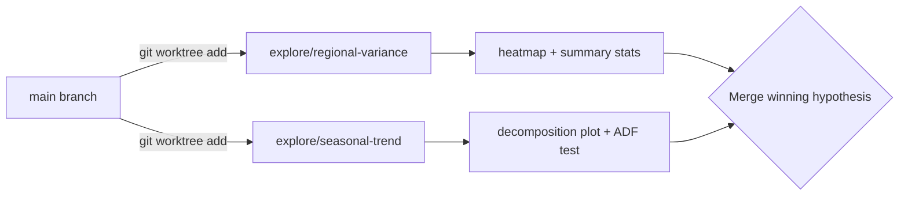
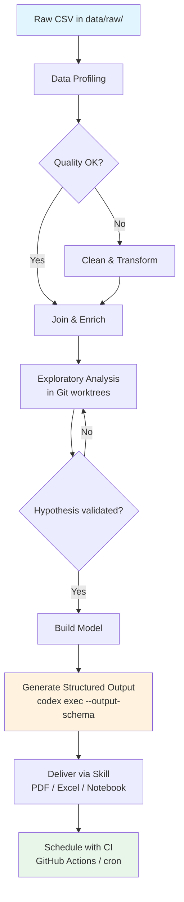

# Codex CLI for Data Analysis: From Raw CSV to Stakeholder Report in One Agent Session


---

Codex CLI started life as a coding agent, but OpenAI's April 2026 "Codex for (almost) everything" update made the shift explicit: the same agent loop that rewrites your React components can also clean a messy CSV, build a regression model, and package the result as a PDF brief — all without leaving the terminal [^1]. With over four million weekly active users and GPT-5.5 powering the backend [^2], the question is no longer *whether* Codex can handle data work, but how to configure it so the output is reproducible and trustworthy.

This article walks through a complete data-analysis workflow using Codex CLI, covering project scaffolding, interactive exploration, non-interactive batch processing with `codex exec`, and final delivery via built-in skills.

## Why Use a Coding Agent for Data Work?

The traditional data-analysis stack — Jupyter notebooks, ad-hoc scripts, manual chart tweaking — produces results that are difficult to reproduce, hard to review, and nearly impossible to schedule. Codex CLI addresses all three problems:

1. **Reproducibility.** Every action Codex takes is a tool call inside a sandboxed environment. The session transcript is a reviewable audit trail.
2. **Reviewability.** Because Codex writes real Python files rather than executing ephemeral cells, the output is diffable and can go through code review.
3. **Automation.** `codex exec` turns any analysis into a single-command pipeline suitable for cron jobs, CI, or GitHub Actions [^3].

OpenAI's official use-case documentation now recommends mirroring the *R for Data Science* framework — import, tidy, transform, visualise, model, communicate — and letting Codex accelerate movement through each stage [^4].

## Project Structure and AGENTS.md

Before handing data to the agent, establish a project structure and encode your conventions in `AGENTS.md`:

```markdown
# AGENTS.md

## Project: Q2 Revenue Analysis

### Environment
- Python 3.12 via `uv` (do NOT use pip directly)
- All dependencies pinned in `pyproject.toml`

### Folder Convention
- `data/raw/` — immutable source files, never modified
- `data/processed/` — cleaned and joined outputs
- `output/` — charts, tables, and final deliverables
- `scripts/` — reusable analysis scripts

### Coding Standards
- PEP 8, type hints on all function signatures
- pandas for tabular work; polars only if explicitly requested
- matplotlib + seaborn for charts; no plotly unless asked
- Every script must be runnable standalone: `python scripts/foo.py`

### Data Safety
- Never modify files in `data/raw/`
- Log all join operations with match rates before committing
- Flag any column with >5% null values in output summaries
```

This file loads automatically at the start of every Codex session, ensuring the agent respects your data conventions from the first prompt [^5].

## The Interactive Exploration Loop

Start a TUI session in your project directory:

```bash
cd ~/projects/q2-revenue
codex
```

### Stage 1: Data Profiling

Your first prompt should ask Codex to inventory the raw data:

```
Read all files in data/raw/. For each CSV, report: row count, column names
and types, null rates per column, and any duplicate-key candidates.
Write the profile to output/data-profile.md.
```

Codex will generate a Python script that uses `pandas.DataFrame.info()`, `describe()`, and `duplicated()`, execute it inside the sandbox, and write the Markdown summary. You review the output, approve, and move on.

### Stage 2: Cleaning and Joining

```
Clean the revenue data: drop rows where amount <= 0, parse date columns
as datetime, normalise region codes to ISO 3166-2. Then join with the
customer dimension table on customer_id. Profile the join key first —
show uniqueness and null rates — and report the match rate before writing
the joined output to data/processed/revenue-customers.parquet.
```

The key instruction here is *profile the join key first*. OpenAI's data-analysis best practices explicitly recommend running trial joins and reporting match rates before committing changes [^4]. This prevents silent data loss from mismatched keys.

### Stage 3: Exploration with Worktrees

For exploratory hypotheses, use separate Git worktrees to keep diffs reviewable:

```
Create a worktree for the regional-variance hypothesis. In that worktree,
group revenue by region and month, compute coefficient of variation,
and generate a heatmap. Keep the diff focused on exploration only.
```



This pattern, recommended in OpenAI's datasets-and-reports guide, prevents exploratory code from polluting your main analysis branch [^4].

## Non-Interactive Batch Processing with codex exec

Once you have validated scripts, `codex exec` turns them into automated pipelines:

```bash
codex exec "Run scripts/clean_revenue.py and scripts/build_model.py \
  in sequence. If any script fails, stop and report the error. \
  Write a JSON summary of the results." \
  --sandbox workspace-write \
  -o output/run-summary.txt
```

### Structured Output for Downstream Consumption

For integration with dashboards or alerting systems, use `--output-schema` to enforce a JSON contract [^3]:

```bash
codex exec "Analyse data/processed/revenue-customers.parquet. \
  Compute total revenue, revenue by region, month-over-month growth rates, \
  and flag any region with >10% decline." \
  --output-schema ./schemas/revenue-summary.json \
  -o output/revenue-summary.json \
  --sandbox workspace-write
```

Where `schemas/revenue-summary.json` defines the expected shape:

```json
{
  "$schema": "https://json-schema.org/draft/2020-12/schema",
  "type": "object",
  "properties": {
    "total_revenue": { "type": "number" },
    "by_region": {
      "type": "array",
      "items": {
        "type": "object",
        "properties": {
          "region": { "type": "string" },
          "revenue": { "type": "number" },
          "mom_growth_pct": { "type": "number" },
          "flagged": { "type": "boolean" }
        },
        "required": ["region", "revenue", "mom_growth_pct", "flagged"]
      }
    },
    "analysis_date": { "type": "string", "format": "date" }
  },
  "required": ["total_revenue", "by_region", "analysis_date"]
}
```

The agent's final response will conform exactly to this schema, making it safe to parse programmatically [^3].

### Reasoning Token Reporting

As of v0.130, `codex exec --json` reports reasoning-token usage alongside completion tokens [^6]. For data-analysis tasks, this helps you understand how much of the cost is the model *thinking* versus *writing*:

```bash
codex exec --json "Build a linear regression model predicting Q3 revenue" \
  2>/dev/null | jq 'select(.type == "usage") | .usage'
```

## Built-In Skills for Output Delivery

Codex ships with several built-in skills that handle the final communication stage [^7]:

| Skill | Use When |
|-------|----------|
| `$jupyter-notebook` | Deliverable should stay notebook-native for data scientists |
| `$spreadsheet` | Stakeholders want Excel with formulas and pivot tables |
| `$doc` | Word document for non-technical executives |
| `$pdf` | Formatted report with charts for archival |

Invoke a skill directly in your prompt:

```
Using the $pdf skill, create a stakeholder report from the analysis in
output/revenue-summary.json. Include an executive summary, regional
breakdown table, month-over-month trend chart, and a caveats section
noting join quality and sampling assumptions.
```

## Configuration Profile for Data Work

Create a dedicated profile in `~/.codex/config.toml`:

```toml
[profile.data-analyst]
model = "gpt-5.5"
model_reasoning_effort = "high"
sandbox = "workspace-write"

[profile.data-analyst.tools.web_search]
mode = "cached"

[profile.data-analyst.permissions]
# Allow pandas, matplotlib, and data processing
allowed_commands = ["python", "uv", "pip"]
```

Activate it per session:

```bash
codex --profile data-analyst
```

Or for batch runs:

```bash
codex exec --profile data-analyst "Run the weekly revenue pipeline"
```

## Scheduling Recurring Analysis

Combine `codex exec` with cron or GitHub Actions for weekly reporting [^3]:


```yaml
# .github/workflows/weekly-revenue.yml
name: Weekly Revenue Report
on:
  schedule:
    - cron: '0 8 * * 1'  # Every Monday at 08:00 UTC

jobs:
  analyse:
    runs-on: ubuntu-latest
    steps:
      - uses: actions/checkout@v4
      - name: Run analysis
        env:
          CODEX_API_KEY: ${{ secrets.CODEX_API_KEY }}
        run: |
          codex exec --profile data-analyst \
            --output-schema schemas/revenue-summary.json \
            -o output/weekly-report.json \
            "Pull latest data from data/raw/, run the full Q2 pipeline, \
             and generate the weekly revenue summary."
      - name: Upload report
        uses: actions/upload-artifact@v4
        with:
          name: revenue-report-${{ github.run_id }}
          path: output/
```


## The Complete Workflow



## Caveats and Limitations

**Token costs scale with data size.** Codex reads file contents into its context window. For datasets larger than a few hundred rows, instruct the agent to sample or summarise rather than ingest the entire file. The `model_reasoning_effort` setting in your profile controls how much reasoning budget the model spends per turn [^8].

**Sandbox constraints matter.** The default `read-only` sandbox prevents Codex from writing output files. Always use `--sandbox workspace-write` or configure it in your profile for data work.

**Skill availability.** The `$jupyter-notebook`, `$spreadsheet`, `$doc`, and `$pdf` skills are available in the Codex app and CLI as of the April 2026 update [^7]. ⚠️ Availability of specific skills may vary by plan tier and region — verify with `/skills` in your TUI session.

**Reproducibility requires pinned dependencies.** Codex may install packages at analysis time. Pin your environment in `pyproject.toml` and instruct the agent to use `uv` for deterministic installs.

## Citations

[^1]: OpenAI, "Codex for (almost) everything," April 2026. [https://openai.com/index/codex-for-almost-everything/](https://openai.com/index/codex-for-almost-everything/)

[^2]: NVIDIA Blog, "OpenAI's New GPT-5.5 Powers Codex on NVIDIA Infrastructure," April 2026. [https://blogs.nvidia.com/blog/openai-codex-gpt-5-5-ai-agents/](https://blogs.nvidia.com/blog/openai-codex-gpt-5-5-ai-agents/)

[^3]: OpenAI Developers, "Non-interactive mode — Codex," 2026. [https://developers.openai.com/codex/noninteractive](https://developers.openai.com/codex/noninteractive)

[^4]: OpenAI Developers, "Analyse datasets and ship reports — Codex use cases," 2026. [https://developers.openai.com/codex/use-cases/datasets-and-reports](https://developers.openai.com/codex/use-cases/datasets-and-reports)

[^5]: OpenAI Developers, "Custom instructions with AGENTS.md — Codex," 2026. [https://developers.openai.com/codex/guides/agents-md](https://developers.openai.com/codex/guides/agents-md)

[^6]: OpenAI, Codex CLI v0.130.0 release notes, May 2026. [https://github.com/openai/codex/releases/tag/rust-v0.130.0](https://github.com/openai/codex/releases/tag/rust-v0.130.0)

[^7]: OpenAI Developers, "Skills — Codex," 2026. [https://developers.openai.com/codex/skills](https://developers.openai.com/codex/skills)

[^8]: OpenAI Developers, "Configuration Reference — Codex," 2026. [https://developers.openai.com/codex/config-reference](https://developers.openai.com/codex/config-reference)
