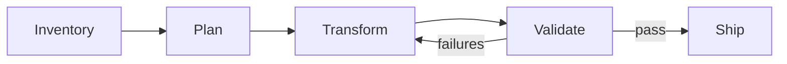

# Codex CLI for Automated Dependency Upgrades and Framework Migrations


---

Dependency upgrades and framework migrations are the tax every engineering team pays for staying current. They are tedious, high-volume, and mechanically repetitive — yet a single missed import or overlooked breaking change can cascade into production incidents. Traditional codemods handle the syntactic transformations well enough, but they fall apart when a migration demands *semantic understanding*: renaming a parameter that also changes behaviour, updating call sites that depend on deprecated return shapes, or adjusting test assertions to match a new API contract.

Codex CLI is well-suited to this problem. It combines an LLM's semantic comprehension with sandboxed shell access, subagent parallelism, and structured output — precisely the toolkit needed to turn a six-week migration into a disciplined, repeatable pipeline. This article walks through the concrete patterns, configuration, and safety rails for running dependency upgrades and framework migrations with Codex CLI v0.130 [^1].

## Why Agents Beat Static Codemods for Migrations

Static codemods — jscodeshift transforms, Rector rules, go fix rewrites — operate on AST patterns. They excel at mechanical substitutions but struggle with three common migration scenarios:

1. **Semantic renames** where the new API has different defaults or error semantics.
2. **Cross-file dependency chains** where updating a type in one module requires changes to consumers, tests, and documentation simultaneously.
3. **Configuration drift** where framework upgrades introduce new required configuration keys or deprecate existing ones.

An LLM-backed agent can read the migration guide, understand the *intent* behind each change, and apply transformations that account for context — precisely what Google's internal research demonstrated when 80% of landed code modifications in a large-scale ID migration were AI-authored, cutting total migration time by an estimated 50% [^2].

## The Four-Stage Migration Pipeline

A reliable agent-driven migration follows a predictable pipeline. Each stage maps to a specific Codex CLI capability.



### Stage 1: Inventory

Before touching code, catalogue what needs changing. Pipe your dependency manifest into `codex exec` with a structured output schema to get a machine-readable inventory:

```bash
cat package.json | codex exec \
  "List every dependency that is more than one major version behind its latest release. For each, note the current version, latest version, and whether the changelog mentions breaking changes." \
  --output-schema ./inventory-schema.json \
  -o ./migration-inventory.json \
  --sandbox read-only
```

The `--sandbox read-only` flag [^3] ensures the inventory phase cannot modify anything. The `--output-schema` flag [^4] constrains the response to a JSON Schema you control, making downstream parsing deterministic.

A minimal inventory schema:

```json
{
  "$schema": "https://json-schema.org/draft/2020-12/schema",
  "type": "object",
  "properties": {
    "dependencies": {
      "type": "array",
      "items": {
        "type": "object",
        "properties": {
          "name": { "type": "string" },
          "current": { "type": "string" },
          "latest": { "type": "string" },
          "breaking_changes": { "type": "boolean" },
          "migration_notes": { "type": "string" }
        },
        "required": ["name", "current", "latest", "breaking_changes"]
      }
    }
  }
}
```

### Stage 2: Plan

For non-trivial migrations, engage Plan Mode before implementation. In interactive mode, press `Shift+Tab` to toggle Plan Mode [^5], or encode planning expectations in your AGENTS.md:

```markdown
## Migration Protocol

When asked to perform a dependency upgrade or framework migration:
1. Read the relevant changelog and migration guide via web search.
2. Produce a PLANS.md listing every file that needs modification, grouped by change type.
3. Wait for explicit approval before proceeding to implementation.
4. Apply changes one logical group at a time, running tests after each group.
```

For batch automation, use `codex exec` with a two-pass approach — first pass generates the plan, second pass executes it:

```bash
# Pass 1: Generate the migration plan
codex exec \
  "Read the React 19 migration guide at https://react.dev/blog/2024/04/25/react-19-upgrade-guide. \
   Analyse our codebase and produce a PLANS.md listing every file that needs changes, \
   grouped by: removed APIs, renamed APIs, new required patterns." \
  --sandbox read-only \
  --search \
  -o ./PLANS.md

# Pass 2: Execute the plan
codex exec \
  "Follow PLANS.md exactly. Apply each group of changes, run 'npm test' after each group, \
   and stop if any test fails." \
  --sandbox workspace-write
```

The `--search` flag enables live web search [^6] so Codex can fetch the latest migration documentation rather than relying on training data.

### Stage 3: Transform with Subagents

For large monorepos, a single-threaded migration is too slow. Codex subagents [^7] let you parallelise independent transformation groups. Configure them in `.codex/config.toml`:

```toml
[agents]
max_threads = 4
max_depth = 1
job_max_runtime_seconds = 600

[agents.migration-worker]
name = "migration-worker"
description = "Applies a specific migration transformation to a set of files"
developer_instructions = """
You are a migration worker. You receive a list of files and a specific transformation to apply.
Apply the transformation to each file. Run the project's test suite after all changes.
Do not modify files outside your assigned list.
"""
model = "gpt-5.4-mini"
sandbox_mode = "workspace-write"
```

Using a cheaper model like GPT-5.4 mini for worker subagents [^8] keeps costs manageable when spawning multiple parallel agents. The parent agent coordinates:

```
Upgrade all usages of the deprecated `createRoot` API across these four directories.
Spawn one subagent per directory: src/components/, src/pages/, src/hooks/, src/utils/.
Each subagent should apply the transformation and run `npm test -- --testPathPattern=<dir>`.
```

### Stage 4: Validate

Post-transformation validation should go beyond simply running the test suite. Use a PostToolUse hook [^9] to enforce migration-specific invariants:

```toml
[[hooks]]
event = "PostToolUse"
tool = "shell"
command = ["bash", "-c", """
  # Fail if any deprecated API usage remains
  if rg -l 'createFactory|React\.createClass|componentWillMount' --type tsx --type jsx src/; then
    echo '{"status":"deny","reason":"Deprecated API usage still present"}'
  else
    echo '{"status":"approve"}'
  fi
"""]
```

This hook runs after every shell command, catching any regressions that slip through test gaps.

## Configuration Profile for Migrations

Create a dedicated `migration` profile to encapsulate the right trade-offs:

```toml
[profiles.migration]
model = "gpt-5.5"
model_reasoning_effort = "high"
sandbox_mode = "workspace-write"
shell_environment_policy.inherit = "core"

[profiles.migration.approval_policy]
auto_approve_read = true
auto_approve_write = true
auto_approve_execute = "on-request"

[profiles.migration.tools.web_search]
mode = "live"
allowed_domains = [
  "react.dev",
  "angular.dev",
  "vuejs.org",
  "docs.python.org",
  "go.dev",
  "github.com"
]
```

Activate it with `codex --profile migration` or `codex exec --profile migration` [^10].

Key design choices:

- **GPT-5.5** for the primary agent because migrations demand strong reasoning about breaking changes and cross-file impact [^11].
- **Live web search** restricted to official documentation domains to prevent prompt injection from untrusted sources [^12].
- **Write approval auto-granted** but shell execution gated at `on-request` — file edits proceed uninterrupted, but commands like `npm install` or `pip install` still require confirmation unless running in CI.

## Multi-Directory Migrations

For migrations spanning multiple packages or services, use the `--add-dir` flag [^13] to grant Codex write access across project boundaries:

```bash
codex exec \
  "Upgrade the shared-types package from v2 to v3 and update all consuming services." \
  --sandbox workspace-write \
  --add-dir ../service-a \
  --add-dir ../service-b \
  --add-dir ../shared-types \
  --profile migration
```

This is particularly useful for monorepo migrations where a shared library upgrade cascades across multiple consumers.

## AGENTS.md Patterns for Migration Safety

Encode migration guardrails directly in your repository's AGENTS.md to persist them across sessions:

```markdown
## Dependency Upgrade Rules

- NEVER remove a dependency without first confirming no import references remain.
- ALWAYS check the CHANGELOG for breaking changes before upgrading a major version.
- ALWAYS run the full test suite (`make test`) after completing a migration group.
- If a test fails after a migration change, revert that specific change and report the failure rather than attempting speculative fixes.
- When upgrading TypeScript, verify that `tsc --noEmit` passes with zero errors before proceeding.
- Commit each logical migration group separately with a descriptive message referencing the migration guide section.
```

## CI Integration with codex-action

For scheduled dependency sweeps, integrate Codex into your CI pipeline using the GitHub Action [^14]:


```yaml
name: Weekly Dependency Sweep
on:
  schedule:
    - cron: '0 6 * * 1'  # Every Monday at 06:00

jobs:
  dependency-sweep:
    runs-on: ubuntu-latest
    steps:
      - uses: actions/checkout@v4

      - uses: openai/codex-action@v1
        with:
          prompt: |
            Check all dependencies for available updates.
            For minor and patch updates, apply them and run tests.
            For major updates with breaking changes, create a separate branch and PR for each.
          codex-args: >-
            --sandbox workspace-write
            --profile migration
            --search
        env:
          CODEX_API_KEY: ${{ secrets.CODEX_API_KEY }}
```


## Cost Management

Migration tasks can be token-intensive, particularly when the agent reads lengthy changelogs and migration guides. Three strategies keep costs under control:

1. **Two-tier model routing**: Use GPT-5.5 for planning and GPT-5.4 mini for mechanical application via subagents [^8]. The planning phase needs strong reasoning; the transformation phase needs speed and volume.

2. **Scoped context**: Rather than loading the entire repository, point Codex at specific directories with `--add-dir` and use AGENTS.md to describe the repository structure so the agent knows where to look without reading everything.

3. **Incremental sessions**: Use `codex exec resume --last` [^15] to continue a migration across multiple runs rather than restarting from scratch. Each resumed session carries forward the prior context without re-reading files.

## Known Limitations

- **MCP + output-schema conflict**: When MCP servers are active, `--output-schema` may be silently ignored (tracked in GitHub issue #15451) [^16]. For the inventory stage, avoid loading MCP servers if you need guaranteed structured output.
- **Subagent token cost**: Each subagent maintains its own context window. Four parallel subagents performing the same migration will each independently read the migration guide, quadrupling that portion of the token spend [^7].
- **Sandbox write boundaries**: The `workspace-write` sandbox restricts writes to the working directory and any `--add-dir` paths. Migrations that need to modify files outside these boundaries (such as global configuration files) require `danger-full-access` — use this only in isolated CI environments.

## Decision Framework

| Scenario | Approach | Model | Sandbox |
|----------|----------|-------|---------|
| Patch/minor dependency bumps | `codex exec` single-pass | GPT-5.4 mini | workspace-write |
| Major version upgrade (single package) | Plan Mode + two-pass exec | GPT-5.5 | workspace-write |
| Framework migration (React 18 to 19, Django 4 to 5) | PLANS.md + subagent workers | GPT-5.5 + GPT-5.4 mini | workspace-write |
| Monorepo-wide migration | `--add-dir` + subagents + PostToolUse hooks | GPT-5.5 + GPT-5.4 mini | workspace-write |
| Exploratory impact assessment | Inventory stage only | GPT-5.4 mini | read-only |

## Conclusion

Dependency upgrades and framework migrations are the kind of high-volume, semantically rich transformation work where an agent-driven approach delivers genuine returns. Codex CLI's combination of structured output for inventorying, Plan Mode for reasoning about breaking changes, subagents for parallel execution, and PostToolUse hooks for validation creates a pipeline that is both faster and safer than manual migration work.

The critical insight is to treat migration as a *pipeline*, not a prompt. Inventory first, plan second, transform third, validate last — and wire each stage to the appropriate Codex CLI primitive.

---

## Citations

[^1]: [Codex CLI v0.130.0 Changelog](https://developers.openai.com/codex/changelog) — May 8, 2026.
[^2]: [Accelerating Code Migrations with AI — Google Research Blog](https://research.google/blog/accelerating-code-migrations-with-ai/) — 80% AI-authored modifications, 50% time reduction.
[^3]: [Codex CLI Reference — Sandbox Modes](https://developers.openai.com/codex/cli/reference) — `--sandbox read-only|workspace-write|danger-full-access`.
[^4]: [Codex CLI Non-Interactive Mode — Output Schema](https://developers.openai.com/codex/noninteractive) — `--output-schema` flag for JSON Schema validation.
[^5]: [Codex Best Practices — Plan Mode](https://developers.openai.com/codex/learn/best-practices) — Shift+Tab to toggle Plan Mode.
[^6]: [Codex CLI Features — Web Search](https://developers.openai.com/codex/cli/features) — Live web search with `--search` flag.
[^7]: [Codex Subagents Documentation](https://developers.openai.com/codex/subagents) — Subagent configuration, max_threads, token cost implications.
[^8]: [OpenAI GPT-5.4 Mini Announcement](https://openai.com/index/introducing-upgrades-to-codex/) — GPT-5.4 mini for lighter coding tasks and subagents.
[^9]: [Codex Hooks Documentation](https://developers.openai.com/codex/hooks) — PostToolUse hook events for validation gates.
[^10]: [Codex Configuration Reference — Profiles](https://developers.openai.com/codex/config-reference) — Named profile configuration and activation.
[^11]: [Codex Models Documentation](https://developers.openai.com/codex/models) — GPT-5.5 recommended for complex reasoning tasks.
[^12]: [Codex Advanced Configuration — Web Search Security](https://developers.openai.com/codex/config-advanced) — Domain allow-lists for prompt injection defence.
[^13]: [Codex CLI Reference — --add-dir Flag](https://developers.openai.com/codex/cli/reference) — Grant additional directory write access.
[^14]: [Codex GitHub Action](https://developers.openai.com/codex/github-action) — `openai/codex-action@v1` for CI integration.
[^15]: [Codex Non-Interactive Mode — Resume](https://developers.openai.com/codex/noninteractive) — `codex exec resume --last` for session continuation.
[^16]: [GitHub Issue #15451 — output-schema ignored with MCP servers](https://github.com/openai/codex/issues/15451) — Known conflict between MCP and structured output.
