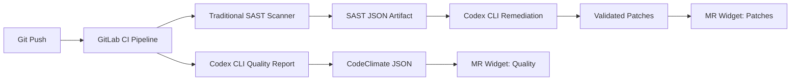
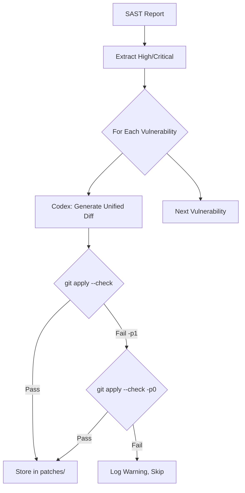

# Codex CLI on GitLab CI: Generating CodeClimate Quality Reports and Automated SAST Remediation Pipelines


---

Most teams bolt a linter into CI and call it done. The results sit in a log that nobody reads until a production incident forces a post-mortem. Codex CLI changes this by bringing reasoning-level analysis into your GitLab pipeline — generating CodeClimate-format quality reports that render directly in merge request widgets and post-processing SAST scanner output into prioritised remediation patches that a developer can apply with `git apply`[^1].

This article walks through two production-ready pipeline patterns drawn from OpenAI's own Cookbook[^1], updated for Codex CLI v0.130 and current best practices.

## Why LLM-Powered Analysis Complements Static Tools

Traditional static analysis tools are rule-based: they match patterns and flag violations. They excel at catching style infractions and known vulnerability signatures, but they struggle with context-dependent problems — business logic errors, architectural anti-patterns, and the subtle security flaws that require understanding how data flows through a system[^1].

Codex CLI adds a reasoning layer on top. It reads the code as a developer would, traces call chains, and surfaces findings that static rules miss. Crucially, it does not replace your existing SAST scanners — it consumes their output and adds exploitability analysis, deduplication, and concrete fix generation[^1].



## Prerequisites

Before configuring these pipeline jobs, ensure you have:

- A GitLab runner with at least 2 vCPUs, 8 GB memory, and 30 GB storage[^1]
- Outbound network access to `api.openai.com` from the runner
- An OpenAI API key stored as a masked CI/CD variable (`OPENAI_API_KEY`)[^2]
- Node.js 20+ available in your CI image (the examples use `node:24`)[^1]

## Pattern 1: AI-Powered Code Quality Reports

The first pattern generates a CodeClimate-format JSON report that GitLab renders natively in merge request widgets[^3]. Each finding appears inline with the affected code, complete with severity, description, and a stable fingerprint for tracking regressions.

### The Pipeline Job

```yaml
codex-quality:
  stage: test
  image: node:24
  variables:
    CODEX_API_KEY: $OPENAI_API_KEY
  before_script:
    - npm install -g @openai/codex
  script:
    - |
      set -euo pipefail

      # Build a file allowlist so Codex only references real files
      FILE_LIST=$(git ls-files | head -500)

      # Run Codex with structured output markers
      codex exec \
        --sandbox read-only \
        --model gpt-5.4 \
        -c reasoning_effort=medium \
        "Review the following repository files for code quality issues.
         Output a single JSON array in CodeClimate format.
         Each object must have: description, check_name, fingerprint,
         severity (info|minor|major|critical|blocker), and
         location (with path and lines.begin).
         Use repo-relative paths without leading './' or absolute paths.
         Wrap output between === BEGIN_CODE_QUALITY_JSON === and
         === END_CODE_QUALITY_JSON === markers.
         No prose, no markdown, no backticks outside the markers.
         Files: ${FILE_LIST}" \
        2>/dev/null | tee /tmp/raw_output.txt

      # Extract JSON between markers
      awk '/=== BEGIN_CODE_QUALITY_JSON ===/,/=== END_CODE_QUALITY_JSON ===/' \
        /tmp/raw_output.txt \
        | grep -v '=== ' \
        | sed 's/\x1b\[[0-9;]*m//g' \
        | tr -d '\r' \
        > /tmp/extracted.json

      # Validate or fall back to empty array
      node -e "
        const fs = require('fs');
        const raw = fs.readFileSync('/tmp/extracted.json', 'utf8').trim();
        try {
          const parsed = JSON.parse(raw);
          if (!Array.isArray(parsed)) throw new Error('not an array');
          fs.writeFileSync('gl-code-quality-report.json', JSON.stringify(parsed, null, 2));
        } catch {
          console.warn('⚠️ Codex output failed validation — using empty report');
          fs.writeFileSync('gl-code-quality-report.json', '[]');
        }
      "
  artifacts:
    reports:
      codequality: gl-code-quality-report.json
  rules:
    - if: $OPENAI_API_KEY && $CI_MERGE_REQUEST_IID
```

### Key Design Decisions

**Read-only sandbox.** The quality report job never needs to write files, so `--sandbox read-only` is the correct policy. This follows OpenAI's own internal practice of granting minimal sandbox permissions[^4].

**File allowlist.** Passing `git ls-files` output constrains Codex to reference actual repository paths. Without this, the model may hallucinate filenames, producing findings that point at non-existent files[^1].

**Marker-based extraction.** Raw `codex exec` output may include ANSI colour codes, progress messages on stderr, and other noise. The `=== BEGIN_CODE_QUALITY_JSON ===` / `=== END_CODE_QUALITY_JSON ===` delimiter pattern gives AWK a reliable extraction boundary[^1].

**Graceful degradation.** If extraction or validation fails, the job writes an empty JSON array rather than failing the pipeline. Quality reports should inform, not block[^1].

**Model selection.** GPT-5.4 with medium reasoning effort strikes the right balance between depth and speed for quality analysis. For cost-sensitive pipelines, `gpt-5.4-mini` works well for straightforward codebases[^5].

### CodeClimate Schema Reference

Each finding in the array must conform to this structure[^3]:

```json
{
  "description": "SQL query built with string concatenation — use parameterised queries",
  "check_name": "security/sql-injection",
  "fingerprint": "a1b2c3d4e5f6",
  "severity": "critical",
  "location": {
    "path": "src/db/queries.py",
    "lines": {
      "begin": 42
    }
  }
}
```

The `fingerprint` field is critical — GitLab uses it to track findings across commits, showing which issues are new versus pre-existing in the merge request widget[^3].

## Pattern 2: SAST Post-Processing and Automated Remediation

The second pattern consumes output from GitLab's built-in SAST scanners and uses Codex CLI to prioritise findings by exploitability and generate validated patches[^1].

### Stage 1: Prioritised Security Recommendations

```yaml
codex-security-triage:
  stage: test
  image: node:24
  needs:
    - job: semgrep-sast
      artifacts: true
  variables:
    CODEX_API_KEY: $OPENAI_API_KEY
  before_script:
    - npm install -g @openai/codex
  script:
    - |
      set -euo pipefail

      # Extract vulnerability count
      VULN_COUNT=$(jq '.vulnerabilities | length' gl-sast-report.json)
      echo "Found ${VULN_COUNT} SAST findings to triage"

      codex exec \
        --sandbox read-only \
        --model gpt-5.4 \
        -c reasoning_effort=high \
        "You are a senior application security engineer.
         Analyse the SAST findings in gl-sast-report.json.

         1. Consolidate duplicates by CWE, affected function, and file range.
         2. Rank by exploitability: prioritise user-controlled inputs reaching
            dangerous sinks (SQL execution, OS commands, eval, deserialisation).
         3. For each consolidated finding, assess:
            - Reachability from exposed entry points
            - Involvement of authentication boundaries
            - Clear call-stack evidence

         Output a markdown report with:
         - Summary statistics (total, consolidated, by severity)
         - Priority table: CWE | Location | Exploit Path | Risk Level
         - Top 5 Immediate Actions with concrete remediation steps
         - Per-finding detail with exploitability score (0-100)

         Save the report to security_priority.md" \
        -o security_priority.md
  artifacts:
    paths:
      - security_priority.md
    expire_in: 30 days
  rules:
    - if: $OPENAI_API_KEY && $CI_MERGE_REQUEST_IID
```

### Stage 2: Automated Patch Generation

```yaml
codex-security-patches:
  stage: deploy
  image: node:24
  needs:
    - job: semgrep-sast
      artifacts: true
    - job: codex-security-triage
      artifacts: true
  variables:
    CODEX_API_KEY: $OPENAI_API_KEY
  before_script:
    - npm install -g @openai/codex
    - apt-get update && apt-get install -y jq
    - mkdir -p patches
  script:
    - |
      set -euo pipefail

      # Extract high/critical vulnerabilities
      jq -r '.vulnerabilities[]
        | select(.severity == "High" or .severity == "Critical")
        | @json' gl-sast-report.json > /tmp/high_vulns.jsonl

      FILE_LIST=$(git ls-files | tr '\n' ' ')
      PATCH_COUNT=0

      while IFS= read -r vuln; do
        VULN_ID=$(echo "$vuln" | jq -r '.id // .cve // "unknown"')
        CWE=$(echo "$vuln" | jq -r '.identifiers[]? | select(.type=="cwe") | .value // "unknown"')
        LOCATION=$(echo "$vuln" | jq -r '.location.file // "unknown"')

        echo "Generating patch for ${CWE} in ${LOCATION}..."

        codex exec \
          --sandbox read-only \
          --model gpt-5.4 \
          -c reasoning_effort=high \
          "Generate a unified diff (git diff format) that fixes this
           vulnerability without changing behaviour:
           ${vuln}
           Repository files: ${FILE_LIST}
           Output ONLY the unified diff. No prose, no explanation." \
          -o "/tmp/patch_${PATCH_COUNT}.diff" 2>/dev/null || continue

        # Validate the patch applies cleanly
        if git apply --check "/tmp/patch_${PATCH_COUNT}.diff" 2>/dev/null; then
          cp "/tmp/patch_${PATCH_COUNT}.diff" "patches/${CWE}_${LOCATION//\//_}.patch"
          echo "✅ Valid patch: ${CWE} in ${LOCATION}"
        elif git apply --check -p0 "/tmp/patch_${PATCH_COUNT}.diff" 2>/dev/null; then
          cp "/tmp/patch_${PATCH_COUNT}.diff" "patches/${CWE}_${LOCATION//\//_}.patch"
          echo "✅ Valid patch (p0): ${CWE} in ${LOCATION}"
        else
          echo "⚠️ Patch failed validation: ${CWE} in ${LOCATION}"
        fi

        PATCH_COUNT=$((PATCH_COUNT + 1))
      done < /tmp/high_vulns.jsonl

      echo "Generated ${PATCH_COUNT} patches, $(ls patches/ 2>/dev/null | wc -l) validated"
  artifacts:
    paths:
      - patches/
    expire_in: 30 days
  rules:
    - if: $OPENAI_API_KEY && $CI_MERGE_REQUEST_IID
```

### The Validation Gate

The `git apply --check` step is non-negotiable. Without it, you risk storing patches that look plausible but fail to apply — or worse, that apply but break the build. The dual check with both default (`-p1`) and `-p0` strip levels handles the two most common path formats Codex produces[^1].



## Security Hardening

Running Codex in CI introduces its own attack surface. Follow these practices to keep it tight:

### API Key Hygiene

Store `OPENAI_API_KEY` as a **masked, protected** CI/CD variable. Restrict it to protected branches and never expose it to forked merge requests[^2]:

```yaml
rules:
  - if: $OPENAI_API_KEY && $CI_MERGE_REQUEST_IID
    when: on_success
  - when: never
```

### Sandbox Policy

Use `--sandbox read-only` for analysis jobs. The only job that should ever need write access is patch generation, and even then `read-only` suffices because patches are written via the `-o` flag and shell redirection, not by the agent writing to the workspace[^4].

Never use `--dangerously-bypass-approvals-and-sandbox` in a pipeline that processes untrusted input. If you need workspace writes, use `--sandbox workspace-write` explicitly[^6].

### Model Selection for Cost Control

Quality analysis and security triage run on every merge request. At scale, model costs matter:

| Job | Recommended Model | Reasoning Effort | Rationale |
|-----|-------------------|-------------------|-----------|
| Quality report | `gpt-5.4-mini` | `medium` | Broad scan, speed matters |
| Security triage | `gpt-5.4` | `high` | Exploitability analysis needs depth |
| Patch generation | `gpt-5.4` | `high` | Correct patches require careful reasoning |

Use profiles in your project's `.codex/config.toml` to codify these choices[^7]:

```toml
[profiles.ci-quality]
model = "gpt-5.4-mini"
reasoning_effort = "medium"

[profiles.ci-security]
model = "gpt-5.4"
reasoning_effort = "high"
```

Then reference them in CI:

```yaml
codex exec --profile ci-quality "Review for quality issues..."
codex exec --profile ci-security "Analyse SAST findings..."
```

## Prompt Engineering for Reliable Pipeline Output

The single biggest failure mode in CI pipelines is unparseable output. Codex is a language model — it wants to explain, caveat, and wrap things in markdown. In a pipeline, you need raw, machine-readable output. Three techniques make this reliable:

**1. Explicit format constraints.** State the exact output format in the prompt: "Output a single JSON array. No prose, no markdown, no backticks."[^1]

**2. Delimiter markers.** Wrap expected output in unique markers (`=== BEGIN_... ===`) so extraction is deterministic regardless of what else the model emits[^1].

**3. Validation with fallback.** Always validate the extracted output against a schema or structural check. If validation fails, fall back to a safe default (empty array, empty report) rather than failing the pipeline[^1].

For structured output without marker extraction, use the `--output-schema` flag to enforce a JSON Schema on the final response[^6]:

```bash
codex exec \
  --sandbox read-only \
  --output-schema ./quality-schema.json \
  "Review src/ for quality issues and return findings"
```

This is cleaner than marker extraction but requires a schema file in your repository.

## Extending the Pattern

The quality-report and remediation-pipeline patterns generalise beyond SAST. The same architecture works for:

- **Dependency scanning** — consume `gl-dependency-scanning-report.json`, prioritise by CVSS and reachability, generate lockfile patches
- **Container scanning** — triage `gl-container-scanning-report.json`, suggest Dockerfile fixes for vulnerable base images
- **DAST post-processing** — correlate dynamic findings with source code to generate targeted fixes
- **Licence compliance** — flag incompatible licences with business-context explanations

Each extension follows the same shape: consume a GitLab-native scanner artifact, prompt Codex for analysis, validate output, and publish results as a pipeline artifact[^1].

## Known Limitations

- **Token costs scale with repository size.** Passing `git ls-files` output consumes input tokens. For large repositories (10,000+ files), filter to relevant directories or use `.codexignore` patterns.
- **Patch quality varies.** Codex-generated patches require human review before merging. The `git apply --check` validation catches format errors but not semantic correctness.
- **Rate limits apply.** API-key usage is subject to standard rate limits. For high-throughput pipelines running across many merge requests, monitor usage and consider request batching.
- **CodeClimate format deprecation.** GitLab deprecated CodeClimate-based scanning in GitLab 17.3, though the report artifact format remains supported[^3]. Check your GitLab version for compatibility.

## Citations

[^1]: OpenAI, "Automating Code Quality and Security Fixes with Codex CLI on GitLab," OpenAI Cookbook, 2026. [https://developers.openai.com/cookbook/examples/codex/secure_quality_gitlab](https://developers.openai.com/cookbook/examples/codex/secure_quality_gitlab)

[^2]: OpenAI, "Non-interactive mode," Codex Developer Documentation, 2026. [https://developers.openai.com/codex/noninteractive](https://developers.openai.com/codex/noninteractive)

[^3]: GitLab, "Code Quality," GitLab CI/CD Documentation. [https://docs.gitlab.com/ci/testing/code_quality/](https://docs.gitlab.com/ci/testing/code_quality/)

[^4]: OpenAI, "Running Codex safely at OpenAI," OpenAI Blog, 8 May 2026. [https://openai.com/index/running-codex-safely/](https://openai.com/index/running-codex-safely/)

[^5]: OpenAI, "Models," Codex Developer Documentation, 2026. [https://developers.openai.com/codex/models](https://developers.openai.com/codex/models)

[^6]: OpenAI, "Command line options," Codex CLI Reference, 2026. [https://developers.openai.com/codex/cli/reference](https://developers.openai.com/codex/cli/reference)

[^7]: OpenAI, "Advanced Configuration," Codex Developer Documentation, 2026. [https://developers.openai.com/codex/config-advanced](https://developers.openai.com/codex/config-advanced)
