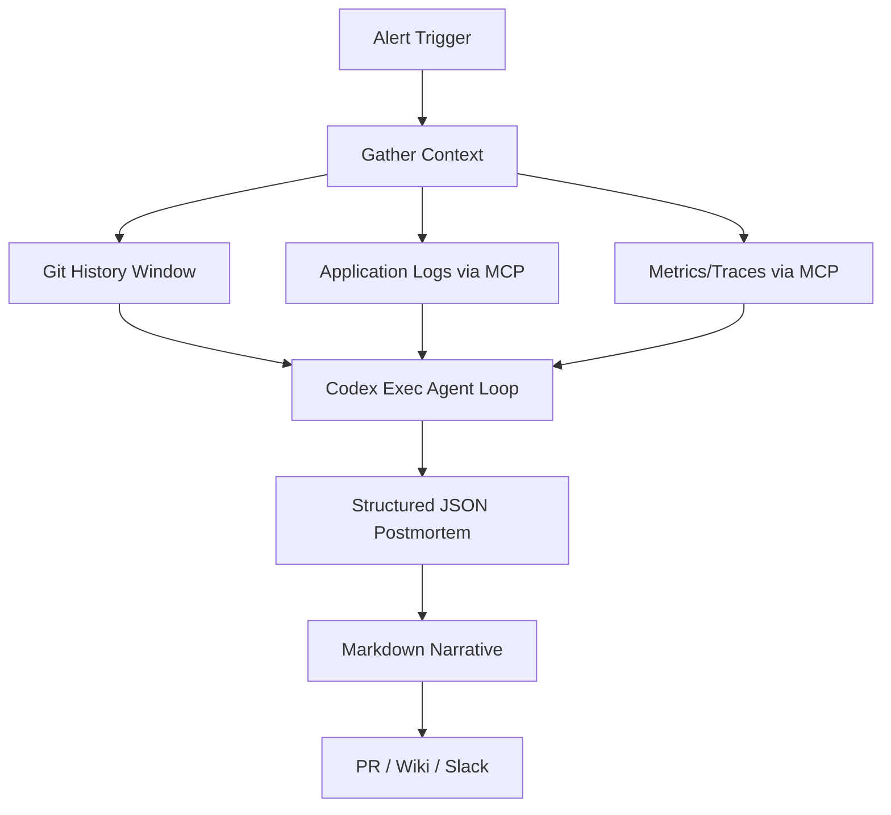
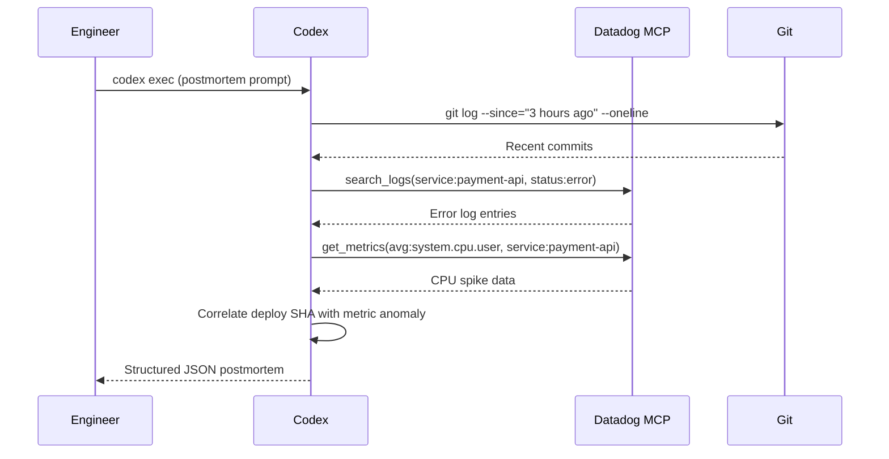

# Codex CLI for Incident Postmortem Automation: From Alert to Structured Root Cause Report in One Agent Loop


---

Writing incident postmortems is universally loathed. Engineers spend 60–90 minutes assembling timelines from scattered logs, correlating deploys with alert spikes, and drafting blameless narratives — all while the next sprint beckons[^1]. AI-assisted postmortem tools like incident.io and Rootly have shown that AI can draft a postmortem in 10–15 minutes from captured timeline data[^2], but they require buy-in to a specific platform. Codex CLI offers a lighter, composable alternative: pipe your existing observability data through an agent loop, apply a structured output schema, and produce a reviewable postmortem document without leaving your terminal.

This article builds a complete incident postmortem pipeline using Codex CLI v0.130, MCP integrations for monitoring platforms, `codex exec` with `--output-schema`, and AGENTS.md policies for consistent blameless analysis.

## Architecture

The pipeline takes four inputs — alert payload, recent git history, application logs, and metrics — and produces a structured JSON postmortem plus a Markdown narrative.



## Prerequisites

You need Codex CLI 0.128.0 or later (0.130+ recommended for `remote-control` and richer MCP support)[^3], an MCP server for your monitoring platform, and a Git repository containing the affected service.

### MCP Server Configuration

Configure your monitoring MCP server in the project's `.codex/config.toml`:

```toml
[[mcp_servers]]
name = "datadog"
transport = "stdio"
command = "npx"
args = ["-y", "@anthropic-ai/mcp-server-datadog"]
env = { DD_API_KEY = "${DD_API_KEY}", DD_APP_KEY = "${DD_APP_KEY}" }

[[mcp_servers]]
name = "pagerduty"
transport = "stdio"
command = "npx"
args = ["-y", "@pagerduty/mcp-server"]
env = { PD_API_TOKEN = "${PD_API_TOKEN}" }
```

For organisations using Grafana, Sentry, or New Relic, substitute the appropriate MCP server package[^4]. The pattern is identical — Codex discovers available tools at session start via the MCP `tools/list` handshake.

## The Output Schema

Define what your postmortem must contain. Save this as `postmortem-schema.json` in your repository:

```json
{
  "$schema": "https://json-schema.org/draft/2020-12/schema",
  "type": "object",
  "required": ["title", "severity", "timeline", "root_cause", "contributing_factors", "impact", "remediation", "action_items"],
  "properties": {
    "title": { "type": "string" },
    "severity": { "enum": ["SEV1", "SEV2", "SEV3", "SEV4"] },
    "timeline": {
      "type": "array",
      "items": {
        "type": "object",
        "required": ["timestamp", "event", "source"],
        "properties": {
          "timestamp": { "type": "string", "format": "date-time" },
          "event": { "type": "string" },
          "source": { "type": "string" }
        }
      }
    },
    "root_cause": { "type": "string" },
    "contributing_factors": { "type": "array", "items": { "type": "string" } },
    "impact": {
      "type": "object",
      "properties": {
        "duration_minutes": { "type": "number" },
        "users_affected": { "type": "number" },
        "revenue_impact": { "type": "string" }
      }
    },
    "remediation": { "type": "string" },
    "action_items": {
      "type": "array",
      "items": {
        "type": "object",
        "required": ["description", "owner", "priority"],
        "properties": {
          "description": { "type": "string" },
          "owner": { "type": "string" },
          "priority": { "enum": ["P0", "P1", "P2"] }
        }
      }
    }
  }
}
```

The `--output-schema` flag ensures Codex's final response conforms to this structure[^5], making downstream automation (Jira ticket creation, wiki publishing) trivial.

## AGENTS.md Postmortem Policy

Create an `AGENTS.md` file (or append to your existing one) that encodes your organisation's postmortem principles:

```markdown
# Incident Postmortem Policy

## Principles
- All analysis MUST be blameless. Never attribute fault to individuals.
- Timelines must include timestamps with sources (log line, commit SHA, alert ID).
- Root cause must distinguish between proximate cause and systemic contributing factors.
- Action items must be specific, measurable, and assigned to a team (not a person).

## Evidence Requirements
- Correlate deploy timestamps (from git log) with metric anomalies.
- Include specific log excerpts that demonstrate the failure mode.
- Note any gaps in observability that hindered diagnosis.

## Severity Classification
- SEV1: >1000 users affected OR revenue loss >£10k/hour
- SEV2: >100 users affected OR degraded SLA
- SEV3: Internal tooling outage OR <100 users
- SEV4: Near-miss, no user impact
```

Codex loads AGENTS.md automatically at session start, ensuring every postmortem follows the same structure regardless of which engineer triggers the pipeline[^6].

## The Execution Pipeline

### Single-Command Postmortem

```bash
codex exec \
  --sandbox workspace-write \
  --output-schema ./postmortem-schema.json \
  -o ./postmortems/$(date +%Y-%m-%d)-incident.json \
  "Investigate the production incident that triggered PagerDuty alert PD-12345. \
   Use the datadog MCP to pull error logs and metrics for service 'payment-api' \
   from the last 2 hours. Cross-reference with git log --since='3 hours ago' \
   to identify recent deploys. Produce a structured postmortem following \
   AGENTS.md policy."
```

This single invocation triggers a multi-step agent loop:



### Converting to Markdown Narrative

Chain a second `codex exec` call to produce the human-readable document:

```bash
codex exec \
  --ephemeral \
  "Convert the JSON postmortem at ./postmortems/2026-05-09-incident.json \
   into a Markdown narrative suitable for the engineering wiki. \
   Use headers, a timeline table, and a numbered action items list." \
  -o ./postmortems/2026-05-09-incident.md
```

### CI Integration for Automatic Postmortem Drafts

Add a GitHub Action that triggers on incident labels:


```yaml
name: Draft Postmortem
on:
  issues:
    types: [labeled]
jobs:
  postmortem:
    if: github.event.label.name == 'incident'
    runs-on: ubuntu-latest
    steps:
      - uses: actions/checkout@v4
      - uses: openai/codex-action@v1
        with:
          codex-args: |
            exec --sandbox workspace-write \
              --output-schema ./postmortem-schema.json \
              -o ./postmortems/${{ github.event.issue.number }}.json \
              "Investigate issue #${{ github.event.issue.number }}. \
               Pull logs from the last 4 hours for the affected service. \
               Correlate with recent deploys. Produce structured postmortem."
        env:
          CODEX_API_KEY: ${{ secrets.CODEX_API_KEY }}
          DD_API_KEY: ${{ secrets.DD_API_KEY }}
          DD_APP_KEY: ${{ secrets.DD_APP_KEY }}
```


The action uses the official `codex-action` GitHub Action[^7], which handles binary installation and authentication.

## Security Considerations

Postmortem pipelines inevitably touch sensitive production data. Apply defence-in-depth:

```toml
[permissions]
profile = "read-only"

[network]
allow_domains = ["api.datadoghq.com", "api.pagerduty.com"]
```

- Use **read-only** permissions — the agent should never modify production systems during analysis[^8].
- Restrict network access to your monitoring APIs via `allow_domains`.
- Set `shell_environment_policy = "ignore"` in CI to prevent credential leakage through environment introspection[^9].
- Consider running postmortem generation in `--ephemeral` mode to avoid persisting sensitive log data in session transcripts.

## Extending the Pipeline

### Multi-Service Correlation

For incidents spanning multiple services, use `--add-dir` to give Codex visibility across repositories:

```bash
codex exec \
  --add-dir ../auth-service \
  --add-dir ../gateway-service \
  --output-schema ./postmortem-schema.json \
  "Investigate the cascading failure across payment-api, auth-service, \
   and gateway-service. Identify the originating failure point."
```

### Sentry Integration for Error Context

Add the Sentry MCP server for richer exception context[^10]:

```toml
[[mcp_servers]]
name = "sentry"
transport = "stdio"
command = "npx"
args = ["-y", "@sentry/mcp-server"]
env = { SENTRY_AUTH_TOKEN = "${SENTRY_AUTH_TOKEN}" }
```

The agent can then pull specific exception stack traces, affected releases, and user impact counts directly from Sentry's issue stream.

### PostToolUse Hook for PII Redaction

Production logs often contain personally identifiable information. Add a hook that scans agent output before it reaches the postmortem:

```toml
[hooks.PostToolUse]
command = "python scripts/redact_pii.py"
description = "Redact emails, IPs, and user IDs from postmortem output"
```

## Measuring Quality

Track postmortem quality over time by adding metrics to your `codex exec --json` pipeline:

```bash
codex exec --json \
  --output-schema ./postmortem-schema.json \
  "Generate postmortem for incident INC-456" \
  | jq 'select(.type == "turn.completed") | .usage'
```

The `turn.completed` event now includes `reasoning_output_tokens` alongside `input_tokens` and `output_tokens`[^11], letting you track how much reasoning the model invested in root cause analysis versus simple log summarisation.

## Limitations and Caveats

- **Correlation is not causation.** Codex can identify temporal correlations between deploys and failures, but the root cause determination is a hypothesis requiring human validation.
- **Log volume constraints.** MCP tools have output token limits. For high-volume services, pre-filter logs before passing to Codex or use the monitoring platform's query language to narrow the window.
- **Model hallucination risk.** Always verify specific log timestamps and commit SHAs cited in the postmortem against source data. The structured output schema helps by forcing explicit source attribution in timeline entries.
- **Sensitive data handling.** Ensure your organisation's data classification policies permit sending production log excerpts to the OpenAI API. Consider self-hosted model providers via Codex's custom provider configuration for regulated environments.

## Conclusion

Incident postmortems are high-value, low-frequency documents that benefit enormously from automation. By combining Codex CLI's `exec` mode with MCP integrations for monitoring platforms, structured output schemas for consistent formatting, and AGENTS.md policies for blameless analysis, teams can reduce postmortem drafting time from 90 minutes to under 10 — while improving consistency and evidence quality. The human reviewer's job shifts from assembling facts to validating conclusions and assigning ownership.

## Citations

[^1]: incident.io, "Best incident postmortem software: Complete guide for 2026," https://incident.io/blog/best-incident-postmortem-software-2026-guide — reports 60–90 minute average postmortem writing time without automation.

[^2]: incident.io, "Best incident postmortem software: Complete guide for 2026," https://incident.io/blog/best-incident-postmortem-software-2026-guide — AI drafts postmortems in 10–15 minutes from captured timeline data.

[^3]: OpenAI, "Changelog – Codex," https://developers.openai.com/codex/changelog — v0.128.0 added persisted /goal workflows; v0.130.0 added remote-control and built-in MCPs as first-class runtime servers.

[^4]: OpenAI, "Model Context Protocol – Codex," https://developers.openai.com/codex/mcp — MCP configuration supports both STDIO and HTTP transports for connecting external tools.

[^5]: OpenAI, "Non-interactive mode – Codex," https://developers.openai.com/codex/noninteractive — `--output-schema` requests a final response conforming to a JSON Schema, useful for automated workflows needing stable fields.

[^6]: OpenAI, "Custom instructions with AGENTS.md – Codex," https://developers.openai.com/codex/guides/agents-md — AGENTS.md loads into context automatically and encodes how a team wants Codex to work in a repository.

[^7]: OpenAI, "GitHub Action – Codex," https://developers.openai.com/codex/github-action — official action for running Codex in CI pipelines.

[^8]: OpenAI, "Running Codex safely at OpenAI," https://openai.com/index/running-codex-safely/ — recommends read-only permission profiles for analysis-only workflows.

[^9]: OpenAI, "Configuration Reference – Codex," https://developers.openai.com/codex/config-reference — `shell_environment_policy` controls whether the agent can read environment variables.

[^10]: Sentry, "Sentry MCP Server," https://docs.sentry.io/organization/integrations/mcp/ — MCP server providing 22 tools for issue investigation, including stack traces and release correlation.

[^11]: GitHub, "Surface reasoning tokens in exec JSON usage," https://github.com/openai/codex/pull/19308 — PR adding `reasoning_output_tokens` to the exec JSON usage payload for programmatic consumers.
