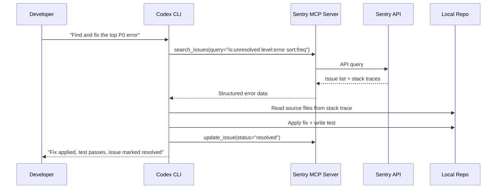
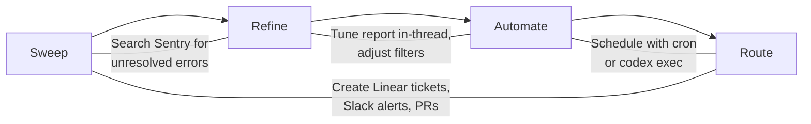

# Codex CLI + Sentry MCP: From Production Error to Pull Request in One Agent Loop


---

Production errors should not require a context switch. You should not have to leave your terminal, open a browser tab, navigate to Sentry, read a stack trace, switch back to your editor, find the offending file, reason about the fix, and then write the code. With the Sentry MCP server connected to Codex CLI, you can collapse that entire loop into a single agent conversation — from error discovery through to a tested pull request.

This article walks through the practical setup, the available tooling, three concrete workflows, and the security considerations you need before you point an agent at your production error stream.

## Why Sentry MCP Matters for Terminal-First Developers

Sentry's MCP server exposes production error data — stack traces, event context, affected releases, user impact metrics, and Seer AI analysis — directly to Codex CLI's agent loop through the Model Context Protocol [^1]. Instead of copy-pasting stack traces into a chat window, the agent can query Sentry programmatically, correlate errors with your local codebase, and propose (or apply) fixes in the same turn.

OpenAI's own bug triage use-case documentation recommends exactly this pattern: connect Sentry alongside GitHub, Slack, and Linear plugins to build automated triage sweeps that prioritise errors and route follow-ups [^2].



## Setting Up the Sentry MCP Server

Sentry offers two transport modes: a hosted cloud endpoint using OAuth, and a local stdio transport for self-hosted instances [^1].

### Cloud Transport (Recommended)

The cloud transport requires no local installation. Add the following to your Codex CLI configuration:

```toml
# ~/.codex/config.toml

[mcp_servers.sentry]
url = "https://mcp.sentry.dev/mcp"
```

On first use, Codex will trigger an OAuth flow in your browser to authenticate against your Sentry account [^1]. To scope the server to a specific organisation or project, append the slug to the URL:

```toml
[mcp_servers.sentry]
url = "https://mcp.sentry.dev/mcp/my-org/my-project"
```

### Stdio Transport (Self-Hosted)

For self-hosted Sentry instances or environments where OAuth is impractical, use the stdio transport:

```toml
[mcp_servers.sentry]
command = "npx"
args = ["@sentry/mcp-server@latest", "--access-token", "${SENTRY_ACCESS_TOKEN}", "--host", "sentry.internal.example.com"]
env = { OPENAI_API_KEY = "${OPENAI_API_KEY}" }
```

The access token requires these scopes: `org:read`, `project:read`, `project:write`, `team:read`, `team:write`, and `event:write` [^3]. The `OPENAI_API_KEY` environment variable is mandatory for AI-powered search tools like `search_issues` and `search_events` when using the stdio transport [^3].

### Tool Allow-Lists

You do not need every Sentry tool exposed to the agent. Restrict the surface area to what your workflow requires:

```toml
[mcp_servers.sentry]
url = "https://mcp.sentry.dev/mcp/my-org"
enabled_tools = [
  "find_projects",
  "search_issues",
  "search_issue_events",
  "get_issue_details",
  "update_issue"
]
```

This follows the principle of least privilege recommended in Codex CLI's agent approvals documentation [^4]. Omitting destructive tools like the universal delete tool prevents the agent from accidentally removing Sentry resources.

## The Sentry MCP Toolset

The Sentry MCP server exposes a growing set of tools (22 at the time of writing) [^5]. The subset most relevant to error triage and resolution includes:

| Tool | Purpose |
|------|---------|
| `find_organizations` | Discover accessible Sentry organisations |
| `find_projects` | List projects within an organisation |
| `search_issues` | Natural-language search across errors (e.g., "unhandled exceptions affecting 100+ users in the last 24 hours") |
| `search_events` | Query events by time, environment, release, trace ID, or tags |
| `search_issue_events` | Filter events within a specific issue |
| `get_issue_details` | Full issue context: stack trace, tags, first/last seen, user count |
| `update_issue` | Change status (resolve, ignore), reassign, adjust priority, add comments |

The `search_issues` and `search_events` tools use an embedded LLM to translate natural-language queries into Sentry's search syntax [^3]. On self-hosted instances without Seer, you may need to disable the `seer` skill via the `MCP_DISABLE_SKILLS` environment variable [^3].

## Workflow 1: Interactive Error Investigation

The simplest workflow is a conversation where you point Codex at a specific Sentry issue:

```bash
codex "Investigate Sentry issue PROJ-4821. Read the stack trace, \
find the root cause in our codebase, and suggest a fix."
```

The agent will:

1. Call `get_issue_details` to retrieve the full stack trace and event context
2. Map file paths from the stack trace to your local repository
3. Read the relevant source files
4. Reason about the root cause using both the error context and the surrounding code
5. Propose a fix, either as a diff or applied directly depending on your approval policy

This works well for one-off investigations where you want the agent to do the legwork but you retain full control over what gets committed.

## Workflow 2: Batch Triage Sweep

For a more systematic approach, use Codex's non-interactive mode to generate a triage report:

```bash
codex exec "Search Sentry for unresolved P0 and P1 errors from \
the last 48 hours in the 'api-gateway' project. For each issue: \
summarise the root cause, identify the affected file(s) in this \
repo, and estimate fix complexity (trivial/moderate/complex). \
Output a markdown table." --json > triage-report.json
```

This mirrors the four-phase triage workflow from OpenAI's use-case documentation [^2]:



Once you are satisfied with the report quality, schedule it:

```bash
# Run every morning at 08:00
0 8 * * * cd /path/to/repo && codex exec "Run the standard Sentry triage sweep..." --json >> /var/log/triage.json
```

## Workflow 3: End-to-End Fix Pipeline

The most powerful pattern chains error discovery, code fix, test generation, and issue resolution into a single agent turn:

```bash
codex "Search Sentry for the highest-frequency unresolved error \
in 'payments-service' from the last 24 hours. Diagnose the root \
cause, write a fix, add a regression test, run the existing test \
suite to verify nothing breaks, and if all tests pass, mark the \
Sentry issue as resolved with a comment linking to the fix."
```

⚠️ **This workflow requires careful approval configuration.** The agent will attempt to mutate both your codebase and your Sentry issue state. At minimum, use the `"on-request"` approval policy so you can review each step:

```toml
# ~/.codex/config.toml
approval_policy = "on-request"
```

For teams who want the agent to run autonomously but with guardrails, use a PostToolUse hook to audit Sentry mutations:

```toml
[features]
codex_hooks = true

[[hooks.PostToolUse]]
matcher = "^mcp__sentry__update_issue$"

[[hooks.PostToolUse.hooks]]
type = "command"
command = 'echo "AUDIT: Sentry issue updated — $(date -u +%Y-%m-%dT%H:%M:%SZ)" >> .codex/sentry-audit.log'
timeout = 5
statusMessage = "Logging Sentry mutation"
```

## AGENTS.md Integration

Define Sentry-aware instructions in your repository's `AGENTS.md` so the agent consistently follows your team's debugging conventions:

```markdown
## Error Investigation Protocol

When investigating Sentry errors:

1. Always check the **full event context** — do not rely solely on the exception message
2. Correlate the stack trace with the **current branch**, not just main
3. Check for **related issues** (linked errors, similar stack traces) before diagnosing
4. When writing a fix, always include a **regression test** that reproduces the original error
5. Never mark an issue as resolved unless all tests pass
6. Add a comment to the Sentry issue with: fix description, affected files, and test coverage

## Sentry Search Conventions

- Use `is:unresolved` to exclude already-resolved issues
- Filter by `environment:production` unless explicitly asked about staging
- Sort by frequency (`sort:freq`) for triage, by date (`sort:date`) for recent regressions
```

These instructions are automatically included in the agent's context and work across Codex CLI, Cursor, Copilot, and other tools that read `AGENTS.md` [^6].

## Security Considerations

### Network Access

Sentry MCP requires network access to reach either the cloud endpoint or your self-hosted instance. If you normally run Codex with network disabled (the default for local sandbox mode), you will need a profile that enables it:

```toml
[profiles.sentry-debug]
sandbox_mode = "write-allow-net"

[profiles.sentry-debug.mcp_servers.sentry]
url = "https://mcp.sentry.dev/mcp/my-org"
enabled_tools = ["search_issues", "get_issue_details"]
```

Activate the profile with `codex --profile sentry-debug` [^7].

### Token Hygiene

For the stdio transport, avoid embedding tokens directly in `config.toml`. Use environment variable references (`${SENTRY_ACCESS_TOKEN}`) and ensure your token has the minimum required scopes [^3]. Rotate tokens on a regular cadence — the agent's audit log will help you track which tokens are in active use.

### Data Sensitivity

Production error events may contain PII, request payloads, or database query fragments. Consider whether your approval policy should require human review before the agent processes event data. The `"on-request"` policy with MCP elicitation support (new in v0.129) provides a natural checkpoint [^8].

## Known Limitations

- **Seer availability**: AI-powered root-cause analysis via Seer is only available on sentry.io cloud, not self-hosted instances [^3]
- **Search tool dependency**: The `search_issues` and `search_events` tools require an LLM provider key (`OPENAI_API_KEY` or `ANTHROPIC_API_KEY`) when using stdio transport [^3]
- **Rate limits**: The cloud MCP endpoint is subject to Sentry's standard API rate limits; batch triage sweeps over large projects may need pagination handling
- **Issue creation**: Sentry issues are created automatically from errors — the MCP server can update but not create issues [^5]
- **Context window cost**: Rich stack traces with full event metadata consume significant tokens; use `enabled_tools` and scoped URLs to limit the data surface

## Putting It Together

The Sentry MCP integration turns Codex CLI into a production-aware debugging agent. The key is to start conservatively — interactive investigation with full approval — and progressively automate as you build confidence in the agent's triage accuracy. The PostToolUse audit hooks and `enabled_tools` allow-lists give you the safety rails to do this incrementally.

For teams already using Codex CLI for development, adding Sentry MCP closes the gap between "code written" and "code working in production." The agent that wrote the feature can now also diagnose and fix the errors it causes.

## Citations

[^1]: Sentry, "MCP Server Documentation," [https://docs.sentry.io/ai/mcp/](https://docs.sentry.io/ai/mcp/) — Accessed 2026-05-09

[^2]: OpenAI, "Automate Bug Triage — Codex Use Cases," [https://developers.openai.com/codex/use-cases/automation-bug-triage](https://developers.openai.com/codex/use-cases/automation-bug-triage) — Accessed 2026-05-09

[^3]: Sentry, "sentry-mcp GitHub Repository," [https://github.com/getsentry/sentry-mcp](https://github.com/getsentry/sentry-mcp) — Accessed 2026-05-09

[^4]: OpenAI, "Agent Approvals & Security — Codex," [https://developers.openai.com/codex/agent-approvals-security](https://developers.openai.com/codex/agent-approvals-security) — Accessed 2026-05-09

[^5]: Speakeasy, "Sentry MCP Server — 22 Tools," [https://www.speakeasy.com/use-cases/mcp-governance/catalog/sentry](https://www.speakeasy.com/use-cases/mcp-governance/catalog/sentry) — Accessed 2026-05-09

[^6]: OpenAI, "AGENTS.md Documentation," [https://developers.openai.com/codex/agents-md](https://developers.openai.com/codex/agents-md) — Accessed 2026-05-09

[^7]: OpenAI, "Config Reference — Codex," [https://developers.openai.com/codex/config-reference](https://developers.openai.com/codex/config-reference) — Accessed 2026-05-09

[^8]: OpenAI, "Codex Changelog — v0.129.0," [https://developers.openai.com/codex/changelog](https://developers.openai.com/codex/changelog) — Accessed 2026-05-09
