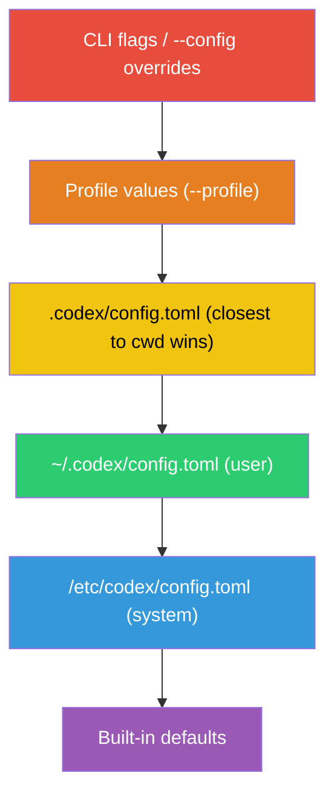
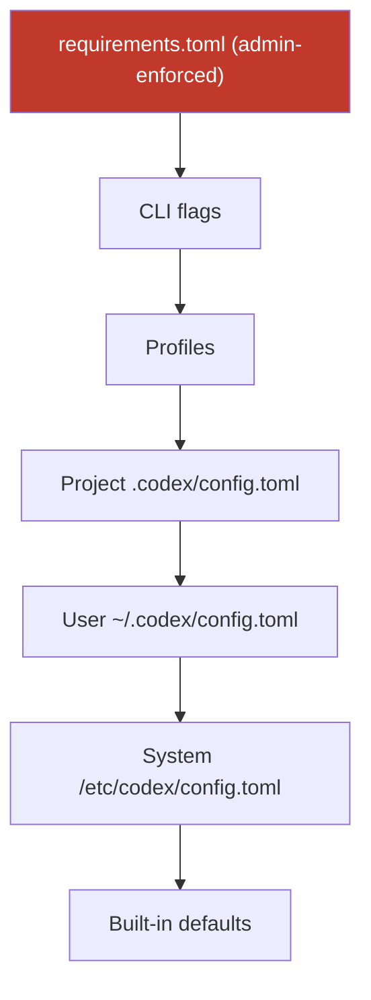
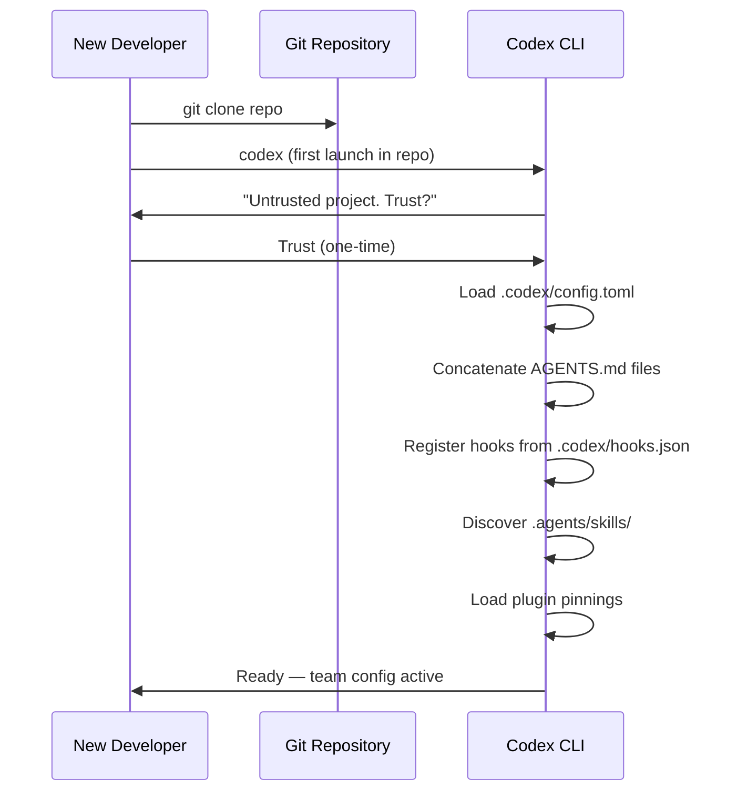

# Codex CLI Team Configuration: The .codex Directory, Shared Profiles, and Repository-Scoped Settings for Consistent Agent Behaviour


---

Individual developers can get productive with Codex CLI in minutes. Getting a ten-person team to work consistently with the same model, approval policies, sandbox constraints, hooks, and AGENTS.md conventions takes considerably more thought. This article maps the full surface area of team-level configuration — the `.codex/` directory, AGENTS.md layering, shared hooks, named profiles, skills, plugin distribution, and the enterprise `requirements.toml` ceiling — and provides concrete recipes for shipping a repository that any new joiner can clone and trust once to inherit the team's entire Codex setup.

## The Configuration Precedence Stack

Codex resolves every setting through a strict precedence hierarchy[^1][^2]:



Project-scoped files — everything inside `.codex/` — only load when the developer has explicitly marked the project as trusted[^1]. This is the foundational security boundary: cloning a malicious repository cannot silently override a developer's approval policies or sandbox mode. When a project is untrusted, Codex falls back to user and system layers, ignoring project-local config, hooks, and rules entirely[^1].

For teams, the sweet spot is the repository-level `.codex/config.toml`. It sets project-specific defaults that every team member inherits on clone, whilst individual developers retain the ability to override specific keys in their personal `~/.codex/config.toml`[^2].

## Anatomy of the .codex Directory

A well-structured repository-level `.codex/` directory looks like this:

```
.codex/
├── config.toml          # Team defaults: model, sandbox, approval policy
├── hooks.json           # Shared lifecycle hooks (lint gates, test gates)
├── rules/               # Exec-policy rule files
│   └── no-force-push.toml
└── agents/              # Custom agent definitions
    ├── reviewer.toml
    └── explorer.toml
```

Alongside `.codex/`, the repository root typically holds:

```
AGENTS.md                # Top-level project instructions
.agents/
├── skills/              # Shared skill directories
│   ├── run-tests/
│   │   └── SKILL.md
│   └── lint-fix/
│       └── SKILL.md
└── plugins/
    └── marketplace.json # Pinned plugin versions for the project
```

Each of these files participates in a different subsystem, but they compose into a single runtime configuration that every team member shares.

## config.toml: Team Defaults

The project-scoped `config.toml` is where most teams should start. A pragmatic baseline for a backend team:

```toml
# .codex/config.toml — checked into version control

model = "gpt-5.5"
model_reasoning_effort = "medium"

# Require explicit approval for writes; read-only by default
approval_policy = "on-request"
sandbox_mode = "workspace-write"

# Lock down web search to cached mode for deterministic CI behaviour
web_search = "cached"

# Default permission profile
default_permissions = ":workspace"

# Shell environment: inherit minimal, never leak secrets
[shell_environment_policy]
inherit = "core"
exclude = ["AWS_*", "AZURE_*", "GH_TOKEN", "OPENAI_API_KEY"]

# MCP servers the team uses
[mcp_servers.context7]
command = "npx"
args = ["-y", "@context7/mcp-server"]
startup_timeout_seconds = 30

# Feature flags
[features]
codex_hooks = true
multi_agent = true
```

Key decisions to make as a team:

- **Model choice.** Pin a specific model rather than relying on defaults. Model routing changes between releases, and pinning avoids surprise behaviour changes[^3].
- **Approval policy.** `"on-request"` is the sensible middle ground — developers see what the agent wants to do before it executes, but can escalate to `"never"` (manual approval for everything) or `granular` approval per category[^4].
- **Sandbox mode.** `"workspace-write"` confines writes to the project directory. Never commit `"danger-full-access"` to a shared repository unless the team has a specific, documented reason[^4].
- **Shell environment policy.** The `exclude` list prevents Codex from inheriting sensitive environment variables. The `ignore_default_excludes` flag (default `false`) retains automatic KEY/SECRET/TOKEN filtering[^2].

## AGENTS.md: Layered Project Instructions

AGENTS.md is the team's natural-language contract with the agent. Codex walks the directory tree from the project root to the current working directory, concatenating every `AGENTS.md` file it finds[^5]. This means you can layer instructions:

```
repo-root/
├── AGENTS.md                    # Broad conventions (style, testing, CI)
├── services/
│   ├── AGENTS.md                # Service-layer patterns (API design, error handling)
│   └── payments/
│       └── AGENTS.override.md   # Payments-specific overrides (PCI constraints)
└── libs/
    └── AGENTS.md                # Library conventions (semver, public API stability)
```

An `AGENTS.override.md` file replaces the regular `AGENTS.md` at that directory level — it does not concatenate[^5]. This is useful when a subdirectory has fundamentally different constraints (e.g., a payments service under PCI scope that should not inherit the general "feel free to refactor" guidance from the root).

**Size limit.** The combined AGENTS.md content is capped at `project_doc_max_bytes` — 32 KiB by default[^5]. If your team's documentation exceeds this, increase it in `config.toml`:

```toml
project_doc_max_bytes = 65536
```

If you have existing documentation standards, configure fallback filenames so Codex picks them up automatically:

```toml
project_doc_fallback_filenames = ["TEAM_GUIDE.md", ".agents.md", "CONTRIBUTING.md"]
```

### What Belongs in AGENTS.md

A root-level AGENTS.md for a team typically covers:

```markdown
# Project Conventions

## Build and Test
- Run tests: `make test`
- Run lint: `make lint`
- Never commit with failing tests.

## Code Style
- British English in comments and documentation.
- Use structured logging (slog) — never fmt.Printf for log output.
- Error handling: wrap errors with context, never discard.

## Architecture
- Services communicate via gRPC; REST is only for external-facing APIs.
- Database migrations use Atlas. Never write raw SQL migration files.

## Security
- Never hardcode secrets. Use environment variables or Vault references.
- All new endpoints require authentication middleware.
```

Keep it actionable and specific. Vague guidance ("write clean code") wastes context window budget.

## Shared Hooks: Quality Gates for the Team

Hooks fire at specific points in the agent lifecycle — before a tool runs (`PreToolUse`), after it runs (`PostToolUse`), before compaction, and at session start/end[^6]. Project-level hooks live in `.codex/hooks.json` or as inline `[hooks]` tables in `.codex/config.toml`[^6].

A typical team hook that blocks force pushes:

```json
{
  "hooks": [
    {
      "event": "PreToolUse",
      "tool_name": "shell",
      "match": "git push --force|git push -f",
      "action": "deny",
      "message": "Force pushes are prohibited. Use --force-with-lease if you must."
    }
  ]
}
```

A `PostToolUse` hook that runs the linter after every file write:

```json
{
  "hooks": [
    {
      "event": "PostToolUse",
      "tool_name": "apply_patch",
      "command": "make lint-changed",
      "on_failure": "warn"
    }
  ]
}
```

If both `hooks.json` and inline `[hooks]` exist in the same config layer, Codex merges them and warns at startup[^6]. Settle on one format per layer to avoid confusion.

Project hooks only load when the project is trusted — the same security boundary that protects `config.toml`[^1].

## Named Profiles: Role-Based Configuration

Profiles let team members switch between configuration sets without editing files[^2]. Define them in the user's `~/.codex/config.toml` or in the project's `.codex/config.toml`:

```toml
# .codex/config.toml

[profiles.ci]
model = "gpt-5.3-codex-spark"
model_reasoning_effort = "low"
approval_policy = "never"
web_search = "disabled"

[profiles.deep-review]
model = "gpt-5.5"
model_reasoning_effort = "xhigh"
approval_policy = "on-request"

[profiles.explorer]
model = "gpt-5.4"
model_reasoning_effort = "medium"
sandbox_mode = "read-only"
```

Invoke with:

```bash
codex --profile ci exec "Run the test suite and report failures as JSON"
codex --profile deep-review
```

The `ci` profile is deliberately frugal — a smaller, faster model with no web search and no interactive approval, suitable for headless pipelines. The `deep-review` profile uses the flagship model at maximum reasoning effort for thorough code review. The `explorer` profile locks the sandbox to read-only for safe codebase exploration[^2][^3].

⚠️ Profiles are currently experimental and unsupported in the IDE extension[^2]. Plan for CLI-only usage.

## Custom Agent Definitions

For teams with specialised workflows, custom agents live as TOML files in `.codex/agents/` (project-scoped) or `~/.codex/agents/` (personal)[^7]:

```toml
# .codex/agents/reviewer.toml

name = "reviewer"
description = "Reviews code changes for style, correctness, and security"

[developer_instructions]
content = """
You are a code reviewer. Focus on:
1. Logic errors and edge cases
2. Security vulnerabilities (injection, auth bypass, data leaks)
3. Adherence to the project's AGENTS.md conventions
4. Test coverage gaps

Never suggest cosmetic-only changes. Every comment must identify
a concrete risk or defect.
"""

sandbox_mode = "read-only"
model = "gpt-5.5"
model_reasoning_effort = "high"
```

Subagents inherit the parent session's sandbox policy and approval overrides unless explicitly overridden[^7]. The `max_threads` setting (default 6) caps concurrent agent threads[^7].

## Skills: Shared Repeatable Workflows

Skills are reusable instruction packages stored in `.agents/skills/` directories[^8]. Each skill is a folder containing at minimum a `SKILL.md` file:

```
.agents/skills/
├── run-tests/
│   ├── SKILL.md
│   └── scripts/
│       └── test-runner.sh
├── generate-migration/
│   ├── SKILL.md
│   └── references/
│       └── atlas-docs.md
└── security-scan/
    └── SKILL.md
```

Codex scans `.agents/skills` from the current working directory upwards to the repository root[^8]. A team can commit shared skills to the repository, and individual developers can add personal skills in `~/.codex/skills/`.

## Plugin Distribution

Plugins bundle skills, MCP servers, and hooks into installable packages[^9]. For team-wide plugin standardisation:

- **Project-level:** `.agents/plugins/marketplace.json` pins specific plugin versions for the repository
- **Personal:** `~/.agents/plugins/marketplace.json` and `~/.codex/plugins/` for individual preferences

The `/plugins` slash command manages installation and discovery interactively[^9].

## The Enterprise Ceiling: requirements.toml

For organisations using ChatGPT Enterprise or Business plans, `requirements.toml` provides an admin-enforced ceiling that no user or project configuration can override[^10][^11]:



When a resolved configuration value conflicts with a requirement, Codex falls back to a compliant value and notifies the developer[^10]. Requirements can constrain:

- Approval policies and sandbox modes
- Web search modes
- MCP server allow-lists
- Feature flags
- Managed hooks (scripts deployed via MDM)

Cloud-managed `requirements.toml` policies are configured through the Codex Policies page in workspace settings, eliminating the need to distribute files to devices[^11].

## Onboarding Recipe: From Clone to Productive

Here is the practical flow for a new team member:



The developer's personal `~/.codex/config.toml` still applies for any keys they choose to override — file opener preference, personality mode, or model provider credentials. The project configuration sets the floor; the personal configuration handles individual ergonomics.

**Verify the setup** with:

```bash
codex --ask-for-approval never "Summarise the current instructions and configuration."
```

Codex should echo the AGENTS.md content in precedence order and confirm the active model, sandbox mode, and approval policy[^5].

For debugging configuration resolution issues, use:

```bash
codex /debug-config
```

This prints every config layer, showing which file contributed each setting and whether any values were overridden[^2].

## Recommendations

1. **Commit `.codex/config.toml` and `AGENTS.md` from day one.** These two files cover 80% of team standardisation.
2. **Pin the model.** Do not rely on default model routing — it changes between releases.
3. **Start with `"on-request"` approval and `"workspace-write"` sandbox.** Relax constraints deliberately, not by default.
4. **Keep AGENTS.md under 16 KiB.** Half the default budget leaves room for subdirectory overrides.
5. **Use profiles for CI vs interactive.** A `ci` profile with a smaller model and no approval avoids wasting flagship-model tokens on headless runs.
6. **Ship hooks for hard rules, not soft preferences.** A `PreToolUse` deny hook for force pushes is a gate; a style preference belongs in AGENTS.md.
7. **Distribute plugins via `.agents/plugins/marketplace.json`.** Pinning versions prevents drift between team members.
8. **Use `requirements.toml` for security invariants.** If a constraint must never be overridden (e.g., no `"danger-full-access"` sandbox), enforce it at the admin level.

## Citations

[^1]: OpenAI, "Config basics — Codex," May 2026. [https://developers.openai.com/codex/config-basic](https://developers.openai.com/codex/config-basic)
[^2]: OpenAI, "Advanced Configuration — Codex," May 2026. [https://developers.openai.com/codex/config-advanced](https://developers.openai.com/codex/config-advanced)
[^3]: OpenAI, "Configuration Reference — Codex," May 2026. [https://developers.openai.com/codex/config-reference](https://developers.openai.com/codex/config-reference)
[^4]: OpenAI, "Agent Approvals & Security — Codex," May 2026. [https://developers.openai.com/codex/agent-approvals-security](https://developers.openai.com/codex/agent-approvals-security)
[^5]: OpenAI, "Custom instructions with AGENTS.md — Codex," May 2026. [https://developers.openai.com/codex/guides/agents-md](https://developers.openai.com/codex/guides/agents-md)
[^6]: OpenAI, "Hooks — Codex," May 2026. [https://developers.openai.com/codex/hooks](https://developers.openai.com/codex/hooks)
[^7]: OpenAI, "Subagents — Codex," May 2026. [https://developers.openai.com/codex/subagents](https://developers.openai.com/codex/subagents)
[^8]: OpenAI, "Agent Skills — Codex," May 2026. [https://developers.openai.com/codex/skills](https://developers.openai.com/codex/skills)
[^9]: OpenAI, "Best practices — Codex," May 2026. [https://developers.openai.com/codex/learn/best-practices](https://developers.openai.com/codex/learn/best-practices)
[^10]: OpenAI, "Managed configuration — Codex," May 2026. [https://developers.openai.com/codex/enterprise/managed-configuration](https://developers.openai.com/codex/enterprise/managed-configuration)
[^11]: OpenAI, "Admin Setup — Codex," May 2026. [https://developers.openai.com/codex/enterprise/admin-setup](https://developers.openai.com/codex/enterprise/admin-setup)
