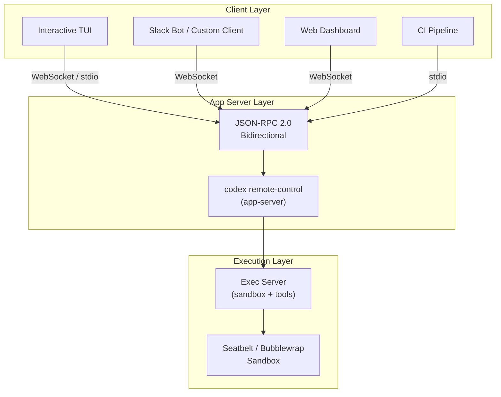
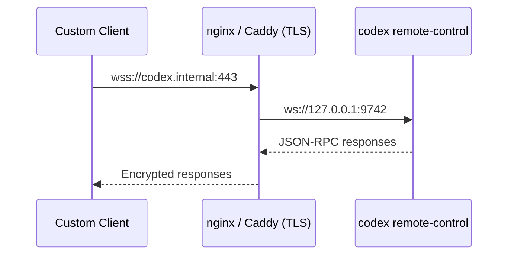

# Codex CLI v0.130: Building Headless Agent Services with `remote-control` and the Thread Pagination API


---

Codex CLI v0.130.0, released on 8 May 2026, ships two features that quietly change what you can build on top of the agent: a new `codex remote-control` subcommand that reduces headless app-server startup to a single line, and a thread pagination API that lets custom clients navigate large conversation histories without loading entire threads into memory[^1]. Together, they lower the barrier for teams building Slack bots, web dashboards, scheduled pipelines, and bespoke developer tools that treat Codex as a programmable backend rather than an interactive terminal.

This article covers the architecture, walks through practical setup, and shows how to build a minimal custom client that creates threads, submits turns, and pages through results.

## Why `remote-control` Exists

Before v0.130, running Codex headlessly meant invoking `codex app-server` with a chain of flags for transport, authentication, and listener configuration[^2]. The incantation looked something like this:

```bash
codex app-server \
  --listen ws://127.0.0.1:9742 \
  --ws-auth capability-token \
  --ws-token-file /var/run/codex/token
```

The `remote-control` subcommand wraps these defaults into a single opinionated entrypoint designed for the common case: a headless Codex agent listening on a local WebSocket, ready for programmatic control[^1].

```bash
codex remote-control
```

Under the hood it still starts the same app-server process — the same JSON-RPC 2.0 protocol, the same sandbox enforcement, the same model routing. What changes is the ergonomics: sensible defaults for transport, auth, and lifecycle management are baked in so you spend less time wiring plumbing and more time building the integration layer above it.

## Architecture: Where `remote-control` Fits

Codex CLI's process model splits into three layers. Understanding them prevents confusion about which component does what.



The **app server** manages threads, turns, model inference, and MCP tool dispatch. The **exec server** handles sandboxed command execution underneath it. Custom clients talk to the app server over JSON-RPC; they never interact with the exec server directly[^2][^3].

The `remote-control` command is simply a convenience wrapper around the app-server layer. It does not introduce a new process or protocol — it configures the existing one for headless use.

## Getting Started

### Prerequisites

Update to v0.130.0 or later:

```bash
codex update
codex --version
# codex 0.130.0
```

### Starting a Headless Instance

The simplest invocation:

```bash
codex remote-control
```

This starts the app-server on a local WebSocket listener with capability-token authentication. The startup banner prints the connection URL and token path[^1].

For production deployments, explicit configuration is clearer:

```bash
codex remote-control \
  --listen ws://127.0.0.1:9742 \
  --ws-auth signed-bearer-token \
  --ws-shared-secret-file /etc/codex/hmac-secret
```

### Authentication Modes

Two authentication modes are available for WebSocket connections[^2]:

| Mode | Use Case | Setup |
|------|----------|-------|
| `capability-token` | Single-user, local network | Generate random token file; client sends it as `Authorization: Bearer <token>` |
| `signed-bearer-token` | Multi-client, production | HMAC shared secret; client signs JWT with configurable issuer/audience claims |

For capability-token auth, create the token:

```bash
openssl rand -hex 32 > /var/run/codex/token
chmod 600 /var/run/codex/token
```

For signed-bearer-token auth, generate the HMAC secret:

```bash
openssl rand -base64 64 > /etc/codex/hmac-secret
chmod 600 /etc/codex/hmac-secret
```

The signed-bearer-token mode supports `--ws-issuer` and `--ws-audience` flags for JWT claim validation, plus `--ws-max-clock-skew-seconds` for distributed environments where clocks may drift[^2].

## The JSON-RPC Protocol

Every interaction with the headless agent follows the JSON-RPC 2.0 specification. Requests include a `method`, `params`, and `id`; notifications omit the `id`[^3].

### Connection Lifecycle

All WebSocket connections must complete an initialisation handshake before sending any other message:

```json
// 1. Client sends initialize
{
  "method": "initialize",
  "id": 1,
  "params": {
    "clientInfo": { "name": "my-bot", "title": "Slack Bot", "version": "1.0.0" },
    "capabilities": { "experimentalApi": true }
  }
}

// 2. Server responds with session info
// 3. Client sends initialized notification
{ "method": "initialized" }
```

Setting `experimentalApi: true` unlocks beta methods including thread pagination and goal management[^3].

### Creating a Thread and Submitting a Turn

```json
// Start a new thread
{
  "method": "thread/start",
  "id": 2,
  "params": { "model": "gpt-5.4" }
}

// Submit a user turn
{
  "method": "turn/start",
  "id": 3,
  "params": {
    "input": [{ "type": "text", "text": "Refactor auth.py to use async/await" }]
  }
}
```

The server streams progress via notifications: `turn/started`, `item/started`, content deltas, `item/completed`, and finally `turn/completed` with the full result and token usage[^3].

### Steering an In-Flight Turn

If the agent goes off-piste mid-turn, `turn/steer` lets you inject additional context without starting a new turn:

```json
{
  "method": "turn/steer",
  "id": 4,
  "params": {
    "input": [{ "type": "text", "text": "Focus on the login endpoint only" }],
    "expectedTurnId": "turn_abc123"
  }
}
```

This is particularly useful for long-running tasks where early course correction saves tokens[^3].

## Thread Pagination: Navigating Large Histories

The second headline feature in v0.130 is thread pagination via `thread/turns/list`[^1]. Before this release, retrieving a thread's history meant loading the entire conversation — impractical for threads with hundreds of turns spanning hours of agent work.

### Paginated Turn Retrieval

```json
{
  "method": "thread/turns/list",
  "id": 5,
  "params": {
    "threadId": "thread_xyz789",
    "limit": 20
  }
}
```

The response includes bidirectional cursors:

```json
{
  "turns": [ /* ... 20 turn objects ... */ ],
  "nextCursor": "cursor_fwd_abc",
  "backwardsCursor": "cursor_bwd_def"
}
```

Use `nextCursor` to page forward through newer turns, or `backwardsCursor` to page backward through older ones[^3].

### Turn Item Views

The v0.130 pagination API supports three view modes for turn items, letting clients trade detail for speed[^1]:

| View | Payload | Use Case |
|------|---------|----------|
| `unloaded` | Turn metadata only; no items | Thread overview, listing recent sessions |
| `summary` | Condensed item summaries | Dashboard widgets, activity feeds |
| `full` | Complete item payloads with deltas | Detailed replay, audit trail |

```json
{
  "method": "thread/read",
  "id": 6,
  "params": {
    "threadId": "thread_xyz789",
    "includeTurns": true,
    "turnItemView": "summary"
  }
}
```

For a dashboard that shows the last 10 turns with summaries, combine pagination with the summary view to keep payloads small.

## Practical Example: A Python Agent Client

Here is a minimal Python client that connects to a headless Codex instance, creates a thread, submits a prompt, and collects the response:

```python
import asyncio
import json
import websockets

CODEX_URL = "ws://127.0.0.1:9742"
TOKEN = open("/var/run/codex/token").read().strip()

async def run_agent(prompt: str) -> str:
    headers = {"Authorization": f"Bearer {TOKEN}"}
    async with websockets.connect(CODEX_URL, additional_headers=headers) as ws:
        msg_id = 0

        async def send(method, params=None):
            nonlocal msg_id
            msg_id += 1
            await ws.send(json.dumps({
                "method": method, "id": msg_id,
                "params": params or {}
            }))
            return msg_id

        async def send_notify(method):
            await ws.send(json.dumps({"method": method}))

        # Initialise
        await send("initialize", {
            "clientInfo": {"name": "py-client", "version": "0.1.0"},
            "capabilities": {"experimentalApi": True}
        })
        await ws.recv()  # init response
        await send_notify("initialized")

        # Start thread
        await send("thread/start", {"model": "gpt-5.4"})
        await ws.recv()  # thread/start response

        # Submit turn
        await send("turn/start", {
            "input": [{"type": "text", "text": prompt}]
        })

        # Collect streamed results
        result_text = ""
        while True:
            msg = json.loads(await ws.recv())
            if msg.get("method") == "item/agentMessage/delta":
                result_text += msg["params"].get("delta", "")
            elif msg.get("method") == "turn/completed":
                break

        return result_text

if __name__ == "__main__":
    output = asyncio.run(run_agent("Explain the SOLID principles in 3 sentences"))
    print(output)
```

This pattern scales to Slack bots, web APIs, and CI pipeline steps. The client is stateless — each connection initialises, runs its work, and disconnects. The app-server manages thread persistence independently.

## Deployment Patterns

### systemd Service

For a Linux server running Codex headlessly:

```toml
# /etc/systemd/system/codex-agent.service
[Unit]
Description=Codex Headless Agent
After=network.target

[Service]
Type=simple
User=codex
ExecStart=/usr/local/bin/codex remote-control \
  --listen ws://127.0.0.1:9742 \
  --ws-auth capability-token \
  --ws-token-file /var/run/codex/token
Restart=on-failure
Environment=CODEX_HOME=/var/lib/codex
Environment=OPENAI_API_KEY=sk-...

[Install]
WantedBy=multi-user.target
```

### Docker Container

```dockerfile
FROM node:22-slim
RUN npm install -g @anthropic-ai/codex@0.130.0
COPY config.toml /root/.codex/config.toml
EXPOSE 9742
CMD ["codex", "remote-control", "--listen", "ws://0.0.0.0:9742"]
```

When containerised, note that the Bubblewrap sandbox requires `--privileged` or specific capability grants (`CAP_SYS_ADMIN`, `CAP_NET_ADMIN`) unless you set `sandbox_mode = "external-sandbox"` in your config.toml and rely on the container boundary for isolation[^4].

### Secure Exposure

Never expose the WebSocket listener directly to the internet. Use SSH port forwarding, a reverse proxy with TLS termination, or a mesh network like Tailscale[^2]:

```bash
# SSH tunnel from developer laptop
ssh -L 9742:127.0.0.1:9742 devbox
```



## Configuration Layering

The headless agent loads configuration from the same layered sources as the interactive CLI[^5]:

1. **System** — `/etc/codex/config.toml` (admin-managed)
2. **User** — `~/.codex/config.toml` (developer defaults)
3. **Project** — `.codex/config.toml` (repo-scoped, trust-gated)
4. **Per-thread overrides** — passed in `thread/start` params

A v0.130 improvement means live threads now refresh from the latest configuration snapshot without requiring a restart[^1]. If an admin updates a permission profile or model routing rule, active threads pick up the change on the next turn.

## What This Unlocks

The `remote-control` + pagination combination opens several workflows that were previously awkward:

- **Scheduled batch agents** — a cron job starts a thread, submits a prompt (e.g., "audit yesterday's dependency updates"), and pages through the result for a summary report.
- **Slack-integrated agents** — a bot bridges Slack messages to Codex threads, paginating history for `/recap` commands.
- **Web dashboards** — a React frontend pages through thread history with summary views for a team activity feed, switching to full views for audit drill-down.
- **CI pipeline agents** — a GitHub Action starts a headless instance, runs a code review, and posts the paginated output as a PR comment.

## Known Limitations

- The `codex remote-control` subcommand is new in v0.130 and documentation is still sparse; the canonical reference remains the `codex app-server` help output[^1].
- Thread pagination with `thread/turns/list` requires `experimentalApi: true` during initialisation[^3].
- WebSocket transport is still marked experimental; for production workloads, plan for reconnection logic and handle the `-32001` backpressure error with exponential backoff[^3].
- The `codex exec` subcommand does not support the app-server protocol — it runs a single non-interactive task and exits. For programmatic multi-turn workflows, use `remote-control` with `thread/start` and `turn/start` instead[^6].

## Citations

[^1]: OpenAI, "Codex CLI v0.130.0 Release Notes," GitHub, 8 May 2026. [https://github.com/openai/codex/releases/tag/rust-v0.130.0](https://github.com/openai/codex/releases/tag/rust-v0.130.0)

[^2]: OpenAI, "Remote Connections — Codex," OpenAI Developers, 2026. [https://developers.openai.com/codex/remote-connections](https://developers.openai.com/codex/remote-connections)

[^3]: OpenAI, "App Server — Codex," OpenAI Developers, 2026. [https://developers.openai.com/codex/app-server](https://developers.openai.com/codex/app-server)

[^4]: OpenAI, "Sandboxing — Codex," OpenAI Developers, 2026. [https://developers.openai.com/codex/sandboxing](https://developers.openai.com/codex/sandboxing)

[^5]: OpenAI, "Configuration Reference — Codex," OpenAI Developers, 2026. [https://developers.openai.com/codex/config-reference](https://developers.openai.com/codex/config-reference)

[^6]: OpenAI, "Command Line Options — Codex CLI," OpenAI Developers, 2026. [https://developers.openai.com/codex/cli/reference](https://developers.openai.com/codex/cli/reference)
