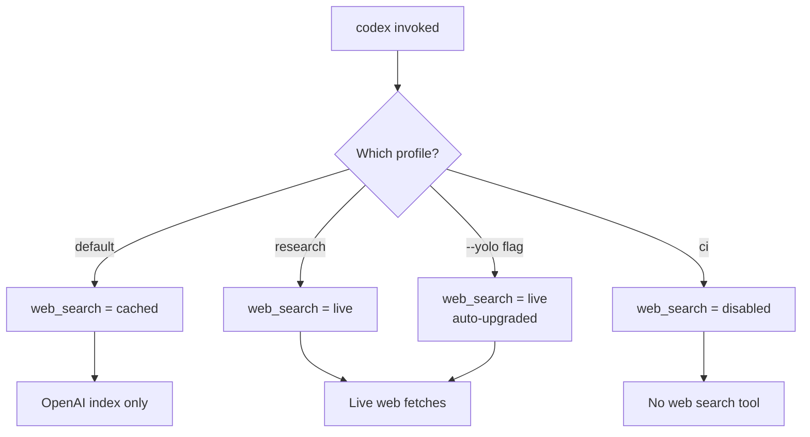

# Codex CLI Web Search Configuration: Cached vs Live Modes, Domain Allow-Lists, and Prompt Injection Defence


Every coding agent eventually needs to look something up. A deprecated API flag, a new framework release, an unfamiliar error code — the model's training data is a frozen snapshot, and your dependencies are not. Codex CLI ships a first-party web search tool that addresses this knowledge gap, but it introduces an attack surface that most developers never think about until something goes wrong[^1].

This article covers the three web search modes, the new object-form configuration with domain allow-lists and context sizing, the security implications of each mode, and practical configuration patterns for solo developers, teams, and enterprise deployments.

## Why Web Search Matters in an Agent Loop

When Codex encounters an unfamiliar library version or a build error it cannot explain from context alone, it can invoke its built-in `web_search` tool to retrieve documentation, Stack Overflow answers, or changelog entries[^1]. You will see `web_search` items in the transcript or in `codex exec --json` output whenever the agent looks something up[^1].

The problem: every web search result is untrusted input. A live fetch can return a page containing hidden instructions — prompt injection — that cause the agent to execute unintended actions[^2]. Cached search mitigates this by serving results from an OpenAI-maintained index rather than fetching arbitrary live pages, but it trades freshness for safety[^1].

## The Three Modes

Codex CLI offers three web search modes, set via the top-level `web_search` key in `config.toml`[^3]:

| Mode | Behaviour | Default When |
|------|-----------|--------------|
| `cached` | Returns pre-indexed results from OpenAI's web index. No live fetches. | Standard sandbox modes (`workspace-write`, `read-only`) |
| `live` | Fetches the most recent data from the web in real time. | `--yolo` / `danger-full-access` sandbox modes |
| `disabled` | Removes the web search tool entirely. The agent cannot search. | Explicitly set by user or admin |

```toml
# ~/.codex/config.toml — set the default mode
web_search = "cached"
```

The critical detail: when you switch to `--yolo` or any full-access sandbox setting, Codex silently upgrades `web_search` from `cached` to `live`[^1][^3]. If you are running a permissive sandbox for a trusted repository, you may be exposing the agent to live web content without realising it.

## The Object-Form Configuration

Since v0.128, the `tools.web_search` key accepts an object form that provides fine-grained control over search behaviour[^3]:

```toml
[tools.web_search]
context_size = "medium"
allowed_domains = [
  "docs.openai.com",
  "developers.openai.com",
  "github.com",
  "stackoverflow.com",
  "developer.mozilla.org",
]
```

### context_size

Controls how much content Codex retrieves from each search result[^3]:

| Value | Use Case |
|-------|----------|
| `low` | Quick lookups — error codes, API signatures, version numbers |
| `medium` | Balanced — documentation sections, code examples |
| `high` | Deep dives — full tutorials, architectural explanations |

Higher context sizes consume more of the context window per search. For cost-sensitive CI pipelines using `codex exec`, `low` is usually sufficient.

### allowed_domains

An array of domain strings that restricts which sites the agent may retrieve results from[^3]. This is the single most effective defence against prompt injection through web search because it limits the attack surface to domains you trust.

```toml
[tools.web_search]
allowed_domains = [
  "docs.openai.com",
  "developer.mozilla.org",
  "rust-lang.org",
  "docs.rs",
]
```

If the array is empty or omitted, all domains are permitted. For enterprise deployments, populate this list from a shared `managed_config.toml` to enforce team-wide defaults[^4].

### location

An optional object providing approximate geographical context for location-sensitive searches[^3]:

```toml
[tools.web_search]
context_size = "medium"
allowed_domains = ["docs.openai.com", "github.com"]

[tools.web_search.location]
country = "GB"
region = "England"
city = "London"
timezone = "Europe/London"
```

This is rarely needed for coding tasks but can be useful when searching for region-specific API endpoints or compliance documentation.

## Profile-Based Mode Switching

Different workflows demand different search modes. Codex profiles let you switch without editing your base configuration[^3][^5]:

```toml
# Base config — conservative default
web_search = "cached"

[profiles.research]
web_search = "live"
model = "o3"

[profiles.ci]
web_search = "disabled"
model = "o4-mini"

[profiles.secure]
web_search = "cached"
```

Invoke a profile with `codex --profile research` or `codex exec --profile ci`. The CI profile disables web search entirely — in a pipeline, the agent should work from the repository and its AGENTS.md context, not from arbitrary web content[^6].



## The Prompt Injection Threat Model

Web search introduces a specific class of prompt injection: the agent fetches a page that contains hidden instructions designed to manipulate its behaviour[^2]. This is not hypothetical — indirect prompt injection via web content has been demonstrated against multiple agent frameworks[^7].

### How the Attack Works

1. The agent encounters an unfamiliar error and invokes `web_search`.
2. A search result contains adversarial text (e.g., hidden in HTML comments, white-on-white text, or legitimate-looking documentation).
3. The agent incorporates the injected instructions into its reasoning.
4. The injected instructions cause the agent to exfiltrate data, modify files maliciously, or bypass approval policies.

### Defence Layers

OpenAI's "Running Codex safely" blog post, published on 8 May 2026, describes a multi-layered approach to mitigating this risk[^8]:

| Layer | Mechanism | Configuration |
|-------|-----------|---------------|
| **Cached search** | Pre-indexed results curated by OpenAI; no live page fetches | `web_search = "cached"` |
| **Domain allow-lists** | Restrict retrievable domains to trusted sources | `allowed_domains = [...]` |
| **Sandbox isolation** | OS-enforced sandbox limits what the agent can do with injected instructions | `sandbox = "workspace-write"` |
| **Approval policy** | High-risk actions require human approval regardless of web content | `approval_policy = "on-failure"` |
| **Guardian auto-review** | Automated reviewer agent checks for data exfiltration and credential probing | `automatic_approval_review_policy = "auto_review"` |

The key insight from OpenAI's internal deployment is that these layers compose[^8]. Cached search reduces the probability of encountering injected content. Domain allow-lists reduce it further. The sandbox and approval policy limit the blast radius if injection does occur. Guardian catches the most egregious exploitation attempts.

### When to Use Live Mode

Live mode is appropriate when:

- You are researching a newly released library or API (the cached index may lag by hours or days).
- You are debugging a production incident and need the latest status page or changelog entry.
- You are working on a trusted, isolated machine with full-access sandbox intentionally enabled.

Even in live mode, combine it with `allowed_domains` to limit exposure:

```toml
web_search = "live"

[tools.web_search]
context_size = "low"
allowed_domains = [
  "status.openai.com",
  "github.com",
  "docs.python.org",
]
```

## Enterprise Configuration with requirements.toml

For teams on Codex Business or Enterprise plans, administrators can enforce web search policies via managed configuration[^4][^9]. The `requirements.toml` file constrains security-sensitive settings that individual users cannot override:

```toml
# requirements.toml — admin-enforced policy
web_search = "cached"
```

This ensures that no developer on the team can switch to live mode without an administrator updating the policy. Combined with a managed `allowed_domains` list, this gives security teams confidence that the agent's web access is bounded[^4].

Administrators can also push different policies to different user groups via the Codex Policies page in the admin console, allowing research teams live access whilst restricting production-facing teams to cached mode[^9].

## Practical Recipes

### Recipe 1: Documentation Lookup in CI

Use `codex exec` with web search disabled to avoid any external data dependency in your pipeline:

```bash
codex exec \
  --profile ci \
  --sandbox workspace-write \
  "Fix the failing TypeScript type check in src/api/handler.ts"
```

### Recipe 2: Research Session with Guardrails

For a development session where you need current documentation but want protection:

```toml
# .codex/config.toml (repo-level)
web_search = "live"

[tools.web_search]
context_size = "medium"
allowed_domains = [
  "docs.openai.com",
  "developer.mozilla.org",
  "nodejs.org",
  "typescriptlang.org",
]
```

### Recipe 3: Air-Gapped Enterprise Deployment

For regulated environments where no external web access is permitted:

```toml
web_search = "disabled"
```

Combine with MCP documentation servers (such as Context7[^10]) to provide the agent with current library documentation without any live web access.

## Verifying Your Configuration

Check which web search mode is active in a running session:

```bash
# In the TUI, check current settings
/status
```

In non-interactive mode, the `--json` flag on `codex exec` includes `web_search` items in the output transcript, letting you audit exactly which searches the agent performed and which domains it accessed[^1].

## Key Takeaways

1. **Default to cached mode.** It covers the vast majority of documentation lookups without exposing the agent to live prompt injection vectors.
2. **Use `allowed_domains` whenever you enable live mode.** An unrestricted live search is an open door to prompt injection.
3. **Disable web search in CI.** Your pipeline should be deterministic; web search introduces non-determinism and security risk.
4. **Layer your defences.** Cached search, domain allow-lists, sandbox isolation, and approval policies compose into a robust security posture.
5. **Watch for silent mode upgrades.** The `--yolo` and `danger-full-access` flags automatically switch web search from cached to live.

## Citations

[^1]: OpenAI, "Features – Codex CLI," OpenAI Developers, 2026. [https://developers.openai.com/codex/cli/features](https://developers.openai.com/codex/cli/features)

[^2]: OpenAI, "Agent Approvals & Security – Codex," OpenAI Developers, 2026. [https://developers.openai.com/codex/agent-approvals-security](https://developers.openai.com/codex/agent-approvals-security)

[^3]: OpenAI, "Configuration Reference – Codex," OpenAI Developers, 2026. [https://developers.openai.com/codex/config-reference](https://developers.openai.com/codex/config-reference)

[^4]: OpenAI, "Managed Configuration – Codex Enterprise," OpenAI Developers, 2026. [https://developers.openai.com/codex/enterprise/managed-configuration](https://developers.openai.com/codex/enterprise/managed-configuration)

[^5]: OpenAI, "Advanced Configuration – Codex," OpenAI Developers, 2026. [https://developers.openai.com/codex/config-advanced](https://developers.openai.com/codex/config-advanced)

[^6]: OpenAI, "Non-interactive Mode – Codex," OpenAI Developers, 2026. [https://developers.openai.com/codex/noninteractive](https://developers.openai.com/codex/noninteractive)

[^7]: Greshake, K. et al., "Not What You've Signed Up For: Compromising Real-World LLM-Integrated Applications with Indirect Prompt Injection," arXiv:2302.12173, 2023. [https://arxiv.org/abs/2302.12173](https://arxiv.org/abs/2302.12173)

[^8]: OpenAI, "Running Codex Safely at OpenAI," OpenAI Blog, 8 May 2026. [https://openai.com/index/running-codex-safely/](https://openai.com/index/running-codex-safely/)

[^9]: OpenAI, "Admin Setup – Codex Enterprise," OpenAI Developers, 2026. [https://developers.openai.com/codex/enterprise/admin-setup](https://developers.openai.com/codex/enterprise/admin-setup)

[^10]: OpenAI, "Sample Configuration – Codex," OpenAI Developers, 2026. [https://developers.openai.com/codex/config-sample](https://developers.openai.com/codex/config-sample)
