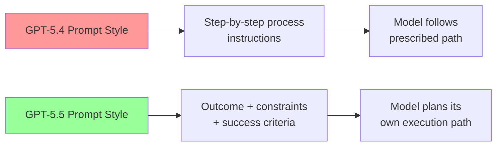
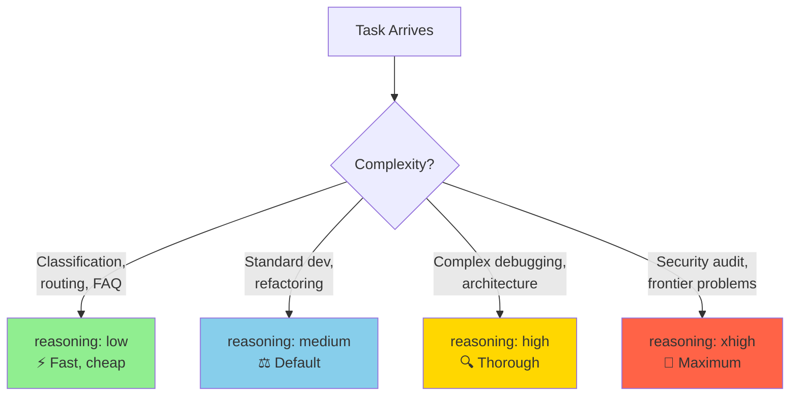

# Prompting GPT-5.5 in Codex CLI: Outcome-First Instructions, AGENTS.md Patterns, and Reasoning Effort Tuning


---

GPT-5.5 landed in Codex CLI in late April 2026 as OpenAI's newest frontier model, bringing stronger planning, tool use, and multi-step follow-through[^1]. It is not, however, a drop-in replacement for GPT-5.4 or GPT-5.3-codex. OpenAI's own guidance is blunt: "Begin migration with a fresh baseline instead of carrying over every instruction from an older prompt stack"[^2]. This article walks through the prompting patterns that actually matter when running GPT-5.5 inside Codex CLI — from rewriting your `AGENTS.md` to tuning reasoning effort per profile.

## Why GPT-5.5 Prompting Is Different

Previous Codex models rewarded detailed, step-by-step process instructions. GPT-5.5 inverts this. The model is "strongest when the prompt defines the target outcome, success criteria, constraints, and available context, then lets the model choose the path"[^2]. Prescriptive instructions now actively harm performance — the model wastes reasoning tokens reconciling your prescribed steps with its own (often superior) execution plan.

Three architectural changes drive this shift:

1. **Deeper autonomous planning.** GPT-5.5 builds internal execution plans that are more reliable than manually scripted sequences[^1].
2. **Native date awareness.** The model already knows the current UTC date — explicitly stating it wastes tokens and can conflict with the model's internal clock[^2].
3. **Structured Outputs integration.** Output schemas belong in the API layer (`--output-schema`), not in the prompt text[^2].



## The Four-Element Prompt Framework

Codex CLI's official best practices define a four-element structure that aligns perfectly with GPT-5.5's outcome-first architecture[^3]:

| Element | Purpose | Example |
|---------|---------|---------|
| **Goal** | What are you building or changing? | "Add retry logic to the payment gateway client" |
| **Context** | Which files, errors, or docs matter? | "See `src/gateway/client.ts` and the failing test in `__tests__/`" |
| **Constraints** | Standards, architecture, safety rules | "Use exponential backoff, max 3 retries, preserve existing error types" |
| **Done when** | Verifiable completion criteria | "All existing tests pass, new tests cover retry and exhaustion paths" |

In an interactive Codex CLI session, this translates to prompts like:

```
Add retry logic to the payment gateway client in src/gateway/client.ts.
Use exponential backoff with jitter, max 3 retries, 1s initial delay.
Preserve existing GatewayError types. Done when all tests pass
including new tests for retry success and retry exhaustion.
```

Notice: no mention of which files to read first, no instruction to run `grep`, no prescribed order of operations. GPT-5.5 handles the exploration autonomously.

## Rewriting AGENTS.md for GPT-5.5

The single highest-leverage change when switching to GPT-5.5 is rewriting your `AGENTS.md`. OpenAI's guidance is clear: "A short, accurate AGENTS.md is more useful than a long file full of vague rules"[^3].

### Before (GPT-5.4 Style)

```markdown
# AGENTS.md

## Process
1. First, read the relevant source files
2. Then, run the existing tests to understand current behaviour
3. Plan your changes before implementing
4. Implement changes one file at a time
5. Run tests after each file change
6. Fix any failures before moving on

## Code Style
- Always use TypeScript strict mode
- Always add JSDoc comments to public functions
- Never use `any` type
- Always handle errors explicitly
```

### After (GPT-5.5 Style)

```markdown
# AGENTS.md

## Repository
- TypeScript monorepo: `packages/` contains `api`, `web`, `shared`
- Build: `pnpm build` | Test: `pnpm test` | Lint: `pnpm lint`

## Standards
- TypeScript strict mode; no `any` types
- Public functions require JSDoc
- Errors handled explicitly — no silent catches
- Tests required for new public APIs

## Verification
- All commands must pass: `pnpm lint && pnpm test`
```

The GPT-5.5 version is roughly half the length. The process section is gone entirely — GPT-5.5 determines its own execution order. What remains are facts (repository layout, commands) and genuine constraints (type safety, documentation, verification).

### Reserve Absolute Language

A critical GPT-5.5 prompting principle: use MUST, NEVER, and ALWAYS only for genuine invariants — safety rules, required outputs, and hard constraints[^4]. For judgment calls, use decision rules instead:

```markdown
## Error Handling
- MUST: never swallow exceptions silently
- If the caller can recover, return a Result type. Otherwise, throw.
- If unsure whether to log at warn or error, prefer warn.
```

This gives the model room to make contextually appropriate choices while preserving your non-negotiable rules.

## Reasoning Effort Configuration

GPT-5.5 supports five reasoning effort levels. The right level depends on the task, and Codex CLI lets you configure this per profile[^5][^6]:

```toml
# ~/.codex/config.toml

model = "gpt-5.5"
model_reasoning_effort = "medium"        # default for interactive work
plan_mode_reasoning_effort = "high"      # /plan always gets deeper thought

[profiles.ci]
model_reasoning_effort = "low"           # fast CI runs
model = "gpt-5.4-mini"                   # cost-efficient for CI

[profiles.review]
model_reasoning_effort = "high"          # thorough code review
model = "gpt-5.5"

[profiles.audit]
model_reasoning_effort = "xhigh"         # security/compliance deep analysis
model = "gpt-5.5"
```



You can also switch mid-session without restarting:

```bash
# In the Codex CLI TUI
/effort high        # switch to high reasoning for a complex task
/effort medium      # drop back for routine work
```

The `plan_mode_reasoning_effort` key is particularly important — since a flawed plan compounds into a flawed implementation, running `/plan` at higher effort than your interactive default is a sensible baseline[^5].

## Verbosity and Output Control

GPT-5.5 introduces a separate `model_verbosity` control that decouples output length from reasoning quality[^6]:

```toml
model_verbosity = "low"     # concise responses, same reasoning depth
```

This is distinct from `model_reasoning_effort`. You can have high reasoning effort (thorough internal thinking) with low verbosity (terse output), which is ideal for `codex exec` automation where you want quality without prose.

## Tool Descriptions Over Prompt Instructions

GPT-5.5 performs better when tool guidance lives in tool descriptions rather than the system prompt[^2]. For MCP servers, this means writing rich tool descriptions:

```json
{
  "name": "run_tests",
  "description": "Run the project test suite. Use after making code changes to verify correctness. Input: optional test file glob pattern. Returns: exit code, stdout, stderr. Safe to retry on transient failures. Common error: missing build step — run build first if tests fail with module-not-found.",
  "inputSchema": {
    "type": "object",
    "properties": {
      "pattern": {
        "type": "string",
        "description": "Glob pattern to filter tests, e.g. 'src/**/*.test.ts'"
      }
    }
  }
}
```

The description includes purpose, triggers, inputs, side effects, retry safety, and common error modes — exactly what OpenAI recommends placing in tool descriptions for GPT-5.5[^2].

## Prompt Layout for Cache Efficiency

Codex CLI supports prompt caching, and GPT-5.5 prompts should be structured to maximise cache hits[^7]. The rule is simple: static content first, dynamic content last.

```markdown
# AGENTS.md (static — cached across sessions)

## Repository
[repository layout — rarely changes]

## Standards
[coding standards — rarely changes]

## Current Sprint Context
[dynamic — changes frequently, placed last]
```

The `developer_instructions` config key lets you inject session-specific context without modifying your cached `AGENTS.md`[^6]:

```toml
developer_instructions = "Focus on the payments module. The Stripe webhook handler has a race condition — see issue #1234."
```

This keeps your `AGENTS.md` stable (maximising cache hits) while adding per-session context that only affects the dynamic tail of the prompt.

## Migration Checklist: GPT-5.4 to GPT-5.5

When migrating an existing Codex CLI setup from GPT-5.4 to GPT-5.5, work through this checklist:

1. **Start fresh.** Do not copy your GPT-5.4 `AGENTS.md` verbatim. Write a minimal version covering repository facts, hard constraints, and verification commands[^2].

2. **Remove process instructions.** Delete any "first do X, then do Y" sequences. Replace with outcome descriptions and success criteria[^2].

3. **Audit absolute language.** Grep your `AGENTS.md` for MUST, NEVER, ALWAYS. Keep only genuine safety invariants. Convert judgment calls to decision rules[^4].

4. **Move output schemas to the API layer.** If your `AGENTS.md` contains JSON schema definitions for output formatting, move them to `--output-schema` flags in `codex exec` invocations[^2].

5. **Remove date statements.** Delete any "Today's date is..." lines. GPT-5.5 knows the date[^2].

6. **Set reasoning effort per profile.** Configure `model_reasoning_effort` and `plan_mode_reasoning_effort` in your `config.toml`[^5].

7. **Test with `/plan` first.** Run a representative task in `/plan` mode to verify that GPT-5.5's autonomous planning produces sensible execution strategies with your new instructions[^3].

8. **Measure, then tune.** Use `codex exec` with `--output-schema` to run your standard tasks and compare quality against your GPT-5.4 baseline before adjusting reasoning effort upward[^2].

## What Still Works

Not everything changes. These patterns carry over from GPT-5.4 without modification[^4]:

- **Structured Outputs** via `--output-schema` in `codex exec`
- **Function calling and tool descriptions** (though descriptions should be richer)
- **Real safety rules** — genuine MUST/NEVER constraints
- **Factual guardrails** — "Use only provided facts and cited sources"
- **Short, clear system prompts with defined roles**
- **Hook configurations** — `PreToolUse` and `PostToolUse` hooks work identically

## A Practical Example

Here is a complete GPT-5.5-optimised `AGENTS.md` for a production Node.js API:

```markdown
# AGENTS.md

## Repository
Express API with PostgreSQL. Source in `src/`, tests in `__tests__/`.
ORM: Drizzle. Auth: JWT with refresh tokens. Deploy: Docker + ECS.

## Commands
- Build: `npm run build`
- Test: `npm test`
- Lint: `npm run lint`
- Migrate: `npm run db:migrate`

## Standards
- TypeScript strict. No `any`.
- All routes require auth middleware unless explicitly public.
- Database queries use Drizzle — no raw SQL outside migrations.
- Error responses follow RFC 7807 Problem Details format.
- MUST: never log PII (emails, tokens, passwords).

## Verification
Every change must pass: `npm run lint && npm test`
```

Forty-three words of standards. No process instructions. No step-by-step guides. GPT-5.5 fills in the execution strategy itself — and in practice, it does so more reliably than GPT-5.4 following a prescriptive script[^1].

## Conclusion

The shift to GPT-5.5 in Codex CLI is less about learning new commands and more about unlearning old prompting habits. Write shorter `AGENTS.md` files. Describe outcomes, not processes. Reserve absolute language for genuine invariants. Tune reasoning effort per profile rather than per prompt. And start with a fresh baseline — the migration tax is real, but the payoff in task quality and token efficiency is measurable from day one.

---

## Citations

[^1]: [OpenAI — Codex Models documentation](https://developers.openai.com/codex/models) — GPT-5.5 as newest frontier model with stronger planning, tool use, and multi-step follow-through.

[^2]: [OpenAI — Using GPT-5.5 guide](https://developers.openai.com/api/docs/guides/latest-model) — Outcome-first prompting, fresh baseline migration, date awareness, schema placement, cache-friendly layout.

[^3]: [OpenAI — Codex Best Practices](https://developers.openai.com/codex/learn/best-practices) — Four-element prompt framework (Goal, Context, Constraints, Done when), AGENTS.md brevity guidance, /plan mode.

[^4]: [MindWired AI — GPT-5.5 Prompting Guide](https://mindwiredai.com/2026/05/07/gpt-5-5-prompting-guide/) — Reserve absolute language, outcome-first structure, personality vs collaboration separation, migration carry-overs.

[^5]: [OpenAI — Codex Configuration Reference](https://developers.openai.com/codex/config-reference) — model_reasoning_effort, plan_mode_reasoning_effort, model_verbosity, developer_instructions keys.

[^6]: [OpenAI — Codex Advanced Configuration](https://developers.openai.com/codex/config-advanced) — Profile-based configuration, OpenTelemetry, named profiles for CI/review/audit workflows.

[^7]: [OpenAI — Codex Prompting Guide (Cookbook)](https://developers.openai.com/cookbook/examples/gpt-5/codex_prompting_guide) — System prompt architecture, tool description placement, compaction strategy, prompt caching layout.
