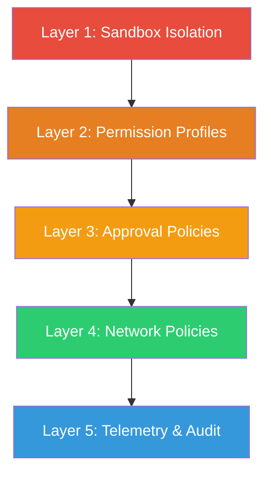
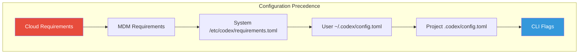

# Running Codex Safely: What OpenAI's Internal Deployment Reveals and How to Mirror It in Your Own Config


---

On 8 May 2026, OpenAI published *Running Codex safely at OpenAI* — a rare look at the controls, boundaries and telemetry the Codex team itself uses when deploying coding agents across its own engineering organisation [^1]. The timing is significant: the Sourcery Intel *State of AI Coding Agents 2026* report, published the same week, puts the AI-generated code vulnerability rate at 14.3% compared with 9.1% for human-written code, and flags a 23% higher bug density in unreviewed agent output [^2]. The message is clear — productivity gains demand a matching investment in safety controls.

This article distils the OpenAI blog post into five actionable layers, maps each to current Codex CLI v0.130 configuration, and provides a complete `config.toml` profile you can drop into your own setup today.

## The Five-Layer Safety Model

OpenAI's internal deployment organises safety into five concentric layers. Understanding their interplay is more useful than treating any single control as a silver bullet.



### Layer 1 — Sandbox Isolation

Codex CLI executes every tool invocation inside a platform-specific sandbox [^3]. On macOS this means Seatbelt profiles; on Linux, Bubblewrap with PID and network namespace isolation plus seccomp BPF filtering; on Windows, restricted tokens with DACL grants [^4]. The sandbox enforces two invariants regardless of platform:

1. `.git`, `.agents` and `.codex` directories remain **read-only** even in writable sandbox modes [^3].
2. Environment variables are scrubbed before the agent phase starts — secrets available during dependency setup never reach the agent [^1].

OpenAI's cloud Codex takes this further with a two-phase runtime model: the **setup phase** runs with network access to install dependencies, then the **agent phase** runs offline by default [^1]. CLI users can approximate this by separating dependency installation from agent execution:

```bash
# Phase 1: install deps (network enabled)
npm install

# Phase 2: run the agent (sandbox, no network)
codex --profile safe-workspace "Refactor the auth module"
```

### Layer 2 — Permission Profiles

Permission profiles control filesystem access via glob patterns. OpenAI's blog emphasises the principle of **least privilege** — giving the agent write access only to the directories it genuinely needs [^1].

```toml
default_permissions = "workspace"

[permissions.workspace.filesystem]
":project_roots" = { "." = "write", "**/*.env" = "none", "**/.secrets/**" = "none" }
glob_scan_max_depth = 3
```

The `"none"` value denies even read access to matched paths, preventing the agent from ever inspecting credentials, `.env` files or secrets directories [^5]. The three built-in profiles provide useful starting points:

| Profile | Filesystem | Network | Best For |
|---------|-----------|---------|----------|
| `workspace-write` | Read/write current directory | Disabled | Day-to-day development |
| `read-only` | Read-only everywhere | Disabled | Code review, exploration |
| `danger-full-access` | Unrestricted | Enabled | Containers, disposable VMs only |

OpenAI's internal teams reportedly default to `workspace-write` with explicit `"none"` overrides for sensitive paths [^1].

### Layer 3 — Approval Policies

The approval layer determines which actions require human confirmation. OpenAI's approach distinguishes low-risk actions (which proceed automatically) from higher-risk actions (which pause for review) [^1].

```toml
approval_policy = { granular = {
  sandbox_approval = true,
  rules = true,
  mcp_elicitations = true,
  request_permissions = false,
  skill_approval = false
} }
```

The granular policy lets you selectively enable approval for sandbox escalations and MCP server interactions whilst allowing trusted skills and permission requests to proceed automatically [^5]. This sits between the blunt `"on-request"` (approve everything) and `"never"` (approve nothing) options.

#### Guardian Auto-Review

For teams that cannot have a human watching every session, the `auto_review` system routes approval requests through a reviewer agent [^5]:

```toml
approvals_reviewer = "auto_review"
```

Guardian evaluates each pending action against four risk categories: data exfiltration, credential probing, persistent security weakening and destructive actions [^5]. Low-risk actions proceed; critical-risk actions are denied outright. This adds model calls to your usage, but OpenAI considers it essential for headless and CI deployments [^1].

### Layer 4 — Network Policies

Network access is **disabled by default** in all local sandbox modes [^5]. OpenAI's managed deployment uses a curated allowlist: expected destinations are permitted, unknown domains require approval, and blocked destinations are denied silently [^1].

For CLI users, the configuration maps to:

```toml
[sandbox_workspace_write]
network_access = false
```

When network access is required (for example, during MCP server calls to external APIs), OpenAI recommends combining it with web search caching to reduce prompt injection risk [^5]:

```toml
web_search = "cached"
```

The `"cached"` mode uses an OpenAI-maintained index rather than fetching live pages, eliminating the primary prompt injection vector from web content [^5].

### Layer 5 — Telemetry and Audit

OpenAI's security team uses Codex's structured telemetry to power an **AI security triage agent** that inspects tool activity, approval decisions, tool results and network policy decisions across all internal sessions [^1]. The triage agent surfaces analysis to human reviewers, distinguishing between expected behaviour, benign mistakes and activity warranting escalation [^1].

CLI users opt in to the same telemetry pipeline via OpenTelemetry:

```toml
[otel]
trace_exporter = "otlp-http"
log_exporter = "otlp-http"
otlp_endpoint = "https://your-collector.internal:4318"
```

Codex emits a trace per session with the service name `codex_cli_rs`, structured as a top-level `session_loop` span with child spans for individual API calls and tool invocations [^6]. This integrates with SigNoz, Grafana, Coralogix, Datadog and any OTLP-compatible backend [^6].

For enterprise compliance, the Compliance API exports activity logs with prompts, responses and metadata — up to 30 days of retention for ChatGPT-authenticated usage [^7]. The Analytics API at `https://api.chatgpt.com/v1/analytics/codex` provides daily and weekly usage metrics with 90-day lookback [^7].

## Complete Safe-Workspace Profile

Combining all five layers into a single deployable profile:

```toml
[profiles.safe-workspace]
model = "gpt-5.3-codex"
approval_policy = { granular = {
  sandbox_approval = true,
  rules = true,
  mcp_elicitations = true,
  request_permissions = false,
  skill_approval = false
} }
approvals_reviewer = "auto_review"
sandbox_mode = "workspace-write"
default_permissions = "workspace"

[profiles.safe-workspace.permissions.workspace.filesystem]
":project_roots" = { "." = "write", "**/*.env" = "none", "**/.secrets/**" = "none" }
glob_scan_max_depth = 3

[profiles.safe-workspace.sandbox_workspace_write]
network_access = false
web_search = "cached"
```

Activate with:

```bash
codex --profile safe-workspace "Implement the retry logic for the payment service"
```

## Closing the Quality Gap

The Sourcery Intel data showing 14.3% vulnerability rates in AI-generated code [^2] makes one thing clear: adopting a coding agent without adopting its safety controls is a false economy. OpenAI's own engineers do not run Codex without sandboxing, approval policies and telemetry — and neither should you.

The configuration above represents current best practice as of Codex CLI v0.130 (May 2026). As the `requirements.toml` managed configuration system matures, enterprise administrators will be able to enforce these controls organisation-wide, with cloud-managed requirements taking precedence over anything users configure locally [^8].



The agents are already writing half the commits [^2]. The question is no longer whether to adopt them, but whether your safety controls are keeping pace.

## Citations

[^1]: OpenAI, "Running Codex safely at OpenAI," openai.com, 8 May 2026. [https://openai.com/index/running-codex-safely/](https://openai.com/index/running-codex-safely/)

[^2]: Sourcery Intel, "The State of AI Coding Agents — 2026," sourceryintel.com, May 2026. [https://sourceryintel.com/reports/the-state-of-ai-coding-agents-2026](https://sourceryintel.com/reports/the-state-of-ai-coding-agents-2026)

[^3]: OpenAI, "Sandbox — Codex," developers.openai.com, 2026. [https://developers.openai.com/codex/concepts/sandboxing](https://developers.openai.com/codex/concepts/sandboxing)

[^4]: OpenAI, "Codex CLI — Sandbox Internals," codex.danielvaughan.com, 3 May 2026. [https://codex.danielvaughan.com/2026/05/03/codex-cli-sandbox-internals-seatbelt-bubblewrap-landlock-windows-dacl/](https://codex.danielvaughan.com/2026/05/03/codex-cli-sandbox-internals-seatbelt-bubblewrap-landlock-windows-dacl/)

[^5]: OpenAI, "Agent approvals & security — Codex," developers.openai.com, 2026. [https://developers.openai.com/codex/agent-approvals-security](https://developers.openai.com/codex/agent-approvals-security)

[^6]: OpenAI, "Advanced Configuration — Codex," developers.openai.com, 2026. [https://developers.openai.com/codex/config-advanced](https://developers.openai.com/codex/config-advanced)

[^7]: OpenAI, "Governance — Codex," developers.openai.com, 2026. [https://developers.openai.com/codex/enterprise/governance](https://developers.openai.com/codex/enterprise/governance)

[^8]: OpenAI, "Managed configuration — Codex," developers.openai.com, 2026. [https://developers.openai.com/codex/enterprise/managed-configuration](https://developers.openai.com/codex/enterprise/managed-configuration)
