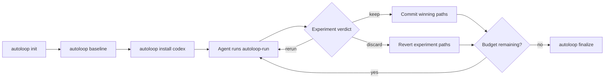

# AutoLoop with Codex CLI: Bounded Optimisation Loops for Measurable Codebase Improvement


---

Karpathy's [autoresearch](https://github.com/karpathy/autoresearch) project — released in March 2026 and now sitting at 21,000+ GitHub stars [^1] — proved that a tight modify-verify-keep/discard loop can drive real improvement without human steering. The core insight is simple: give an agent a fitness signal, a bounded experiment count, and let it grind. AutoLoop generalises that pattern beyond ML training into everyday software engineering and pairs cleanly with Codex CLI's `/goal` mode and `codex exec` pipelines [^2].

This article walks through setting up AutoLoop with Codex CLI, configuring metrics and guardrails, and structuring bounded optimisation runs that leave you with a clean review branch of verified wins.

## Why Another Layer on Top of Codex?

Codex CLI already has scored improvement loops via `/goal` [^3] and the iterate-on-difficult-problems workflow [^4]. So why bolt on AutoLoop?

Three reasons:

1. **Structured experiment tracking.** `/goal` keeps a progress log in the conversation context. AutoLoop persists every experiment outcome to disk under `.autoloop/experiments/`, surviving session compaction and context limits.
2. **Path-scoped git operations.** AutoLoop records exactly which files changed in each experiment. A `keep --commit` only touches those paths; a `discard --revert` rolls back precisely what was tried, not the entire worktree [^2].
3. **Agent portability.** The same `.autoloop/` configuration works across Codex CLI, Claude Code, Gemini CLI, Cursor, and OpenCode. If your team uses mixed agents, the experiment history is shared [^2].



## Installation and Repository Setup

AutoLoop ships as a single binary with multiple distribution channels [^2]:

```bash
# macOS / Linux — quick install
curl -sSf https://raw.githubusercontent.com/armgabrielyan/autoloop/main/install.sh | sh

# Or via package managers
brew install armgabrielyan/tap/autoloop
npm install -g @armengabrielyan/autoloop
cargo install autoloop
```

Initialise it inside your repository:

```bash
cd your-project
autoloop init --verify
```

This scans your repo for build and test artefacts — `Cargo.toml`, `pyproject.toml`, `package.json`, `go.mod`, Maven/Gradle files, `.csproj` — and infers your eval and guardrail commands [^2]. The inferred configuration lands in `.autoloop/config.toml`.

### Verifying the Inferred Configuration

Before trusting the inference, run the doctor:

```bash
autoloop doctor --fix
```

This executes every inferred command against the current repo state, flags failures, and offers repaired alternatives where possible [^2]. Once doctor passes cleanly, record your baseline:

```bash
autoloop baseline
```

The baseline snapshot lands in `.autoloop/baseline.json` and becomes the reference point for all subsequent experiment verdicts.

## The `.autoloop/` Directory

After setup, your directory structure looks like this:

```
.autoloop/
├── config.toml         # Eval/guardrail commands, metric parsing
├── baseline.json       # Starting metric snapshot
├── learnings.md        # Auto-refreshed experiment insights
├── experiments/        # Timestamped iteration history
│   ├── 001-reduce-alloc.json
│   └── 002-batch-queries.json
└── sessions/           # Grouped runs with commit refs
```

Add `.autoloop/` to your `.gitignore` or track it — the choice depends on whether you want experiment history in your repository's permanent record. For teams running repeated optimisation passes, tracking it provides useful institutional memory.

## Integrating with Codex CLI

Install the Codex-specific wrapper:

```bash
autoloop install codex
```

This generates workspace-local skills that expose AutoLoop's state machine as commands Codex can invoke autonomously: `autoloop-init`, `autoloop-doctor`, `autoloop-baseline`, `autoloop-run`, `autoloop-status`, `autoloop-learn`, and `autoloop-finalize` [^2].

### The Prompt

The key to a successful AutoLoop session is a well-bounded prompt. Direct Codex to use the installed wrapper with explicit constraints:

```
Use autoloop-run to reduce benchmark latency in this repo.
Keep behaviour unchanged. Use at most 5 experiments and
ask me only if you are genuinely blocked.
```

This gives Codex three essential constraints: the optimisation target (latency), a behavioural invariant (correctness), and an experiment budget (5 iterations) [^2].

### Combining with `/goal`

For long-running optimisation, pair AutoLoop with Codex's `/goal` mode [^3]. First enable the feature if you haven't already:

```toml
# ~/.codex/config.toml
[features]
goals = true
```

Then set a goal that references AutoLoop:

```
/goal Reduce p99 API latency by 20% using autoloop-run.
Stop when the target is met or after 10 experiments.
Keep a checkpoint log after each experiment.
```

`/goal` provides the autonomous outer loop — working independently across many turns without check-ins [^3] — whilst AutoLoop provides the structured experiment tracking and path-scoped git operations beneath it.

## Metrics and Guardrails

AutoLoop supports three metric extraction formats [^2]:

### 1. Explicit `METRIC` Markers

If your eval script prints `METRIC p99_latency=42ms`, AutoLoop extracts it directly.

### 2. JSON Output

```bash
# eval script outputs:
{"p99_latency_ms": 42, "throughput_rps": 1200, "error_rate": 0.001}
```

AutoLoop parses all numeric fields and tracks them against baseline.

### 3. Regex Extraction

For legacy test output that prints results in prose, configure regex patterns in `.autoloop/config.toml` to capture numeric values.

### Guardrail Configuration

Guardrails are first-class citizens, not afterthoughts. A faster benchmark that breaks correctness is automatically discarded [^2]:

```toml
# .autoloop/config.toml (conceptual structure)
[eval]
command = "cargo bench --bench api_latency"
metric_format = "json"
primary_metric = "p99_latency_ms"
direction = "lower_is_better"

[guardrails.tests]
command = "cargo test"
pass_threshold = "all"

[guardrails.clippy]
command = "cargo clippy -- -D warnings"
pass_threshold = "all"
```

The verdict engine combines metric improvement against the primary target with pass/fail results from every guardrail. Three possible outcomes [^2]:

- **keep** — metric improved and all guardrails passed → commit the winning paths
- **discard** — metric regressed or guardrails failed → revert experiment paths
- **rerun** — results inconclusive (e.g., noisy benchmarks) → retry with a different approach

## A Worked Example: Optimising a Go HTTP Service

Consider a Go service where `go test -bench=. -benchmem` shows high allocations per request:

```bash
# Step 1: Initialise
autoloop init --verify
autoloop doctor --fix
autoloop baseline

# Step 2: Install Codex wrapper
autoloop install codex

# Step 3: Run via Codex
codex "Use autoloop-run to reduce allocations per request in the
HTTP handler benchmarks. Preserve all test coverage. Budget: 7 experiments."
```

Codex will autonomously:

1. Read `.autoloop/config.toml` to understand the eval command and guardrails
2. Run the baseline benchmarks
3. Analyse allocation hotspots in the handler code
4. Make a focused change (e.g., pooling buffers, pre-allocating slices)
5. Run `autoloop eval --json` to measure the result
6. Issue `autoloop keep --commit` or `autoloop discard --revert` based on the verdict
7. Repeat until the budget is exhausted or the target is met

After the run, review what happened:

```bash
autoloop status --all    # Summary of all experiments
autoloop learn --all     # Refresh learnings.md with insights
autoloop finalize --session  # Create a clean review branch
```

The finalize step creates a branch containing only the committed wins, ready for code review via `gh pr create` [^2].

## Codex CLI Non-Interactive Integration

For CI pipelines, combine AutoLoop with `codex exec` [^5]:

```bash
codex exec "Run autoloop-run targeting compile time reduction. \
  Budget: 3 experiments. Report final metrics as JSON." \
  --json \
  --profile ci
```

The `--json` flag produces a JSONL stream including `turn.completed` events with token usage fields (`input_tokens`, `cached_input_tokens`, `output_tokens`) — useful for tracking the cost of each optimisation pass [^5].

For structured final output, use `--output-schema` [^5]:

```bash
codex exec "Run autoloop-run for latency optimisation. \
  Return a summary of experiments." \
  --output-schema ./optimisation-report-schema.json \
  -o ./report.json
```

## When to Use AutoLoop vs Native `/goal`

| Dimension | `/goal` alone | AutoLoop + `/goal` |
|---|---|---|
| Experiment persistence | Conversation context only | `.autoloop/experiments/` on disk |
| Git operations | Full worktree commits | Path-scoped keep/discard |
| Cross-agent portability | Codex-only | Works across six agents [^2] |
| Guardrail enforcement | Manual eval script calls | Built-in verdict engine |
| Session survival | Lost on compaction [^6] | Persists independently |
| Overhead | Zero setup | `autoloop init` + agent install |

Use `/goal` alone for straightforward migrations and refactors where you trust Codex to track its own progress. Add AutoLoop when you need persistent experiment records, path-scoped rollbacks, or when multiple agents will contribute to the same optimisation effort across sessions.

## AGENTS.md Integration

Add AutoLoop conventions to your project's `AGENTS.md` so every Codex session respects the optimisation workflow [^7]:

```markdown
## Optimisation Runs

When asked to optimise performance metrics:
1. Use `autoloop-run` if `.autoloop/` exists in the repo root
2. Never exceed the stated experiment budget
3. Always run guardrails before issuing a verdict
4. Commit messages must reference the experiment number: "exp-003: pool HTTP buffers"
5. Do not modify `.autoloop/config.toml` without explicit approval
```

## Limitations and Caveats

- **Noisy benchmarks.** AutoLoop's verdict engine can produce false `rerun` verdicts on benchmarks with high variance. Consider running benchmarks multiple times and reporting the median ⚠️.
- **Token cost.** Each experiment iteration consumes a full eval cycle's worth of reasoning tokens. Budget accordingly — a 10-experiment run on GPT-5.5 can consume significant tokens [^8].
- **Sandbox interactions.** AutoLoop's git operations (commit, revert) require write access. If you're running Codex with `sandbox_mode = "read-only"`, AutoLoop cannot persist wins. Use `workspace-write` or higher [^9].
- **No visual diff review.** AutoLoop tracks path-scoped changes but doesn't render diffs. Use `autoloop finalize --session` to create a review branch, then inspect with your usual diff tooling.

## Conclusion

AutoLoop sits at the intersection of Karpathy's autoresearch insight — that agents improve faster when given explicit fitness signals and bounded iteration — and Codex CLI's autonomous execution capabilities. The combination gives you structured, reproducible optimisation runs with clean git history and cross-agent portability. For teams running regular performance sweeps, dependency optimisations, or compliance remediations, it replaces ad-hoc "run it again and see" workflows with measurable, reviewable experiment records.

---

## Citations

[^1]: [Fortune — Why everyone is talking about Andrej Karpathy's autonomous AI research agent](https://fortune.com/2026/03/17/andrej-karpathy-loop-autonomous-ai-agents-future/)
[^2]: [GitHub — armgabrielyan/autoloop: Agent-agnostic tools for intelligent iterative optimization loops](https://github.com/armgabrielyan/autoloop)
[^3]: [OpenAI Developers — Follow a goal: Codex use cases](https://developers.openai.com/codex/use-cases/follow-goals)
[^4]: [OpenAI Developers — Iterate on difficult problems: Codex use cases](https://developers.openai.com/codex/use-cases/iterate-on-difficult-problems)
[^5]: [OpenAI Developers — Non-interactive mode: codex exec](https://developers.openai.com/codex/noninteractive)
[^6]: [OpenAI Developers — Advanced Configuration: context compaction](https://developers.openai.com/codex/config-advanced)
[^7]: [OpenAI Developers — AGENTS.md documentation](https://developers.openai.com/codex/agents-md)
[^8]: [OpenAI Developers — Codex Models and pricing](https://developers.openai.com/codex/models)
[^9]: [OpenAI Developers — Configuration Reference: sandbox modes](https://developers.openai.com/codex/config-reference)
