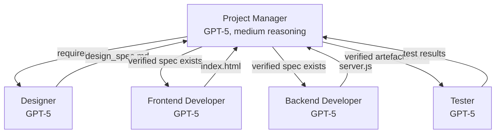

# Codex CLI as an MCP Server: Multi-Agent Orchestration with the OpenAI Agents SDK


---

Codex CLI is a capable coding agent in its own right, but its real power emerges when you stop thinking of it as a terminal tool and start treating it as an **infrastructure component**. Since early 2026, OpenAI has shipped a first-class path for running Codex CLI as a Model Context Protocol (MCP) server that the Agents SDK can orchestrate — turning a single-agent REPL into a node in a multi-agent software delivery pipeline [^1].

This article walks through the architecture, configuration, and practical patterns for wiring Codex CLI into Agents SDK workflows.

## Why Run Codex as an MCP Server?

Native subagents inside Codex CLI already support parallel work via `[agents]` configuration in `config.toml` [^2]. But they operate within a single Codex process, share the same sandbox policy, and are limited by `agents.max_depth` (default `1`) [^2]. When you need:

- **Cross-language orchestration** — a Python Agents SDK coordinator delegating to a Codex CLI agent writing TypeScript
- **Gated handoffs** — a project manager agent verifying artefact existence before allowing the next agent to proceed
- **Heterogeneous models** — GPT-5 for planning, GPT-5.5 for implementation, o4-mini for quick linting passes
- **Full Agents SDK tracing** — unified traces across all agents at `platform.openai.com/trace`

…then the MCP server pattern is the right abstraction [^1].

## Architecture

The integration uses a simple but effective design: the Agents SDK launches Codex CLI as a child process over stdio, and Codex exposes two MCP tools that the SDK's agents can call [^1].

```mermaid
flowchart LR
    A[Agents SDK<br/>Python Process] -->|stdio| B[Codex CLI<br/>MCP Server]
    B --> C[codex&#40;&#41;<br/>Start Session]
    B --> D[codex-reply&#40;&#41;<br/>Continue Session]
    C --> E[Sandbox<br/>File System]
    D --> E
    A --> F[OpenAI API<br/>Traces]
```



The `codex()` tool initiates a new Codex session. The `codex-reply()` tool continues an existing one by referencing a `threadId` returned in the structured content of the first call [^1]. This two-tool design means Codex stays alive across multiple agent turns — you are not paying cold-start overhead on every interaction.

## Prerequisites

Before starting, ensure you have [^1]:

- **Python** 3.10+
- **Node.js** 18+ (Codex CLI runs via `npx`)
- **Codex CLI** installed (`npm i -g @openai/codex` or use `npx`)
- **Python packages**: `openai`, `openai-agents`, `python-dotenv`

```bash
python -m venv .venv
source .venv/bin/activate
pip install --upgrade openai openai-agents python-dotenv
```

## Launching the MCP Server

The single command that turns Codex CLI into an MCP server [^3]:

```bash
codex mcp-server
```

This starts Codex as a stdio-based MCP server. It inherits your global `~/.codex/config.toml` settings and terminates when the downstream client closes the connection [^3].

For debugging, you can inspect the exposed tools with the MCP Inspector [^1]:

```bash
npx @modelcontextprotocol/inspector codex mcp-server
```

## The Two MCP Tools

### `codex()` — Start a Session

| Property | Type | Required | Notes |
|---|---|---|---|
| `prompt` | string | Yes | The task instruction |
| `approval-policy` | string | No | `untrusted`, `on-request`, or `never` |
| `sandbox` | string | No | `read-only`, `workspace-write`, or `danger-full-access` |
| `model` | string | No | e.g. `o3`, `o4-mini`, `gpt-5.5` |
| `base-instructions` | string | No | System-level context |
| `cwd` | string | No | Working directory |
| `config` | object | No | Runtime config overrides |

### `codex-reply()` — Continue a Session

| Property | Type | Required | Notes |
|---|---|---|---|
| `prompt` | string | Yes | Follow-up instruction |
| `threadId` | string | Yes | From prior `codex()` response |

The response from `codex()` includes `structuredContent.threadId`, which you pass to subsequent `codex-reply()` calls to maintain conversation context [^1].

## Single-Agent Pattern: Wrapping Codex in an Agents SDK Agent

The simplest integration wraps a single Codex MCP server in an Agents SDK agent [^4]:

```python
from agents import Agent, Runner
from agents.mcp import MCPServerStdio

async def run_single_agent():
    async with MCPServerStdio(
        name="Codex CLI",
        params={
            "command": "npx",
            "args": ["-y", "codex", "mcp-server"],
        },
        client_session_timeout_seconds=360000,
    ) as codex_mcp_server:

        developer = Agent(
            name="Developer",
            instructions=(
                "You are an expert developer. Use Codex to implement "
                "the requested changes. Always call codex with "
                '"approval-policy": "never" and '
                '"sandbox": "workspace-write".'
            ),
            mcp_servers=[codex_mcp_server],
        )

        result = await Runner.run(
            developer,
            "Create a Python CLI that converts CSV to JSON",
        )
        print(result.final_output)
```

Note the `client_session_timeout_seconds=360000` — MCP server sessions for code generation can run for minutes, so the default timeout is far too short [^4].

## Multi-Agent Pattern: The Gated Handoff Pipeline

The real value appears when you orchestrate multiple specialised agents with gated handoffs. The OpenAI Cookbook demonstrates a five-agent pipeline [^4]:



### The Project Manager as Gating Agent

The critical pattern here is the **gating logic**. The project manager does not blindly hand off — it verifies that required artefacts exist before advancing [^4]:

```python
from agents import Agent, ModelSettings, Reasoning

project_manager = Agent(
    name="Project Manager",
    instructions=(
        "Convert the input task list into three project-root files: "
        "REQUIREMENTS.md, TEST.md, AGENT_TASKS.md. "
        "Create files using Codex MCP with "
        '{"approval-policy":"never","sandbox":"workspace-write"}. '
        "Verify /design/design_spec.md exists before handing off to "
        "developers. Verify both /frontend/index.html and "
        "/backend/server.js exist before handing off to tester."
    ),
    model="gpt-5",
    model_settings=ModelSettings(
        reasoning=Reasoning(effort="medium")
    ),
    handoffs=[designer, frontend_dev, backend_dev, tester],
    mcp_servers=[codex_mcp_server],
)
```

Each downstream agent hands back to the project manager after completing its work [^4]:

```python
designer = Agent(
    name="Designer",
    instructions="Create UI/UX specifications in /design/design_spec.md...",
    mcp_servers=[codex_mcp_server],
    handoffs=[project_manager],
)
```

### Output Structure

A successful multi-agent run produces a clean artefact tree [^4]:

```
project/
├── AGENT_TASKS.md
├── REQUIREMENTS.md
├── TEST.md
├── backend/
│   ├── server.js
│   └── package.json
├── design/
│   ├── design_spec.md
│   └── wireframe.md
├── frontend/
│   ├── index.html
│   ├── styles.css
│   └── game.js
└── tests/
    ├── TEST_PLAN.md
    └── test_runner.sh
```

## Configuration Best Practices

### Approval Policy Selection

For automated pipelines, use `"approval-policy": "never"` to avoid hanging on approval prompts [^4]. For human-in-the-loop workflows, `"on-request"` lets the agent request elevated permissions mid-session [^1].

### Model Routing Across Agents

Different agents have different compute profiles. A practical split [^4] [^2]:

```toml
# In your Agents SDK code, set per-agent:
# Project Manager: model="gpt-5", reasoning effort="medium"
# Developers:      model="gpt-5", reasoning effort="high"
# Tester:          model="gpt-5.5", reasoning effort="low"
# Quick lint pass:  model="o4-mini"
```

### Sandbox Boundaries

Each `codex()` call can specify its own sandbox level [^1]. A sensible default for CI-style pipelines:

- **Designer agents**: `read-only` — they produce specs, not code
- **Developer agents**: `workspace-write` — they need to create files
- **Tester agents**: `workspace-write` — they need to run test scripts

⚠️ Avoid `danger-full-access` in automated pipelines unless you have compensating controls (network allow-lists, ephemeral environments).

## Observability and Tracing

The Agents SDK captures full execution traces — prompts, tool invocations, handoff sequences, MCP server calls, and timing data — viewable at `platform.openai.com/trace` [^1] [^4]. This gives you:

- **Bottleneck identification** — which agent is consuming the most tokens or wall time
- **Artefact validation** — confirm that gated handoffs actually check for file existence
- **Regression detection** — compare traces across runs to spot prompt drift

For deeper telemetry, Codex CLI's own OpenTelemetry export (`[telemetry]` in `config.toml`) can run in parallel, sending spans to your own collector [^5].

## Native Subagents vs. Agents SDK Orchestration

| Dimension | Native Subagents | Agents SDK + MCP |
|---|---|---|
| Setup complexity | Zero — built in | Moderate — Python env + MCP wiring |
| Max concurrency | `agents.max_threads` (default 6) | Unlimited (SDK-managed) |
| Nesting depth | `agents.max_depth` (default 1) | Arbitrary handoff chains |
| Cross-language | No — Codex-internal only | Yes — SDK is Python, agents can be anything |
| Gated handoffs | Manual prompt-based | SDK `handoffs` with verification logic |
| Tracing | Codex OTEL export | Agents SDK traces + Codex OTEL |
| Model heterogeneity | Per-agent model in TOML | Per-agent model in Python |

For single-repository, same-language tasks, native subagents are simpler and cheaper. For cross-cutting workflows, release pipelines, or anything requiring programmatic gating, the Agents SDK path is worth the setup overhead [^2] [^4].

## Practical Recipe: PR Review Pipeline

Here is a compact pattern combining both worlds — the Agents SDK orchestrates, Codex CLI executes:

```python
reviewer = Agent(
    name="Code Reviewer",
    instructions=(
        "Review the PR diff. Check for: security issues, "
        "test coverage gaps, documentation mismatches. "
        "Write findings to /review/findings.md. "
        "Use codex with sandbox=read-only."
    ),
    mcp_servers=[codex_mcp_server],
    handoffs=[fixer],
)

fixer = Agent(
    name="Fix Implementer",
    instructions=(
        "Read /review/findings.md. Fix each issue. "
        "Use codex with sandbox=workspace-write. "
        "Hand back to reviewer for re-review."
    ),
    mcp_servers=[codex_mcp_server],
    handoffs=[reviewer],
)
```

This creates a review-fix loop that terminates when the reviewer finds no remaining issues — a pattern that maps directly to how human teams operate, but executes in minutes rather than days.

## Limitations and Caveats

- **Token consumption scales linearly** with agent count — each agent maintains its own context window [^2]
- **Stdio transport only** for the MCP server mode; streamable HTTP is not yet supported for `codex mcp-server` [^3]
- **No shared memory** between agents — communication happens through files on disk or handoff messages
- **Timeout management** is critical — set `client_session_timeout_seconds` generously for complex tasks [^4]
- ⚠️ The `codex mcp-server` command is relatively new and the tool schema may evolve in future releases

## Conclusion

Running Codex CLI as an MCP server transforms it from an interactive terminal tool into a programmable building block. The Agents SDK provides the orchestration layer — handoffs, gating, tracing, model routing — while Codex provides the sandboxed code execution. Together, they let you build software delivery pipelines where agents write requirements, implement code, and validate results, all with full auditability.

The practical advice: start with a single-agent wrapper to validate your MCP server setup, then graduate to multi-agent pipelines once you have confidence in your approval policies and sandbox boundaries.

## Citations

[^1]: OpenAI, "Use Codex with the Agents SDK", OpenAI Developers, 2026. [https://developers.openai.com/codex/guides/agents-sdk](https://developers.openai.com/codex/guides/agents-sdk)

[^2]: OpenAI, "Subagents", OpenAI Developers, 2026. [https://developers.openai.com/codex/subagents](https://developers.openai.com/codex/subagents)

[^3]: OpenAI, "Command line options — Codex CLI", OpenAI Developers, 2026. [https://developers.openai.com/codex/cli/reference](https://developers.openai.com/codex/cli/reference)

[^4]: OpenAI, "Building Consistent Workflows with Codex CLI & Agents SDK", OpenAI Cookbook, 2026. [https://developers.openai.com/cookbook/examples/codex/codex_mcp_agents_sdk/building_consistent_workflows_codex_cli_agents_sdk](https://developers.openai.com/cookbook/examples/codex/codex_mcp_agents_sdk/building_consistent_workflows_codex_cli_agents_sdk)

[^5]: OpenAI, "Advanced Configuration — Codex", OpenAI Developers, 2026. [https://developers.openai.com/codex/config-advanced](https://developers.openai.com/codex/config-advanced)
